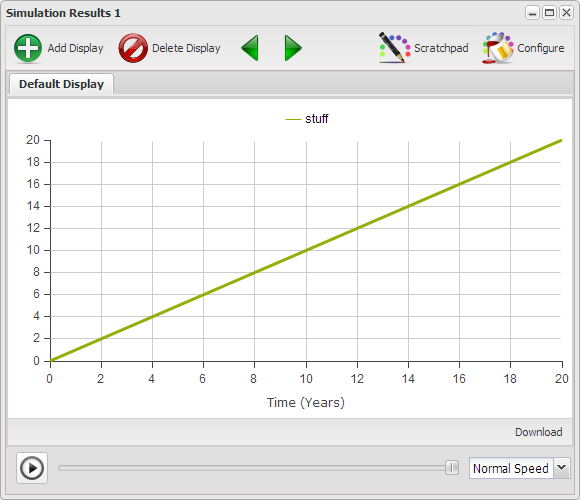

# Chapter 2 - Dynamic Lego Blocks #

----------

### Notes to Reviewers ###

This chapter is intended to provide the reader with enough experience with the basic elements of the modeling environment such that they can construct simple balancing and reinforcing loops. Supporting aspects of the environment necessary to run these models will also be described. This will build on the elements presented in the previous chapters and is intended to be an introduction, not an exhaustive dissertation on modeling and simulation theory. The intent is to encourage the reader to develop and play with models, not chase them from the room screaming in fear never to return again.

----------

## The Blank Canvas ##

Some might look on the blank canvas and hesitate not knowing where to start. You will be far better off if you look on the blank canvas as a gift of freedom which allows you to start anywhere. You will come to understand that if you approach modeling appropriately it won't matter where you start, you'll still end up with a meaningful model.

In the next few segments you will learn how to create on this canvas the two basic structures from which all models are constructed.

Notice in Figure 1 that similar tools are grouped on the \u{Toolbar} in Figure 1. Also only a portion of the \u{Toolbar} is displayed though it's enough for what will be covered in this section.

<IFRAME SRC="http://InsightMaker.com/insight/5291?embed=0&editor=1&topBar=1&sideBar=0&zoom=0" TITLE="Figure 1. Blank Canvas" width=700 height=400></IFRAME>

[** Figure 1. Blank Canvas](http://insightmaker.com/insight/5291)

To use a tool you click on it on the \u{Toolbar} to select it, then you click on the canvas where you want it located, or used. For each tool there are a set of allowed uses. Once you place the item on the canvas it is named for what it is with that name selected so you can type in the name you want. Labels can be anything except braces "{}", brackets "\[\]", parentheses \(\), and quotes '. If the label is no selected you can double-click on it to select the label and then enter a new one, or you can enter the label in the \u{Configuration Panel} though we'll address that in a bit more detail later.

----------

### Exercise 2-1 ###

Practice placing \p{Stock} and \p{Variable} \p{Primitives} on the blank canvas in Figure 1 and naming them. You can remove a \p{Primitive} by selecting it and pressing the \u{Delete} key or clicking the \u{Delete} button in the \u{Actions} section of the \u{Toolbar}. Note that the \u{Save} option is disabled so you won't be able to save what you create. Note: This is only for the review copy. In the final copy you will be able to save what you create.

----------

## Stocks, Flows, Variables and Links ##

\p{Stocks} and \p{Variables} are connected using \p{Flows} and \p{Links} and there are very explicit rules associated with these connections. The allowed connections are depicted in Figure 2.

<IFRAME SRC="http://InsightMaker.com/insight/5275?embed=0&editor=0&topBar=0&sideBar=0&zoom=0" TITLE="Figure 2. Valid Primitive Connections" width=680 height=400></IFRAME>

[** Figure 2. Valid Primitive Connections](http://insightmaker.com/insight/5275)

If \p{Use Links} or \p{Use Flows} is selected in the \u{Connections} segment of the \u{Toolbar} then when you mouse over an element of a model a little right pointing arrow shows up at the center of the element. You always draw a \p{Link} or a \p{flow} from one element to another and the arrow on the element points in the direction you draw the connection. If neither \p{Use Links} or \p{Use Flows} is selected then thee will be no right pointing arrow when you mouse over the element.

----------

### Exercise 2-2 ###

Click on the Set Up button on Figure 2, answer OK to both questions, and then repeatedly click Display to walk though a description of the valid connections between Stocks and Variables.

----------

Hopefully the rules associated with the connections were easy to understand. Just remember that Flows represent the movement of stuff while Links only communicate the value of something from one location to another.

## Valid Primitive Connections ##

The valid primitive connections of Figure 2 are described as follows.

### Flow ###

A Flow adds stuff to a Stock, subtracts stuff from a Stock, or moves stuff from one Stock to another. The only way to change the quantity of stuff in a Stock is with a Flow.

- A flow out of a stock decreases it. If where the flow goes isn't relevant to the model then it just flows from the stock to the canvas. Select Flow from the toolbar and then click on the arrow that appears on the stock when you mouse over it and drag onto the canvas and release. 
- A flow into a stock will increase it. If you don't care where the Flow is coming from then you first have to draw the Flow from the Stock to the canvas and click the Reverse button in the Connections section to get the Flow to come into the Stock from nowhere. It's just a quirk of the web implementation.
- A flow from one stock to another decreases the source and increases the destination. The get a flow between two Stocks draw the Stocks first and then draw the Flow from one Stock to the other.
- Flows can be bidirectional.

### Link ###

A Link is used to communicate a value from one element to another. There is no flow of stuff through the link itself. The communication is considered to be instantaneous.

- You can use a Link from a Stock to a Variable to communicate the value of the Stock to be used in an equation. This does not change the Stock.
- You can use a Link to communicate the value of a Stock to a Flow to be used in the equation determining the value of the Flow in the next iteration. The Link does not change the value of the Stock.
- You can use a Link to communicate the value of a Flow to a Variable to be used in an equation. This does not change the value of the flow.
- You can use a Link to communicate the value of a Variable to a Flow to be used in the equation that defines the flow. This does not change the value of the Variable.
- You can use a Link to communicate the value of a Variable to another Variable so that value can be used in an equation in the destination variable. The link does not change the value of the source Variable.
- You can use a Link to communicate the value of a Variable to a Stock to be used as it's Initial Value when the simulation begins. The value of the Variable is computed and assigned to the Stock as the simulation begins and it has no influence on the Stock during the simulation.

When you draw a link from one element to another it is created as a straight line. There are times when you would prefer that the connection be other than a straight line to make the diagram easier to understand. You can turn a straight line into a multiple segment line as follows.

- Click on the line to select it.
- Hold down the shift key and click somewhere in the middle of the line then release. This puts a little node on the line.
- Click on the node and move it as you wish to create a two segment line.
- You can create as many segments as you need, simply repeat the second step above.
- If you wish to remove the segments select the head of the link, move it off the element it's connected to and then reconnected it. It will now be a straight line.

----------

### Exercise 2-3 ###

Go back to Figure 1 and recreate Figure 2 for yourself. Actually making the connections helps develop a level of familiarity which will serve you well in the long run.

----------

To this point you've learned how to develop a static picture of a model. It actually is a model and provides a sense of the relationships between the various elements of the model. What it doesn't give you a sense of is the dynamic nature of these interactions over time. What are the implications of the relationships? In the next few sections you'll learn how to bring your model to life.

## Common Property # 1 ##

Look at the pictures in Figure 3 and ask yourself what it is that these pictures have in common. The pictures all represent very different kinds of things, some living, some not, though there is a characteristics they all have in common. Have you figured it out?

[** Figure 3. Common Property # 1](http://www.insightmaker.com/insight/4548)

Maybe you notice the rabbits from the previous chapter? The things depicted in the various images all grow in one way or another, and some faster than others.

## Constructing a Growth Structure ##

Lets use Figure 4 to construct a basic growth structure and in the process you'll learn about several of the parameters associated with the different elements of a model.

<IFRAME SRC="http://InsightMaker.com/insight/5351?embed=0&editor=1&topBar=1&sideBar=1&zoom=0" TITLE="Figure 4. Growth Structure" width=700 height=500></IFRAME>

[** Figure 4. Growth Structure](http://insightmaker.com/insight/5351)

- Place a Stock on the canvas and label it Stuff.
- Now make sure the Stock is selected and take a look at the Configuration Panel on the right.
- For each Primitive and Connection there are a set of parameters you can assign.
- There are some in common across all elements of a model and there are some unique to various elements as they server different purposes.
- If you scroll down you'll notice there is a description of the element along with examples at the bottom of the panel.
- For this exercise you don't actually have to set any of the parameters though you could take a min to read thogh them. We'll discuss each parameter the first time it's used in a model.
- Click on Use Flows to select that element.
- Mouse over the stock and click when the arrow appears at the center and drag onto the canvas somewhere outside the stock. Which direction doesn't make a difference though make sure you're a couple inches outside the stock before you release the mouse button.
- While the flow is still selected click on Reverse so you have a flow into the stock.
- Notice that the parameters in the Configuration Panel are different from those for the Stock.
- Click in the field to the right of Flow Rate = and change the zero to a 1.
- Click the Run Simulation button and you've successfully created and run your first model. Admittedly it may not be very exciting though it is the first one, and one of many.

[** Figure 5. Your First Model Output](http://www.insightmaker.com/insight/5351)

Notice that the model ran for 20 years. That's because we used the default Time Settings.

