# Chapter 3 Modeling v1 13.05.xx #

----------

Notes to Reviewers

This chapter is intended to present guidelines for creating a model to promote an understanding of an area of interest. An aspect of this essential for the development of sound models is the topic of units. While units don't ensure a model is sound, if the units don't match up one can be certain the model is not sound.

----------

## Begin at the Beginning ##

    “Would you tell me, please, which way I ought to go from here?”
    “That depends a good deal on where you want to get to,” said the Cat.
    “I don’t much care where–” said Alice.
    “Then it doesn’t matter which way you go,” said the Cat.
    “–so long as I get SOMEWHERE,” Alice added as an explanation.
    “Oh, you’re sure to do that,” said the Cat, “if you only walk long enough.”
    
    Lewis Carroll - Alice in Wonderland
    
There are a number of guidelines or rules of thumb that you will find helpful when developing a model. The idea is to ensure that the model serves the purpose you started building it for.

We develop models to help us understand the implications of interactions, and sometimes guidance. As such, as with Alice above, it is essential that before you begin to build a model you know what it is that you want to understand otherwise how will you know if the model does what you needs to do.

Here's a simple example of a question that might be answered with a model. And yes, it is quite obvious you could just do the math though would you get any better at building models if you did?

Little Red Riding Hood want's to know how long it will take her to get to Grandma's house if she walks at 2 miles per hour and Grandma's house is 4.5 miles away thought the woods.

In this statement what is to be figured out is very easy to identify. Sometimes it's not so easy and you have to dig a little.

----------

### Modeling Tips ###

- **Stocks**. Identify which items are the the stocks, or accumulations, in the model that will change over time. Stocks are often easy to identify if you think about stopping time. When time stops a stock still has a quantity. In this case it's the distance from Grandma's house as Red walks toward it.
- **Flows**. Identify the flows which are responsible for changing the stocks over time. If time stops a flow has no value. In this case it's walking.
- **Time Units**. Will the interactions in this model be depicted over Years, Months, Days, etc. In this case the initial thought is that it will be hours. And you should realize that you initial thought may have to be revised once you begin developing the model.
- **Simulation Length**. How long might the interactions have to be modeled for. Here again the answer may be obvious, or you may have to start with an estimate and revise it after working with the model. Here we'll estimate 4 hrs.
- **Time Step**. Here again you have to estimate a value based on the smallest time of transition you expect in the interactions and then test it to see if you you're close enough. In this case we'll start with 0.5

----------

Figure 1 represents a simple model of Little Red Riding Hood walking to Grandma's house.

<IFRAME SRC="http://InsightMaker.com/insight/6767?embed=0&editor=1&topBar=1&sideBar=1&zoom=0" TITLE="Figure 1. Walking to Grandma's House" width=950 height=650></IFRAME>

[** Figure 1. Walking to Grandma's House](http://insightmaker.com/insight/6767)

While this may look like a rather trivial model there are several aspects of this model that warrant a few notes, and some of them we've not considered before.

----------

### Modeling Tips ###

- **Labels**. A stock represents a quantity and should be labeled with a directionless noun our noun phrase, you know, a person, place or thing. Avoid directional modifiers such as increasing, decreasing, growing, slowing, etc. as they tend to make a model very difficult to understand. A flow represents something moving over time so it's label should be something one would easily think of as moving over time as walk, speed, flow, etc.
- **Comments**. As you build your model add comments to the elements so you can refer back to them later to get a sense of what you were thinking when you created them. Yes, you tell yourself you know what you're doing at the moment, though you'll be surprised at what you won't remember a week, a month or even a year from now. Comments also make it much easier for others to understand what you intended when you created elements.

----------

If you click on the stock and look at the configuration panel you'll notice that the last item in the list, Units, is set to miles. Units were not addressed in the first two chapters as they are so important we wanted to ensure we could focus on them in this chapter. You use units to help ensure that your models are sound. Not that units will not guarantee that your model is sound though it the units don't work out right you can be sure it's not, and Insight Maker checks them for you. Figure 2 shows the Configuration Panel for the stock.

[** Figure 2. Units for Distance to Grandma's House is in miles](http://www.insightmaker.com/insight/6767)

If you click on the flow and look at the configuration panel you'll notice that the units for walk is miles/hour as depicted in Figure 3.

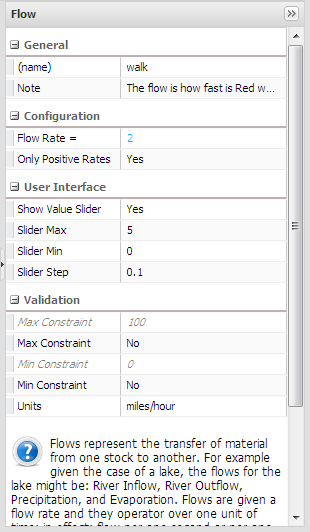

[** Figure 3. Units for Walk is in miles/hour](http://www.insightmaker.com/insight/6767)

The flow has a units of hours as that's what was set up in Time Settings as the Time Units for the model. All the time settings are showing in Figure 4.

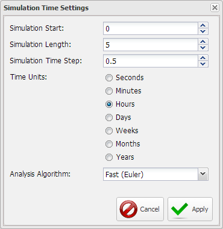

[** Figure 4. Time Settings for the Walk to Grandma's House](http://www.insightmaker.com/insight/6767)

You might now be asking, how the Walk in miles/hour gets turned in to Distance to Grandma's in miles? Because we've selected a Time Step of 0.5 each simulation step multiplies 0.5 hours x 2 miles/hour to get 1 mile traveled each time step. And the units are consistent. Later you can try changing the Time Units and running the model to see how that affects the answers. It's not actually this simple though with a constant flow rate this description is close enough.

----------

### Modeling Tip ###

There are a large number of units predefined in Insight Maker. If you click in the Units field and then click on the drop down on the right the Units Selection window will open as depicted in Figure 5. Here you can select from predefined units, though it's usually easier to just enter the appropriate units into the Units field. There is  also a way to define Custom Units thought we'll cover this option in a later chapter.

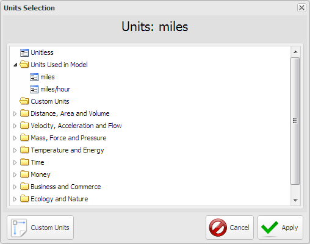

[** Figure 5. Units Selection Window](http://www.insightmaker.com/insight/6767)

----------

Now click the Run Button to simulate the model. The Run Button was added as a convenience because the Run button on the menu bar is off the right side at the top. The Run Button in the model will probably go away in the final version of this writing.

From the graphic results in Figure 6 and the tabular results in Figure 7 is should be evident that there are some enhancements that need to be made to our Walk to Grandma's House model.

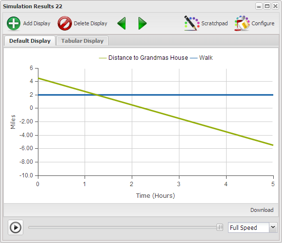

[** Figure 6. Walk to Grandma's/Graphic Results](http://www.insightmaker.com/insight/6767)

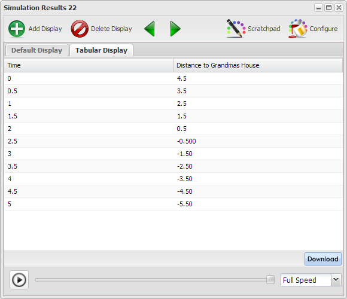

[** Figure 7. Walk to Grandma's/Tabular Results](http://www.insightmaker.com/insight/6767)

In both the graphic display and tabular display it's evident that Red didn't stop when she got to Grandma's house, and one might wonder where she ended up after 5 hours of walking. And from the tabular display at 2 hours Red was 0.5 miles from Grandma's House and at 2.5 hours she was 0.5 miles past Grandma's House.That there is no time with the Distance to Grandma's House equal to zero indicates that the time step is to large. This simply tells us that our Time Step is too large for the relationships in the model. 

----------

### Exercise 3 - 1 ###

Run this model of Figure 1 with a Time Step of 0.25 and 0.125 and from the Tabular Display which Time Step do you think is most appropriate and why?

----------

Figure 8 represents a modification of the Little Red Riding Hood walking to Grandma's house which was presented in Figure 1.

<IFRAME SRC="http://InsightMaker.com/insight/6778?embed=0&editor=1&topBar=1&sideBar=1&zoom=0" TITLE="Figure 8. Stopping at Grandma's House" width=950 height=650></IFRAME>

[** Figure 8. Stopping at Grandma's House](http://insightmaker.com/insight/6778)

Hopefully you found in Exercise 3-1 that both 0.25 and 0.125 produced a step with a distance to Grandma's House of 0 at 2.25 hours. In finding no difference between the results for 0.25 and 0.125 you should have concluded that 0.25 was a small enough for this model.

The time step in Figure 8 has been set to 0.25 and the Stop at Grandmas variable has been added to tell the simulation to stop when Red has reached Grandma's House. If you run the model you'll see that it does just what we want it to do though if you look at the formula in Stop at Grandmas some explanation is probably in order.

    IfThenElse([Distance to Grandmas House] < {0 miles}, STOP, 0)

If you look at the Configuration Panel for Stop at Grandmas you'll notice that the Units are Unitless. The variable itself doesn't need a definition of units because it's not participating in any calculations. It's just a test.

As for the formula what you should remember is that when you start using units in a model, which you should do, all formulas have to be consistent from a units perspective otherwise Insight Maker will raise an error message. Just as a test change {0 miles} to 0 and run the model. Because [Distance to Grandmas House] has units what it is compared to has to have units.

----------

### Exercise 3-2 ###

In the [Stop at Grandmas] variable change {0 miles} to {0 kilometers}. Does the model still work? Why?

----------

The simulation engine in Insight Maker is smart enough to convert between the myriad of similar dimensions, e.g., miles, kilometers, feet, etc. Though it's recommended that you make conversions explicit otherwise models become very difficult to understand.

----------

### Exercise 3-3 ###

Seldom is there ever just one right way to build a model. You build the model to help you understand something and you might do that in different ways. Even for a model as simple as Going to Grandma's can be structured in several different ways other than starting with a stock of 2.5 and reducing it by walking. Try to build one or two alternatives to this model.

----------

Hopefully the Going to Grandma's model has given you a sense of an approach for developing models along with some useful tips and an introduction to using units and why they can be so useful to you. Oh, and not forget about putting notes in the model. Wiring diagrams without knowing what the pieces mean are generally not very useful.

## Why Aren't We All Rich ##

The following is intended to be another example of he development of a model, though somewhat more involved than the previous one. Here's the initial question describing what I'd like to understand.

> If one can put money in an investment account and it grows over time, and it grows even faster with regular deposits, why aren't more people rich and ready for retirement? I've started numerous retirement programs through the years though for one reason or another they've all evaporated in time. What is the basis of this sad state of affairs?

<IFRAME SRC="http://InsightMaker.com/insight/6780?embed=0&editor=1&topBar=1&sideBar=1&zoom=0" TITLE="Figure 9. Why Aren't We All Rich v0" width=950 height=650></IFRAME>

[** Figure 9. Why Aren't We All Rich v0](http://insightmaker.com/insight/6780)

Figure 9 presents the initial set up for this model.

- **Investment Account**. represents the amount of money, in Dollars, in the account. If you look at the Configuration Panel you'll notice that Units are set to Dollars.
- **Initial Deposit**. is a variable used to specify the amount of money that is initially put into the [Investment Account] when it is opened. Remember we said only a flow can increase or decrease a stock, though you can use a external variable to set the initial value for a stock. This is done done to make the [Initial Deposit] explicit with a slider for testing. The Units for [Initial Deposit] is also set to Dollars.
- **Time Setting**. We've assumed that this is an investment account that will compute and add interest on a monthly basis so the time settings are set up to run for 36 months with an initial Time Step = 1 knowing that we will have to test this later on.

If you run the model you'll find out it's about as interesting as watching pain dry, thought it does run.

----------

### Modeling Tips ###

Before you run a model you should develop a sense of the result you expect from the model at this point of its development. Then once you run the model you should be certain that is it performing as expected. When the result is not what you expect then either the structure is wrong, your assumptions are wrong, or you simply have an opportunity to develop your understanding.

You should never be more than a single concept change away from a running model that produces a result that you understand. You may think this a bit strict though after you add several elements to a model and it doesn't work and you spend hours trying to figure out why you may have a better appreciation for this statement.

----------

Since this is an investment account that is supposed to grow based on monthly interest Figure 10 provides a few additions.

<IFRAME SRC="http://InsightMaker.com/insight/6783?embed=0&editor=1&topBar=1&sideBar=1&zoom=0" TITLE="Figure 10. Why Aren't We All Rich v1" width=950 height=650></IFRAME>

[** Figure 10. Why Aren't We All Rich v1](http://insightmaker.com/insight/6783)

**Annual Interest Rate**, as depicted in Figure 11, is the rate that will be used to compute the interest on the account on a yearly basis. Not the a slider has been included with a .01 step size to make it easy to test different values. Units is 1/year as this is the per year interest rate.

[** Figure 11. Annual Interest Rate Configuration Pane](http://www.insightmaker.com/insight/6783)

**Months Per Year**, as depicted in Figure 12, is just the number of months per year, a fixed constant of 12, to be used to convert the Annual Interest Rate to a monthly interest rate. The Units for this variable are Months/Year.

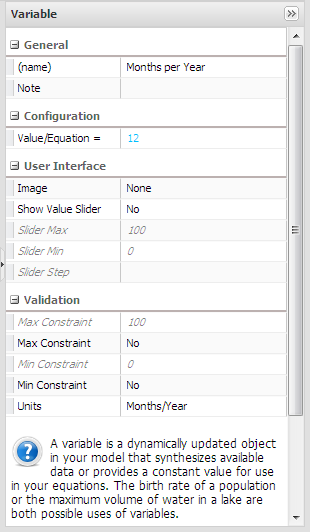

[** Figure 12. Months per Year Configuration Pane](http://www.insightmaker.com/insight/6783)

----------

### Modeling Tips ###

Making all the elements of a model visible makes it much easier for others to understand it. This is why Months per Year and Initial Deposit were created as explicit variables rather than embedding the valued inside other elements.

And what's definitely worth repeating is that providing comments for all the elements of a model will also make it much easier for others to understand. All one need do is mouse over an element and click on the "i" that appears to read the comment.

----------

**Interest**, ad depicted in Figure 13, contains the calculation for the Interest at each step of the simulation. The Units for interest are Dollars/Month which is derived from the formula.

> [Investment Account] * ([Annual Interest Rate]/[Months per Year])

> In Units: Dollars * (1/Year) / (Months/Year) = Dollars/Month

And as the simulation sums Dollars/Month over months the result added to the Investment Account is in Dollars which is consistent with the units specified for the Investment Account stock.

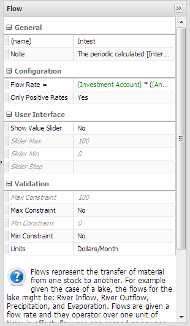

[** Figure 13. Interest Configuration Pane](http://www.insightmaker.com/insight/6783)

----------

### Modeling Tip ###

**R1** makes use of the Picture primitive used to indicate that the relationship between Investment Account and Interest created a Reinforcing structure, with the 1 simply meaning it's the first one in the model.

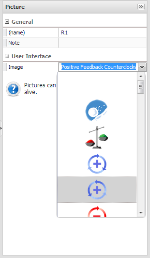

[** Figure 14. Picture Configuration Pane](http://www.insightmaker.com/insight/6783)

You have the option of adding notes to the Picture element and there are a number of predefined images  that you can select from the pull down that can be assigned to the element. There are images for balancing and reinforcing loops, both clockwise and counter clockwise. These pictures can be assigned to Variables and Stocks also.

The other option is that you can put a URL in this field for an image somewhere on the web and that image will be displayed and may be resized.

----------

Figure 15 depicts a run of this model over the three years with a 2% annual interest rate.

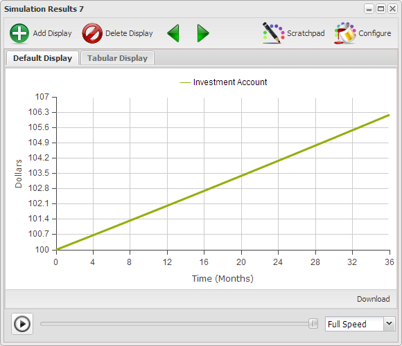

[** Figure 15. Why Aren't We All Rich v1](http://www.insightmaker.com/insight/6783)

Admittedly $6 dollars in interest wouldn't seem like much of an incentive to invest in a investment account for three years. Though there are several aspects of the Investment Account that we might take into consideration.

Figure 16 depicts a couple several update to the model which are described below.

<IFRAME SRC="http://InsightMaker.com/insight/6788?embed=0&editor=1&topBar=1&sideBar=1&zoom=0" TITLE="Figure 16. Why Aren't We All Rich v2" width=950 height=650></IFRAME>

[** Figure 16. Why Aren't We All Rich v2](http://insightmaker.com/insight/6788)

**Time Settings** have been changed so the model runs for 30 years, or 360 months.

**Monthly Deposits** have been added as a flow allowing one to indicate that there are additional monthly deposits into the investment account. A slider has been included to allow for testing this model with different monthly deposits. The Units for this flow are Dollars/Month, the same as for Interest.

**Annual Interest Rate** has been changed to 10% because one is likely to find an investment account that will average 10% over a period of 30 years, or so it would seem based on Whitfield & Co[1].

Figure 17 shows the new result from the model with these parameters. Though is this enough to retire on? Not likely.

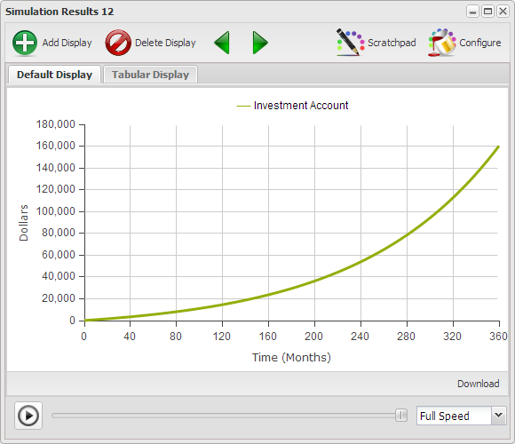

[** Figure 17. Why Aren't We All Rich v2 for 30 years, 10% interest, $70/month deposits](http://www.insightmaker.com/insight/6783)

Figure 18 is the same model with the years changed to 40 years and with $100 Dollars/Month recurring deposits. And there's a significant difference between $160 thousand dollars and $640 thousand dollars. The difference being what you are willing to invest and for how long.

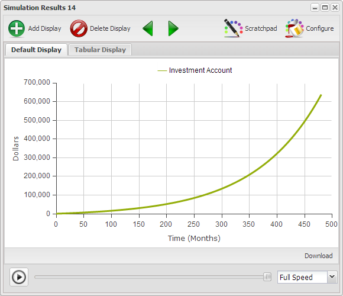

[** Figure 18. Why Aren't We All Rich v2 for 40 years, 10% interest, $100/month deposits](http://www.insightmaker.com/insight/6783)

That said it's best if we don't lose sight of the initial question, that being why more people employ this model and become rich. Part of the difference between Figure 17 and Figure 18 is the extra $30 dollars/month in periodic deposits. One of the difficulties is finding the money to deposit on a monthly basis.

Figure 19 expands on where the money comes from for the monthly deposits.

<IFRAME SRC="http://InsightMaker.com/insight/6794?embed=0&editor=1&topBar=1&sideBar=1&zoom=0" TITLE="Figure 16. Why Aren't We All Rich v3" width=950 height=650></IFRAME>

[** Figure 16. Why Aren't We All Rich v3](http://insightmaker.com/insight/6794)

And based on this model if one wants to increase the monthly deposits then it is necessary to increase the Income or decrease Expenses as the Monthly Deposits are what's left over. Part of the difficulty is that when one has money the tendency seems for most to spend it rather than save it. And there are a couple of other aspects that one might consider.

## References ##

- Catalina Foothills School District. 2003. Tips for Using System Dynamics Tools. http://www.clexchange.org/ftp/documents/Implementation/IM2003-12TipsUsingSDTools.pdf
- Keeting, Elizabeth K. Internet 2013. Everything You Ever Wanted to Know about How to Develop A System Dynamics Model, But Were Afraid to Ask. http://www.systemdynamics.org/conferences/1998/PROCEED/00024.PDF
- Richardson, George P. Internet 2013. Model Validation as an Integrated Social Process. http://www.albany.edu/~gpr/Validation.ppt
- Whiftield, Caraig. 2012. What Returns Should We Expect from the Stock Market. http://www.whitfieldco.com/blog/?p=39

