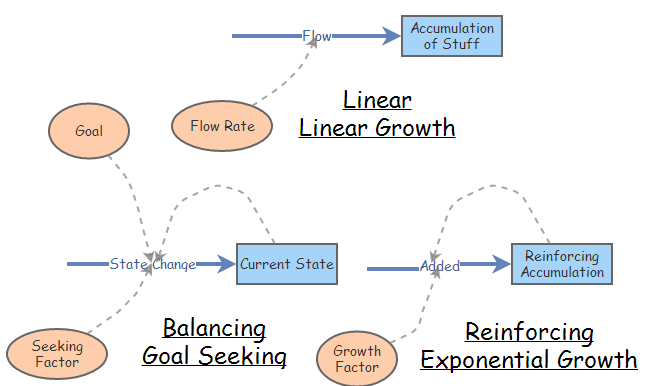
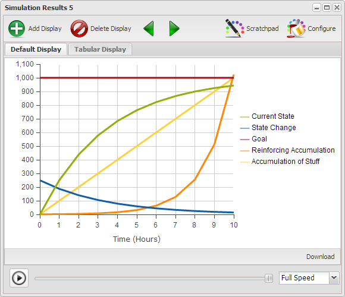
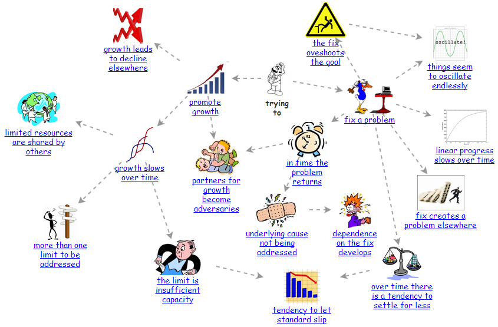

# Implications of Reality

Chapter 1 presented Bertalanffy's premise that that the same basic structures operated across all disciplines, and if one learned how these structures operated one could transfer much of their learning from one discipline to another. In that chapter and those following there has been a focus on three basic structures in support of Bertalanffy's premise. In this chapter will will build on those three basic structures in such a way as to demonstrate that there are a set of more complex structures composed of combinations of the basic three which also recur repeatedly across all disciplines.

## Basic Structures ##

The three basic structures and their characteristics behavior curves are depicted in Figure 1 and Figure 2.

[** Figure 1](http://insightmaker.com/insight/5138)

[** Figure 2](http://insightmaker.com/insight/5138)

In the Chapter 2 we covered the three basic structures in some detail. And it was claimed that all the models you will ever create will simply be a combination of some number of these basic structures. We don't expect that you take this on faith and while we can't prove it in this chapter we will provide you an opportunity to experience some of the more common structures which occur repeatedly across all disciplines of science.

## Typical Evolving Relationships ##

Figure 3 depicts the manner in which the Balancing/Goal Seeking and Reinforcing/Exponential Growth structures tend to relate to more complex structures.

[** Figure 3](http://insightmaker.com/insight/538)

The following sections of this chapter will present an investigation of the more frequently occurring structures. At the end of the chapter links will be provided as to where you can continue to investigate those structures not presented here.

Each structure will be presented in a generic form so you can focus on the implications of the relationships rather than what the actual elements are. Each section will also provide appropriate strategies for dealing with the structure as well as a number of explicit example of this structure in different areas.

Because the Balancing and Reinforcing Loops have been presented already we'll simply begin with more complex structures.

## Linear Progress Slows Over Time ##

A Limits to Results structure represents a situation where a Balancing Loop moving toward its goal is slowed in its progress due to a limiting factor. This is generally due to some resource restriction or constraint.

# Model

{"title": "Limits to Results", "description": "A balancing loop seldom progresses simply based on the difference between the [current state] and the [desired state]."}

{"load": "<mxGraphModel> <root> <mxCell id=\"0\"\/> <mxCell id=\"1\" parent=\"0\"\/> <Setting Note=\"\" Version=\"28\" TimeLength=\"10\" TimeStart=\"0\" TimeStep=\"1\" TimeUnits=\"Days\" Units=\"\" HiddenUIGroups=\"Validation,User Interface\" SolutionAlgorithm=\"RK1\" BackgroundColor=\"white\" Throttle=\"-1\" Macros=\"\" SensitivityPrimitives=\"\" SensitivityRuns=\"50\" SensitivityBounds=\"50, 80, 95, 100\" SensitivityShowRuns=\"false\" id=\"2\"> <mxCell parent=\"1\" vertex=\"1\" visible=\"0\"> <mxGeometry x=\"20\" y=\"20\" width=\"80\" height=\"40\" as=\"geometry\"\/> <\/mxCell> <\/Setting> <Display name=\"Display\" Note=\"Identify which elements are to be displayed and in which of the available formats.\" Type=\"Time Series\" xAxis=\"Time (%u)\" yAxis=\"\" ThreeDimensional=\"false\" Primitives=\"4,6,7,8,12\" AutoAddPrimitives=\"false\" Image=\"Display\" yAxis2=\"\" Primitives2=\"\" showMarkers=\"false\" showLines=\"true\" showArea=\"false\" legendPosition=\"Automatic\" id=\"3\"> <mxCell style=\"roundImage;image=\/builder\/images\/DisplayFull.png;\" parent=\"1\" vertex=\"1\" visible=\"0\"> <mxGeometry x=\"20\" y=\"70\" width=\"64\" height=\"64\" as=\"geometry\"\/> <\/mxCell> <\/Display> <Stock name=\"current state\" Note=\"The state of things at the beginning of the simulation assumed to be less than the desired state.\" InitialValue=\"0\" StockMode=\"Store\" Delay=\"10\" Volume=\"100\" Units=\"Unitless\" MaxConstraintUsed=\"false\" MinConstraintUsed=\"false\" MaxConstraint=\"100\" MinConstraint=\"0\" ShowSlider=\"false\" SliderMax=\"1\" SliderMin=\"0\" NonNegative=\"false\" Image=\"None\" LabelPosition=\"Middle\" FlipHorizontal=\"false\" FlipVertical=\"false\" SliderStep=\"0.1\" AllowNegatives=\"true\" id=\"4\"> <mxCell style=\"stock;labelBackgroundColor=none\" parent=\"1\" vertex=\"1\"> <mxGeometry x=\"400\" y=\"190.5\" width=\"100\" height=\"40\" as=\"geometry\"\/> <\/mxCell> <\/Stock> <Flow name=\"action\" Note=\"If gap is greater than limit then action = limit, otherwise it equals gap.\" FlowRate=\"IfThenElse([gap] &gt; [limit], [limit], [gap])\" OnlyPositive=\"true\" TimeIndependent=\"false\" Units=\"Unitless\" MaxConstraintUsed=\"false\" MinConstraintUsed=\"false\" MaxConstraint=\"100\" MinConstraint=\"0\" ShowSlider=\"false\" SliderMax=\"100\" SliderMin=\"0\" id=\"6\"> <mxCell style=\"\" parent=\"1\" target=\"4\" edge=\"1\"> <mxGeometry x=\"50\" y=\"-14.5\" width=\"100\" height=\"100\" as=\"geometry\"> <mxPoint x=\"190\" y=\"205.5\" as=\"sourcePoint\"\/> <mxPoint x=\"50\" y=\"85.5\" as=\"targetPoint\"\/> <\/mxGeometry> <\/mxCell> <\/Flow> <Variable name=\"desired state\" Note=\"The desired state, assumed to be greater than the current state in this example.\" Equation=\"1\" Units=\"Unitless\" MaxConstraintUsed=\"false\" MinConstraintUsed=\"false\" MaxConstraint=\"100\" MinConstraint=\"0\" ShowSlider=\"false\" SliderMax=\"1\" SliderMin=\"0\" Image=\"None\" LabelPosition=\"Middle\" FlipHorizontal=\"false\" FlipVertical=\"false\" SliderStep=\"0.1\" id=\"7\"> <mxCell style=\"parameter;fillColor=none;labelBackgroundColor=none;strokeColor=none\" parent=\"1\" vertex=\"1\"> <mxGeometry x=\"210\" y=\"25.5\" width=\"60\" height=\"50\" as=\"geometry\"\/> <\/mxCell> <\/Variable> <Variable name=\"gap\" Note=\"The difference between the desired state and the current state which provides the basis for action.\" Equation=\"[desired state] - [Current State]\" Units=\"Unitless\" MaxConstraintUsed=\"false\" MinConstraintUsed=\"false\" MaxConstraint=\"100\" MinConstraint=\"0\" ShowSlider=\"false\" SliderMax=\"100\" SliderMin=\"0\" Image=\"None\" LabelPosition=\"Middle\" FlipHorizontal=\"false\" FlipVertical=\"false\" id=\"8\"> <mxCell style=\"parameter;fillColor=none;labelBackgroundColor=none;strokeColor=none\" parent=\"1\" vertex=\"1\"> <mxGeometry x=\"326\" y=\"75.5\" width=\"40\" height=\"30\" as=\"geometry\"\/> <\/mxCell> <\/Variable> <Link name=\"Link\" Note=\"\" BiDirectional=\"false\" id=\"9\"> <mxCell style=\"entity\" parent=\"1\" source=\"7\" target=\"8\" edge=\"1\"> <mxGeometry x=\"50\" y=\"-14.5\" width=\"100\" height=\"100\" as=\"geometry\"> <mxPoint x=\"50\" y=\"85.5\" as=\"sourcePoint\"\/> <mxPoint x=\"150\" y=\"-14.5\" as=\"targetPoint\"\/> <Array as=\"points\"> <mxPoint x=\"290\" y=\"55.5\"\/> <mxPoint x=\"310\" y=\"55.5\"\/> <mxPoint x=\"320\" y=\"75.5\"\/> <\/Array> <\/mxGeometry> <\/mxCell> <\/Link> <Link name=\"Link\" Note=\"\" BiDirectional=\"false\" id=\"10\"> <mxCell style=\"entity\" parent=\"1\" source=\"4\" target=\"8\" edge=\"1\"> <mxGeometry x=\"50\" y=\"-14.5\" width=\"100\" height=\"100\" as=\"geometry\"> <mxPoint x=\"50\" y=\"85.5\" as=\"sourcePoint\"\/> <mxPoint x=\"150\" y=\"-14.5\" as=\"targetPoint\"\/> <Array as=\"points\"> <mxPoint x=\"440\" y=\"165.5\"\/> <mxPoint x=\"431\" y=\"130.5\"\/> <mxPoint x=\"402\" y=\"106.5\"\/> <\/Array> <\/mxGeometry> <\/mxCell> <\/Link> <Link name=\"Link\" Note=\"\" BiDirectional=\"false\" id=\"11\"> <mxCell style=\"entity\" parent=\"1\" source=\"8\" target=\"6\" edge=\"1\"> <mxGeometry x=\"30\" y=\"-33.65652570442285\" width=\"100\" height=\"100\" as=\"geometry\"> <mxPoint x=\"30\" y=\"66.34347429557715\" as=\"sourcePoint\"\/> <mxPoint x=\"130\" y=\"-33.65652570442285\" as=\"targetPoint\"\/> <Array as=\"points\"> <mxPoint x=\"290\" y=\"113.5\"\/> <mxPoint x=\"271\" y=\"146.5\"\/> <mxPoint x=\"270\" y=\"185.5\"\/> <\/Array> <\/mxGeometry> <\/mxCell> <\/Link> <Variable name=\"limit\" Note=\"A resource or process limit which action is not allowed to exceed.\" Equation=\"0.3\" Units=\"Unitless\" MaxConstraintUsed=\"false\" MinConstraintUsed=\"false\" MaxConstraint=\"100\" MinConstraint=\"0\" ShowSlider=\"true\" SliderMax=\"1\" SliderMin=\"0\" Image=\"None\" LabelPosition=\"Middle\" FlipHorizontal=\"false\" FlipVertical=\"false\" SliderStep=\"0.1\" id=\"12\"> <mxCell style=\"parameter;fillColor=none;labelBackgroundColor=none;strokeColor=none\" parent=\"1\" vertex=\"1\"> <mxGeometry x=\"160\" y=\"245.5\" width=\"60\" height=\"30\" as=\"geometry\"\/> <\/mxCell> <\/Variable> <Link name=\"Link\" Note=\"\" BiDirectional=\"false\" id=\"13\"> <mxCell style=\"entity\" parent=\"1\" source=\"12\" target=\"6\" edge=\"1\"> <mxGeometry x=\"50\" y=\"-14.5\" width=\"100\" height=\"100\" as=\"geometry\"> <mxPoint x=\"50\" y=\"85.5\" as=\"sourcePoint\"\/> <mxPoint x=\"150\" y=\"-14.5\" as=\"targetPoint\"\/> <Array as=\"points\"> <mxPoint x=\"250\" y=\"265.5\"\/> <mxPoint x=\"270\" y=\"255.5\"\/> <mxPoint x=\"290\" y=\"235.5\"\/> <\/Array> <\/mxGeometry> <\/mxCell> <\/Link> <Picture name=\"B1 Goal&#xa;Seeking\" Note=\"\" Image=\"Negative Feedback Counterclockwise\" FlipHorizontal=\"false\" FlipVertical=\"false\" LabelPosition=\"Bottom\" id=\"0b767fbc4cac5e1f4dff786f98f75235-14\"> <mxCell style=\"picture;image=\/builder\/images\/SD\/Negative Feedback Counterclockwise.png;imageFlipV=0;imageFlipH=0;fontStyle=1\" parent=\"1\" vertex=\"1\"> <mxGeometry x=\"340\" y=\"105.5\" width=\"34\" height=\"34\" as=\"geometry\"\/> <\/mxCell> <\/Picture> <\/root> <\/mxGraphModel>"}

DIAGRAM

Beginning with current state = 0, desired state = 1, limit = 0.3 and action = IfThenElse([gap] > [limit], [limit], [gap]) it becomes apparent that action is a constant value until the gap < limit.

RESULTS

The choppy nature of the diagram will be addressed in the exercise below.

# End Model

[** Limits to Results Stock & Flow Simulation](http://insightmaker.com/insight/543)

~ Exercise

Run the model with different values for limit. And see what happens if you change the Time Step to 0.5 or 1.0. What is the most appropriate value to use for Time Step?

~ Answer

There isn't a noticeable difference between the graph for 0.25 and 0.125 so 0.25 would be the most appropriate value to use for Time Step.

~ End Exercise

### Examples ###

[Limits to Results Examples](http://www.systemswiki.org/index.php?title=Category:Limits_to_Results)

### Effective Strategies ###

- The effective way to avoid a Limits to Results scenario is simply to plan ahead to ensure there are sufficient resources available so progress toward results is not limited to a greater extent than are acceptable. That said, remember that more of a good thing is not always the best answer. There is often a trade off and more resources may cost more than one gains by reducing the time by using more resources. There's always more than one things that should be considered.
