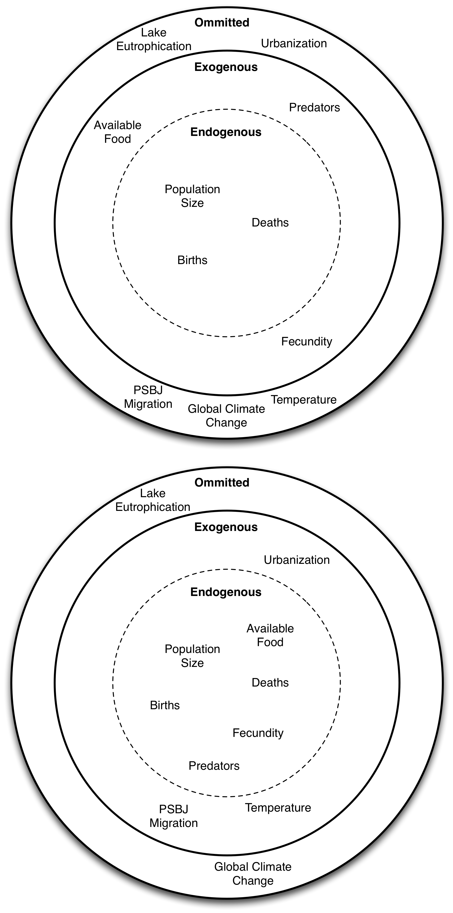
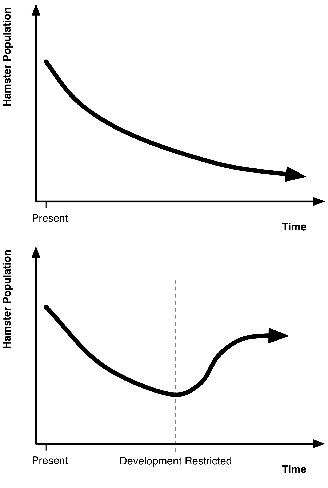

# The Process of Modeling {#ModelingProcess}

Now that you are well on your way to being a modeling expert, you may begin to receive requests for assistance with various modeling projects. As a motivating example, a friend -- it could also be a colleague or client -- comes to you and asks for help. This friend has been involved with the effort to protect the rare Aquatic Hamster.

The Aquatic Hamster is an endangered species that spends most of its life living in lakes and rivers. Unfortunately, development and human encroachment has steadily reduced the available habitat for these hamsters and their population has plummeted. Indeed, now there is just one last population of them left located on a lake just south of the Canada/United States border.

Your friend asks you to build a model of this hamster population in order to help prioritize protection efforts and to rally support from governmental agencies and non-profits to protect this last hamster colony. You want to be of real assistance to your friend, and the hamsters are admittedly cute, so you agree to take on this modeling project.

You are at your desk to start building the model, but then realize something: You aren't sure what to do next. There are so many candidates for first steps. Do you start sketching diagrams? Do you talk to hamster experts? Do you start coding up a model? You are paralyzed by the sheer number of different choices. You know your friend is counting on you, so what do you do now?

In this chapter, we answer that question. We explore the modeling process from start to finish, introducing the tools and techniques for getting from "I need a model" to a final product that works. As you will see, our experience is that the best approach to tackling tough modeling problems is to start deceivingly small: build the simplest model possible (what we call the "Minimum Viable Model") to get going and then iterate aggressively on this initial version.

## Why Model?

The first step to building a model is answering the simple question: *Why am I building this model?*

This question seems obvious, but it is often hard to answer in practice. Let's try answering it for our hamster population model: Why are we building this model? The truth is that so far we do not have a real understanding of this.

Oftentimes, the lack of focus begins with the friend/client/colleague who commissioned the model. Laypeople frequently do not have a strong understanding of what modeling is,including what modeling can accomplish and what it cannot. Instead, your friend might have a simplistic view of a model, almost as if were a magic wand. He feels he just needs a model and then, *abracadabra*, it will solve his problem. His thought process on what to do with a model might be as bareboned as:

1. Build Model.
2. ...
3. Hamsters Saved.

Of course this is not the case. You build a model with a specific purpose in mind otherwise it will most likely accomplish nothing. Worse yet, when it comes to the hamsters, it will be too little too late. Your first action should be to work with your friend to make sure you have filled in the "..." step. The best way to do this is generally working backwards from the final step rather than working upwards from the first one. For us that would be to first figure out how the hamster population is to be protected.

Paradoxically, in order to answer the question of why we are building a model, we are going to need to ask many questions of our own. Why should we protect the hamsters? What risks do the hamsters face? What do the hamsters need to be protected? What avenues to obtaining these protections are there? What techniques to protecting the hamsters are most effective? Cheapest? Most expedient? And so on. We need to obtain a good understanding of the root cause of the problem you friend wants to tackle with this model and force out the concrete steps to getting there.

After discussing this with your friend and the two of you come to the conclusion that you will need two things in order to reliably protect the hamster population. First, government regulatory agencies need to pass (stronger) rules protecting the hamster habitat. Second, non-governmental organizations (NGO's) need to provide funds for hamster conservation and protection efforts.

Using this, we can expand our plan with more details:

1. Build Model.
2. ...
3. Agencies enact rules to reliably protect hamsters. NGO's provide money for conservation efforts.
4. Hamsters Saved.

This focuses things for us. Rather than "Building a model to save the hamsters" (which is too vague and completely unactionable leading to our quandary about what to model), we are building a model designed to persuade governmental regulators and NGO's that they should devote resources to protecting the hamsters.

So how do we do that? Let's simplify the complex issue into two specific goals for our model:

* Show that given the *status quo* (business as usual) the hamster population will go extinct.
* Show that alternatives to the *status quo* exist (which require regulatory action or investments) that enable the hamster population not only to survive, but also to thrive.

If our model demonstrates both these things it could be a highly persuasive tool to shape decisions and policies. By building a model that does these two things^[The model of course must also inspire confidence in its audience. They must believe its results are reliable otherwise the results will have no persuasive power. Review the previous chapter for tools for building confidence in models.] we will have given our friend a powerful tool to push for regulatory action and financial support.

When building your own models you’ll want to go through a similar thought process to get at the core goal or question the model should address. Going into a modeling project with the attitude "First we'll build a great model, then we'll figure out how to apply it" is a prescription for failure. Of course, as you go through the process you might discover insights you never expected or you might in fact determine that your original hypothesis was wrong. Such discovery is always a great outcome, but you can never count on it happening in the course of building your model. It's best to start very focused in your modeling efforts and treat any discoveries or broadening of scope later on as a lucky bonus.

## Model Project Management

When tackling modeling projects such as our hamster-population model, there are two basic overarching project management approaches. The first is founded on detailed planning and preparation. Tackling the hamster model using this approach might look something like the following sequential phases:

Research
: Find and obtain relevant literature on Aquatic Hamsters. Read peer-reviewed publications. Locate hamster experts and interview them. Identify key mechanisms affecting hamster population growth. Some mechanisms may require further study. For example, if human expansion and urbanization affect the hamster habitat area, for example, you may need to study the forces influencing urbanization. These may require additional literature searches and expert interviews.

Design
: Once you have completed your background research on the hamsters, start to design the model. Create causal loop diagrams and develop stock and flow diagrams. Break your hamster population model into different sectors. You will have the hamster-specific sector, which includes sub-sectors for each of the life-stages these endangered hamsters go through. You will also need sectors for other parts of the model that affect the hamster population growth: an urbanization sector with its own model, a climate sector with a climate model, and so on. Write out equations for all these sectors and resurvey experts you have contacted to review the overall model design and the specific equations. There will probably be several cycles of iteration and model expansion during this stage as additional key areas to include are identified.

Construction
: Now that you have completed a model design and received a seal of approval from experts in the field, you are ready to start building the model itself. Decide what modeling software package (or programming environment) you will use. Implement the equations as they were specified in the design phase.

Wrapping Things Up
: Go through the confidence building steps from the previous chapter. Develop tests for your model to ensure it works correctly. Create model documentation. Show the model demonstrates expected behavior and obtain final approval from experts.

This approach to building a model is a very linear process where you go sequentially from stage to stage. In the project management field, this is the classic "waterfall" project where you proceed phase by phase through the project. You plan out the whole thing ahead of time estimating how long each phase would take and identifying dependencies between phases. This form of project management can work well if done expertly and it is well suited for certain kinds of projects such as constructing a building.

In our opinion, however, this approach to tackling a project is quite poorly suited to the task of building a model. There are several reasons for this.

First, each model is inherently unique^[Lots of "cookie cutter" models out there are designed to model a certain class of problems. Without custom work, however, these models are of dubious validity and may serve more to "check a box" that a model has been built rather than to be a useful decision-making tool.]. You may have developed a dozen different population models in your career, but when it comes to developing a model for a new species or location, you will inevitably run into situations and problems you have never encountered before. The quantity and quality of data will differ from the cases before. If not, the biology of the animal you are modeling will be different. If not, the model goals and constraints will be different, and so on. Given these differences, rigid project management techniques such as the waterfall approach do not generally provide the predictability that is needed.

Secondly, when building a model you will find that many of your assumptions may simply be wrong. This can happen with every aspect of model construction: the data you thought you had will turn out to be non-existent, the equations provided to you by experts end up not working, and the model code you write will invariably have a bug or two that needs to be identified and squashed. Because of this you will continually need to be adjusting and adapting your model as you learn more about the system and what pieces of information you can rely upon and what you cannot.

Such a high likelihood of error and need for readjustment are not well suited towards techniques based on sequential, long-term planning formats. What good is a great plan if the assumptions it is based on are substantially wrong?

Take, for instance, the data you use to build your model. It is not uncommon for a collaborator to come to you and say we have *X*, *Y* and *Z* data series for you to use in your model (where these might represent environmental conditions or other important model inputs). When you go to check the data however you may find that in fact *X* does not exist (the collaborator was confused), *Y* actually has large gaps in the data set which make it effectively useless for your needs, and *Z* was collected in such a way that they were actually measuring something completely different than they thought they were.

Take, as another instance, the equations in a model. Imagine you consult an expert on Aquatic Hamsters and she provides an equation governing the survival of hamsters during their first year of life. This equation was developed as part of a scientific study where the hamsters were grown in indoor swimming pools at her university's Aquatic Hamster Research Facility. When you go to apply this equation in your model, however, you find out that how the hamsters behave when living within an indoor swimming pool is very different from how they survive in the wild. Because of this, the equation you have is simply not accurate for the hamsters living in the wild.

Errors like these two examples are *very* common. If you had proceeded with the classic waterfall approach to modeling you might not realize that you cannot rely on the data or equations you were planning to use until the very end of the modeling process. At this point it is much too late to go back and correct your model.

### Iteration: Failing Fast and Failing Often

Because of this, we advocate an alternative approach to building models. We support jumping right into the model construction process as early as possible. As we showed you in the *Red* example from Chapter 4, we think it is important to get a simulation model up and running as quickly as possible. You should never want to be more than a few steps away from a simulating model^[This is a common theme in agile approaches to project management. You never want to be far from a working product. For instance, in the popular Scrum approach to managing software projects, the key unit of collective work is "the sprint". A sprint is a relatively brief amount of time (in the scope of the entire project) to complete a set group of product features. At the end of the sprint, the features must be completed and the software working or they are cut. The goal is always to be close to a working program just like you should always be close to a working model.].

When beginning a modeling project we recommend building the simplest model possible to get going. We call this the *Minimum Viable Model*^[This idea is adapted from Eric Ries's excellent book *The Lean Startup* (@Ries:2011vp). In it he advocates an approach to developing start-up companies and businesses focus on rapid development and innovation. Ries supports developing a "Minimal Viable Product" for the company as quickly as possible and iterating on the feedback received for this initial product.] and it is the model that contains just enough to minimally represent the system and nothing more. For the hamster model, this Minimum Viable Model might contain just a single stock representing the hamster population and a couple of flows modifying the population. Nothing more.

You don't have to worry about your equations being right or your model being an accurate predictor in the Minimum Viable Model; you just want to get something up and running as soon as possible.

Once you have the Minimum Viable Model you can start to run it by people and begin to incorporate their feedback. So get your friend's thoughts on the minimal hamster model, talk to experts, study the model's forecasts and see what works and does not. Then iterate on the model: make a change here, add a new component there. If the feedback you are getting is no one trusts the model because it does not contain some key mechanism, add that mechanism to the model^[But the key is to wait until you get this feedback. It's easy on your own or with a group of people to make a list of dozens mechanisms that a model *must* contain to be realistic. Once you have implemented those mechanisms in your model you might find out that no one actually cared about them. It is best to start small and then augment the model when there is a demand for some additional mechanism, than it is to spend a large amount of time implementing a very complex model and then to find out much of that work was unnecessary.]. Steadily adjust and refine the model based on the actual results of the model and the feedback you receive.

This feedback will be more useful to you when you have a concrete model that is simulating than it would be if you were just running abstract ideas by people. By putting your stake in the ground with a model that simulates, you allow others to critique and engage with the model providing you with valuable information about what works and what does not. If you do not come with a concrete model, you run the risk of receiving very vague, unactionable feedback.

What is best about this approach of rapid iteration we advocate is that it allows you to identify failures quickly. If a data source is no good, you find that out immediately as you try to integrate it rather than spending days, weeks or months planning your model with the assumption it’s really there or you can really use it. Rapid iteration -- failing fast and failing often -- is a key goal in the model development process. It can be argued that your successes in life are directly proportional to the number of failures and wrong turns you take: the more things you try, the more times you will both succeed and fail. We believe the same is often true in modeling. By speeding up the process of identifying and iterating past failures, this agile approach to modeling will often result in higher quality models completed more quickly than approaches that rely on extensive planning.

## Model Boundaries

There are many different mechanisms and entities we could include in our model of the hamster population^[The idea of the "butterfly effect" is that the flapping of a butterfly's wings in Europe, can initiate slight air disturbances that interact and magnify until they create a hurricane in Florida. If we believe in such avalanche effects to small events, the number of potential items we should include in the model is literally endless.]. Of course there are the hamsters themselves but there are also hamsters predators, the hamsters' food, climatic conditions that affect the growth and survival of the hamsters, urbanization, eutrophication that affects the hamsters' lake, and so on. Given that it would be impossible to include every single element and mechanism in our model, we must define the boundaries of the system.

We can illustrate model system boundaries using a boundary diagram as illustrated in the excellent book *The Electronic Oracle* (@Meadows:1985wb)^[This book provides an excellent overview of a number of different models and, very interestingly, it tracks the ultimate reception and the success or failure of these models.]. When using a model boundary diagram, we classify items of interest into one of three categories:

Endogenous
: Endogenous items are at the core of the model. They are things that the model itself determines. For instance, the size of the hamster population is endogenous to the model. The model itself simulates this population.

Exogenous
: Exogenous items are those that you include in the model but which you do not directly simulate. For instance, if we thought temperature had a significant effect on hamster survival, we might want to include historical temperature data in the model. We do not want to simulate this data though, we just want to use it as an exogenous input into the model.

Omitted
: Omitted items are those that, though we may acknowledge they do impact the hamsters either directly or indirectly, we choose not to include in the model. Even the most ambitious and comprehensive model will need to draw the line somewhere.

Figure 1 illustrates two different model boundaries for the hamster model. The top diagram depicts a small, conservative model with many features excluded from the model. The bottom figure illustrates a much more ambitious model where many additional items are made endogenous to the model and there are much fewer omitted items.

When developing a model, we recommend starting with the boundaries as narrow as possible. In the minimum viable model, you will want to omit as many different mechanisms as possible. As you receive feedback and people push for the inclusion of different mechanisms, you can slowly expand the boundaries of the model. We recommend starting small and expanding as necessary.

## From Mental Models to Simulation Models

Generally speaking, a single individual should ultimately be responsible for the design and implementation of a model. Models "designed-by-committee" are understandably suffused with compromise and a greater lack of focus. That said, even though one person is ultimately calling the shots, many voices and perspectives are there to be heard in the modeling process. The more input there is into a model, the better the resulting model will most likely be.

The people you are working with generally will not be experts in modeling. Because of this, even if they are intimately familiar with the system you are attempting to model, it will sometimes be difficult to take their freeform insights and transform them into a formal model structure and accompanying numerical equations. In fact people often have great difficulty communicating and describing their own mental models of a system. A number of useful tools and techniques can be used to help elicit information on people's mental models. We discuss three of these tools in the following sections.

### Reference Mode Diagrams

A reference mode is a graph that plots how the key stocks and variables in the system change over time. The *x*-axis of the graph is time, and the *y*-axis shows the values of the variables as they change. Sometimes reference modes are based on historical data, but you can also create them by asking those involved with the system to sketch out how they think the system will behave in different scenarios.

For our hamster model we could start simply by asking our friend to sketch out what he thinks will happen with the hamster population in the future assuming business as usual (remember that the status quo does not mean no-action). When we do this, he sketches out the top graph in Figure 2.

While your friend probably would use different terminology, to us the curve he sketched immediately looks like an exponential decay model. The instant we see this sketch we should start mapping out a stock and flow diagram in our mind to implement this type of model. Your friend does not need to understand any modeling concepts though, he just needs to be able to draw a picture of what he thinks will happen in the future. This is something that is easy to ask most people to do.

Let's go beyond the simple business as usual scenario. We can also use reference mode diagrams to elicit information on different scenarios. For instance, we have previously been told that development and encroachment on the hamster habitat are key factors reducing the hamster population size. Not only does the development consume key hamster habitat, the construction creates disturbances that have a further negative impact on the hamsters.

We can ask our friend to create a second sketch that shows how the hamster population would respond if development were suspended indefinitely. He responds by drawing the bottom graph in Figure 2. This graph shows the hamster population starting to recover after development stops, initially growing and then leveling off at a certain point.

Again, your friend never said this, but looking at this second drawing we should immediately start thinking of logistic growth models. The leveling off implies that there is some carrying capacity limit for the hamsters. This carrying capacity is probably a function of the available hamster habitat and the disturbances that are going on around the hamsters. We can start to sketch out stock and flow and causal loop diagrams to implement these types of dynamics and reproduce the behaviors our friend has drawn.

These are just two of the reference modes we might ask our friend to think about. We could go on to explore other scenarios and see how he thinks the changes in the scenarios would affect the hamster population. We could also ask him to sketch out other key variables in the system -- such as the quantity of food available to the hamsters -- to understand how he thinks these key variables interact. We could go on to interview other people familiar with the system and take them through the same process. Ideally, all the reference modes between individual people will agree, but differences are in themselves also useful in revealing different mental models between our interviewees. Bridging differences will be a key interest of ours as we attempt to develop a persuasive model that will bring everyone on board and gain wide support.

Asking non-modelers to sketch out reference modes is a great technique for several reasons. Reference modes are accessible to laypeople, force your interviewees to be concrete, and provide you with very useful and actionable material. Really, a reference mode is a projection of an individual's mental model of the system. They may be unable (or unwilling) to explain their mental model to you in equations or even words, but they generally will be able to describe how they perceive the world using these reference mode diagrams -- one small slice of their mental model at a time. Once you have the diagrams, you can proceed to translate them into model structure and equations.

### Pattern-Oriented Modeling

Pattern-oriented modeling focuses on identifying key patterns in the system to be modeled. For example, we may observe a boom-and-bust pattern in our hamster population that is triggered by unusually warm weather. When we develop our model, we formulate relationships and equations that will replicate this boom-and-bust pattern in the simulation.

Developed to help guide the creation of agent-based models, pattern-oriented modeling is very similar in concept to reference modes and system archetypes. Rather than building models around expected dynamic trajectories however, pattern-oriented modeling builds models to recreate patterns. Sometimes a pattern may be the same as a reference mode, but especially when dealing with agent based modeling you may not be able to define a pattern in terms of the dynamic trajectory of a reference mode. For a good overview of pattern-oriented modeling, see @Grimm:2005ei.

### Group Model Building

Group modeling sessions are a powerful tool to capitalize on the collective thoughts of a group to inform model structure and design. Instead of individually surveying experts and those involved in a system, a group session with many interested parties can be conducted. The term "group model building" is a bit of a misnomer as generally the model itself will be built away from the group by the facilitator or modeler and the group work will be focused on identifying and ranking key variables and mechanisms and developing high-level causal loop or stock and flow diagrams. See @Andersena:1997tg for a very practical overview of running and facilitating group model building sessions.

Group modeling sessions can also benefit an organization independently of the success or failure of the model itself. You might expect that the mental models of individuals within an organization would be aligned and the members of the organization would share a common objective and understanding of the challenges and needs required to achieve this objective. However, this is often not the case as different organization members may hold distinct mental models of the organization's purpose and operation within the world. Additionally, it is quite possible that these differences may never be realized as people may fail to adequately communicate their mental models assumptions and beliefs during the course of regular interactions.

The group modeling process can force the concrete discussion of and revealing of these mental models and the stakes involved in having these differences. Once they are revealed, they can be discussed and reconciled, potentially leading to a greater congruity of viewpoints within the group and a greater shared purpose. @Vennix:1993wv carried out a survey of participants in group model building sessions and found that this process led to insights and a shared vision more quickly than occurred in standard meetings.

## Wrapping it Up

Completing a model is in some ways just the first step in a modeler’s work. Once the model is finished you need to make sure to develop adequate tests to ensure it is operating as designed. Moreover, a model by itself is often of little use. You will need to develop extensive sets of documentation, manuals and tutorials if you want the model to be used in practice by people other than yourself. Such efforts take time. Writing clear and useful documentation is a skill in itself and, if done right, may take as long as developing the model in the first place!
