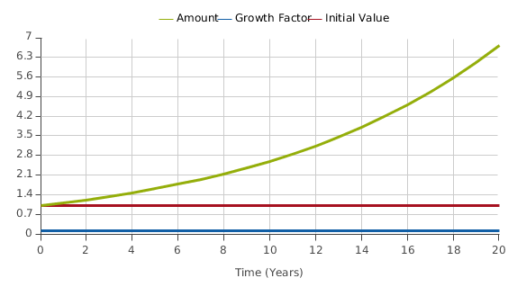

# It's Alive! It's Alive! #
## Thought It's Not Frankenstein's Monster ##
Ludwig von Bertalanffy[1] first proposed, in 1937, that the same basic structures operated across all disciplines, and if one learned how these structures operated one could transfer much of their learning from one discipline to another. When moving from one discipline to another, one would simply have to learn the structures that were operating, and the labels on the elements of the structures. On first reading this may seem most profound, or maybe even preposterous. 

However, if you think about it, maybe there is some truth to it after all. What follows is the introduction to a live Systems Thinking book presented from a cross discipline models perspective. Live in the sense that the models are presented in a form that allows you to actually interact with them. 

von Bertalanffy wrote “Allegemein Systemlehre” which was translated into English as “General Systems Theory”[2] and I expect we’ve still not recovered from the translation error. What he intended was a “General Theory of Systems” or “General Systems Teaching,” a way to support learning about the structures which operated across all disciplines. Today there are a set of structures referred to as Systems Archetypes which I believe are just what Bertalanffy had in mind.

In the words of von Bertalanffy, "The student in 'system science' receives a technical training which makes systems theory -- originally intended to overcome current overspecialization -- into another of the hundreds of academic specialties"[1]

Systems Thinking is not a method though more of a way of looking at the world around us and understanding based not from understanding things though more from understanding relations and interactions between things. And while there are many who believe that Systems Thinking or a Systems Perspective provides the best foundation for creating effective approaches of dealing with challenges and shaping a better tomorrow. Yet even with that view, over the past 75 years it has not become widely adopted, even though during that period dozens of approaches have been developed with claim to embrace the Systems Thinking world view. I believe Pogo had it right when he said, “We have met the enemy and he is us.” I have repeatedly commented to people that the greatest impediment to the adoption of Systems Thinking is Systems Thinkers.

This should provide you with a sense of why this book has to be different. Now let me offer you a view of how it will be different.

It is our intent to provide a basis for recovering from this overspecialization by offering an extensive series of models from everyday life that will show the value of looking at things though a different lense. We will then build on this to develop an understanding without all the terminology and complexity that typically drives people away from Systems Thinking. 

**Models and Patterns**

Models are the way we look at the world around us. All we have are our models. They are the way we understand everything. This is so because we build our understanding based on what we already understand. The world around us simply has too much detail for us to pay attention to all of it. As such we filter much of the detail and choose what to pay attention to. In the midst of what we choose to pay attention to there are patterns. And it is these patterns that we attempt to make sense of. And we understand these patterns by linking them to extend patterns we already understand.

**Consider the following**

- I have a box that’s about 3’ wide, 3’ deep and 6’ high
- It’s a rather heavy box
- The has a couple of doors on it
- When you open the doors it’s cooler inside the box than outside
- One compartment is much cooler than the other
- When you open the door a light comes on
- There’s food inside the box
- The box is in a kitchen
- There are sticky notes all over the front of the box
- There’s a collection of papers and stuff on top of the box
- If you move the box you’ll probably find a lot of dust under it
- The box is plugged into an electrical outlet
- From time to time you can hear the box running

At some point in this sequence you became convinced that what was being described was a refrigerator. Now stop for a moment and ponder just how it is that you realized what was being described was a refrigerator? As long as you knew beforehand what a refrigerator was the statements could have been given to you in any order and still at some point you would have finally realized what was being described. If you had never seen, nor heard about a refrigerator you would still be wondering what was being described and what to call it.

You have also most likely come to understand that all refrigerators are not identical. Some have one door with a separate compartment inside. Some have two doors and a drawer. Some are much smaller than others. Some can fit under a counter and some even fit on top of a counter. Some can be so large you can walk into them. Though if you see any of these you generally readily ascertain that it is a refrigerator. How does that happen? Gregory Bateson, one of the giants of Systems Thinking, said, “It’s the pattern that connects.” If you reflect on this statement you should come to realize there are actually different ways to interpret what it means. In this particular case the pattern connects you to the following purpose

- The box keeps food from readily spoiling by keeping it cool
- Part of the box is a freezer which keeps food from spoiling for even longer

and you understand it to be a refrigerator. 

**The Basis for Flawed Learning**

As I have indicated since Bertalanffy’s initial work in the 30’s numerous models and methods have been developed with claim to embrace the Systems Thinking worldview, that it is the relations between a number of elements which is far more responsible for the nature of a thing than simply the nature of the parts of which it is made. As such we will begin with models that everyone should be familiar with and demonstrate the nature of those models and how they actually occur across numerous disciplines. And in the process we will demystify the myriad of model and methods that embrace Systems Thinking, distilling and demonstrating that the essence of Systems Thinking is essential contains in a single word, “AND”.

Really this is an outgrowth of an old Sufi saying.

***Because you think you understand one, you think you understand two, because one and one equals two. But first you must understand AND.***

Because we live in the moment, even though we may think about the past, or the future, we tend to relate to things in the moment. It is this living in the moment that is most responsible for us tending to think in terms of cause and effect, i.e., A caused B. Even when we consider things that have evolved over time we tend to ignore the passage of time, and more often than not simplify situations to one dimensional cause and effect, e.g., Wall Street is responsible for the Financial Crisis; Corporations aren’t hiring more people because their taxes are too high; Obama is spending the US into ruin; etc. And as you might have gathered from these examples the simplification often produces beliefs that may not even be true. It’s our enduring need to make sense of things, along with our lack of a better way to consider things, that drives us to fabricate meaning, even if it is at times invalid.

**A More Meaningful Perspective**

Consider the items in Fig. 1 and ask your self what they have in common?

<IFRAME SRC="http://InsightMaker.com/insight/4548/embed?topBar=0&sideBar=0&zoom=1" TITLE="Embedded Insight" width=600 height=420></IFRAME>
Fig. 1 - What do these have in common?

What they have in common is that they all present a character of growth. Growth in population or growth in size. There is one underlying structure responsible for their nature as depicted in Fig. 2.

<IFRAME SRC="http://InsightMaker.com/insight/4530/embed?topBar=0&sideBar=0&zoom=0" TITLE="Embedded Insight" width=600 height=420></IFRAME>
Fig. 2 - Simple Reinforcing Growth Model <a href="http://www.youtube.com/watch?v=MUaBFzCfwVk" target="_blank">(Video)</a>

If you conder sider each item in figure one to be an amount of something that something increases over time. And the amount that it increses depends on how much of that something there is already and a factor.

Fig. 3 - Growth with Initial Value = 1 and Growth Factor = .1

With a small initial value and small growth factor the amount doesn't grow very much over a 20 year period.

Fig. 4 - Amount Growing with Initial Value = 10 and Growth Factor = .25

With a somewhat larger initial value and growth factor notice the marked different in the resulting value between fig. 4 and fig. 3.

The question I hope you might now be asking is, "If the growth depends on the initial value, amount, and growth factor, why doesn't everything just keep on growing?" We know that nothing ever grows forever and that is the case because everything that grows consumes something. Notice that one end of the flow in Fig. 2 isn't attached to anything. For the amount to grow it something has to flow in from somewhere. There are times when the stuff comes from doesn't matter and there are times when it does. We'll get to this in a more advanced version of the growth model.

**References**

- [1] Davidson, Mark. 1983. Uncommon Sense: The Life and Thought of Ludwig von Bertalanffy http://www.amazon.com/Uncommon-Sense-Thought-Bertalanffy-1901-1972/dp/087477165X/
- [2] Hofkirchner, Wolfgang. 2013. Ludwig von Bertalanffy: Forerunner of Evolutionary Systems Theory http://www.bertalanffy.org/2011/wp-content/uploads/2011/09/pdf41.pdf
