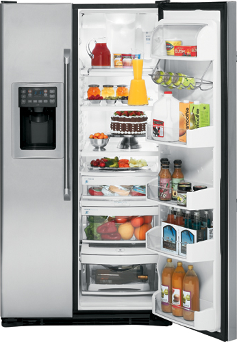
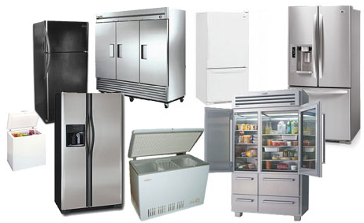
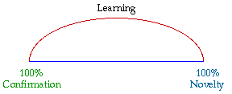
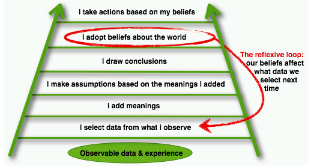
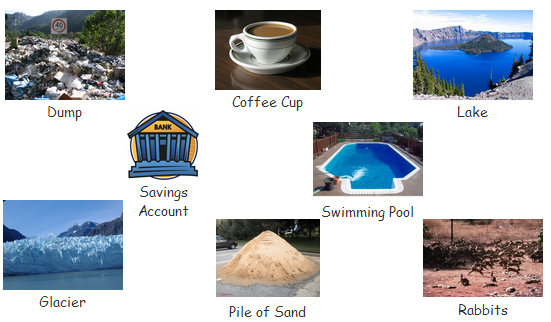
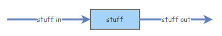
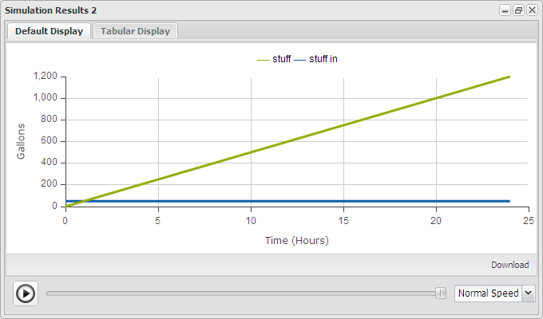
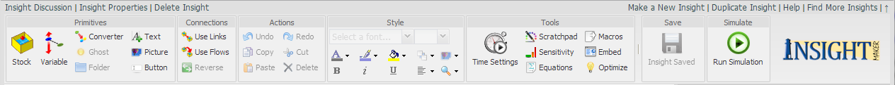
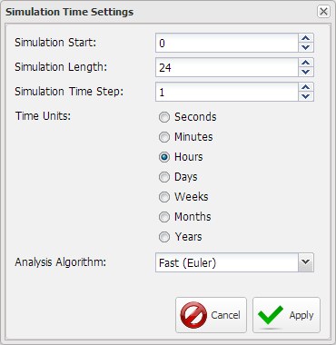

# Chapter 1 - It's The Pattern That Connects #

----------

*Develop an awareness that the diverse world around us has a commonality that can be meaningfully represented by just a few elements with rather simply attributes. The basic operation and interaction with embedded models must also experienced and then explained.*

----------

What you learn and your capacity to learn serves as the basis for everything that you do in your life. Yet, have you ever thought about how you really learn about the world around you? Yes, there are some things you memorize early in life like the times tables, and you learn to remember these, though is that really learning? Do you remember that if you put your hand on something very hot it will burn you, or is that something you learned? And if you learned that, how was it that that learning happened? 

**Consider the following**

- I have a box that’s about 3’ wide, 3’ deep and 6’ high
- It’s a rather heavy box
- The has a couple of doors on it
- When you open the doors it’s cooler inside the box than outside
- One compartment is much cooler than the other
- When you open the door a light comes on
- There’s food inside the box
- The box is in a kitchen
- There are sticky notes all over the front of the box
- There’s a collection of papers and stuff on top of the box
- If you move the box you’ll probably find a lot of dust under it
- The box is plugged into an electrical outlet
- From time to time you can hear the box running

At some point in this sequence you probably became convinced that what was being described was a refrigerator. Now stop for a moment and ask yourself just how it was that you realized what was being described was a refrigerator? Yes it would have been easier if I had just showed you a picture of a refrigerator though that would have spoiled it, wouldn't it.

[** Figure 1. From the description you knew it was a refrigerator - but how?](http://coastappliancerepair.com/los-angeles-blog/appliance-repair/ge-refrigerator-repair-los-angeles/)

As long as you knew beforehand what a refrigerator was the statements could have been given to you in any order and still at some point you would have finally realized what was being described. If you had never seen, nor heard about, a refrigerator before you would still be wondering what was being described and what to call it.

You have also most likely come to understand that all refrigerators are not identical. Some have one door with a separate compartment inside. Some have two doors and a drawer. Some are much smaller than others. Some can fit under a counter and some even fit on top of a counter. Some can be so large you can walk into them.

[** Figure 2. Many kinds of refrigerators, or freezers - But how do you know?](http://www.applianceexpert24-7.com/refrigerators.html)

If you see any of these you quickly decide it's a refrigerator. How does that happen? Gregory Bateson, one of the of the great thinkers of our time, said, “It’s the pattern that connects.” If you reflect on this statement you should come to realize there are actually different ways to interpret what it means. In this particular case the pattern connects you to the following purpose

- The box keeps food from readily spoiling by keeping it cool
- Part of the box is a freezer which keeps food from spoiling for even longer

and you understand it to be a refrigerator. Though now that we've arrived at this point we still haven't addressed the question of how you know. You probably were not actually taught that it's the above purpose that defines the essence of a refrigerator. Most people were not, though they have essentially learned it over time.

**Models**

Models are the way we look at, and understand the world around us. All we have are our models. They are the way we understand everything. This is so because we build our understanding based on what we already understand. The world around us simply has too much detail for us to pay attention to everything. A refrigerator has many pieces though how many do you really pay attention to? Probably not many unless you build or repair refrigerators. We filter out much of the detail around us so we don't become overloaded and we choose what to pay attention to. Some times we do this consciously and sometimes subconsciously. In the midst of what we choose to pay attention to there are patterns. Whether we realize it or not it is these patterns that we pay attention to and attempt to make sense of. We understand these patterns by linking them to extend patterns we already understand. And much of the world around us we simply ignore for if we didn't we would just become overwhelmed.

**Remember**: A model is a simplified version of some aspect of the world around us to help us understand something.

**Learning**

When we experience something that experience falls somewhere between complete novelty, meaning that we can't connect it with anything in our past experience, and complete confirmation, meaning that it represents something we perceive as already completely understood. The things we experience which lie somewhere between complete novelty and complete confirmation provide a basis for learning. They represent a basis for connecting to current patterns we understand and extending our understanding and what results is learning. {Cite: Jantach, Eric. 1980. The Self-Organizing Universe: Scientific and Human Implications. Pergamon Press. http://www.amazon.com/The-Self-Organizing-Universe-Implications-Innovations/dp/0080243118/}

[** Figure 3. Experience between novelty and confirmation as a basis for learnin](http://www.systemswiki.org/images/7/7c/Tkco2.gif)

Consider running into a refrigerator that looks like no refrigerator you've never seen before. From an initial view you are likely not to perceive it as a refrigerator. As you inspect it to find it serves the purpose you've come to understand for refrigerators or if someone tells you it's a refrigerator you then expand your awareness of the range of patterns that constitute a refrigerator.

**A Basis for Flawed Learning**

While reading the previous paragraphs did it dawn on you that all this pattern recognition/connection/extension learning doesn't happen consciously? We connect with patterns and extend our knowledge at times without even being consciously aware that it is happening. And when it happens in an unconscious manner there isn't really any critical validation that happens along with the learning. Because this ongoing learning happens without critical validation there are things we learn and come to believe which are actually incorrect. We have perceived patterns and extended our learning in a flawed manner. The really annoying thing is that we then act on these beliefs and when we produce results that don't go the way we planned we wonder why. Or even worse we don't actually learn from the results and correct our flawed models.

When we act on flawed beliefs when attempting to solve problems we typically create more problems than we fix. It has been said repeatedly that the majority of today's problems are the direct result of yesterday's solutions. Wouldn't this provide a sense that we might really benefit from a better way to think about the world around us, develop better understanding, and develop solutions that don't come back to haunt us in the future?

**Ladder of Inference**

The best explanation of how we build our beliefs was developed by Chris Argyris {Argyris, Chris. 2013. Chris Argyris. Wikipedia.http://en.wikipedia.org/wiki/Chris_Argyris} and is referred to as the Ladder of Inference. When we consciously traverse this ladder we're in good shape. Though when we traverse this ladder in an unconscious manner we often create learning that is not accurate. We then act on this inaccurate learning and produce inappropriate or undesirable results. {Bellinger, Gene. 2013. Ladder of Inference: Short Circuiting Reality. SystemsWiki. http://www.systemswiki.org/index.php?title=Ladder_of_Inference:_Short_Circuiting_Reality}

[** Figure 4. How we form beliefs and influence our action](http://blog.pegasuscom.com/Leverage-Points-Blog/?Tag=ladder%20of%20inference)

Because we live in the moment, even though we may think about the past, or the future, we tend to relate to things in the moment. It is this living in the moment that is most responsible for us tending to think in terms of cause and effect, i.e., A caused B. Even when we consider things that have evolved over time we tend to ignore the passage of time, and more often than not simplify situations to one dimensional cause and effect, e.g., Wall Street is responsible for the Financial Crisis; Corporations aren’t hiring more people because their taxes are too high; Obama is spending the US into ruin; etc. And as you might have gathered from these examples the simplification often produces beliefs that may not even be true. It’s our enduring need to make sense of things, along with our lack of a better way to consider things, that drives us to fabricate meaning, even if it is at times invalid.

As such many of the models we develop to make sense of thing are actually flawed. And as previously stated, when we act based on models that simply aren't correct, flawed in some way, the results of our actions are generally simply not what we intended or expected.

**A Better Way**

Based on the understanding I hope you've developed to this point it should be obvious that we need a better way to develop models that are more likely to be correct as well as surface flaws in many of our current mental models.

Ludwig von Bertalanffy first proposed, in 1937, that the same basic structures operated across all disciplines, and if one learned how these structures operated one could transfer much of their learning from one discipline to another.{Davidson, Mark. 1983. Uncommon Sense: The Life and Thought of Ludwig von Bertalanffy. J.P. Tarcher, Inc. http://www.amazon.com/Uncommon-Sense-Thought-Bertalanffy-1901-1972/dp/087477165X/} When moving from one discipline to another, one would simply have to learn the structures that were operating, and the labels on the elements of the structures. On first reading this may seem most profound, or maybe even preposterous. However, if you think about it, maybe there is some truth to it after all.

I'm not asking you to believe the previous statement just because it was provided here. Though if you give me a few minutes the experience that follows may allow you to arrive at a sensibility of the statement from your own perspective.

Consider the images in the following figure and ask yourself what it is that all these different items actually have in common.

[** Figure 5. What do these items have in common?](http://insightmaker.com/insight/4957)

Each of these items represents a collection of stuff. Admittedly each image represents different stuff though stuff just the same. Because in each case this stuff collected over time it's really more appropriate to refer to the the collections as accumulations.  And as you will come to realize it is extremely important to remember that accumulations take time to accumulate, and often even longer to get rid of if you find out you don't want them.

The shorter term often used to refer to an accumulation is "stock." Just where this term originate I'm unsure and what you call an accumulation of stuff isn't nearly as important as remembering it's a bunch of stuff that collected over time. How much time is different for each one of the accumulations and now it's probably time to talk about how accumulations happen over time.

For each of the accumulations in Figure 5 how they change is a bit different and are the time frames concerned. Time frame being the time it takes for some real noticeable change in the accumulation. Let me talk about each in some detail.

- **Coffee Cup**. You usually fills a coffee cup from a coffee pot and it takes a few seconds. And then you take a few minutes to drink it as it's usually too hot to drink when you initially get it.
- **Dump**. Generally a dump accumulates by the truckload after the garbage is picked up at houses or businesses in your community. If the dump were just getting started you'd probably notice it grow with each additional truck load. As it gets bigger and bigger it's gets more difficult to notice that it's growing, even though it is. While the dump is likely to grow almost every day we are probably more likely to think about the growth of the dump in months and years. And does it ever really go away? Usually when it gets to be too much a new dump is started somewhere else and the current dump is buried. Though when it's buried it doesn't really go away. It's still there and we'll probably talk about dumps more later on.
- **Glacier**. A glacier is a long term accumulation of snow which packs down and turns to ice. Glaciers get bigger in the winter when snow falls and they get smaller in summer when some portion of the glacier melts. The time frame one usually uses to think about glaciers is years or even decades.
- **Lake**. Lakes are bigger than a pond and smaller than an ocean and usually filled with fresh water, not salty that is. The lake is filled by rivers and streams that flow into is as well as rain water. One might think of this in terms of gallons per hour or gallons per minute in the case of a large inflow like at Niagara Falls where the water flows into Lake Ontario in the USA. Water leaves the lake through rivers and streams as well as evaporation into the air. For a lake one might think about the water flowing into our out of the lake in hours though when considering the level of the lake itself the change might be considered over days or weeks. It sort of depends on what you're interested in.
- **Pile of Sand**. The pile of sand probably showed up in a truck that dumped it right where it is. While it may have taken the truck a while to drive from the wherever it started it probably only took a couple of minutes to dump the truck once it arrived. And the sand is probably referred to in cubic yards, which is how much sand it takes to fill a box that's 1 yard wide, 1 yard deep, and 1 yard high. How long it takes for the sand to go away depends on how it's taken away. If you use a wheel barrow then you have to shovel the sand into the wheel barrow and take it to wherever you're going to use it. At this rate it may take days to move it. If you move it with a small piece of machinery, a Bobcat or a Backhoe then will will probably only take a few minutes to an hour to get it moved.
- **Rabbits**. A population of rabbits gets larger with new rabbit births and gets smaller with rabbit deaths. Have you ever heard the phrase "multiply like rabbits?" What it means is that it doesn't take very long for a few rabbits to become many rabbits as long as there is a good food supply and not to many predators like wolves and coyotes. The time frame for considering a rabbit population is probably months to years.
- **Savings Account**. A savings account is a bank account where if you put money into it and keep it there the bank will periodically give you money just for keeping it there. Not very much, though some. If you keep putting money in your savings account every so often and never take it out one day you'll be rich, yet for some reason that doesn't happen to too many people. We'll have to talk about that sometime later in the book. One generally thinks about the money associated with a savings account in dollars and the interest rate as a percentage.
- **Swimming Pool**. Swimming pools usually hold thousands of gallons of water and you usually have a couple of options to fill one. You might use a garden hose, which will take days, or a hose from a fire hydrant, which will take a few hours, or from a tanker truck, which probably takes a few loads. In each case the water filling the pool is probably measured in gallons per hour. Once you fill the pool you loose a little water when people get in and out of the pool, thought not too much. Most of the water loss from a pool is though evaporation due to the sun and when you backwash the filter used to keep the pool clean. The change in amount of water is usually measured in gallons per hour.

----------

**Exercise**: Take a few minutes and identify half a dozen situations you're familiar with where there are stocks that accumulate over time. What are the quantities for those stocks, e.g., gallons, pounds, kilograms, etc.. What are the flows that increase and decrease them and what are the time frames over which you think about the accumulation of that stock?

----------

At this point you may be wondering why so much time was spent making you walk though all these examples for the accumulation of stuff. Since we said this was an interactive book you're probably wondering where the interaction is.

[** Figure 6. The Accumulation of Stuff](http://insightmaker.com/insight/4990)

All the accumulations depicted in Figure 5 can be represented in a general form by the model in Figure 6. Remember we defined a model as a simplified version of some aspect of the world around us to help us understand something. It doesn't get much simpler than this does it?

Some amount of stuff flowing in causes stuff to increase over time and stuff flowing out causes stuff to decrease over time. With both of these happening at the same time stuff increases if stuff in is larger than stuff out. And if stuff out is greater than stuff in then the accumulation of stuff gets smaller. The most critical aspect of this to remember is that it takes time for stuff to increase or decrease. How fast the change happens depends on the amount of stuff in the flows.

<IFRAME SRC="http://InsightMaker.com/insight/4990/embed?topBar=0&sideBar=0&zoom=0" TITLE="Embedded Insight" width=680 height=400></IFRAME>

[** Figure 7. Swimming Pool](http://insightmaker.com/insight/4990)

Lets take a specific instance. Figure 7 represents Figure 6 in Insight Maker. We'll talk about how this was done shortly. Now suppose we have a swimming pool and we start filling it with a hose that fills at 50 gallons an hour. If we let it run for 24 hours how much water will be in the pool? Admittedly the math is pretty straight forward though the idea here is to show how you can use a model to show changes over time.

If I set up the model in Figure 7 with stuff = 0, stuff in = 50 and stuff out = 0, set the Time Settings for 24 hours, and then click the Run button the model produces the graph in Figure 8.

[** Figure 8. Adding water to the swimming pool](http://insightmaker.com/insight/4990)

This graph indicates that the after 24 hours the swimming pool with have 1,200 gallons of water in it. I know, it's about as interesting as watching paint dry. Actually, as you will come to find out, that's a good thing because this is really easy. A more interesting question might be, if the swimming pool holds 20,000 gallons of water how long with it take to fill with water at 50 gallons per hour? We'll get to this shortly.

----------

**Insight Maker**: As various models are developed and used I'll present aspects of Insight Maker that you'll need to do the exercises. I won't spend a lot of time on pieces you're not going to use immediately so please don't let any of the displays overwhelm you. I think it's far easier to remember things when you actually use them. 

**Canvas**. The center area of Insight Maker is the work area where you create models. This area may be scrolled if necessary.

**Toolbar**. Notice in the upper right corner there is a small down arrow. If you click on this arrow it will open the toolbar displayed in Figure 9 which contains all the tools you will use to build and modify models. Yes, you get to do everything on a single screen, which a few pop up windows of course.

[** Figure 9. Insight Maker Toolbar](http://insightmaker.com/insight/4990)

**Parameter Tab**. Just below the arrow you clicked to open the top toolbar is a left pointing double caret. If you click this the parameter tab will open and the left pointing double caret will now point right and can be used to close the parameter tab. This tab serves two different purposes.

If there are no elements of the model on the canvas selected the parameter tab will be similar to Figure 10 and contain the model description, tags, and parameter sliders used to set parameter values just before running the model.

[** Figure 10. Insight Maker Parameter Bar](http://insightmaker.com/insight/4990)

If there is a single element selected on the canvas then the parameter tab will present the list of parameters that can be set for that element. Figure 10 shows the parameters for the stuff element of the model. This is where I set the stuff in to 50 before running the model. Please don't be overwhelmed by this long list of parameters. We'll cover them one at a time as they are actually used in a model.

[** Figure 11. Insight Maker Parameter Bar](http://insightmaker.com/insight/4990)

You should note in Figure 11 under the User Interface section it indicates that there should be a slider for stuff and it can be set for values from 0 to 100. Each element has some of the same parameters and some unique to it. Click one of the flows and see what the parameters are.

Just a couple more pieces and you can go interact with the model some more and get away from this boring description.

**Time Settings**. In Figure 8 I talked about the swimming pool filling for 24 hours. It's the Time Settings tool that allows you to define this for the model. Figure 12 shows the elements you can set before running a model.

[** Figure 12. Insight Maker Time Settings](http://insightmaker.com/insight/4990)

This is where I told the model to start at Time = 0 and runs for 24 time units. It steps one unit at a time and the unit is in Hours. Don't worry about Time Step for now. We'll get into that later.

**Simulation Results**. When you click the Run button Insight Maker steps the model through the defined time period and produces a display of the results. There are various options for the type of display and which elements are displayed as in Figure 13.

[** Figure 13. Insight Maker Simulation Results](http://insightmaker.com/insight/4990)

----------

more stuff here
