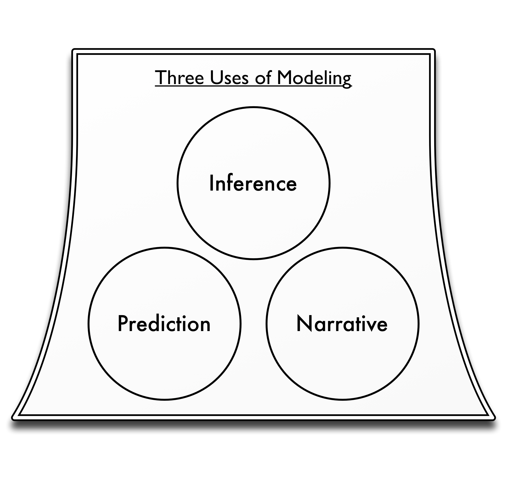

# Models and Truth #

> All models are wrong, but some are useful -- George E.P. Box

In discussing the relationship between models and truth it is useful to first take a step back and talk in general about the different usages and classes of models. There are three main usages for models: prediction, inference and narrative.

Prediction
: Models used for inference are the most straightforward. They attempt to forecast some outcome given information about variables related in some way to that outcome. A weather forecast is an example of a model being used prediction. When you apply for a credit card at a bank, they run a predictive model to determine your risk of default. When you apply for life-insurance, similarly, the company has an actuarial model to predict how much they should charge you for a given payout.

Inference
: Models used for inference are the most common in academic research. Often, academic research question boil down to the simple template: "Does *X* affect *Y*?" These are inferential type questions. So an academic may make a hypothesis, for instance; "The diversity of a student body in a school affects test scores at a school." They may then build a model to support or refute this hypothesis and their response will generally be phrased in terms of a *p*-value indicating the significance of the evidence in support or against the hypothesis.

Narrative
: Models are often used to tell a story. When the Obama administration wanted to persuade law makers and the public to support there proposed stimulus, they famously published the graph shown in Figure 2. A lot of complex modeling and mathematics went into constructing this figure, however its sole purpose is to tell a story: things were bad, but the stimulus would make them less bad. We will return to this figure later on.

All models can be classified using this classification scheme. Some models will attempt to do both. For instance it is common to want to build a model that is both predictive but also provides a strong narrative. In some cases this will succeed but more often it will fail.

There is an even simpler classification system we can use that once we complete it will really clarify the core dichotomy that is at the heart of modeling.

Narrative versus Predictive

Mechanistic versus statistical