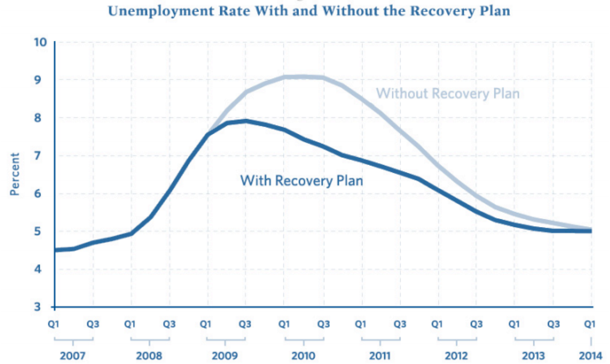

# Models and Truth

> All models are wrong, but some are useful -- George E.P. Box

In discussing the relationship between models and truth it is useful to first take a step back and talk in general about the different types of models. Modeling is wide a ranging field and their are many distinctions that modelers and mathematicians make when discussing models. Some distinctions -- such as Bayesian versus Frequentist statistical models^[Briefly, this debate refers to two divides within the statistical community that hinge on how probability is interpreted. A Frequentist claims that probability is dependent on the long term sequence of outcomes. Bayesian's take probability as a subjective degree of belief. Frequentist statistics are what are generally taught in introductory statistic courses and receive the most use. ]-- have been the subject of century's old philosophical arguments between mathematicians which continue to this very day.

These arguments and distinctions are of little interest to us -- we will present our own classification scheme that once we complete it will really clarify the core dichotomy that is at the heart of modeling -- but it can be useful to briefly discuss them in order to obtain a deeper understanding of the choices we make when we develop the construction of a model.

### Deterministic versus Stochastic Models

There are two views of the world. One view says the fate of the universe is governed by strict predictable laws. The universe is like a giant machine and given its current state, its future states through the rest of time are predetermined. Another view, is that the universe is governed by chance and randomness. Random quantum mechanical fluctuations pile up and amplify each other leading to an infinite range of diverging possibilities. Which is the truth? We certainly do not know and it is possible that this will be one of the questions that physicists will never cease exploring. Albert Einstein had a particular view though. He was a strong partisan in favor of the deterministic view, famously remarking that "God doesn't play dice with the world."

When creating a model of a process, we must make a similar choice about chance. Do we build are model in deterministic way such that each time we run it we get the same results? Or do we conversely incorporate elements of uncertainty so that each time it is run we may obtain a different trajectory of outcomes?

### Mechanistic versus Statistical Models

When beginning a model of a system, there are many questions that you should ask yourself. Two of them are:

1. Do I know (or have a hypothesis of) the mechanisms that drive the system?
2. Do I have data on the behavior of the system?

If the first question is answered in the affirmative, then you can build a mechanistic model that is replicates your understanding (or hypothesis of) the true system. If the second question is answered in the affirmative, you can use statistical algorithms such as linear regression to create a model of the system based purely on the data.

If neither question is answered affirmatively, well there isn't much of anything you can build.

### Aggregated versus Disaggregated

When building a model, the question of scale becomes very important. Imagine we are concerned about the affects of Global Climate Change and whether there will be enough water resources in the future assuming a warming climate. At what resolution do we build the model?

* At the most aggregate we could simply estimate total World-wide water demands and supplies into the future.
* Maybe that is too coarse; clearly having excess water in Norway has little impact on the situation in Egypt. We could instead create a finer resolution model that separately looked at the water demand and consumption in each country.
* Maybe that is still too coarse, maybe we should reduce our model to look at a specific cities and population clusters within countries.
* At the extreme disaggregated level, we might even want to model individual people: all 7 billion of them.

Clearly, there is no simple answer to this question and the best choice is highly context sensitive and depends on the needs of the specific model and application.

## A Functional Classification of Models

The three scales presented above can be used to classify models. We can even use them to classify the models we have discussed in this book. Most of these models would be classified as deterministic (random chance is generally not explicit incorporated in the models), mechanistic (we generally assume mechanisms rather than estimating relationships from data), and aggregated (the agent based models are an exception to this).

Outside of modelers, however, these choices scales are of little importance. Let's take off our modeler hats for a moment, and instead look at modeling as a client. In this case, we would hire a modeler to build a model to fulfill some specific purpose. The choices the modeler make (aggregated versus disaggregated, stochastic versus deterministic, what software they use, etc.) are all really secondary to them fulfilling that purpose.

So instead of using a scale based method to classify models, we can use a functional one based on the purpose or desired usage of a model. There are three main purposes for models: prediction, inference and narrative.

Prediction
: Models used for inference are the most straightforward. They attempt to forecast some outcome given information about variables related in some way to that outcome. A weather forecast is an example of a model being used prediction. When you apply for a credit card at a bank, they run a predictive model to determine your risk of default. When you apply for life-insurance, similarly, the company has an actuarial model to predict how much they should charge you for a given payout.

Inference
: Models used for inference are the most common in academic research. Often, academic research question boil down to the simple template: "Does *X* affect *Y*?" These are inferential type questions. So an academic may make a hypothesis, for instance; "The diversity of a student body in a school affects test scores at a school." They may then build a model to support or refute this hypothesis and their response will generally be phrased in terms of a *p*-value indicating the significance of the evidence in support or against the hypothesis.

Narrative
: Models are often used to tell a story. When the Obama administration wanted to persuade law makers and the public to support there proposed stimulus, they famously published the graph shown in Figure 2. A lot of complex modeling and mathematics went into constructing this figure, however its sole purpose is to tell a story: things were bad, but the stimulus would make them less bad. We will return to this figure later on.

All models can be classified in terms of these three primary usages and it can be useful to discuss modeling projects in terms of them. There is an even simpler classification system we can use, however, that once we complete it will really clarify the core dichotomy that is at the heart of modeling.

Rather then talking about the usage or p of a model, we can talk 

Let's talk for a moment about the process of inference. 

Narrative versus Predictive

Mechanistic versus statistical

Although models will ultimately fit squarely in one of these three categories, in practice many modeling projects will try to fulfill multiple usages. For instance, it is common to for clients of modelers to want to build a model for prediction 