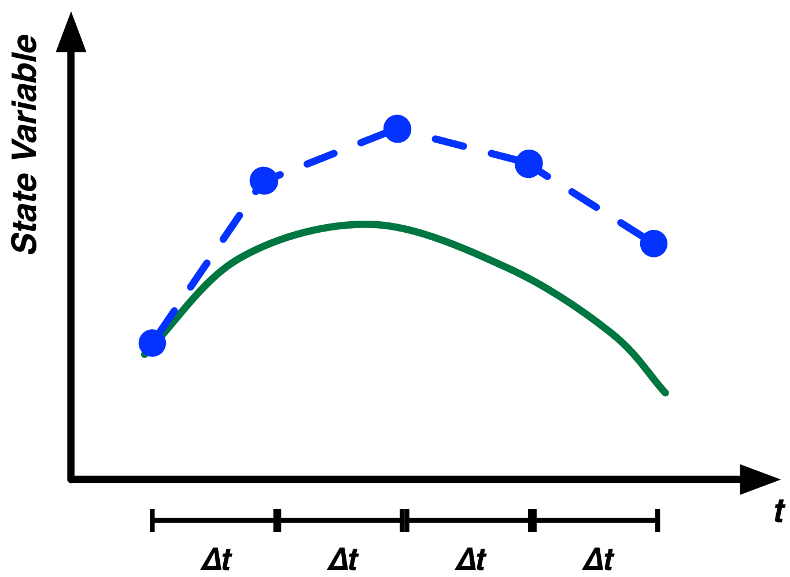
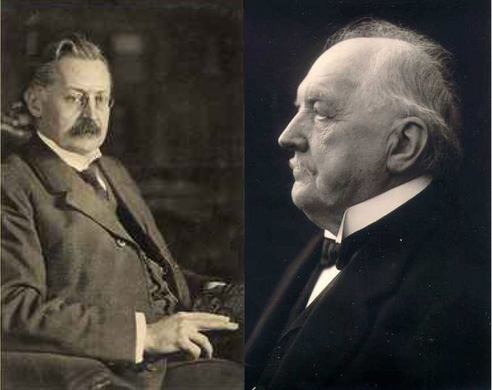
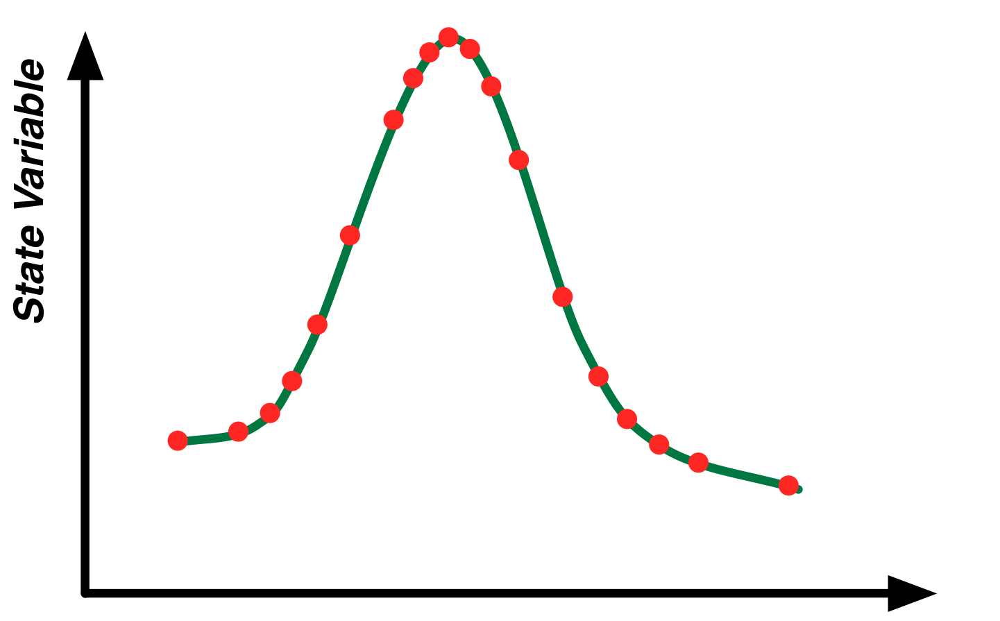

# The Mathematics of Modeling

This chapter takes the modeling techniques introduced earlier in this book and places them within a firm mathematical framework. The contents of this chapter are quite technical in parts and to fully understand them requires knowledge of basic calculus and linear algebra. We present the material because it is important for both readers who want a deep understanding how their models operate and also those who wish to understand how System Dynamics fits within the larger field of mathematical modeling. For users who approach systems thinking and modeling from a more qualitative angle, this material may be browsed or safely skipped.

##  Differential Equations and System Dynamics

Differential equations are a common mathematical tool used to study rates of change. Some basic terminology needs to be learned in order to discuss differential equations. After introducing this new terminology, we will then tie it back to the modeling techniques you’ve already learned.

State Variable
: A state variable is an object that represents part of the state of a system. For instance, in a population model you could have a state variable representing the current number of individuals in that population. In a model of a lake, you could have a state variable representing the current volume of water in the lake. In equations, state variables are often represented using Roman letters such as $X$, $Y$ or $Z$.

Derivative
: Derivatives define rates of change in state variables. For instance, if we had a state variable representing the size of a population, a derivative would specify how this population grows or shrinks over time. The population's derivative would aggregate all changes such as births, deaths and immigration or emigration to show the net change in the state variable over time. Similarly, in the case of a model of a lake, the lake volume state variable would have a derivative showing how much net water flows into or out of the lake over time. Given a state variable $X$, the derivative of $X$ with respect to time is generally written as $dX/dt$ but can also be written as $X'$ or $\dot{X}$.

Let's put this new terminology to work to define a simple model. We start by creating an exponential growth population model. We only need one state variable in this model to represent the size of the population. We denote this state variable as $P$. We need to define one parameter to control the growth rate in the population. We will denote this growth rate parameter $\alpha$.

The resulting differential equation exponential growth model can be written simply as:

$$ \frac{dP}{dt} = \alpha \times P $$

This indicates that the rate of change for the population for one unit of time is $\alpha \times P$. Our model is not quite fully specified yet as we do not know what the initial value of the population is. Differential equation models are often additionally specified by providing the values of the state variables at a specific point in time. Below we indicate that the population size at time 0 is 100.

$$ P(0) = 100 $$
$$ \frac{dP}{dt} = \alpha \times P $$

You may have already noted that this model is easy to construct using the techniques we have already introduced in the book. In fact we have discussed this type of model several times. We could construct it with System Dynamics tools using a stock to represent the population ($P$), a flow to represent the change of population ($dP/dt$) and a variable to represent birth rate ($\alpha$). We could specify our initial condition of a population size of 100, by setting the initial value for the stock for 100.

This is an important point. Many differential equation models^[Specifically those where the denominator in the derivative $dX/dt$ is always $dt$: a very wide class of commonly used models.] can be directly represented using the System Dynamics modeling techniques described in this book. Similarly, a System Dynamics model can be rewritten as a differential equation model.

From this perspective, System Dynamics models and differential equation modeling are one and the same. A System Dynamics model can be expressed using differential equation notation and vice versa. To see this in more detail, we can look at the mapping between System Dynamics and differential equation models. There is a one a one-to-one direct correspondence between the key System Dynamics primitives and components of a differential equation model.

System Dynamics Primitive | Differential Equation Equivalent
---|---
Stock | State Variable ($X$, $Y$, etc...)
Flow | Derivative ($dX/dt$, $dY/dt$, etc...)
Variable | Constants/Parameters ($\alpha$, $\beta$, etc...)

Since they do not differ significantly from a mathematical standpoint, what separates these two approaches to modeling? Where System Dynamics and differential equation modeling differ is in their focus and philosophy. The primary goal for differential equation modelers is analytic tractability (in other words, how easy is it to mathematically manipulate and understand the model’s equations). This analytic tractability allows these modelers to derive definite results and conclusions from the model's equations. System Dynamics modelers generally are less concerned about analytic tractability and are more comfortable with simulating the model and drawing conclusions from observed trajectories and numerical results.

System Dynamics modelers, to go further, care greatly about communicating their models, deliberately mirroring reality to some extent and exploring the consequences of feedback. The differing focuses on communication between System Dynamics modelers and differential equation modelers can be seen in the method of naming variables. Differential equation models are generally dominated by abstract Greek symbols (e.g. $\alpha$) while System Dynamics models generally clearly spell out variable names (e.g. "Birth Rate") and additionally use a model diagram to illustrate and communicate the relationships between different parts of the model.

## Solving Differential Equations

Given a differential equation or System Dynamics model specification, how do you go about determining the results of the model? This is typically referred to as "solving" the model. Since differential equation models and system dynamics models are essentially one and the same, the techniques used to solve differential equations can be directly applied to System Dynamics models and they are the techniques used by Insight Maker when you simulate any of the models in this book.

For most of the rest of this chapter, we use the differential equation terminology instead of the System Dynamics one. We do so first because it is more concise and more elegantly addresses the issues discussed in this chapter, but also because we want to familiarize you with its terminology and concepts. If you ever get lost, just refer to the System Dynamics to differential equation translation table we showed above.

Let's start our discussion of solving differential equations using our simple population model. As you recall, this model was:

$$ P(0) = 100 $$
$$ \frac{dP}{dt} = \alpha \times P $$

What is the size of the population, at, let's say $t=10$ given an $\alpha$ of 0.1? Calculus can be used to solve the model and answer this question. First we separate the terms of the derivative and integrate both sides of the equation. Thereafter it is a simple matter of algebra to solve for $P$:

$$
\begin{aligned}
\frac{dP}{dt} &= \alpha \times P \\
dP &= \alpha \times P\ dt \\
\frac{1}{P}\ dP &= \alpha\ dt \\
\log(P) &= \alpha \times t + A \\
P &=  e^{\alpha \times t + A} \\
P &=  B \times e^{\alpha \times t} \\
\end{aligned}
$$

In this equation two new variables $A$ and $B$ appeared (where we arbitrarily set $B=e^A$). These are unknown integration constants^[Recall from calculus that if $A$ is a constant, then $x^2+A\ dx = 2 \times x$. When we integrate $2 \times x$ we need to add back in the constant term. We don’t know the value of this constant term immediately and we have to determine it later on.]. We can determine the values of the integration constants based on the initial conditions of the model, as we specified earlier that $P(0) = 100$. We evaluate the solution of the model at this initial condition to determine the value of $B$.

$$
\begin{aligned}
P &= B \times e^{\alpha \times t} \\
100 &= B \times e^{\alpha \times 0} \\
100 &= B
\end{aligned}
$$

Thus our generic equation for $P$ at any time and for any $\alpha$ is:

$$ P = 100 \times e^{\alpha \times t} $$

Plugging in $\alpha=0.1$ and $t=10$, we obtain:

$$
\begin{aligned}
P &= 100 \times e^{0.1 \times 10} \\
  &= 271.828...
\end{aligned}
$$

For this simple population model we have shown that we can obtain the precise population value at any point in the future. It took a fair amount of algebra even for such a simple model, but we did it!

Unfortunately, many differential equation models cannot be solved using these techniques. For most complex models in practice, it is impossible to analytically determine the values of the state variables in the future. This inability to solve a model can be true for even very simple models. Take for example the following growth model similar to our original one:

$$ P(0) = 100 $$
$$ \frac{dP}{dt} = \alpha \times P \times \log(P) $$

We have simply added a logarithm of $P$ into our growth rate. Despite the smallness of this change, this model is now impossible to solve analytically. There is no analytic solution possible, but feel free to give it a try yourself (but please don't try too hard; we promise there is no solution). When developing complex models it should generally to be assumed that in practice no analytical solution will be available. In cases like these, how can we go about developing solutions to the equations and determining the trajectory of the state variables in the system?

The answer is numerical approximation. Even if we can't solve the model equations analytically, we will always be able to approximate their results numerically. A number of different algorithms exist that allow us to approximate the solution to differential equations by repeatedly plugging values into them. To discuss these methods, it is useful to introduce some additional mathematical notation.

In our previous models, we have only looked at systems with a single state variable at a time. However, we can also consider systems containing multiple state variables. The Lotka-Volterra predator prey system we looked at earlier in the book is an example of this. Given two populations of animals -- let's say a population of wolves ($W$) and a population of moose ($M$) -- where the first population preys upon the second, we obtain a paired set of differential equations representing this predator prey relationship:

$$ \frac{dM}{dt} = \alpha \times M - \beta \times M \times W $$
$$ \frac{dW}{dt} = \gamma \times M \times W - \delta \times W  $$

When looking at algorithms to solve sets of equations like these numerically, it can be useful to denote $\mathbf{y}$ as a vector of all the state variables in the model. So for the case of the exponential growth model $\mathbf{y}=[P]$ while for the Lotka-Volterra model $\mathbf{y}=[M, W]$. When using this notation, $\mathbf{y_t}$ indicates the vector of state variable values at a specific point in time, so $\mathbf{y_0}$ are the initial conditions for this model.

Additionally, we can denote $\mathbf{y'}$ as the vector of derivatives for the different state variables. We treat these derivatives as functions of the current time and the values of the other state variables. So, for instance, to determine the rate of change of the state variables in a model at $t=10$, we would write $\mathbf{y'}(\mathbf{y_{10}}, 10)$ where $\mathbf{y_{10}}$ are the values of the state variables at $t=10$.

The use of this notation might seem cumbersome, but it allows us to elegantly describe the mathematics of numerical solution algorithms without getting tied up in the details of a specific model.

### Euler's Method

The most basic numerical solution algorithm for differential equations is Euler's method^[Leonhard Euler was a brilliant 18th century Swiss mathematician who made many great advances in the theoretical and applied mathematics.]. Simply put, assuming we know the state of the system at time $t$ and we wish to estimate the state of the system at time $t+\Delta t$ (where $\Delta t$ is pronounced "delta-t" and represents the change in time) we can use the following equation:

$$ \mathbf{y_{t+\Delta t}} = \mathbf{y_{t}} + \Delta t \times \mathbf{y'}(\mathbf{y_t}, t) $$

Let's walk through what this equation is doing. It first takes the derivatives for the state variables at the current point in time. It multiplies these rates of change by the $\Delta t$ (how far in the future we want to know the results) and adds this change to the values of the state variables at the starting point in time. The result is an estimate of what the values in the future should be.

Let’s now apply this to a concrete example. Start with our population scenario, but instead of exponential growth we have a fixed inflow of people at a rate of 20 per year. At $t=0$ we have 100 people and we want to know the population in 10 years, using Euler's method we obtain the following:

$$
\begin{aligned}
P_{10} &= P_0 + \Delta t \times \frac{dP}{dt} \\
&= P_0 + 10 \times 20 \\
&= 100 + 200 \\
&= 300
\end{aligned}
$$

Thus the population size in 10 years will be 300. In this simple example, Euler's method works perfectly and generates the exact same answer as we would have found using analytic solutions.

In general, however, we won't be so lucky. For most problems Euler's method will generate results that contain some level of error compared to what the true value should be. To see this let's explore our exponential growth model again with an $\alpha$ of 0.1. As a reminder, this model is:

$$ P(0) = 100 $$
$$ \frac{dP}{dt} = 0.1 \times P $$
 
As we showed earlier, the precise solution to this model for $t=10$ (to three decimal places) is 271.828. Let's see what we get using Euler's method with $\Delta t = 10$. Carrying out similar calculations as before we get:

$$
\begin{aligned}
P_{10} &= P_0 + \Delta t \times \frac{dP}{dt} \\
&= P_0 + 10 \times (0.1 \times P_0) \\
&= 100 + 10 \times (0.1 \times 100) \\
&= 100 + 10 \times 10 \\
&= 100 + 100 \\
&= 200
\end{aligned}
$$
 
So using Euler's method we obtain an estimate 200 for the population size at $t=10$ when we know the true value should be around 272. That's a pretty large error! Why does this error come about? Why do we so significantly underestimate the final population size?

The reason is that we calculate the population's rate of change only at $t=0$. For each of the ten years we are simulating, we assume the population grows at the rate it would if there were exactly 100 people. However, the population size is constantly increasing during these ten years, so the rate at which it grows should also be increasing. Imagine, the case of a bank account with an interest rate of 10% yearly. The bank account grows over time so the interest earned should also grow from year to year. It's the same principle of compounding here.

How do we address this issue? Using Euler's method, we can do it simply by changing how often we calculate the rates of change. In our previous calculation, we went straight from $t=0$ to $t=10$ all in one step, we used a $\Delta t$ in Euler's equation of 10. However, we could employ an alternate calculation strategy where, for instance, we stepped from $t=0$ to $t=5$, recalculated the derivative based on the new population size and then stepped from $t=5$ to $t=10$. This would be equivalent to used a $\Delta t$ of 5 and iterating the algorithm twice. Here is what we get doing this:

$$
\begin{aligned}
P_{5} &= P_0 + \Delta t \times \frac{dP}{dt} \\
&= P_0 + 5 \times (0.1 \times P_0) \\
&= 100 + 50 \\
&= 150 \\
P_{10} &= P_5 + \Delta t \times \frac{dP}{dt} \\
&= P_5 + 5 \times (0.1 \times P_5) \\
&= 150 + 5 \times 15 \\
&= 150 + 75 \\
&= 225
\end{aligned}
$$ 

That result is certainly better, and we cut our error by over 33%. However, the error is still too large for most practical purposes. To improve the numerical estimation even more, we can apply smaller and smaller $\Delta t$'s. You probably have a good grasp of the calculations now, so let's just show the results for each step of the simulation. We’ll look at $\Delta t = 2$ and $\Delta t = 1$.

$t$|$P$
---|---
0|100
2|120
4|144
6|172.8
8|207.4
10|248.8

$t$|$P$
---|---
0|100
1|110
2|121
3|133.1
4|146.4
5|161.1
6|177.2
7|194.9
8|214.4
9|235.8
10|259.4

We see that as $\Delta t$ gets smaller and smaller our results become more and more accurate. However, they are never perfect. There is always some error. Even if we made $\Delta t$ as small as 0.1 (requiring 100 simulation steps), our final population size would be calculated to be 270, an error just under 1%.

Figure 1 illustrates the application of Euler's method to numerically estimate the trajectory for an example function. The smaller the $\Delta t$'s in the estimation are, the better the results will be. Other terms that can be used in place of $\Delta t$ are "Step Size", "Time Step" or just "DT". We prefer not to use the notation DT as it is easily confusable with the $dt$ from differential equations. The latter indicates an infinitesimally small change, while step sizes are never infinitesimally small.

As you decrease the step size for the simulation, the results of the simulation become more and more accurate^[It is important to note at this point that when we discuss accuracies in this context we are specifically referring to models composed of continuous differential equations. If you are using agent based modeling or have discontinuities in your models -- which could occur if you use \e{IfThenElse()} logic -- then a smaller step size may not provide additional accuracy when there is some fundamental time step logic to the model.]. The cost of this increased accuracy, however, is increased computation time. The computation time required by your model is directly proportional to 1 over the step size. Thus, if you cut the step size in half, your model will take twice as long to complete simulating.

In general, you want a step size small enough that your results are "accurate enough," but one that isn't so small that the simulation takes too long to complete. A rule of thumb for choosing the step size is to choose a starting step size that results in a fast simulation. Then cut the value of the step size in half and simulate the model again. If the results have not change materially between these two simulations, keep the larger step size. If the results have changed, cut the step size in half again and repeat until the results cease to change.

### Runge-Kutta Methods

Euler's method is not the only technique that can be used to numerically solve differential equations. Another popular set of techniques are called Runge-Kutta methods. Runge-Kutta methods are a family of numerical differential equation solvers. In fact Euler's method itself can be classified as a simple Runge-Kutta method.

One particular member of the Runge-Kutta family of methods that is widely used is a 4th-order Runge-Kutta method. This method differs from Euler's method in that for each step, it evaluates the model multiple times and averages the resulting derivatives. Briefly, the driving set of equations for this method is as follows:

$$
\begin{aligned}
\mathbf{y_{t+\Delta t}} &= \mathbf{y_{t}} + \Delta t \frac{\mathbf{a}+2 \times \mathbf{b}+2 \times \mathbf{c}+\mathbf{d}}{6} \\
\text{Where:} \\
\mathbf{a} &= \mathbf{y'}(\mathbf{y_t}, t) \\
\mathbf{b} &= \mathbf{y'}(\mathbf{y_t}+\frac{\Delta t}{2} \times \mathbf{a}, t+\frac{\Delta t}{2}) \\
\mathbf{c} &= \mathbf{y'}(\mathbf{y_t}+\frac{\Delta t}{2} \times \mathbf{b}, t+\frac{\Delta t}{2}) \\
\mathbf{d} &= \mathbf{y'}(\mathbf{y_t}+\Delta t \times \mathbf{c}, t+\Delta t) \\
\end{aligned}
$$

What this algorithm does is first compute the derivatives of the system at the current time ($\mathbf{a}$) and use them to move the system forward to $t+\Delta t/2$. The derivatives are evaluated at $t+\Delta t/2$ ($\mathbf{b}$) and this new set of derivatives is used to again move the system from $t$ to $t+\Delta t/2$. A third set of derivatives are evaluated again at this mid-point ($\mathbf{c}$) and they are the used to move the system from $t$ to $t+\Delta t$. A fourth set of derivatives are evaluated at this point ($\mathbf{d}$). The system is then returned to its starting point and a weighted average of derivatives are used to move the system the full time step. This weighting puts most of the weight on the middle two derivatives instead of the derivatives from the end points.

This 4th-order Runge-Kutta method is generally much more accurate than Euler's method for a given step size. Using a step size of 10 for our earlier population model, the Runge-Kutta method generates a value of 270.8. A step size of 5 yields a results of 271.7, just a smidgeon away from the precise value of 271.8. Recall that for Euler's method, even with a step size of 0.1 we still were not as accurate as the Runge-Kutta method with a step size of 5. Now it is true that this 4th-Order Runge-Kutta method does a lot more work than Euler's method for each step. It evaluates the model for times and has to do some averaging of derivatives. However, it is still much more accurate than Euler's method for an equivalent level of computational effort.

# Model

{"title":"Numerical Solution Algorithms", "description": "This model explores the selection of the simulation step size and differential equation solution algorithm."}

{"geometry":{"x":390,"y":330,"width":100,"height":40},"name":"Population","create":"Stock"}

{"attribute":"InitialValue","target":"Population","value":"100"}

{"geometry":{"x":0,"y":0,"width":100,"height":100,"sourcePoint":{"x":440,"y":110},"targetPoint":{"x":0,"y":100}},"alpha":null,"omega":"Population","name":"Net Growth","create":"Flow"}

{"geometry":{"x":590,"y":120,"width":120,"height":50},"name":"Growth Rate","create":"Variable"}

{"attribute":"Equation","target":"Growth Rate","value":"0.1"}

{"geometry":{"x":0,"y":0,"width":100,"height":100},"alpha":"Growth Rate","omega":"Net Growth","create":"Link"}

{"attribute":"FlowRate","target":"Net Growth","value":"[Growth Rate]*[Population]"}

{"geometry":{"x":590,"y":320,"width":120,"height":50},"name":"True Population","create":"Variable"}

{"geometry":{"x":0,"y":0,"width":100,"height":100},"alpha":"Growth Rate","omega":"True Population","create":"Link"}

{"attribute":"Equation","target":"True Population","value":"100*Exp([Growth Rate]*Years)"}

{"attribute":"TimeLength","value":"10"}

DIAGRAM

Let's now implement the simple exponential growth model we have discussed in this chapter. We have a population that starts with 100 people and increases at a rate of 10% per year. In addition to creating the stock and flow model, we have also created a variable, [True Population], that contains the analytical solution to the model.

First, we'll use Euler's method with a step size of 2 years and simulate the model.

{"attribute":"TimeStep","value":"2"}

RESULTS

As we can see these results aren't very accurate. The value of the numerical estimated [Population] is quite different from the analytically determined value in [True Population]. Let's reduce the step size to 1 year and try again.

{"attribute":"TimeStep","value":"1"}

RESULTS

This is better, but we're still off by a fair amount. We could experiment with continuing to reduce the step size, but let's instead switch now to the more accurate Runge-Kutta method. Will simulate the model again with a step size of 1 using the 4th-Order Runge-Kutta solution algorithm.

{"attribute":"SolutionAlgorithm","value":"RK4"}

RESULTS

That's a lot better! It's so close to being perfect that we can’t even see the difference between the two lines in the figure. Just to be clear, let's see how quickly the results degrade when we increase the step size. Let's set the step size to 10 and simulate the model again.

{"attribute":"TimeStep","value":"10"}

RESULTS

That's still very good and much better than Euler's Method with a step size of 1. Why don't you go ahead now and experiment with different step sizes and the two solution methods to get a feel for their accuracies.

# End Model

### Other Solution Techniques

While being a brief introduction into numerical solution methods for differential equations, this should provide you with the background you need to intelligently make decisions about controlling the simulation of your models. It should help you identify potential sources of errors in your model and help you to adjust you simulation configuration to account for them.

The two methods we have looked at for solving differential equation models -- Euler's method and a 4th-Order Runge-Kutta method -- are widely used and they are what are built into Insight Maker. In addition to these two techniques, however, there are many other methods that are used in practice and you should be aware of this richer ecosystem of solution techniques.

Although we do not have space here to delve into the full ecosystem of numerical differential equation algorithms, it is useful to discuss one variant briefly: the adaptive step size algorithm. The methods we have looked at here use a fixed step size specified at the beginning of a simulation. Many models, however, might be characterized by highly variable trajectories. Part of the trajectory might be very smooth and unchanging while other parts might experience numerous rapid changes.

When using a fixed step size algorithm like the ones illustrated above, the step size must be set for the worse case scenario. The step size must be set to a small enough value to account for the rapidly changing areas. That said, the precision of this small step size is unnecessary on the smooth regions of the trajectory where the algorithm must do extra work for minimal gain in precision. Ideally, we would want to have a small step size for the rapidly changing areas and a large one for the smooth regions. This would result in the best of both worlds: high accuracy and quick computation.

Adaptive step size algorithms do just that. They adjust the step size dynamically based on the behavior of the model's derivatives. If the derivatives change rapidly, then the step size will be automatically shrunk; if the derivatives are constant or change very slowly the step size will automatically grow. Figure 2 illustrates the location of steps for an illustrative model using an adaptive step size algorithm. The steps are clustered around changes in the trajectory's derivatives in an attempt to maximize predictive accuracy while minimizing computation effort.

### Analyzing Differential Equations

Although the trajectory for the state variables in differential equation models generally cannot be determined analytically, several key properties of models can often still be determined. These properties include:

* The location of equilibrium points
* The stability of the equilibrium points

An equilibrium point is defined as a set of state variable values that will cause the system to cease to change. Once the system enters an equilibrium configuration, it will not leave that configuration without an external stimulus. For instance, in our exponential growth model a single equilibrium point exists: that of zero people. If the population is empty, then the population will not grow and instead remain at 0 indefinitely.

In the exponential growth population model there is only one equilibrium point ($P=0$). In other models you may have multiple equilibrium points. In a model of a highly infectious, incurable disease you can imagine a system where two equilibrium points exist: one where no one is infected and a second point where everyone is infected. As long as there were no infectious individuals, the population would remain healthy. If just a single infected individual were introduced into the population, the infection would, however, spread until everyone was infected and the population would then remain at that point (remember this hypothetical disease is incurable).

Multiple types of equilibria exist. Figure 3 illustrates what is known as the *stability* of equilibrium points. Each of the three panes in this figure show a different form of equilibrium for the ball. In all three the balls are in equilibrium: if the no external forces come into play, the balls will not move. What differs in each of the three is what occurs if the balls are displaced a small amount.

Stable Equilibrium
: In this type of equilibrium the ball will return to its original position if it is displaced. The structure of the system is such that the system is naturally attracted to the point of equilibrium. To use the physical metaphor, the equilibrium is at the bottom of a dip and the system naturally rolls into it.

Unstable Equilibrium
: Here the ball will move further and further away from the point of equilibrium if it is displaced even a small amount. The equilibrium is unstable in that if we are just a small distance away from it, we move further away from it. To use the physical metaphor, the equilibrium is at the top of the hill and the system will move away from it unless it is placed at the exact point of equilibrium.

"Neutrally Stable Equilibrium"
: This is a less common form of equilibrium and goes by several different names. In this case if the ball is moved it will stay fixed at its new location. It will not move closer to or further from the original equilibrium. Of the three types of equilibrium, this one is less interest or relevance in practice.

In the case of the highly infectious disease model, an equilibrium of everyone being healthy would be classified as an unstable equilibrium. The equilibrium would persist as long as no one brought the disease into the population (someone would not just spontaneously become ill), but if as little as a single sick person entered the population, the population would move further and further away from the equilibrium point of everyone being healthy and would never naturally return to it.

The equilibrium point of everyone being sick is, on the other hand, a stable equilibrium as no one recovers from the disease on their own. Even if you introduced healthy people into a population of sick individuals -- moving the population away from the equilibrium -- they too will eventually become sick restoring the population to the equilibrium of everyone being sick.

#### Equilibrium  Points

Often, we can determine the equilibrium points for a system without fully needing to solve the trajectory for the state variables. Let's implement the simple disease model we've been discussing. We'll do so for both a differential equation model and a System Dynamics model, but we'll rely on differential equation version to do our analytic analysis.

One way to express the differential version of the model is to define two state variables: the number of healthy people ($H$) and the number of sick people ($S$). The rate of infection between sick and healthy people can be made a function of the number of people in each category. Clearly, if there are no sick people the infection rate is 0; but, just as clearly, if everyone is already sick then the infection rate will also be zero. One workable differential equation model to implement this behavior is shown below:

$$
\begin{aligned}
H(0) &= 100 \\
S(0) &= 1 \\
\frac{dH}{dt} &= - \alpha \times H \times S \\ 
\frac{dS}{dt} &= \alpha \times H \times S
\end{aligned}
$$

This model uses a single parameter ($\alpha$) to control the infection rate. $alpha$ is a non-zero positive value; the smaller $\alpha$ is, the slower the infection will progress and vice versa. This notation illustrates one of the clumsier aspects of implementing stock and flow models using differential equations. The flow values between two stocks have to be repeated twice once for each of the two connected state variable's derivatives.

# Model

{"title":"Incurable Disease", "description": "This model illustrates stable and unstable equilibria using the scenario of an incurable disease in a population."}

{"geometry":{"x":380,"y":180,"width":100,"height":40},"name":"Healthy","create":"Stock"}

{"geometry":{"x":380,"y":340,"width":100,"height":40},"name":"Sick","create":"Stock"}

{"geometry":{"x":0,"y":0,"width":100,"height":100},"alpha":"Healthy","omega":"Sick","name":"Infection","create":"Flow"}

{"geometry":{"x":210,"y":200,"width":120,"height":50},"name":"Infection Rate","create":"Variable"}

{"geometry":{"x":0,"y":0,"width":100,"height":100},"alpha":"Infection Rate","omega":"Infection","create":"Link"}

DIAGRAM

This is the structure of our model. We have two stocks of people with people moving from the healthy stock to the sick stock as they become infected. Let's add the values and equations now.

{"attribute":"InitialValue","target":"Healthy","value":"100"}

{"attribute":"InitialValue","target":"Sick","value":"0"}

{"attribute":"Equation","target":"Infection Rate","value":"0.01"}

{"attribute":"FlowRate","target":"Infection","value":"[Infection Rate]*[Healthy]*[Sick]"}

There our model is fully setup. We've set it to start with everyone being healthy.

RESULTS

These results are quite stable. Everyone is healthy and no one gets sick. That indicates we have an equilibrium here. Let's now experiment by making a single person in the population sick.

{"attribute":"InitialValue","target":"Sick","value":"1"}

{"attribute":"InitialValue","target":"Healthy","value":"99"}

RESULTS

That's more interesting! We can see that everyone being healthy is an unstable equilibrium as the system moves away from it if we deviate from it by even a small amount. We can also see that the second equilibrium (everyone being sick) is stable as the system moves towards it naturally.

# End Model

Finding the equilibria for differential equation models is by-and-large straightforward analytically. We simply need to harness the definition of an equilibrium point: an equilibrium point is one where the state variables are constant and unchanging. Since the derivatives represent changes in the state variables, this statement is equivalent to saying the derivatives for the model are 0 at equilibrium points.

Based on this, in order to find the equilibrium points we simply need to set the derivatives in our model to 0 and solve the resulting equations. For the disease model we get:

$$
\begin{aligned}
H(0) = 99 \\
S(0) = 1 \\
0 = - \alpha \times H \times S \\ 
0 = \alpha \times H \times S
\end{aligned}
$$

The initial conditions will determine what equilibrium is arrived at but they do not affect the existence of the equilibria. Furthermore, the two equations we have set to 0 are equivalent^[Although we expressed this model as a function of two state variables $H$ and $S$, it only has one independent state variable. Given the fixed population size, you know the value of $H$ given $S$ and vice versa.] so we can simplify these equations to simply be:

$$ 
0 = \alpha \times H \times S
$$

Simple inspection reveals that this equation is true if and only if either $H=0$, $S=0$, or $\alpha=0$. Thus we have mathematically shown that our equilibria are either when everyone is sick or everyone is healthy (or there is no infection whatsoever). Granted this is a trivial conclusion for this model and we stated it earlier. However, for more complex models this type of analysis can be very useful and will often reveal that equilibria are functions of the different parameter values in the model and they may enable you to explicitly determine how the equilibria changes as the model configuration changes.

Let's try a more complex example. Remember the predator prey model from earlier? We had the following set of equations to simulate the relationship between a moose and wolf population:

$$ \frac{dM}{dt} = \alpha \times M - \beta \times M \times W $$
$$ \frac{dW}{dt} = \gamma \times M \times W - \delta \times W  $$

Let's determine what the equilibrium values are for this model. As before, we start by setting the derivatives to 0:

$$ 0 = \alpha \times M - \beta \times M \times W $$
$$ 0 = \gamma \times M \times W - \delta \times W  $$

Solving this set of equations is more difficult than for the disease model. However a little bit of algebra reveals two solutions. One when $M=0$ and $W=0$ (there are no animals at all), and the second when $M=\delta/\gamma$ and $W=\alpha/\beta$. This is an example of where the equilibrium location depends on the values of the model parameters.

#### The Phase Plane

When looking at model results, up until now we have been focused on time series plots and we have mainly been interested in the trajectory of the variables and stocks over time. For the mathematical analysis of differential equations, however, the primary graphical tool is not this time series plot; instead it is what is known as a phase plane plot.

Phase planes are almost like scatterplots. They show one of the state variables plotted against another of the state variables. A scatterplot could be used to show the path for these two variables over the course of a simulation. In the predator prey model the results of a scatterplot of the wolf and moose population will be an ellipsoid. The two populations will cycle continuously. A phase plane plot is similar to this, but rather than just showing one of these cycles for a given simulation run, the phase plane shows the trajectories for *all* combinations of moose and wolf population sizes.

Figure 4 illustrates a phase plane plot for the predator prey system. The trajectory for one set of parameter and state variable values is highlighted in red and, as expected, we see a continual oscillation. We can also see the trajectories for all the other combinations of state variables. We see that the system will always oscillate and the size of this oscillation depends on the initial conditions for the state variables. This illustration provides us with a good deal of information in a single graphic and the phase plane plot is a great way to summarize the behavior of a system with two state variables.

Let's quickly explore the phase plane plots for a simpler system than our predator prey model. Take a system consisting of two state variables^[Just a helpful reminder if you are starting to get lost in some of this differential equation jargon. A "state variable" is just a stock. Return to the table at the beginning of this chapter to see how these terms relate to the system dynamics modeling terminology we have already learned.] both of which grow (or decay) exponentially. These state variables will be assumed to be independent from each other so the value of one does not affect the value of the other:

$$
\begin{aligned}
\frac{dX}{dt} = \alpha \times X \\
\frac{dY}{dt} = \beta \times Y \\
\end{aligned}
$$

Clearly, there is an equilibrium point for this model at $X=0$ and $Y=0$. There are four general types of behavior around this equilibrium. One when $\alpha>0$ and $\beta>0$, one when $\alpha<0$ and $\beta>0$, one when $\alpha>0$ and $\beta<0$, and one when $\alpha<0$ and $\beta<0$. The phase planes for each of the four cases are shown in Figure 5.

From these plots we can visually determine how the stability of the equilibrium point at $X=0, Y=0$ changes as we change $\alpha$ and $\beta$. When $\alpha<0$ and $\beta<0$, we have a stable equilibrium; in all other cases we have an unstable equilibrium.

#### Stability Analysis

Now that we have learned how to analytically determine the location of equilibrium points, we may want to determine what type of stability occurs at these equilibria. As we stated earlier, for the incurable disease model it is trivial to arrive at the conclusion that the state of everyone being healthy is unstable while the state of everyone being sick is stable. In more complex models, it may be harder to draw conclusions or the stability of an equilibrium point may change as a function of the model's parameter values. Fortunately, there is a general way to determine the precise stability nature of the equilibrium points analytically.

The procedure to do this is relatively straightforward, but the theory behind it can be difficult to understand. The first key principle that must be understood is that of "linearization". To get a feel for linearization, let's take the curve in Figure 6. Clearly this curve is not linear. It has lots of bends and does not look at all like a line.

If we zoom in on any one part of the curve, however, the section we are zoomed in on starts to straighten out. If we keep zooming in, we will eventually reach a point where the section we are zoomed in on is effectively linear: basically a straight line. This is true for whatever part of the curve we zoom in on^[The one exception to this rule is if your curve is some sort of fractal. In this case no matter how much you zoom in on it, it will never become straight. In practice, however, this caveat is a non-issue.]. The more bendy parts of the curve will just take more zooming to convert them to a line.

We can conceptually do the same process for the equilibrium points in our phase planes. Even if the trajectories of the state variables in the phase planes are very curvy, if we zoom in enough on the equilibrium points, the trajectories at a point will eventually become effectively linear. The simple, two-state variable exponential growth model we illustrated with phase planes above are examples of a fully linear model. If we zoom in sufficiently on the equilibrium points for most models, the phase planes for the zoomed-in version of the model will eventually start to look like one of these linear cases.

Mathematically, we apply linearization to an arbitrary model by first calculating what is called the Jacobian matrix of the model. The Jacobian matrix is the matrix of partial derivatives of each of derivatives in the model with respect to each of the state variables:

$$ \text{Jacobian} = \begin{bmatrix} \dfrac{\partial }{\partial X} X' & \cdots & \dfrac{\partial }{\partial Z} X' \\ \vdots & \ddots & \vdots \\ \dfrac{\partial }{\partial X} Z' & \cdots & \dfrac{\partial }{\partial Z} Z'  \end{bmatrix} $$

The Jacobian is a linear approximation of our (potentially) non-linear model derivatives. Let's take the Jacobian matrix for the simple exponential growth model:

$$
\begin{aligned}
\frac{dX}{dt} = \alpha \times X \\
\frac{dY}{dt} = \beta \times Y \\
\end{aligned}
$$

$$
\begin{aligned}
\text{Jacobian} &= \begin{bmatrix} \dfrac{\partial}{\partial X } \alpha \times X & \dfrac{\partial}{\partial Y } \alpha \times X  \\  \dfrac{\partial}{\partial X } \beta \times Y & \dfrac{\partial}{\partial Y } \beta \times Y \end{bmatrix}
&= \begin{bmatrix} \alpha  & 0 \\ 0 & \beta \end{bmatrix}
\end{aligned}
$$

This is complicated so don't worry if you don't completely understand it! Once you have the Jacobian, you calculate what are known as the eigenvalues of the Jacobian at the equilibrium points. This is also a bit complicated, so if your head is starting to spin, just skip forward in this chapter!

Nonetheless, eigenvalues and their sibling eigenvectors are an interesting subject. Given a square matrix (a matrix where the number of rows in equals the number of columns), an eigenvector is a vector which, when multiplied by the matrix, results is the original vector multiplied by some factor. This factor is known as an eigenvalue as is usually denoted $\lambda$. Given a matrix $\mathbf{A}$, an eigenvalue $\lambda$ with associated eigenvector $\mathbf{V}$; the following equation will be true:

$$\mathbf{A} \times \mathbf{V} = \lambda \times \mathbf{V}$$

Let's look at an example for a $2\times2$ matrix:

$$\begin{bmatrix} 1 & 2 \\ 1 & 0 \end{bmatrix} \times \mathbf{V} = \lambda \times \mathbf{V}$$

What eigenvector and eigenvalue combinations satisfy this equation? It turns out there are two key ones:

$$\begin{bmatrix} 1 & 2 \\ 1 & 0 \end{bmatrix} \times \begin{bmatrix} 2 \\ 1 \end{bmatrix}= 2 \times \begin{bmatrix} 2 \\ 1 \end{bmatrix}$$

$$\begin{bmatrix} 1 & 2 \\ 1 & 0 \end{bmatrix} \times \begin{bmatrix} -1 \\ 1 \end{bmatrix} = -1 \times \begin{bmatrix} -1 \\ 1 \end{bmatrix}$$

Naturally, any multiple of an eigenvector will also be an eigenvector. For instance, in the case above, $[1, 0.5]$ and $[-2, 2]$ are also eigenvectors of the matrix.

We can interpret eigenvectors geometrically. Looking at the $2\times2$ matrix case, we can think of a vector as representing a coordinate in a two-dimensional plane: $[x,y]$. When we multiply our $2\times2$ matrix by the point, we transform the point into another point also in the two-dimensional plane. Due to the properties of eigenvectors, we know that when we transform an eigenvector, the transformed point will just be a multiple of the original point. Thus when a point that is on a matrix's eigenvector is transformed by that matrix, it will move inwards or outwards from the origin along the line defined by the matrix's eigenvector.

We can now relate the concept of eigenvalues and eigenvectors to our differential equation models. Take a look back at the phase planes for the exponential model example. For each of the phase planes, there are at least two straight lines of trajectories. In these cases the *x*- axis and the *y*-axis are the locations of these trajectories. If you have a system on the *x*- or *y*-axis in this example it will remain on that axis as it changes. This indicates that for this model, the eigenvectors are the two axises as a system on either of them does not change direction as it develops. That's the definition of of an eigenvector.

For our purposes though, we do not really care about the actual direction or angle for these eigenvectors. We instead care about whether the state variables move inwards or outwards along these vectors. We can determine this from the eigenvalues of the Jacobian matrix. If the eigenvalue for an eigenvector is negative, then the values move inwards along that eigenvector; while if the eigenvalue is positive, they move outward along the eigenvector.

These eigenvalues tell us all we need to know about the stability of the system. Returning to our illustration of stability as a ball on a hill, we can think of these eigenvalues as being the slopes of the hill around the equilibrium point. If the eigenvalues are negative, the ground slopes down towards the equilibrium point forming a cup (leading to a stable equilibrium). If the eigenvalues are positive, the ground slopes away from the equilibrium point creating a hill (leading to an unstable equilibrium).

Eigenvalues can be calculated straightforwardly for a given Jacobian matrix. Briefly, for the Jacobian matrix $J$, the eigenvalues $\lambda$ are the values that satisfy the following equation where $det$ is the matrix determinant and $I$ is the identity matrix.

$$
0=det(J-\lambda \times I)
$$

We can do a quick example of calculating the eigenvalues for the Jacobian matrix we derived for our two-state variable exponential growth model.

$$
\begin{aligned}
0 &= det\left(\begin{bmatrix} \alpha  & 0 \\ 0 & \beta \end{bmatrix} - \lambda  \times  \begin{bmatrix} 1 & 0 \\ 0 & 1 \end{bmatrix} \right) \\
 &= det\left(\begin{bmatrix} \alpha -\lambda & 0 \\ 0 & \beta-\lambda \end{bmatrix}\right) \\
 &= (\alpha-\lambda) \times (\beta-\lambda) - 0 \times 0 \\
\lambda = \alpha, \lambda = \beta
\end{aligned}
$$

That is a fair amount of work to do. It's even more complicated if you have more than two state variables. However, once you have gone through the calculations and determined the linearized eigenvalues for your equilibrium points, you know everything you might want to know about the stability of the system.

In the exponential growth model we can see that when the eigenvalues are both negative we have a stable equilibrium (refer to the graphs we developed earlier), while if either one is positive (or they both are) we have an unstable equilibrium. This makes a lot of sense as if either one is positive it pushes the system away from the equilibrium making it unstable.  While if they are both negative then they both push the system towards the equilibrium point. Visualize the ball sitting in the cup or on the hill.

Let's now look at some more examples.

First let's take our simple disease model from earlier. If you recall that model was:

$$
\begin{aligned}
\frac{dH}{dt} &= - \alpha \times H \times S \\ 
\frac{dS}{dt} &= \alpha \times H \times S
\end{aligned}
$$

First let's calculate the Jacobian for this model. We take the partial derivatives of each of the two derivatives with respect to each of the two state variables to create a two-by-two matrix:

$$
\text{Jacobian} = \begin{bmatrix} \dfrac{\partial}{\partial H }  - \alpha \times H \times S& \dfrac{\partial}{\partial S }  - \alpha \times H \times S  \\  \dfrac{\partial}{\partial H } \alpha \times H \times S & \dfrac{\partial}{\partial S } \alpha \times H \times S \end{bmatrix} =\begin{bmatrix}
-\alpha \times S & -\alpha \times H \\
\alpha \times S & \alpha \times H
\end{bmatrix}
$$

Next, we evaluate this Jacobian at one of our equilibrium points. Let's choose the one where the $S=0$ (no one is sick) and $H=P$ (where $P$ is the population size) so everyone is healthy:

$$
\begin{bmatrix}
0 & -\alpha \times P \\
0 & \alpha \times P
\end{bmatrix}
$$

We can now find the eigenvalues for this matrix. Once we go through the math we get two eigenvalues: 0 and $\alpha \times P$. What do these mean? Well, since one of the eigenvalues is positive, this indicates we have movement away from the equilibrium point along at least one of the eigenvectors. The other vector has no movement (0 as the eigenvalue), but this one positive value will ensure we have an unstable equilibrium. Again, think of the ball, the positive eigenvalue indicates the ground slopes downwards from the equilibrium point so a ball balanced on top of this hill will be very unstable.

Now let's do the second equilibrium. The one where $S=P$ and $H=0$ (everyone is sick). Let's evaluate the Jacobian at this equilibrium:

$$
\begin{bmatrix}
-\alpha \times P & 0 \\
\alpha \times P & 0
\end{bmatrix}
$$

Now let's find the eigenvalues for this matrix. Once we go through the math we get two eigenvalues: this time 0 and $-\alpha \times P$. Again, the 0 eigenvalue can be ignored as it does not cause growth or change. The second eigenvalue however is negative, indicating the system moves toward the equilibrium point again. Look back at our exponential growth phase planes. Negative coefficients indicate trajectories towards the equilibrium (create a cup for the ball). Thus this second equilibrium is a stable one.

It's time to look at a more complex example, we'll consider our predator prey model. First we calculate the Jacobian matrix for this model:

$$
\text{Jacobian} = \begin{bmatrix} \dfrac{\partial}{\partial M }  \alpha \times M - \beta \times M \times W & \dfrac{\partial}{\partial W }  \alpha \times M - \beta \times M \times W  \\  \dfrac{\partial}{\partial M } \gamma \times M \times W - \delta \times W & \dfrac{\partial}{\partial W } \gamma \times M \times W - \delta \times W \end{bmatrix} = \begin{bmatrix}
\alpha - \beta \times W & -\beta \times M \\
\gamma \times W & \gamma \times M - \delta
\end{bmatrix}
$$

Now that we have the Jacobian, we'll evaluate it at the trivial equilibrium of $M=0$ and $W=0$. The resulting matrix is:

$$
\begin{bmatrix}
\alpha  & 0 \\
0 & -\delta
\end{bmatrix}
$$

The eigenvalues of this matrix are $\alpha$ and $-\delta$. Thus one of the eigenvectors approach the equilibrium and the other moves away from it. This means we have an unstable equilibrium, which is actually good news as it indicates that the two animal populations will not spontaneously go extinct.

Let's now evaluate the more complex equilibrium point we identified earlier of $M=\delta/\gamma$ and $W=\alpha/\beta$. First we calculate the Jacobian at this point:

$$
\begin{bmatrix}
0 & \frac{-\beta \times \delta}{\gamma} \\
\frac{\gamma \times \alpha}{\beta} & 0
\end{bmatrix}
$$

When we calculate the eigenvalues for this point we obtain $i\sqrt{\alpha \times \delta}$ and $-i\sqrt{\alpha \times \delta}$. Here the $i$ indicates the imaginary number $\sqrt{-1}$. That's a little strange, so how do we interpret this? Well, it turns out that imaginary numbers in the eigenvalues indicate oscillations in the phase planes, thus this results means we have oscillations around the point of equilibrium. Since we have no real component in the eigenvalues, there is neither attraction towards the point of equilibrium or repulsion away from it so we have a stable oscillation around the equilibrium.

Of course we already knew that from our simulations, but this stability analysis allows us to mathematically determine this relationship, a capability that is a very powerful tool. The following table summarizes the different types of eigenvalues that can be found for a system with two state variables and their associated stabilities.

Real Parts | Imaginary Part? | Stability
---|---|---
Both Equal to 0| No | Neutrally Stable
Both Equal to 0| Yes | Stable Oscillations
Both greater than or equal to 0 | No | Unstable
Both greater than or equal to 0 | Yes | Unstable Oscillations
Both less than or equal to 0 | No | Stable
Both less than or equal to 0 | Yes | Damped Oscillations (Stable)

## Analytical vs. Numerical Analysis

The majority of this book has been focused on the numerical analysis of models and the qualitative conclusions that can be drawn from these results. This chapter has introduced a set of analytical tools that can be used -- for the most part -- to analyze the same models we have presented elsewhere in the book. Now take a moment to reflect on these different forms of analysis and what each one can offer.

The great benefit of the analytical techniques we present here is that they can provide precise answers to the general behavior of the system. Most of these same answers can also be determined numerically (e.g. running the simulation many times and exploring the results), but those answers will be less precise and definite. If you manually attempt to explore the parameter space of your model, it is possible that you could miss some set of parameter values that will give you unexpected behavior. An analytical analysis may be fully comprehensive and can guarantee the completeness of your conclusions.

A weakness of analytical methods is that your model must be solvable analytically. This means that you will probably need to keep your model from growing too complex in order to keep it analytically tractable. Also, some common functions such as \e{IfThenElse} logic can make analytical work much more difficult. Further, some models may simply be impossible to analyze analytically and these insolvable models may in fact be very simple in practice. For example, any model containing both $X$ and $\log(X)$ in the same equation will be intractable to many forms of analysis. 

We think both analytical and numerical work has a lot of applicability in practice. We do worry, though, about some of the analytical models and work we see presented or published. Sometimes these models seem to us to be much too simple to adequately represent the system they are supposed to be modeling. True, analytically the results of the models appear elegant and clear, but if the model is too simple to be relevant these results have little use and may actually be very misleading in practice. We worry sometimes that a focus on analytical work^[And, rightly or wrongly, analytical work is generally considered more prestigious and "serious" than numerical work.] leads to modelers prioritizing analytical tractability over model utility in their decisions. We believe a focus on analytical results can lead to reductionist models with reduced practical utility and we caution modelers against becoming too focused on elegant solutions and the expense of relevance. Where available, more realistic models are preferable, even if they require numerical solutions than overly simplistic analytically solvable ones.

