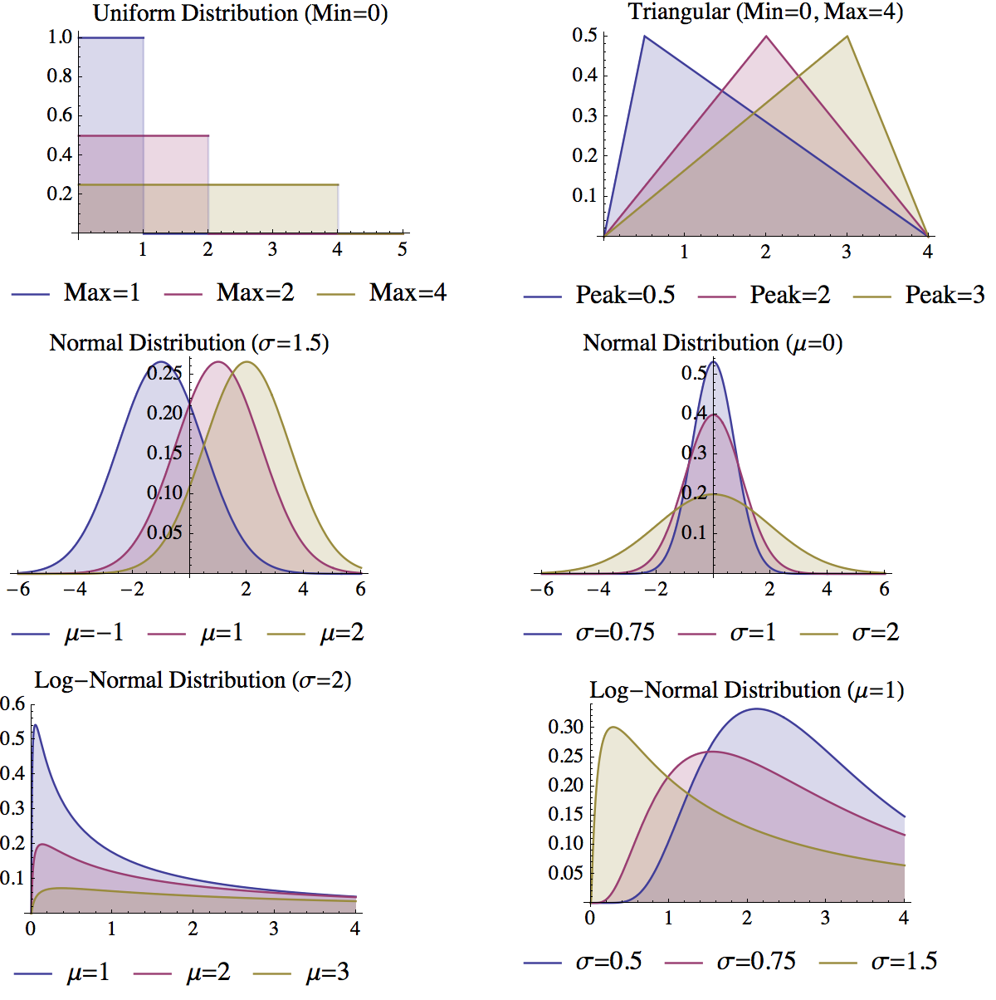

# Models and Truth

> All models are wrong, but some are useful -- George E.P. Box

In discussing the relationship between models and truth, it is useful to first take a step back and discuss the different types of models. Modeling is a wide-ranging field and there are many distinctions that modelers and mathematicians make when discussing models. Some distinctions -- such as Bayesian versus Frequentist statistical models^[Briefly, this debate refers to two divides within the statistical community that hinge on how probability is interpreted. A Frequentist claims that probability derives from the relative frequency of outcomes of numerous events. Bayesians take probability as a subjective degree of belief. Frequentist statistics are what are generally taught in introductory statistic courses and receive the most use in practice today.]-- have been the subject of century's old philosophical arguments between mathematicians which continue to this very day.

Such arguments are of little interest to us -- we will present our own classification scheme that once completed will really clarify the core dichotomy that is at the heart of modeling -- but it can be useful to briefly discuss the distinctions that are commonly made in order to obtain a deeper understanding of the choices underlying the development of a model.

### Deterministic versus Stochastic Models

There are two views of the world. One view says the fate of the universe is governed by strict predictable laws. The universe is in effect a giant machine and, given its current state, its future states through the rest of time are predetermined. Another view, is that the universe is ruled by chance and randomness. Random quantum mechanical fluctuations merge and amplify each other leading to an infinite range of diverging possibilities. Which is the truth? We certainly do not know and it is possible that this will be one of the questions that physicists will never cease exploring. Albert Einstein had a particular viewpoint though. He was a strong partisan in favor of the deterministic view, famously remarking that "God doesn't play dice with the world."

When creating a model of a process, we must make a similar choice about chance. Do we build our model in deterministic way such that each time we run it we get the same results? Or do we conversely incorporate elements of uncertainty so that each time the model is run we may obtain a different trajectory of outcomes?

### Mechanistic versus Statistical Models

When beginning to model of a system, there are many questions that you should ask yourself. Two of them are:

1. Do I know (or have a hypothesis of) the mechanisms that drive the system?
2. Do I have data which describes the observed behavior of the system?

If the first question is answered in the affirmative, then you can build a mechanistic model that replicates your understanding (or hypothesis of) the true mechanisms in the system system. If the second question is answered in the affirmative, you can use statistical algorithms, such as linear regression, to create a model of the system based purely on the data.

If neither question is answered affirmatively, well in that case, there isn't much of anything you can build.

### Aggregated versus Disaggregated

When building a model, the question of scale becomes very important. Imagine we are concerned about the affects of Global Climate Change on water resources. We may wish to examine the question of whether there will be sufficient water supplies given a rise in temperatures in the future.

At what resolution do we build this model? There scale is wide:

* At the most aggregate, we could simply estimate total Worldwide water demands and supplies into the future.
* Maybe that is too coarse a scale; clearly having excess water in Norway has little impact on the situation in Egypt. We could instead create a finer resolution model that separately looked at the water demand and consumption in each country.
* Maybe even that is still too coarse, maybe we should make our model even more granular to look at a specific cities and population clusters around the globe
* At the extreme disaggregated level, we might even want to model individual people: all 7 billion of them.

Clearly, there is no simple answer to this question and the best choice is highly context sensitive and depends on the needs of the specific model and application.

## Prediction, Inference and Narrative

The three distinctions presented above can be used to classify models. We can even use them to classify the models we have discussed in this book. Most of our models would be classified as deterministic (random chance is generally not explicitly incorporated in the models), mechanistic (we generally assume mechanisms rather than estimating relationships from data), and highly aggregated (the agent based models are an exception to this).

Outside of modelers, however, these distinctions are of little importance. Let's take off our modeler hats for a moment, and instead look at modeling from the perspective of a client. As clients, we would hire a modeler to build a model to fulfill some specific purpose. The choices the modeler make (aggregated versus disaggregated, stochastic versus deterministic, what software they use, etc.) are all really secondary to the success of the model in fulfilling that purpose. Let's look back at Box's quote at the beginning of this chapter. We know all models are wrong, what we should really care about is there applicability to a specific task: how useful they are.

So instead of using these classifications to classify models, we can use the purpose of a model. There are three main purposes for models: prediction, inference and narrative.

Prediction
: Models used for prediction are the most straightforward. They attempt to forecast some outcome given information about variables that may influence that outcome. A weather forecast is an example of a model being used prediction. Likewise, when you apply for a credit card at a bank, they run a predictive model to determine your risk of default. When you apply for life-insurance, similarly, the company has an actuarial model to predict how much they should charge you for a given payout. All these models take in data (the weather yesterday, the amount of money in your bank account, or your age) and use that data to generate a prediction of the outcome.

Inference
: Models used for inference are the most common in academic research. Often, academic research questions boil down to the simple template: "Does *X* affect *Y*?" These are inferential type questions. As an example, a researcher may make a hypothesis statement such as, "The wealthier a high-school student's family is, the higher the student's test scores will be." They may then build a model to test the validity of this hypothesis and the model's results will generally be phrased in terms of a *p* value indicating the significance of the evidence in support or against the hypothesis.

Narrative
: Models are often used to tell a persuasive story. When the Obama administration wanted to persuade law makers and the public to support there proposed stimulus, they famously published the graph shown in Figure 2. A lot of complex modeling and mathematics surely went into constructing this figure, however its sole purpose is to tell a story: things are going to be bad, but the recovery plan will make them less bad. We will return to this figure later on.

![Figure 2. The Obama Administration's Predictions for the Effects of the Recovery Plan [@Romer:2009tx]](Stimulus.png)

All models can be classified in terms of these three primary usages and it can be useful to discuss modeling projects in terms of them. There is an even simpler classification system we can use, however, that once we complete it will clarify the core dichotomy that is at the heart of modeling.

## The Strange Case of Inference

To help us get at this reduced classification scheme, let's first talk for a moment about the process of inference. Take our earlier example of finding whether wealth results in increased high-school test scores. We phrased this hypothesis in a specific way: that increased wealth will always increase test scores. This illustrative statement, however, actually differs from what is often done in practice. In general, researchers simply asks the question "Does *X* affect *Y*?" rather than "Does *X* increase *Y*?" This is a more flexible question that allows for many forms of relationships. Using this more general terminology, we would ask the question "Does wealth affect tests scores?"

The gold-standard to answering questions like this is the controlled experiment. For our wealth case, we could imagine an experiment where we took a sample of a thousand families from a school district. When the families' children enter high-school we randomly select have to be in a "poor" category and the other half to be in a "rich" category. Families in the rich category are given grants of $500,000 a year to spend how they wish while the parents in the poor category are fired from their jobs and have their savings frozen for the duration of the experiment. Once the students have graduated from high-school, we simply compare the average scores for the students in the poor and rich categories.

This is the ideal approach to answering inferential questions like these. For many types of questions, controlled experiments can be done (for instance does treatment with a novel drug help control a disease), but in general complex social questions are simply impossible to answer with them. We can construct the procedure we just imagined, but it would be impossible (and deeply unethical) to implement in a community.

### Traditional Model Based Inference

Given this inability to do controlled experiments in many cases, how do we approach inferential questions? The standard way is to collect data and then construct a model enabling us to measure the statistical significance of the hypothesis given the data. The model of choice due to history and simplicity is the linear model:

$$ Y = \beta_0 + \beta_1 \times X_1 + \beta_2 \times X_2 ... $$

For the education example we could simple collect data on a number of students. We could measure their families' wealth ($X_1$ in the equation above) and on their test scores ($Y$). We could then run the linear regression to determine the coefficient values ($\beta_0$ -- the intercept -- and $\beta_1$ -- the effect of wealth on test scores). If we thought there were other factors that affected test scores, we could measure them and include them as addition $X$'s in the regression.

In addition to obtaining the values of these coefficients, we also obtain as a result from the regression the statistical significances or "$p$ values" of these coefficients. Although $p$ values are commonly used in statistics, they are ubiquitously misunderstood^[These misunderstandings are not only made by on-the-ground practitioners and analysts, they are frequently shared, and propagated, by university-level statistics instructors; see, for instance, @Haller:2002vo.] so it would be useful to briefly review them.

In short a $p$ value measures the probability of seeing the measured data (or more extreme data) assuming the null hypothesis is true. When looking at the significance of coefficients, a $p$ value means the probability of seeing that magnitude of coefficient (or one even further from 0), given that the (unknown) truth is that the coefficient actually has a value of 0. In other words, it is the probability of seeing the observed non-zero value, assuming that the true value is in fact 0. Generally probabilities of 10%, 5% or 1% or smaller are taken as indicating statistical significance. These low values indicate that the coefficient value is so far from 0, and the probability of this occurring by chance so small, that we can accept the fact that the coefficient is not 0.

This is what a $p$ value is. Now let's specifically mention what a $p$ is not, as this is often misunderstood. $p$ values do not represent the following commonly used interpretations:

* The probability that the null hypothesis is true (that the coefficient is 0)
* One minus the probability that the alternative hypothesis is true (that the coefficient is not 0)
* Any sort of "proof" that the null or alternative hypotheses are correct or incorrect
* The probability that you are making the correct or incorrect decision if you accept or reject the null or alternative hypothesis

Using the $p$ we can do inference by using the statistical significance of the coefficients. If the probability of  $\beta_1$ (the coefficient for wealth) occurring due to chance (given it is false in reality) is less than, say 5%, we can claim with reasonable strength that wealth does in fact affect test scores. This is the standard approach researchers take to model-based inference.

### A Sea of Assumptions

However, let's stop for a second and consider what we have done here. In carrying out these logical steps, we have had to make one very large assumption: that the relationship between test scores and wealth is linear. Our equation  above assumes that for every increase in one unit of wealth ($X_1$), test scores ($Y$) will increase on average by the amount of the coefficient ($\beta_1$). What if this were not in fact true? For instance, we could easily imagine the case where wealth initially helped test scores by providing students more resources and opportunities to learn. However, after a certain point, wealth could theoretically negatively impact scores as very wealthy students might lack the pressure or motivation to work hard.

If we thought this was the case, we could change are regression formula to contain quadratic terms which could replicate this type of relationship:

$$ Y = \beta_0 + \beta_1 \times X_1 + \beta_2 \times X_1^2 $$

If our assumptions about the quadratic relationship are correct, then this models will yield accurate inferences. However, if they are wrong, are inferences will also be wrong.

What are we really doing when we assume regression forms like this? Now it might not be immediately obvious, but what we are in fact doing is telling a story. Using our first equation, we are telling the story that as wealth increases, test scores will always increase. Bill Gate's children will preform amazingly well! Using the second equation we are telling a different story: that as wealth increases test scores initially do as well but after a certain point increased wealth will hurt test scores. That picture isn't so rosy for Bill Gates!

And so we arrive at a very interesting conclusion. By telling these stories, our inferences are in fact based on narrative modeling approaches. Yes, these inferences build upon numerous calculations and very advanced theoretical underpinnings, but ultimately what governs our conclusions and inferences are the stories or narratives we tell about them. These are choices that we as the storyteller make, they not determined by an objective truth or reality.

### Predictive Inference

Is there an alternative approach to inference? Can we accomplish it without using narrative techniques? The answer is yes. An alternative prediction-based approach to inference is available. In this approach, rather than calculating statistical significances as a function of an assumed model, we calculate significances as a function of the simple question: "Does knowing *X* help us to predict *Y*?" This question is effectively identical to our earlier question -- "Does *X* affect *Y*?" -- but it is structured in an explicitly predictive manner. If the answer to the question is true, then we can say that there is a relationship between *X* and *Y*.

The techniques to accomplish prediction-based inference are much newer than classic techniques as linear regression as they rely upon ample computing power and would not be possible with out. One of these approaches is the A3 method (XXX Citation) which uses resampling based algorithms to obtain estimates of predictive accuracy and statistical significance. They focus  purely on predictive accuracy to determine whether a variable is significant and often require the automatic exploration of hundreds or thousands of competing models to find the one that best describes the data.

## Predictive versus Narrative Modeling

As we can see, inferential techniques can be split into two categories: those based on narrative modeling methods and those based on predictive modeling methods. So from our original three categories of model purposes -- prediction, inference, and narrative -- we are left with just two fundamental types of modeling: predictive modeling and narrative modeling.

This terminology is not a traditional one, but it is at the heart of modeling. Understanding the distinction between these two types of modeling will prove to be much more valuable than mastering fine technical details. The choice of whether to build a predictive or a narrative model is fundamental one that shapes every aspect of a model and determines its ultimate utility for a specific purpose.

### Predictive Models

How do we define a predictive model? The obvious answer is that predictive model is one that makes predictions. If a model  generates predictions for a future outcome or a given scenario, than it must be a predictive model. By this definition, a weather forecast is a predictive model as were the Obama administration's unemployment predictions we saw earlier.

Unfortunately, this straightforward definition is useless. Worse than being useless, it is actually quite dangerous.

***

Let us propose a model for next year's unemployment figures in the United States:

> Generate a random number from 0 to 1. If the number is less than 0.1, unemployment will be  20%. If the number is greater than or equal to 0.1, unemployment will be 0%.

There, we have just constructed a model of unemployment. Furthermore, our model creates predictions. With just a few calculations we can forecast unemployment for the coming year. Isn't that convenient?

Of course this model is a joke. It is clearly a horrible tool to use to predict unemployment. However, using the naive definition of what it means to a predictive model, it would be classified as one. What makes this simple model, such a poor model for prediction purposes?

There are several answers to this. We might start by saying it is too *simple*. Clearly if we are trying to predict unemployment we should include the current economic state and trends into our model. If the economy is improving, unemployment will probably drop and vice versa. This is a valid point. Let's address it by proposing an "improved" model:

> Generate a random number from 0 to 1. If the number is less than the percentage change in GDP over the past year, unemployment will be  20% plus the current unemployment rate. If the number is greater than or equal to 0.1, unemployment will be the net change in the consumer price index over the past 8 years.

Is this a better model? Clearly, it is more complex than the previous one and it incorporates some relevant economic data and indicators. Equally as clear, however, it is also a joke no one should treat this as a real predictive model.

So what defines a predictive model? These toy economic models show that just generating predictions is not a rigorous enough criterion. Instead a predictive model must fulfill two additional criteria. A predictive model is one that:

1. creates predictions,
2. has an accurate estimate of prediction error,
3. and has the lowest prediction error of a reasonable set of other models.

If these three criteria are true, then you have a predictive model. Our two proposed models to estimate unemployment are clearly not predictive as we do not have any estimate of predictive error. We can also apply this definition to Obama's employment predictions we saw earlier. When we first presented the model, we called it a narrative model which was probably slightly confusing as the model did generate predictions. However, using these three criteria we can see also that it is in fact not a predictive model. The model contains no estimate of prediction error (and one is not available in the original report) so it simply cannot be consider to be predictive.

If an accurate estimate of prediction error are available, you can proceed to criteria 3 and directly compare the prediction errors between different models to find the one with the lowest error. For instance, we could estimate prediction errors for the two simple models proposed here along with Obama's model to find the one with the lowest error. We would hope that the one Obama presented to congress would be the most accurate, however, before we test it we must not make the error of blindly accepting a model to be right based on who presented it to us or its complexity.

Why do we so rarely hear about the predictive accuracy of models. There are a number of reasons but they all boil down to three basic issues:

1. Assessing prediction error accurately is quite difficult.
2. Sharing prediction error may perversely decrease subjective belief in a model.
3. Most models people use for prediction are actually narrative models and their predictive error is irrelevant.

Let's look at each of these points in detail. First the issue of the difficulty of assessing prediction error. In general, obtaining an accurate assessment of prediction error is much more difficult that developing the predictions themselves. Most commonly used approaches (for instance the standard $R^2$ from linear regression) have significant flaws. There are both theoretical and numerical methods that can be used to more accurate prediction errors in many cases (this will be discussed  further in the section the Cost of Complexity; see also @FortmannRoe:2012tf). When dealing with time series models, however, like most of those explored in this book, it is almost impossible to truly manage to accurately assess model prediction error. In the past ten years, theoretical technique to approach these issues have just begun to be developed (e.g. @He:2009jp or @King:2008jq) but they are still impractical to apply in most cases.

If the challenge of measuring prediction error is overcome, there is an even more insidious barrier to its being provided with the model. There is a perverse phenomena that the act of reporting prediction error will often *decrease* the credence an audience gives a model. An anecdote was relayed to us by a member of a team working on a model of disease spread. His team was sharing the predictions from the model with a group of policy makers. Everything was going well until the audience saw the error bars of the predictions. Where his audience had been content with the raw predictions, they were quite unhappy with the predictions given the accurately estimated uncertainty. Why was this? Was the team's model particularly bad and these policy makers had a more predictive model at their disposal? Unfortunately, not. In a world where policy makers and clients are constantly shown models (like Obama's unemployment figures) with no measure of uncertainty (or even worse, poorly calculated, artificially low uncertainty), they come to have unrealistic expectations and turn away good science in favor of magical guesstimates.

Finally, probably the most likely reason supposedly predictive models do not include prediction error is that they simply are not predictive. Generally models developed for a purportedly predictive purpose are actually narrative models in disguise. Why is this? Well lets look at the reason for most modeling project. It is very rare that models are being funded solely for the purpose of generating an accurate prediction. More often, the models are part of some political process within an organization or between organizations. Ultimately, the people funding the model expect it to prove a point to their benefit. In environments like these, it is to be expected that even the most purportedly predictive modeling efforts will become side tracked by political concerns and make significant compromises to placate these concerns.

We can see the results of such influences in the predictions generated for unemployment presented earlier. Figure 3 shows the projections for the unemployment rates with and without the stimulus plan just as in Figure 2. Overlaid on this, however, are the true values of unemployment. As is readily evident, the original modeling and predictions were way off the mark. Not only are they worse than the projections assuming the stimulus was enacted (which it was) they are much worse than the projections for the economy assuming the stimulus had never been enacted! This is just a small example -- one that is sadly replicated over and over again in business and policy making -- of mistakenly treating a narrative model as a predictive one.

![Figure 3. Unemployment projections versus reality [@TheHeritageFoundation:2013vu]](StimulusAndReality.png)

### Narrative Models

In contrast to predictive models, a narrative model is one built to tell a story. When most people first hear the "narrative" terminology, they often have an instinctive negative reaction. We find this strange as narratives are the fundamental human form of communication. We tell narratives to our friends and relatives. Politicians communicate their policies to us using narratives. Of course the vast majority of our entertainment is focused on narratives^[Even sports, a form of entertainment that innately contains no narrative, becomes wrapped in narrative the announcers and commentators attempt to create for it to engage us.]. Business leaders and managers attempt to describe their strategies to us using narratives; and business books are in generally dominated by narrative anecdotes.

Generally we humans do not view the world as a collection of numbers and probabilities, instead we see reason and meaning. In short, narratives are how we see the world.

One critique of the term narrative is that it implies a lack of numbers or mathematics. This could not be further off the mark. There are many ways to construct narratives. Words are one, pictures are another, music is a third. Numbers and mathematics are just a fourth way of constructing a story.

In fact, most statistical and mathematical models are in fact narrative models. We looked earlier at the case of linear regression as a tool to predict test scores given wealth. Again the mathematical equation for this simple model is:

$$ Score = \beta_0 + \beta_1 \times Wealth $$

This equation defines tells narrative. Translating this narrative into words, we would say:

>  Test scores are only determined by a student's family's wealth. A child's whose family is broke, will have a test score, on average, of $\beta_0$. For every dollar of wealth a child's family accumulates, the child will score, on average, better on tests by $\beta_1$.

You might or might not agree with this narrative (in our view it is a nonsensical and reductionist view of child achievement) but it shows the strict equivalence between this mathematical narrative and narrative prose. This process can be applied all mathematical models. The mathematical definition of the model can be converted directly, with more or less lucidity, into a story describing how the system operates. The same can also be done in the reverse: we can take a descriptive narrative of a system and convert it into a mathematical description. As we have seen (will see? XXX) this is what tools like reference modes and pattern matching are all about: eliciting a narrative from a subject in a way which can be formulated quantitatively.

With predictive models, we can compare competing models based primarily on prediction accuracy^[Other criteria include ease of use, cost of fulfilling data requirements, and computational requirements. But all those are secondary to prediction accuracy.]. But how do we evaluate and compare the quality of narrative models?

The basic criterion to assess a narrative model is that it should be *persuasive*. Although persuasion is not a purely objective measure like prediction accuracy, there are two key goals of a persuasive model. A persuasive model is one that is both highly believable and one which effectively communicates its results.

When building a narrative it is very important to use tools that are well suited to these tasks. Again, as with most modeling work, statistical models like the wealth linear regression example are the most commonly used tools for the construction of narrative models. Unfortunately, they are quite poorly suited to them many ways. Most statistical models depend on numerous unrealistic and highly technical assumptions about the data. If these assumptions are enumerated in plain english, they will often conflict with people's understanding of a system discrediting the model. The alternative is to leave these assumptions hidden creating a black box model. This is often the road taken and in our view, it is a shame. Narrative models should never be given any credence if the model operations is not transparent. There is a reason for the saying, "there are lies, damned lies, and statistics."

The modeling techniques presented in this book, on the other hand, are well suited for narrative modeling. The techniques we present are "clear box" modeling where the workings of the model are transparently evident and clear. The models in the book have their structure explicitly described using a very accessible modeling diagram showing the interactions between the different components in the model. The equations governing the evolution of a model are clear and readily accessible for each part of the model. Furthermore, these modeling techniques make it straightforward to generate animated illustrations and displays to communicate model results.

In total this combines to make them these models powerful persuasive tool. As with any model, however, there are concerns and questions people will raise about them that could cause them to doubt the work. There are a number of techniques that can be used to help build an audience's confidence in these models.

## Confidence Building Steps

...

@Forrester:1978vy

### Sensitivity Testing

XXX

There are four key distributions that are quite useful for specifying the uncertainty in a variable:

Uniform Distribution
: The uniform distribution is defined by two parameters: a minimum and a maximum. Each number within these two boundaries as an equal probability of being sampled. The uniform distribution is useful when you know the boundaries on the values a variable can take on, but you do not have any information on the likelihood of the different values within this region. The uniform distribution can be used in Insight Maker using the function \e{Rand(Minimum, Maximum)}, the two parameters are optional and will default to 0 and 1 if \e{Rand()} is called without them.

Triangular Distribution
: The triangular distribution is defined by three parameters: the minimum, the maximum, and the peak. Like the uniform distribution, the triangular distribution will only generate numbers between the minimum and maximum. Unlike the uniform distribution, the triangular distribution will not sample all numbers between these boundaries with equal likelihood. The value specified by the peak will have the most likelihood of being sampled with the likelihood falling off as you move away from the peak towards either the minimum or maximum boundary. The triangular distribution is useful when you know the both the most likely value for a variable and you also know boundaries for the values a variable can take on. The triangular distribution can be used in Insight Maker using the function \e{RandTriangular(Minimum, Maximum, Peak)}.

Normal Distribution
: The normal distribution is defined by two parameter: the mean of the distribution (generally denoted $\mu$) and the standard deviation of the distribution (generally denoted $\sigma$[^ This is where the term six-sigma of the Quality Control methodology comes from.]). The most likely value be sampled from the normal distribution is the mean. As you move away from the mean (in either a positive or negative direction), the likelihood of a number being sample decreases. The standard deviation controls how fast this likelihood falls as you move away from the mean. Small standard deviations results is steep declines in the likelihood while large standard deviations result in more gradual declines. The normal distribution is useful when you do not have boundaries on the values for a variable but you do know what the most likely value for the variable should be (the mean). The normal distribution can be used in Insight Maker using the function \e{RandNormal(Mean, Standard Deviation)}.

Log-normal Distribution
: The log-normal distribution is closely related to the normal distribution. In fact the logarithm of the values samples from a normal distribution will be log-normally distributed. Like the normal distribution, the log-normal distribution is defined by two parameters: the mean and standard deviation. Where the log-normal distribution differs from the normal distribution, is that negative values will never be generated by the log-normal distribution. Thus is is useful when you have a variable which you know cannot be negative, but for which you do not have an upper bound. The log-normal distribution can be used in Insight Maker using the function \e{RandLogNormal(Mean, Standard Deviation)}.

There are many other forms of probability distributions. Some notable ones are the Binomial Distribution (\e{RandBinomial(Count, Probability)}), the Negative Binomial Distribution (\e{RandNegativeBinomial(Successes, Probability)}), the Poisson Distribution (\e{RandPoisson(Lambda)}), the Exponential Distribution (\e{RandExp(Lambda)}) and the Gamma Distribution (\e{RandGamma(Alpha, Beta)}). These distributions can be used to address very specific modeling usage cases and needs (for instance, the Poisson distribution can be used to model the number of arrivals), however, the four distributions described in detail above should generally be sufficient for most sensitivity testing needs.

The astute reader will notice that our discussion up to this has failed to address an important point: how do we know the uncertainty of a variable? It is very easy to say that we do not know the precise value of a variable, but it is much harder to define the uncertainty of it. One case where can precisely define uncertainty is when you take a random sample of measurements. For instance, suppose our model included the height of the average american man as a variable. We could randomly select a hundred men and measure their heights. In this our uncertainty would be normally distributed with a mean equal to the mean of our sample of one hundred men and a standard deviation equal to the standard error of our sample of one hundred men[^ Please note that this contradicts slightly what we said earlier. Clearly, a person cannot have a negative height while the normal distribution will sometimes generate negative values. So wouldn't a log-normal distribution be better than a normal distribution? Mechanistically, it would, however statistical we can show that due to the Central Limit Theorem the normal distribution does asymptotically precisely model our uncertainty. Given a large enough sample size, the standard deviations for heights will be so small that the chances of seeing a negative number (or even one far from the mean) are effectively none.]. For any random sample of $n$ values from a population, the same should hold true: you will be able to model your uncertainty using a normal distribution with:

$$ \mu = \frac{Value_1+Value_2+Value_3+...+Value_n}{n} $$
$$ \sigma = \sqrt{\frac{1}{n} \sum_{i=1}^n (Value_i-\mu)^2} $$

However, in most applied cases you will not be able to apply this normality assumption. Generally you will not have a nice random sample, or you might have no data at all and instead have some abstract variable you need to specify a value for. In theses cases, it is up to you to make a judgement call on the uncertainty. Choose one of the four distributions detailed above and use whatever expert knowledge available to you to place an estimate on the parameterization of uncertainty. One rule of thumb, however, is that it is better to overestimate uncertainty than underestimate it. It is better to err on the side of overestimating you lack of knowledge than it is to obtain undue confidence in model results due to an underestimation of uncertainty.

### Extreme Value Tests

### Forecasting

### Units
