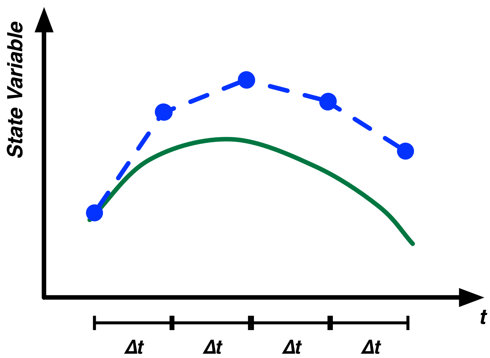

# The Mathematics of Modeling

This chapter will take the modeling techniques we introduce in this book and place them in a firm mathematical framework. This chapter will be quite technical in parts and will require knowledge of basic calculus and linear algebra to fully understand. We think this material is important  for readers who really want to understand how their models operate and also those who want to understand how System Dynamics fits within the larger field of mathematical modeling. For users who approach this material from a more qualitative angle, the material is this chapter is not very essential and may be safely skipped.

## Differential Equations

Differential equations are a basic mathematical tool that are designed to study rates of change. There is some basic terminology that needs to be used to understand differential equations.

State Variable
: A state variable is an object that represents part of the state of a system. For instance, in a population model you could have a state variable representing the current number of individuals in the population. In a model of a lake, you could have a state variable representing the current amount of water in the lake. In equations, state variables are often represented using capital Roman letters such as $X$, $Y$ or $Z$.

Derivative
: Derivates represent rates of change in state variables. For instance, if we had a state variable representing the size of a population, a derivative would specify how this population grows or shrink over time. The derivative would aggregate all changes such as births, deaths and immigration or emigration to show the net change. Similarly, in the case of a lake, our lake volume state variable would have a derivate showing in net how much water flows into or out of the lake over time. Given a state variable $X$, the derivative of $X$ with respect to time is generally written as $\frac{dX}{dt}$ but can also be written as $X'$ or $\dot{X}$. The first form is explicit that we are referring to how the value of $X$ changes with respect to time which is generally what we want.

Let's put this new terminology to work to define a simple model. We'll create an exponential growth model. We'll have one state variable in this model representing the size of the population which we will denote $P$. We need to define one parameter to control the growth in the population. We will denote this growth rate parameter $\alpha$.

The resulting model can be written simply as:

$$ \frac{dP}{dt} = \alpha \times P $$

This indicates that the rate of change for the population for one unit of time is $\alpha \times P$. Our model is quite fully specified as we do not know what the initial value of the population is. Differential models are often fully specified by providing the values of the state variables at specific points in time. Below we indicate that the population size at time 0 is 100.

$$ P(0) = 100 $$
$$ \frac{dP}{dt} = \alpha \times P $$

You are probably noting that this model would be very easy to construct using the techniques we have shown. In fact we have already discussed this type of model several times. We would construct it using a stock to represent the population ($P$), a flow to represent the change of population ($dP/dt$) and a variable to represent birth rate ($alpha$). We could specify our initial condition of a population size of 100, by setting the initial value for the stock for 100.

This is an important point. Many differential equation models^[Specifically those where the denominator in the $dX/dt$ is always $dt$: a very wide class of commonly used models.] can be directly represented using the System Dynamics modeling techniques described in this book. 

From this angle, System Dynamics models and differential equation modeling are really one and the same. A System Dynamics model can be expressed using differential equation notation and vice versa. To see this in more detail, we can look at the mapping between System Dynamics and differential equations models in the following table:

System Dynamics Primitive | Differential Equation
---|---
Stock | State Variable ($X$, $Y$, etc...)
Flow | Derivative ($dX/dt$, $dY/dt$, etc...)
Variable | Constants/Parameters ($\alpha$, $\beta$, etc...)

Since they truly do not differ significantly in capabilities, where System Dynamics and differential equation modeling differ is in their focus. The primary goal for differential equation modelers, generally operating within academia, is analytic tractability. This analytic tractability allows modelers to derive definite results and conclusions from the model's equations. System dynamics modelers generally are less concerned about analytic tractability and are more comfortable with simulating the model and drawing conclusions from observed trajectories.

System dynamics modelers care greatly about communicating their models, mirroring reality to some extent, and exploring the consequences of feedback. The differing focuses on communication between System Dynamics modelers and differential equation modelers can be seen in the method of naming variables. Differential equation models are generally dominated by abstract Greek symbols (e.g. $\alpha$) while System Dynamics models spell out variable names (e.g. "Birth Rate") and additionally use a model diagram to show the relationships between different parts of the model.

## Solving Differential Equations

Given the simple population model, what is the size of the population, at, let's say $t=10$ given an $\alpha$ of 0.1? We can use calculus to solve this model:

$$
\begin{aligned}
\frac{dP}{dt} &= \alpha \times P \\
dP &= \alpha \times P dt \\
\frac{1}{P} dP &= \alpha dt \\
\log(P) &= \alpha \times t + A \\
P &=  e^{\alpha \times t + A} \\
P &=  B e^{\alpha \times t} \\
\end{aligned}
$$

Where $A$ and $B$ are integration constants that we can determine bases on the initial conditions of the model, as we specified earlier $P(0) = 100$ so,

$$
\begin{aligned}
P &= B e^{\alpha \times t} \\
100 &= B e^{\alpha \times 0} \\
100 &= B
\end{aligned}
$$

And our equation for $P$ at any time is:

$$ P = 100 e^{\alpha \times t} $$

Plugging in $\alpha=0.1$ and $t=10$, we obtain:

$$
\begin{aligned}
P &= 100 e^{0.1 \times 10} \\
  &= 271.828...
\end{aligned}
$$

For this simple population model we have shown that we can obtain the precise population value at any point in the future. However, many differential equation models cannot be solved using these techniques. For most complex models you see in practice, it is simply impossible to analytically determine the values of the state variables in the future. Take for example the following model that looks very similar to our original one:

$$ P(0) = 100 $$
$$ \frac{dP}{dt} = \alpha \times P \times \log(P) $$

We have simply added a logarithm of $P$ into our growth rate. Despite the smallness of this change, this model is now simply impossible to solve analytically and no analytic solution is possible. Many other equations, might have analytical solutions but they are too difficult to determine in practice.

When developing complex models it should generally be assumed that in practice no analytical solution will be available. In cases like these, how do we go about developing solutions to the equations and determining the trajectory of the state variables in the system?

Even if we can't solve the model equations analytically, we will always be able to approximate their value numerically. A number of different algorithms exist that allow us to approximate the solution to differential equations. To discuss these methods elegantly, it can be useful to introduce some small amount of additional notation.

In our previous equations, we have only looked at a single state variable at a time. However, we can also consider systems containing multiple state variables. For instance the Lotka-Volterra predator prey system is an example of this. Assuming two populations of animals -- let's assume a population of wolves ($W$) and a population of moose ($M$) -- we obtain a paired set of differential equations the looks something like this:

$$ \frac{dM}{dt} = \alpha M - \beta M W $$
$$ \frac{dW}{dt} = \gamma M W - \delta W  $$

When looking at algorithms to solve sets of equations like these numerically, it can be useful to denote $\mathbf{y}$ as a vector of all the state variables in the model. So for the case of the exponential growth model $\mathbf{y}=[P]$ while for the Lotka-Volterra model $\mathbf{y}=[M, W]$. When using this notation, $\mathbf{y_t}$ indicates the vector of state variable values at a specific point in time so $\mathbf{y_0}$ are the initial conditions for a set of equations.

Additionally, we can denote $\mathbf{y'}$ as the vector of derivatives for the different state variables. We treat these derivatives as functions of the current time at the status of the other state variables. So, for instance, to determine the rate of change of a model at $t=10$, we would write $\mathbf{y'}(\mathbf{y_{10}}, 10)$.

The use of this notation might seem a bit complex at first, but it allows us to elegantly describe the mathematics of numerical solution algorithms without worrying about the details of a specific model.

### Euler's Method

The most basic algorithm is Euler's method^[Leonhard Euler was a brilliant 18th century Swiss mathematician who made many great advances in the theoretical and applied mathematics.]. Simply put, assuming we now the state of the system at time $t$ and we wish to estimate the state of the system at time $t+\Delta t$ we can use the following equation:

$$ \mathbf{y_{t+\Delta t}} = \mathbf{y_{t}} + \Delta t \times \mathbf{y'}(\mathbf{y_t}, t) $$

We can walk through what this equation is doing. It first takes the derivates for the state variables at the current point in time. It multiplies these rates of change by the $\Delta t$ and adds the results to the values of the state variables at the starting point in time.

Let's apply this to a concrete example. Imagine our population example, but instead of exponential growth we have a fixed inflow of people at a rate of 10 per year. At $t=0$ we start with 100 people and we want to know the population in 10 years, using Euler's method we obtain the following:

$$
\begin{aligned}
P_{10} &= P_0 + 10 \times 10 \\
&= 100 + 100 \\
&= 200
\end{aligned}
$$

Thus the population size in 10 years will be 200. In this simple example, Euler's method works perfectly and generates the exact same answer as would be found using analytic solutions.

In general, however, we won't be so lucky. For most problems Euler's method will generate results that contain some level of error compared to what the true value should be. To see this let's explore our exponential growth model again with an $\alpha$ of 0.1. As a reminder this model is:

$$ P(0) = 100 $$
$$ \frac{dP}{dt} = 0.1 \times P $$
 
As we showed earlier, the precise solution to this model is (to three decimal places) 271.828. Let's see what we get using Euler's method with $\Delta t = 10$. Carrying out similar calculations as before we get:

$$
\begin{aligned}
P_{10} &= P_0 + 10 \times (0.1 \times P_0) \\
&= 100 + 100 \\
&= 200
\end{aligned}
$$
 
So using Euler's method we obtain 200 for the population size at $t=10$ when we know the true value should be about 272. That's a pretty large error! Why does this error come about? Why do we so significantly underestimate the final population size?

The reason is that for each of the ten years we are simulating, we assume the population grows at the rate it should if there were 100 people. However, the population size is constantly increasing during these ten years so the rate at which it grows should also be increasing. Imagine, the case of a bank account with an interest rate of 10% yearly. The bank account grows over time so the interest earned should also grow over time. It's the same principle here.

How do we address this issue? Using Euler's method, we can do it by changing how often we recalculate the rates of change. In our previous calculation we went straight from $t=0$ to $t=10$ all in one jump, we used a $\Delta t$ in Euler's equation of 10. However, we could employ an alternate calculation strategy where, for instance we went from $t=0$ to $t=5$, recalculated the derivative based on the new population size and then went from $t=5$ to $t=10$. This would be equivalent to used a $\Delta t$ of 5 and iterating the algorithm twice, here is what we get:

$$
\begin{aligned}
P_{5} &= P_0 + 5 \times (0.1 \times P_0) \\
&= 100 + 50 \\
&= 150 \\
P_{10} &= P_5 + 5 \times (0.1 \times P_5) \\
&= 150 + 5 \times 15 \\
&= 150 + 75 \\
&= 225
\end{aligned}
$$ 

That's certainly better, we cut our error by over 33\%. However, the error is still too large for most practical purposes. To improve the model even, more, we can apply smaller and smaller $\Delta t$'s. You probably have a good grasp of the calculations now so let's just show the results for each step of the simulation. Will look at $\Delta t=2$ and $\Delta t= 1$.

$t$|$P$
---|---
0|100
2|120
4|144
6|172.8
8|207.4
10|248.8

$t$|$P$
---|---
0|100
1|110
2|121
3|133.1
4|146.4
5|161.1
6|177.2
7|194.9
8|214.4
9|235.8
10|259.4

We can see that as $\Delta t$ gets smaller and smaller our results get more and more accurate. However, they are never perfect. There is always some error. Even if we made $\Delta t$ as small as 0.1 (require 100 simulation steps), our final population size would be calculated to be 270, an error just under 1\%.

Figure 1 illustrates the application of Euler's method to numerically estimate the trajectory for an example function. The smaller the $\Delta t$'s in the estimation are the better the results will be. Other terms that can be used in place of $\Delta t$ are "Step Size", "Time Step" or just "DT". We prefer not to use the notation DT as it is easily confusable with the $dt$ from differential equations. The latter indicates an infinitesimally small change, while step sizes are never infinitesimally small.

As you decrease the step size for the simulation, the results of the simulation will become more and more accurate^[It is important to note at this point, that when we discuss accuracies in this context we are specifically referring to models composed of continuous differential equations. If you are using agent based modeling or have discontinuities in your models -- which could occur if you use \e{IfThenElse{}} logic -- then a smaller step size may not provide additional accuracy if there is a fundamental time step logic to your model.]. The cost of this increased accuracy, however, in increased computation time. The computation time required by your model is directly proportional to 1 over the step size. Thus, if you cut the step size in half, your model will take twice as long to complete simulating.

So in general you will want a step size such that your results are "accurate enough" but one that isn't so small that the simulation takes too long to complete. A rule of thumb for choosing the step size is to choose an starting value which results in a fast simulation. Then cut the value of the step size in half. Simulate the model again. If the results have not change materially between these two simulation, keep the larger step size. If the results have changed. Cut the step size in half again and keep doing so until the results cease to change.

### Runge-Kutta Methods

Euler's method is not the only technique that can be used to numerically solve differential equations. One very popular set of techniques are called Runge-Kutta methods. Runge-Kutta methods are a whole family of numerical differential equation solvers. In fact Euler's method itself can be classified as a simple Runge-Kutta method.

One particular member of the Runge-Kutta family of methods is widely used. It is a fourth-order Runge-Kutta method. This method differs from Euler's method in that for each step, it evaluates the model multiple times and averages the resulting derivatives. Briefly, the driving set of equations is as follows:

$$
\begin{aligned}
\mathbf{y_{t+\Delta t}} &= \mathbf{y_{t}} + \Delta t \frac{\mathbf{a}+2\mathbf{b}+2\mathbf{c}+\mathbf{d}}{6} \\
\text{Where:} \\
\mathbf{a} &= \mathbf{y'}(\mathbf{y_t}, t) \\
\mathbf{b} &= \mathbf{y'}(\mathbf{y_t}+\frac{\Delta t}{2} \times \mathbf{a}, t+\frac{\Delta t}{2}) \\
\mathbf{c} &= \mathbf{y'}(\mathbf{y_t}+\frac{\Delta t}{2} \times \mathbf{b}, t+\frac{\Delta t}{2}) \\
\mathbf{d} &= \mathbf{y'}(\mathbf{y_t}+\Delta t \times \mathbf{c}, t+\Delta t) \\
\end{aligned}
$$

What this algorithm does is first computer the derivatives of the system at the current time  and use them to move the system forward to $\Delta t/2$. The derivatives are evaluated at $t+\Delta t/2$ ($\mathbf{b}$) and this new set of derivatives is used to move the system from $t$ to $t+\Delta t/2$. A third set of derivatives are evaluated again at this mid-point ($\mathbf{c}$) and they are the used to move the system from $t$ to $t+\Delta t$. A fourth set of derivatives are evaluated at this point ($\mathbf{d}$). The system is the returned to its starting point and a weight set of derivatives are used to move the system the full time step. This weighting puts most of the weight on the middle two derivatives instead of the derivatives from the end points.

This fourth-order Runge-Kutta method is generally much more accurate the Euler's method for a given step size. Using a step size of 10 for our earlier population model, the Runge-Kutta method generates a value of 270.8. A step size of 5 yields a results of 271.7, just a smidgeon away from the precise value of 271.8. Recall that for Euler's method, even with a step size of 0.1 we still weren't this accurate.

Now its true the this 4th-Order Runge-Kutta method does a lot more work for each step. It evaluates the model for times and has to do some averaging of derivative. However, it is still much more accurate the Euler's method when you base your comparison on the unit of computational effort.

# Model

{"geometry":{"x":390,"y":330,"width":100,"height":40},"name":"Population","create":"Stock"}

{"attribute":"InitialValue","target":"Population","value":"100"}

{"geometry":{"x":0,"y":0,"width":100,"height":100,"sourcePoint":{"x":440,"y":110},"targetPoint":{"x":0,"y":100}},"alpha":null,"omega":"Population","name":"Net Growth","create":"Flow"}

{"geometry":{"x":590,"y":120,"width":120,"height":50},"name":"Growth Rate","create":"Variable"}

{"attribute":"Equation","target":"Growth Rate","value":"0.1"}

{"geometry":{"x":0,"y":0,"width":100,"height":100},"alpha":"Growth Rate","omega":"Net Growth","create":"Link"}

{"attribute":"FlowRate","target":"Net Growth","value":"[Growth Rate]*[Population]"}

{"geometry":{"x":590,"y":320,"width":120,"height":50},"name":"True Population","create":"Variable"}

{"geometry":{"x":0,"y":0,"width":100,"height":100},"alpha":"Growth Rate","omega":True Population","create":"Link"}

{"attribute":"Equation","target":"True Population","value":"100*Exp(0.1*[Growth Rate])"}

{"attribute":"TimeLength","value":"10"}

DIAGRAM

Let's implement the simple exponential growth model we have discussed in this chapter. We have a population that starts with 100 people which increases at a rate of 10% per year. In addition to creating the stock and flow model, we have also created a variable, [True Population], that contains the analytical solution to the model.

First we'll use Euler's method with a step size of 2 years and simulate the model.

{"attribute":"TimeStep","value":"2"}

RESULTS

As we can see these results aren't very accurate. The value of the numerical estimated [Population] is quite different from the analytically determined value in [True Population]. Let's reduce the step size to 1 year and try again.

{"attribute":"TimeStep","value":"1"}

RESULTS

This is better, but still off by a fair amount. We could experiment with continuing to reduce the step size, but let's instead switch to the more accurate Runge-Kutta method. Will simulate the model again with a step size of 1 using the 4th-Order Runge-Kutta solution algorithm.

{"attribute":"SolutionAlgorithm","value":"RK4"}

RESULTS

That's a lot better! It's almost perfect. Let's see how quickly the results degrade when we increase the step size. Let's set the step size to 2 and simulate the model again.

{"attribute":"TimeStep","value":"2"}

RESULTS

That's still very good and much better the Euler's Method with a step size of 1. Why don't you go ahead now and experiment with different step sizes and the two solution methods to get a feel for their accuracies.

# End Model

### Other Techniques

This has been only the briefest introduction into the numerical solution methods for differential equations. This introduction should provide you with the knowledge you need to intelligently make decisions about controlling the simulation of your models. They should help you identify the potential sources of errors in your model and adjust the models calibration to account for them.

The two methods we have looked at for solving differential equations -- Euler's method and a 4th-Order Runge-Kutta method -- are widely used. Additionally, they are what are built into Insight Maker. In addition to these two techniques, however, there are many other methods that are used in practice and you should be aware of this richer ecosystem of techniques.

Although we do not have space here to delve into the full ecosystem numerical differential equation algorithms in detail, we think it would be useful to briefly discuss one variant: the adaptive step size algorithm. The methods we have looked at here use a fixed step size specified at the beginning of the simulation. Many models, however, might be characterized by highly variable trajectories. Part of the trajectories might be very smooth and unchanging while other parts might experience significant and rapid changes.

When using a fixed step size algorithm, the step size must be set for the worse case scenario. Thus in the case of these models the step size must be set to a small value to account for the rapidly changing areas. Unfortunately, the precision of this small value is wasted on the smooth regions of the trajectory where the algorithm does extra work for minimal gain in precision.

Adaptive step size algorithms adjust this by dynamically changing the step size of the algorithm based on the behavior of the derivatives. If the derivatives change rapidly, then the step size will be made smaller while if the derivatives are constant or change very slowly the step size will automatically grow. Figure 2 illustrates the location of steps for an illustrative model. The steps are clustered around changes in the trajectory in an attempt to maximize predictive accuracy.

### Analyzing Differential Equations

Although the trajectory for the state variables in differential equation models generally cannot be determined analytically, several key properties can often be determined. These properties include:

* The location of equilibrium points
* The stability of equilibrium points

An equilibrium point is a defined as a set of state variable values which, once the system takes them on, the system will no longer change. For instance, in our exponential growth model a single equilibrium point exists: that of zero people. If the population is empty, then the population will not grow and will remain at 0.

In this case there is only on equilibrium point. In other models you may have multiple equilibrium points. For instance, in a model of a highly infectious, incurable disease; you can imagine a model where two equilibrium points exist: one where no one is infected and a second point where everyone is infected. As long as there were no infectious, the population would remain completely healthy. However if just a single infected individual was introduced into the population, the infectious would spread until everyone was infected and the population would then remain at that point.

Figure 3 is useful to illustrate what is known as *stability* of equilibrium points. Each of the three panes in this figure illustrate a different form of equilibrium point. In all three the balls are in equilibrium: if the no external forces come into play, the balls will not move. What differs in each of the three is what occurs if the balls are displayed a small amount.

Stable Equilibrium
: In this form of equilibrium the ball will return to its original position if it is displaced. The structure of the system is such that the ball is pushed towards the point of equilibrium if it moves away from it.

Unstable Equilibrium
: In this form of equilibrium, the ball will move further and further away from the point of equilibrium if it is displaced even a small amount. The equilibrium is unstable in that if we are just a small distance away from it, we move further away form it.

"Neutrally Stable Equilibrium"
: This is a less common form of equilibrium and goes by several different names. In this case if the ball is moved it will stay fixed at its new location. It will not move closer to or further from the original equilibrium. Of the three forms of equilibrium, this one is of the least interest or relevance in practice.

In the case of the highly infectious disease model, the state of everyone being healthy would be an unstable equilibrium. The equilibrium would persist as long as no one brought the disease into the population (some one would not just spontaneously become ill), but if as little as one sick person entered the population, the population would move further and further away from the point of everyone being healthy.

The point of everyone being sick however, is a stable equilibrium as no recovers naturally. Even if you introduce healthy people into the population, moving the population away from the equilibrium, they too will become sick restoring the population to the equilibrium.

#### Equilibrium  Points

Often, we can determine the equilibrium points for a system, without fully needing to solve the trajectory for the state variables. Let's implement the simple disease model we've been discussing. We'll implement it both as a differential equation model and System Dynamics model but we'll be using the differential equation version to do analytic analysis.

One way to express the differential version of the model is to define two state variables: the number of healthy people ($H$) and the number of sick people ($S$). The rate of infection between sick and healthy people can be made a function of the number of people in each category. Clearly, if there are no sick people the infection rate is 0; but, just as clearly, if everyone is already sick than the infection rate will also be zero. One workable differential equation model is shown below:

$$
\begin{aligned}
H(0) = 100 \\
I(0) = 1 \\
\frac{dH}{dt} = - \alpha \times H \times I \\ 
\frac{dI}{dt} = \alpha \times H \times I
\end{aligned}
$$

This model uses a single parameter ($\alpha$) to control the infection rate. $alpha$ is a non-zero positive value and the smaller $\alpha$ is, the slower the infection will progress and vice versa. This notation illustrates one of the clumsy aspects of implementing stock and flow models using differential equations. The flow values between two stocks have to be repeated twice once for each of the two state variable's derivatives.

Finding the derivates for differential equation models is generally very straightforward analytically. We simply need to harness the definition of an equilibrium point: an equilibrium point is one where the state variables are constant and unchanging. Since the derivatives represent changes in state variables, this statement is equivalent to saying the derivates for the model are 0 at the equilibrium point.

Thus we simply need to set the derivatives in the our model to 0 and solve it:

$$
\begin{aligned}
H(0) = 99 \\
I(0) = 1 \\
0 = - \alpha \times H \times I \\ 
0 = \alpha \times H \times I
\end{aligned}
$$

The initial conditions will determine what equilibrium is arrived at but they don't affect the existence of the equilibriums. Furthermore, the two equations we have set to 0 are equivalent ^[Although we expressed this model as a function of two state variables $H$ and $I$, it really only has one independent state variable. Given the population size, you will know the value of $H$ give $I$ and vice versa.] so we can simplify this to be:

$$ 
0 = \alpha \times H \times I
$$

Simple inspection reveals that this statement is true if and only if either $H=0$, $I=0$, or $\alpha=0$. Thus we have mathematically shown that our equilibriums are either when everyone is sick or everyone is healthy (or there is not infection ever). Now, granted this is a trivial conclusion for this model and we stated it earlier. However, for more complex models this type of analysis can be very useful and will often reveal that equilibriums are functions of the different parameter values and you can explicitly determine how the equilibriums changes as the model configuration changes.

Let's try a more complex example. Remember the predator prey model from earlier? As a reminder had this set of equations to simulate the relationship between a moose and wolf population:

$$ \frac{dM}{dt} = \alpha \times M - \beta \times M \times W $$
$$ \frac{dW}{dt} = \gamma \times M \times W - \delta \times W  $$

Let's determine what the equilibrium values are for this model. As before we start by setting the derivatives to 0:

$$ 0 = \alpha \times M - \beta \times M \times W $$
$$ 0 = \gamma \times M \times W - \delta \times W  $$

Solving this set of equations is more difficult, however a little bit of calculus reveals two solutions. One when $M=0$ and $W=0$ (there are no animals at all), and the second when $M=\delta/\gamma$ and $W=\alpha/\beta$. This is an example of where the equilibrium location depends on the values of the parameters.

#### The Phase Plane

When looking at model results, we have generally been focused on time series results. We've mainly been interested in the trajectory of the variables and stocks over time. In more mathematically oriented fields, the primary tool is not this time series plot instead it is what is known as a phase plane plot.

Phase plane are almost like a scatterplot. They show the one of the state variables plotted against another of the state variables. For instance, in the predator prey model, the results of scatterplot of the wolf and moose population will be an ellipsoid. The two populations will cycle continuously. In a phase plan plot, rather than just showing one of these cycles, the trajectories for all combinations of moose and wolf population sizes is shown.

Figure 4 illustrates a phase plane plot for the predator prey system. The trajectory for on set of parameter and state variables values is shown in red and we see a continual oscillation as expected. However, we can also see the trajectories for all the other combinations of state variables values. We can see that the system will always oscillate and the size of the oscillation depends on the the initial conditions for the state variable. This provides us a lot of information in a small space and the phase plane plot is a great way to quickly summarize the behavior of a two state variable system.

Let's quickly explore the phase plane plots for an even simple system. Take a system consisting of two state variables both of which grow (or decay) exponentially. These state variables will be assumed to be independent from each other so the value of one does not affect the value of the other:

$$
\begin{aligned}
\frac{dX}{dt} = \alpha X \\
\frac{dY}{dt} = \beta Y \\
\end{aligned}
$$

There are four general types of behavior for this system. One when $\alpha>0$ and $\beta>0$, one when $\alpha<0$ and $\beta>0$, one when $\alpha>0$ and $\beta<0$, and one when $\alpha<0$ and $\beta<0$. The phase planes for each of these four cases is shown in Figure 5.

From these plots we can visually determine how the stability of the equilibrium point at $X=0, Y=0$ change as we change $\alpha$ and $\beta$. When $\alpha<0$ and $\beta<0$, we have a stable equilibrium; in all other cases we have an unstable equilibrium.

#### Stability Analysis

Now that we have determined the equilibrium points, we may want to determine what type of stability occurs at the equilibrium. As we stated earlier, for the disease model it is trivial to arrive at the conclusion that the state of everyone being healthy is unstable while the state of everyone being sick is stable. In more complex models, however, it may be harder to draw conclusions or the stability may change as a complex function of parameter values. Fortunately, there is a general way to determine the precise stability nature of the equilibrium points analytically.

The procedure to do this is relatively straightforward, however the theory behind it can be difficult to understand. The first key principle is that of "linearization". To understand linearization, let's take the curve in Figure 6. Clearly this curve is not at all linear. It has lots of bends and does not look at all like a line.

However, if we zoom in on one part of the curve, whatever that part may be, the section we are zoomed in on starts to straight out. If we keep zooming in, we will eventually reach a point where are zoomed in section is effectively linear: effectively a straight line. This is true for whatever part of the curve we zoom in on^[The one exception to this is if your line is some sort of fractal. In this case no matter how much you zoom in on it, it will never become smooth. For differential equations, however, this caveat is a non-issue.]. The more bendy parts of the curve will just take more zooming to convert them to a line.

We can conceptually do the same process for the equilibrium points in our phase planes. Even if there trajectories around the phase planes are very curvy, if we zoom in enough on the phase equilibrium points, the trajectories at the point will become linear. The simple exponential growth model we illustrated with phase planes are an example of a linear model. If we zoom in enough for most models the phase planes will start to look like these examples.

Mathematically, we apply linearization to an arbitrary model by first calculating what is called the Jacobian of the the Jacobian is the matrix of partial derivatives for each of the state variables in the model applied to each of the derivatives in the model:

$$ \text{Jacobian} = \begin{bmatrix} \dfrac{\partial y'_1}{\partial y_1} & \cdots & \dfrac{\partial y'_1}{\partial y_n} \\ \vdots & \ddots & \vdots \\ \dfrac{\partial y'_m}{\partial y_1} & \cdots & \dfrac{\partial y'_m}{\partial y_n}  \end{bmatrix} $$

This is bit complicated so don't worry if you don't understand this! Once you have the Jacobian, you calculate the eigenvalues of the Jacobian a the equilibrium points. This is also a bit complicated, if you don't understand this, just skip forward! 

Eigenvalues and eigenvectors are an interesting subject. Briefly take a look back at the phase planes for the exponential model example. For each of the phase planes, there are at least two straight lines of trajectories. In these phase planes the x axis and the y axis satisfy this. If you have a point on the x or y axis it will remain on that axis as it moves. This indicates that for this model the eigenvectors are the two axii as they do not change direction as they move.

For our purposes though, we actually do not care about the actual direction or angle for the eigenvectors. We instead care about whether the state variables move inwards or outwards along these vectors. We can determine this from the eigenvalues of the Jacobian. If the eigenvalue for a eigenvector is negative, then the values move inwards along that vector while if it is positive, they move outward along the vector.

Eigenvalues can be calculate straightforwardly for a given Jacobian matrix. Briefly, for Jacobian matrix $J$, the eigenvalues $\lambda$ are the values that satisfy the following equation where $det$ is the matrix determinant and $I$ is the identify matrix.

$$
0=det(J-\lambda I)
$$

We can do a quick example of calculating the eigenvalues for the matrix $[1,2; 3,4]$:

$$
\begin{aligned}
0 = det\left(\begin{bmatrix} 1 & 2 \\ 3 & 4 \end{bmatrix} - \lambda  \begin{bmatrix} 1 & 0 \\ 0 & 1 \end{bmatrix} \right) \\
0 = det\left(\begin{bmatrix} 1 -\lambda & 2 \\ 3 & 4-\lambda \end{bmatrix}\right) \\
0 = (1-\lambda)(4-\lambda)-6 \\
0= \lambda^2-5\lambda-2 \\ 
\lambda = -0.37, \lambda = 5.37
\end{aligned}
$$

That is a fair amount of work to do. It's even more complicated if you have more than two state variables. However, once you have gone through the calculations and determined the linearized eigenvalues for your equilibrium points you know everything there is to know about the system.

Let's now look at some examples.

First let's take our simple disease model from earlier. If you recall that model was:

$$
\begin{aligned}
\frac{dH}{dt} = - \alpha \times H \times I \\ 
\frac{dI}{dt} = \alpha \times H \times I
\end{aligned}
$$

First let's calculate the Jacobian for this model. We take the partial derivatives of each of the two derivatives with respect to each of the two state variables to create a four by four matrix:

$$
\begin{bmatrix}
\alpha I & \alpha H \\
-\alpha I & -\alpha H
\end{bmatrix}
$$

Next, we evaluate this Jacobian at one our our equilibrium points. Let's choose the one where the $I=0$ (no one is sick) and $H=P$ (the population size, everyone is healthy):

$$
\begin{bmatrix}
0 & \alpha P \\
0 & -\alpha P
\end{bmatrix}
$$

Now let's find the eigenvalues for this matrix. Once we go through the math we get get two eigenvalues: 0, $\alpha$. What does this mean? Well, since one of the eigenvalues is positive, this indicates we have growth away from the equilibrium point. along at least one of the vectors. The other vector has no movement (0 as the eigenvalue), but this one positive value will ensure we have an unstable equilibrium.

Now let's do the second equilibrium. The one where $I=P$ (everyone is sick) and $H=0$. Let's evaluate the Jacobian at his equilibrium:

$$
\begin{bmatrix}
\alpha P & 0 \\
-\alpha P & 0
\end{bmatrix}
$$

Now let's find the eigenvalues for this matrix. Once we go through the math we get get two eigenvalues: 0, $-\alpha$. Again, the 0 eigenvalue can be ignored as it doesn't cause growth or change. The second eigenvalue however is negative indicating the system moves toward the equilibrium point again. Look back at our exponential growth phase planes. Negative coefficients indicate trajectories towards the equilibrium. Thus this second equilibrium is a stable one.

Let's look at a more complex example, we'll consider our predator prey model. First we calculate the Jacobian matrix for this model:

$$
\begin{bmatrix}
\alpha - \beta \times W & -\beta \times M \\
\gamma \times W & \gamma \times M - \delta
\end{bmatrix}
$$

Now that we have the Jacobian, we'll evaluate it at the trivial equilibrium of $M=0$ and $W=0$. The resulting matrix is:

$$
\begin{bmatrix}
\alpha  & 0 \\
0 & - \delta
\end{bmatrix}
$$

The eigenvalues of this matrix are $\alpha$ and $-\gamma$. Thus one of the state variables approach the equilibrium along one trajectory and move away from it on the other trajectory. This means we have an unstable equilibrium which is actually good news as it indicates that the two animal populations will not spontaneously go extinct.

Let's now evaluate the more complex equilibrium point of $M=\delta/\gamma$ and $W=\alpha/\beta$. First we calculate the Jacobian at this point:

$$
\begin{bmatrix}
0 & \frac{-\beta \times \gamma}{\gamma} \\
\frac{\gamma \times \alpha}{\beta} & 0
\end{bmatrix}
$$

Then we calculate the eigenvalues for this point and obtain $i\sqrt{\alpha \times \delta}$ and $-i\sqrt{\alpha \times \delta}$. Here the $i$ indicates the imaginary number $\sqrt{-1}$. That's a little strange, how do we interpret it? We'll it turns out the imaginary numbers in the eigenvalues indicate oscillations, thus this is indicating we have oscillations around the point of equilibrium. Since we have no real component to the eigenvalues, their is neither attraction towards the point of equilibrium or repulsion from it so we have a stable oscillation around the equilibrium.

Of course we already new that from our simulations, but this stability analysis allows us to mathematically determine this relationship which is a very powerful tool. The following table summarizes the different types of eigenvalues that can be found for a system with two state variables and the associated stabilities.

Real Parts | Imaginary Part? | Stability
---|---|---
Both Equal to 0| No | Neutrally Stable
Both Equal to 0| Yes | Stable Oscillations
Both greater than or equal to 0 | No | Unstable
Both greater than or equal to 0 | Yes | Unstable Oscillations
Both less than or equal to 0 | No | Stable
Both less than or equal to 0 | Yes | Damped Oscillations (Stable)

## Analytical vs. Numerical Analysis

The majority of this book has been focus on the numerical analysis of models and the qualitative conclusions that can be drawn from the results. In this chapter we have introduced a set of analytical tools that can be used -- for the most part -- to analyzed the same models we have presented elsewhere in the book. It may be useful now to take a moment to reflect on these different forms of analysis and what each one can offer.

The great benefit of the analytical techniques we present here is that they can provide precise answers to the general behavior of the system. Most of these same answers can also be determined numerically (e.g. running the simulation many times and exploring the results) but the answers will be less precise and definite. If you manually attempt to explore the parameter space it is possible that you could miss some set of parameter values that will give you abnormal behavior. An analytical analysis can be comprehensive and can guarantee the accuracy of your conclusions.

A weakness of analytical methods is that your model must be solvable analytically. This means, for instance, that you will probably need too keep your model from growing to complex to keep it tractable. Also, some common functions such as If-Then-Else logical can make analytical work much more difficult. Furthermore, some models may simply be impossible to analyze analytically. These insolvable models may be very simple in practice. For example, any model containing both $X$ and $\log(X)$ in the same equation will be impossible to solve. 

We think both analytical and numerical work has a lot of applicability in practice. We do worry, however, sometimes about some of the analytical models and work we see presented or published in practice. Sometimes these models seem to us to be much too simple to adequately represent the system they are supposed to be modeling. True, the results of the models are elegant and clear, but if the model is too simple to be relevant these results have little use in practice. We worry sometimes that a focus on analytical work^[And, to be honest, analytical work is generally much more prestigious in academia than is numerical work.] leads to modelers choosing analytical tractability over model utility in their decisions. We believe a focus on analytical results can lead to reductionist models with little practical utility and we caution modelers against becoming too focused on elegant solutions. In general we prefer more realistic models, even if they require numerical solutions than overly simplistic analytical ones.
