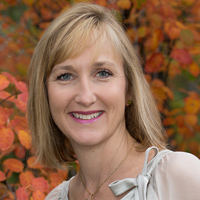
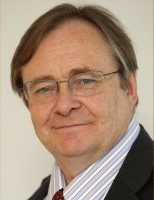

## Acknowledgements ##

We are sincerely grateful to our project sponsors without whom this project would not have been possible. That they believed in the project and us as authors was a significant motivator throughout this project. And their feedback along the way was invaluable in enabling us to continue to evolve both the content and the technology.

**Publisher Level**

               

**Editor Level**

Michael Bartikoski, Aliah Blackmore, Erika Ekedal, Paul Holmstrom, Ian Kendrick, Geoff McDonnell, Jim McGee, Bobby Moore, Rebecca Niles, Susan Pattee, James B Rieley, Lees Stuntz, Karen Corliss, Yutaka Takahashi, Julian Todd, Richard 
Turnock

**Evangelist Level**

Denis Conway Adams, Anthony Akins, David Allen, Enkhbat Dangaasuren,Helene Finidori,  Louise Fortmann, Paul Gehres, Jon Golding, Jeremy Hilton, Jin Lee, Paul Lundberg, Michael McManus, Dean Meyers, Damien Newman,Jeanne Marie Olson,  Rene Oosthuizen, Richard Shaun Pairish, Francois Sauer, Bill Schrum, David Soul, Harry van der Velde, John Vermes, Franck Vermet, Steve Williams, Richard Wright, Werner Schoenfeldinger, Raafat Zaini

**Benefactor Level**

Zareer Aga, Henk Akkermans, Duane Banks, Vincent Barabba, Roberto Berchi, John R. Broomfield, Stephen Chaffey, William Conklin, Jean-Daniel Cusin, Roger Duck, Sergio Echeverria, Lorraine Filipek, Lars Finskud, Diana Fisher, Andreas Gaarder, John Gancz, Santiago Garcia, H. Lucien Gauthier III, Alan Gaynor, Chuck Georgo, Michael Gidlewski, Leo Gilmore, Rob Hall, Susan L. Harris, David Hawk, Luc Hoebeke, Rick Hubbard, David Hurst, Garry Jenkin, Willard Jule, Tony Korycki, Roman Koziol, Ian Leaver, Jan Lelie, Tom Marzolf, John McCreery, Jakob Moeller-Jensen, Ash Moran, Steve Morlidge, Kent Myers, Cees Niesing, Stefan Norrvall, Brendan O'Sullivan, Clifford R. Perry, Deborah Polk, David Rees, Alexander Samarin, Lukas, Schmid, Barbara Schmidt-Abbey, Steven Schneider, David Seward, Zach Shoher, Fay Simcock, David Peter Stroh, Jurgen Strohhecker, Fabian Szulanski, Mukon Akong Tamon, Ivan Taylor, Luis Orlindo Tedeschi, Megan Turnock, Paulo Viella, Hunt Waddell, Stefan Michael Wasilewski, Edward Bing Wu, Rob Young

**Engraved Level**

Cliff Bennett, Colin Farrelly, John M Gould, Philip Hathaway, Anne Maguire, Christoph Mandl, Keith Masnick, David Packer, Ruth Rominger, Geoffrey A. Schoos, Dave Thomas, Joe Van Steen, Jan Veldsink

**Champion Level**

Chris Abbey, Janos Abel, Peter Addor, Adrian Apthorp, Chris Baker, Jerry Bally, Antonio Barron Inigo, Collin Barry, Jan Bartscht, Michael Bean, Matthiew Bister, Fenna Blomsma, Joseph Born, Joanne Chen Angela Courtney, Ed Cunliff, Aanand Dav&eacute;, Idea De Vos, Geoff Dean, Michael DeJardin, Dino Demopoulos, Margaret Devlin, Arthur Dijkstra, Luc Dubois, Eric Duguay, Dirk Ehnts, Melissa Eitzel, Francois Faure, Marciano Morozowski Filho, Bart Fonteyne, Rachel Freeman, Mario Freitas, Nick Fryars, Pascal Gambardella, Philippe Garvie, Daniel Gerber, Ramtin Ghasemipour-Yazdi, David Gilding, Stefan Hallberg, Rolf Hasanen, Doug Haynes, Time Hordern, Dennis Beng Hui, Alex Husted, Christian Erik Kampmann, Richard Karash, Fredeerick A. Kautz, Michael Kerr, Roland Kofler, Lucia Kopilcakova, Joseph Frank Krupa, Vladimir Boyko Kuznetsov, Harold Lawson, Antonio Leva, Mark Levison, David Lyell, Brock MacDonald, Habeeb Mahaboob, David McAra, George McConnell, Anne McCrossan, Bruce McNaughton, David Milligan, William M. Montante, Mario Lopez de Avila Munoz, Julius Neviera, Antoni Oliva, David Parsons, Robert Polk, John Pourdehnad, Christopher R. Ratcliff, Jack Ring, Donald Robadue, Simon Roberts, Ahmad Salih, Simon Savage, Richard Selwyn, Graham Smith, Nicolas Stampf, Alberto Stanislao Atzori, Linda Booth Sweeney, Laurent Thevoz, Karl Tiedemann, Sherri Tillotson, Colm Toolan, Greg Tutunjian, Stuart Umpleby, Frank Verschueren, Anders Vesterberg, Wayne Wakeland, Andrew Warner, Steve Wehrenberg, David Zager, Akbar Zamir, Stevan Zivanovic, Roy Zuniga

**Advocate Level**

Tore Aarsland, Robert Abbey, Edmilson Alves de Moraes, Ramon Arguello, Andre Baitello, Alexander Baumgardt, Bernard Vander Beken, Eric Belleflamme, Todd BenDor, Ilia Bidder, Ben Birdsell, Hercules Bothman, Stephen M. Brown, Jim Bryans Cameron, Neil Carhart, Zan Chadnler, Mitz Chauhan, Didier Clement, Barry Clemson, Romilly Cocking, Harlan Cohen, Brian Paacheo, Ryan Cross, Craig A. Cunningham, Joseph Dager, Alan David, Evan Davies, Selwyn Davies, Peter de Haan, Bob Debold, Pawel Defee, Tom Diffley, Adrian C. Dobson, Brian Dowling, Richard G. Dudley, Burcu Tan Erciyes, Brian Faulkner, Mary A. Ferdig, Christine Flanagan, Travis Franck, Sergio Shiguemi Furuie, Joe Fusion, David F. Gay, Asish Ghosh, Gabriella Giuffrida, Stephan Goetschius, Keith Eric Grant, David W. Gray, Wided Guedria, Jayne Heggen, Chip and Mary Ann Hines, Matthew Hoesch, Andrew Hollo, Mark Hongenaert, Rick Horocholyn, Fred Hosea, Kris Howard, Timothy Hower, Brian Hunt, Choat Inthawongse, John Jolley, Brian Sherwood Jones, Colleen Kaman, Sandy Kemsley, Erin Kenzie, Alex Koloskov, Robert Koshinskie, Dan Kristian Kristensen, Maxim Kuschpel, Roger J. S. Langford, Joe Le Doux, Ilkka Lilius, Nalani Linder, Athanasios Maimaris, Yeu-Wen Mak, David Malterre, Thorbjoern Mann, Kristine Manning, Mario Marais, John Maxey, Gary McCready, David McDonald, Curt McNamara, Gavin McNicol, Nicola Mellor, Juan B. Mendez, Jerry Michalski, Eric Milligan, Alberto Molinar, Pierre Mongin, Gerhard Mueller, Lamson Nguyen, Slobodan Ninkov, Michael D. Okrent, Hein Oomen, Julio Ortega, Bard C. Papegaaij, Phares Parayno, Roger Parker, Stephen Pauker, Herbert Pauler, Luis Carlos Molina Picinato, Nicholas G. Poulos, Ernes Parbhakar, David Pozo Fernandez, Ante Prodan, Marc Radley, Chris Ragg, Rebecca Reese, Dale Rothman, Mikhail Rubinov, Vicki Sauter, Mark Schleicher, Daniel A. Schultz, Fred Seigneur, Bill Seitz, Aaron E. Silvers, Bruce Skarin, Travis Slagle, Scott Smerchek, William Smith, Christina Spencer, Elizabeth Stackpole, Rob Staenke, Louis Stanford, Krystyna Stave, Myles Steinhauser, Greg Stevenson, Eric Stiens, Samuel Suss, Tom Swales, Artur Swietanowski, Tom Tang, Michael Tiller, Magnus Tuvendal, Ulrich Reetz, Charles Uyeda, Johnnie Vaughn, Ivo Velitchkov, Nitsh Verma, Iikka Virkkuen, Kim Warren, Peter Weinmann, Stefan Wild, Tony Williams, Hume Winzar, Evan Wondrasek, Terry Woodward, Wendy Zeitz

**Contributor Level**

KK Aw, Michele Battel-Fisher, Tom Bell, Hitesh Bhattari, Julia Brodsky, Chris Browne, Bruce Burk, Dibyendu De, Cynthia DuVal, David Hooper, Nishanth K Hydru,Igor Krejci, Sigrun Luras, Francisoc Mariategui, Kevin McGowan, John Morgan, Tim Newton, Edward B. Rockower, Ricardo Rodríguez-Ulloa, Michael Sales, Gerardo del cerro Santamaria, Dan Strongin, Tonnie van der Zouwen, George Woodman