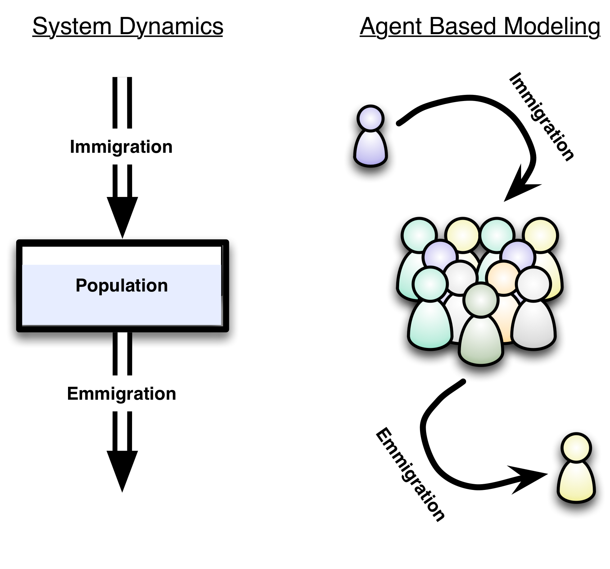
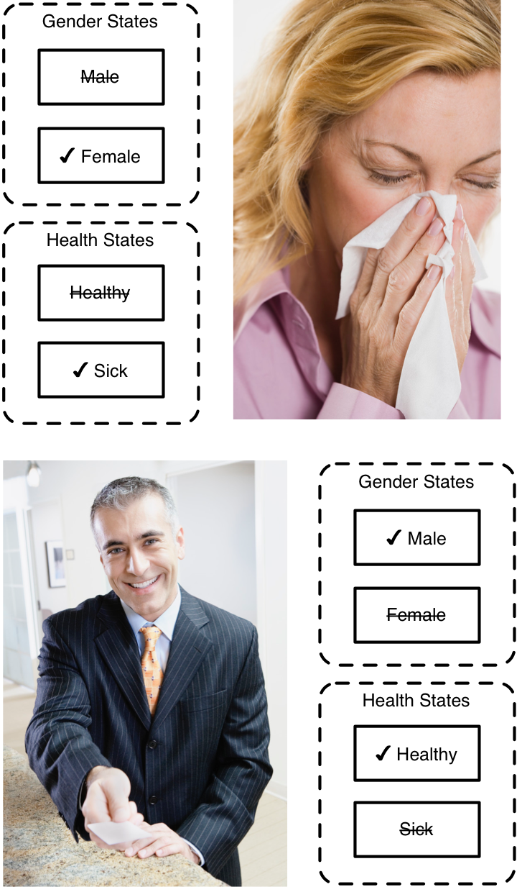
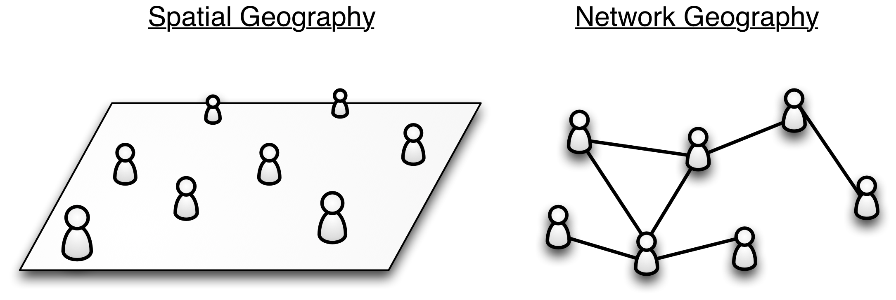

# Modeling with Agents

The modeling techniques we have taught up until this point focused on gaining insights using highly aggregated models of a system. This means that when we looked at models of population growth, we did not explore individual people and instead focused on understanding the population as a whole. This high-level aggregate approach to modeling helps us cut through unnecessary details to understand the core dynamics of a system.

For certain models however, this high-level view may hamstring our ability to explore important questions. For instance in a disease model we may care about the physical relationship between people in the model. Are they near each other? How often do they come into contact? Can we attempt to control the disease by manipulating how people move about and relate to each other? These are all questions that are very hard to answer with a standard System Dynamics model.

Heterogeneity, differences between individuals, is difficult to represent using System Dynamics models. One approach to heterogeneity that is sometimes used is simply to duplicate the model structure for each different class of person or entity in the model. We recall seeing one model that explored education in the United States. The modelers wanted to explore the differences between male and female students. To do so, they simply copy and pasted the entire model structure (consisting of dozens of stocks and flows) and calibrated one of these copies for male students and the other copy for female students.

Granted, this approach can be made to work, but it requires a lot of effort to set up and configure even in the simple two-gender case. When you have more than two cases it can quickly become completely unmanageable. Furthermore, duplicating parts of your model is a recipe for creating unmaintainable models afflicted by hard to track down bugs. The reason for this is that when you later make changes to your model, you are going to need to ensure the changes are made correctly to each one of the model copies. Although simple in principle, in practice this is very easy to mess up and it is a direct route for bugs to be introduced into the model.

Fortunately, an alternative modeling paradigm to System Dynamics exists that is excellent for modeling discrete individuals. It is called Agent Based Modeling and is focused on simulating individual agents and the interactions between these agents^[System Dynamics also has another standard tool for dealing with heterogeneity. This tool is called "vectors", "arrays", "subscripting", or "indexing" and allows you to transparently create multiple copies of your model during simulation to match different classes. Arrays are not as flexible as fully Agent Based Models though. If you consider the continuum of fully aggregate System Dynamics models on one end to fully individualized Agent Based Models on the other, we can think of arrays as existing part way along this continuum.]. In this chapter we will introduce Agent Based Modeling and show how you can use it to explore questions that cannot be answered with pure System Dynamics.

~ Exercise

Discuss the challenges you might face using System Dynamics to model a the adoption of a new product like an improved mousetrap. Identify issues that could be addressed by modeling discrete consumers.

~ End Exercise

## The State Transition Diagram

Up until now our primary modeling tool has been the stock and flow diagram. This type of diagram is useful for summarizing systems from a high-level viewpoint. The stock is a primitive that can model entities that take on a range of values and flows are well suited for specifying the changes in stocks

In addition to representing aggregate systems, stock and flow diagrams are also used to model things on an individual level. For instance, a model of a person's motivations could be represented using a stock and flow diagram. The strength or importance of each type of motivation -- money, family, etc... -- could be represented as stocks with flows modulating the strength of these motivations over time.

When looking at the individual scale however, we will oftentimes find ourselves wanting to define characteristics of the individual using simple on/off logic. For instance, take the issue of an individual's sex. We can represent this using two categories: Male or Female (leaving aside transgendered individuals for the sake of simplicity). Similarly, when constructing a model of a disease, we might want to say a person is either sick or not sick (with no nuances such as "slightly sick" or "highly sick"). You can attempt to represent these different categories using stocks, but the formulation and equations to do so will be overly complicated.

Where the stock and flow diagram is used to model changing systems with continuous stocks, the state transition diagram is used to model systems with discrete on/off states. Within Insight Maker, state transition diagrams are constructed in almost the same way as stock and flow diagrams. The key difference is all stocks are replaced with *State* primitives and all flows are replaced with *Transition* primitives. State primitives can be added to the model by right-clicking on the model diagram and selecting \u{Add State}. Transition primitives will automatically be created when you connect two state primitives together using the standard "Flow" connection type.

A state primitive is possibly the simplest primitive available as it can only take on one of two values: true or false. When the state value is true, the state is active. When the state value is false, the state is not active and the agent does not occupy that state. When configuring a state primitive, you only need to specified whether the state is \a{initially active} or not at the start of the simulation. This initial condition can simply be \e{true} or \e{false}, but it can also be a logical equation that depends on the values of other primitives in the agent. For example, if you had a variable in the agent called \p{Size}, and you wanted a state to be initially active if the value of \p{Size} was greater than 5, you could use the following as the initially active property for the state: \e{[Size] > 5}.

A transition primitive moves an agent between states. For instance, if you had two states in your model -- *Healthy* and *Sick* -- you could have one transition primitive moving agents from the healthy state to the sick state (simulating infection) and another transition primitive moving them the other way (simulating recovery).

There are three different ways a transition from one state to another can be triggered:

Timeout
: In this mode the transition will be triggered a specific amount of time after the first state becomes active. For instance, if we had a disease model where the disease lasted 10 days, we could have a transition from the sick to healthy state using a timeout trigger with a period of 10 days.

Probability
: In this mode there is a probability of the transition happening each time period. For instance, in the disease model if the disease only lasted 10 days on average but could randomly last longer or shorter, you could use a probability transition with a daily probability of 0.1.

Condition
: In this mode you create an equation that will trigger than transition when it becomes true. For instance, if we had a stock, \p{Infection Level} in our agent indicating how sick the agent was, we could have them transition out of the sick state once that stock fell to zero. The trigger condition to enable this could be something like: \e{[Infection Level] = 0}.

~ Exercise

Specify a transition trigger type and value for the following types of transition:

1. Transition after 10 days.
2. 20% chance of transitioning each year.
3. Transitioning when value of the primitive \p{Volume} is greater than 5.

~ Answer

1. Timeout trigger with value 10 days.
2. Probability trigger with value 20% (assuming time units of years).
3. Condition trigger. Value: \e{[Volume] > 5}

~ End Exercise

~ Exercise

Create a state transition diagram for a model of a person who three states: \p{Child}, \p{Adult}, \p{Retired}. The person starts in the \p{Child} state, transitions to the \p{Adult} state when they are 18 years old, and has a 2% chance of transitioning to the \p{Retired} state each year.

~ End Exercise

# Model

{"title": "A State Transition Diagram for Disease", "description": "This model illustrates the use of state transition diagrams to model a simple disease. This is a disease such as the flu where immunity is obtained once the individual recovers from the disease."}

{"cmd": "Math.seedrandom(1)"}

{"geometry":{"x":470,"y":120,"width":100,"height":40},"name":"Healthy","create":"State"}

{"geometry":{"x":470,"y":240,"width":100,"height":40},"name":"Infected","create":"State"}

{"geometry":{"x":470,"y":360,"width":100,"height":40},"name":"Recovered","create":"State"}

DIAGRAM

States can be used to represent a person's condition. In our model a person can either be healthy, infected, or recovered from the infection. Now, let's add transitions that move a person from state to state.

{"geometry":{"x":0,"y":0,"width":100,"height":100},"alpha":"Healthy","omega":"Infected","name":"Infection","create":"Transition"}

{"geometry":{"x":0,"y":0,"width":100,"height":100},"alpha":"Infected","omega":"Recovered","name":"Recovery","create":"Transition"}

Please note that in this model someone who is recovered cannot become sick again. They have gained immunity to the disease. 

Now that the model structure has been designed, let's add equations and configure the primitives.

{"attribute":"Active","target":"Healthy","value":"True"}

DIAGRAM

When a state is active, it means a person is in that state. By setting [Healthy] to start active, we have the person start in the healthy state.

{"attribute":"Trigger","target":"Infection","value":"Probability"}

{"attribute":"Value","target":"Infection","value":"0.3"}

{"attribute":"Trigger","target":"Recovery","value":"Probability"}

{"attribute":"Value","target":"Recovery","value":"0.2"}

Using the Probability type for the transition trigger means that the person has a fixed probability of transitioning from one state to the next each year. We will assume a 30% probability of the person becoming sick each year and once sick, a 20% chance of recovering each year.

Let's run the model now.

RESULTS

A value of 1 for a state primitive means it is active. A value of 0 means it is not active. We can see from this diagram when the individual transitions from the healthy to the infected state and then from the infected state to recovered state.

We can run the model again and we will see that we get different results each time we run it. This is because the model is stochastic and the transition triggers are random.

RESULTS

# End Model

## Creating Agents

Now that we have learned about state transition diagrams, we are ready to start creating agents. There are three key parts of creating agents in a model:

1. Defining what an agent is
2. Creating a group of agents
3. Viewing agent results

### Defining Agents

We have already introduced the folder primitive as a tool for grouping primitives together and also as a tool for unfolding a model. The folder primitive plays an additional role in Agent Based Modeling as we use folders to define what our agent consists of.

To create an agent construct the state transition diagram for your agent (and also add any stocks, flows or any other primitives you want to this agent). Then create a folder containing all these primitives. Give the folder the name of your agent such as "Person" or "Individual" or even just "Agent". This is all similar to what we have done with folders before, but now there is one extra step. Edit the folder configuration and set the folder \u{Behavior} to "Agent". You have now created the definition of your first agent! 

You can have as many different types of agents in your model as you would like. Just create a new agent model and use a new folder to define each of the different types of agents. For instance if you had a predator prey model you could have one agent definition describing the behavior of the prey, and a second agent definition describing the behavior of the predators.

### Creating a Population of Agents 

After you have defined an agent in your model, you are ready to create a collection or population of agents. This is done by adding an *Agent Population* primitive to your model. The agent population primitive takes the definition of an agent from an agent folder and creates many copies of that agent from the definition. The agent population primitive keeps track of these copies and allows them to operate and to interact with one another.

There are a number of different settings for the agent population primitive but two of them are of key importance. The first is to select what type of agent will be in the population. Each population primitive can only have one type of agent in it. You can have multiple populations though and the agents in one population can interact with the agents in another population.

After specifying what type of agent is in the population, you need to specify how many agents are in the population at the start of the simulation. This is done by setting the \a{Size} property for the agent population. Later on you can add or remove agents to a population by using the \e{Add()} and \e{Remove()} functions.

### Viewing Agent Results

Many of the standard Insight Maker display types can be used to show the results of an agent based simulation. If you add an agent population to a time series or tabular display, the results for the number of agents in each of the various agent states will automatically be shown. You can also use the \u{Map} display type to illustrate agents within a geographic region.

# Model

{"title": "An Agent Based Model of Disease", "description": "Here we convert a state transition diagram into a model containing multiple agents."}

{"load": "<mxGraphModel>  <root>    <mxCell id=\"0\"\/>    <mxCell id=\"1\" parent=\"0\"\/>    <Setting Note=\"\" Version=\"28\" TimeLength=\"20\" TimeStart=\"0\" TimeStep=\"1\" TimeUnits=\"Years\" StrictUnits=\"true\" Units=\"\" HiddenUIGroups=\"Validation,User Interface\" SolutionAlgorithm=\"RK1\" BackgroundColor=\"white\" Throttle=\"1\" Macros=\"\" SensitivityPrimitives=\"\" SensitivityRuns=\"50\" SensitivityBounds=\"50, 80, 95, 100\" SensitivityShowRuns=\"false\" id=\"2\">      <mxCell parent=\"1\" vertex=\"1\" visible=\"0\">        <mxGeometry x=\"20\" y=\"20\" width=\"80\" height=\"40\" as=\"geometry\"\/>      <\/mxCell>    <\/Setting>    <Display name=\"Default Display\" Note=\"\" Type=\"Time Series\" xAxis=\"Time (%u)\" yAxis=\"\" ThreeDimensional=\"false\" Primitives=\"23,24,25\" AutoAddPrimitives=\"true\" ScatterplotOrder=\"X Primitive, Y Primitive\" Image=\"Display\" yAxis2=\"\" Primitives2=\"\" showMarkers=\"false\" showLines=\"true\" showArea=\"false\" legendPosition=\"Automatic\" id=\"3\">      <mxCell style=\"roundImage;image=\/builder\/images\/DisplayFull.png;\" parent=\"1\" vertex=\"1\" visible=\"0\">        <mxGeometry x=\"50\" y=\"20\" width=\"64\" height=\"64\" as=\"geometry\"\/>      <\/mxCell>    <\/Display>    <State name=\"Healthy\" Note=\"\" Active=\"True\" Image=\"None\" FlipHorizontal=\"false\" FlipVertical=\"false\" LabelPosition=\"Middle\" id=\"23\">      <mxCell style=\"state\" vertex=\"1\" parent=\"1\">        <mxGeometry x=\"470\" y=\"120\" width=\"100\" height=\"40\" as=\"geometry\"\/>      <\/mxCell>    <\/State>    <State name=\"Infected\" Note=\"\" Active=\"false\" Image=\"None\" FlipHorizontal=\"false\" FlipVertical=\"false\" LabelPosition=\"Middle\" id=\"24\">      <mxCell style=\"state\" vertex=\"1\" parent=\"1\">        <mxGeometry x=\"470\" y=\"240\" width=\"100\" height=\"40\" as=\"geometry\"\/>      <\/mxCell>    <\/State>    <State name=\"Recovered\" Note=\"\" Active=\"false\" Image=\"None\" FlipHorizontal=\"false\" FlipVertical=\"false\" LabelPosition=\"Middle\" id=\"25\">      <mxCell style=\"state\" vertex=\"1\" parent=\"1\">        <mxGeometry x=\"470\" y=\"360\" width=\"100\" height=\"40\" as=\"geometry\"\/>      <\/mxCell>    <\/State>    <Transition name=\"Infection\" Note=\"\" Trigger=\"Probability\" Value=\"0.3\" Units=\"Unitless\" MaxConstraintUsed=\"false\" MinConstraintUsed=\"false\" MaxConstraint=\"100\" MinConstraint=\"0\" ShowSlider=\"false\" SliderMax=\"100\" SliderMin=\"0\" SliderStep=\"\" id=\"26\">      <mxCell style=\"transition\" edge=\"1\" parent=\"1\" source=\"23\" target=\"24\">        <mxGeometry width=\"100\" height=\"100\" as=\"geometry\">          <mxPoint y=\"100\" as=\"sourcePoint\"\/>          <mxPoint x=\"100\" as=\"targetPoint\"\/>        <\/mxGeometry>      <\/mxCell>    <\/Transition>    <Transition name=\"Recovery\" Note=\"\" Trigger=\"Probability\" Value=\"0.2\" Units=\"Unitless\" MaxConstraintUsed=\"false\" MinConstraintUsed=\"false\" MaxConstraint=\"100\" MinConstraint=\"0\" ShowSlider=\"false\" SliderMax=\"100\" SliderMin=\"0\" SliderStep=\"\" id=\"27\">      <mxCell style=\"transition\" edge=\"1\" parent=\"1\" source=\"24\" target=\"25\">        <mxGeometry width=\"100\" height=\"100\" as=\"geometry\">          <mxPoint y=\"100\" as=\"sourcePoint\"\/>          <mxPoint x=\"100\" as=\"targetPoint\"\/>        <\/mxGeometry>      <\/mxCell>    <\/Transition>  <\/root><\/mxGraphModel>"}
	
DIAGRAM
	
We start with our state transition diagram from our previous modeling example.

{"geometry":{"x":450,"y":100,"width":140,"height":320},"items":["Healthy","Infected","Recovered","Infection","Recovery"],"create":"Folder", "name": "Person"}

{"attribute":"Type","target":"Person","value":"Agent"}

First we create an agent folder to encapsulate our state transition diagram. This is a definition of what an agent in our model will be and we make sure the folder behavior is set to "Agent".

{"geometry":{"x":220,"y":180,"width":170,"height":80},"name":"Population","create":"Agents"}

{"attribute":"Agent","target":"Population","value":"Person"}

Next we create an agent population [Population] and set it to contain instances of our *Person* agent. We'll start with a population size of 100 agents.

DIAGRAM

We can now run the model to see how the disease affects the 100 people in our population.

RESULTS

Each time we run the model we will get different results due to the stochasticity in the model.

RESULTS

{"attribute":"Size","target":"Population","value":"50"}

We can easily change the number of people in the population. Let's set it to 50 then run the model again.

RESULTS

When we have a smaller number of people, the overall population changes are more variable. As we add more and more people, the randomness in the model has less of an effect and trends become smoother approaching the average results we would see if we had used a System Dynamics model.

# End Model

## Working with Agents

Working with agents is fundamentally different from working with primitives in a pure System Dynamics model. For instance, if you have a regular model and you refer to the value of a variable or stock you get a single value back. With agents, however, when you refer to the value of a primitive you might get a separate value for each individual agent in your model.

So for instance, if you have 100 agents and you refer to the primitive \p{Height}, you will get 100 different heights one for each of the agents in the model. Similarly, in the case of our disease model, if you you request the value of the state \p{Infected}, you will get a different infected value for each of the agents in the model.

You will need to extend your modeling toolkit in order to be able to effectively manage agents and accomplish your goals in your model. The key building block of this extended toolkit is the vector^[In other programing languages and modeling environments vectors are sometimes called "Arrays" or "Lists".]. In the following sections we will first introduce the general concept of vectors and then show how you can use them to interact with agents.

### Working with Vectors

A vector is an ordered list of items. In Insight Maker vectors can be written using the '{' followed by the '}' sign. For instance imagine we had a small population of only four people. If we asked the model for the heights of those four people^[Using an equation like *Value(FindAll([Population]), [Height])*. We'll see later how to construct equations like this.] in meters we might get something like this:

\e{{ {2, 1.8, 1.9, 1.5} }}

This indicates that our population has four people with heights of 2, 1.8, 1.9 and 1.5 meters. Insight Maker has an extensive set of capabilities and functions for manipulating and summarizing vectors such as this. For instance, if we wanted to know the height of the tallest person in our population, we could use the \e{Max()} function:

\e{{ Max({2, 1.8, 1.9, 1.5}) # = 2 }}

If we wanted to know the height of the smallest person in the population we could use the \e{Min()} function:

\e{{ Min({2, 1.8, 1.9, 1.5}) # = 1.5 }}

Let's say we wanted to know the average height of the people in our our population. We could either use the \e{Mean()} or \e{Median()} functions:

\e{{ Mean({2, 1.8, 1.9, 1.5}) # = 1.8 }}

\e{{ Median({2, 1.8, 1.9, 1.5}) # = 1.85 }}

We can also use basic mathematical operations on our vectors. For example, assume we needed to design a room such that the top of the room was at least half a meter above a person's head. We could find the required room height for each person by adding 0.5 to the vector of heights:

\e{{ {2, 1.8, 1.9, 1.5} + 0.5 # = {2.5, 2.3, 2.4, 2} }}

We can also add vectors together. For instance, let's imagine that some of the agents had hats on and we have measured the height of these hats and got the following vector of heights: \e{{ {0.05, 0, 0.1, 0} }} (two of the people do not wear hats). We could find the height of the agents when they are wearing their hats using:

\e{{ {2, 1.8, 1.9, 1.5} + {0.05, 0, 0.1, 0} # = {2.05, 1.8, 2, 1.5} }}

Another useful vector function is the \e{Count()} function. Assuming we did not know there were four agents, we could determine how many elements there were in the vector using this function:

\e{{ Count({2, 1.8, 1.9, 1.5}) # = 4 }}

You can do a lot with these basic functions but there are also two very powerful vector functions we should mention: \e{Map()} and \e{Filter()}. Map takes each element in a vector and applies some transformation to it and returns a vector of the transformations. As an example, let's say we wanted to test whether or not are agents were tall enough to ride an amusement park ride with a cutoff of 1.85 meters. We could get a vector containing whether or not each agent was tall enough using:

\e{{ Map({2, 1.8, 1.9, 1.5}, x >= 1.85) # = {true, false, true, false} }}

Here the function \e{x >= 2} is applied to each element in the vector (with \e{x} representing the element value) and the results of this element-by-element evaluation of the function is returned.

Filter takes a function and applies it to each element in a vector. If the function evaluates to true, the element is included in the resulting vector; if the function evaluates to false, the element is not included in the results. For instance, if we just wanted the heights of the people who were tall enough to ride the ride, we could use:

\e{{ Filter({2, 1.8, 1.9, 1.5}, x >= 1.85) # = {2, 1.9} }}

Lastly, there are a couple of very useful functions are available to combine vectors together. \e{Union()} takes two vectors and combines them together removing duplicated elements. 

\e{{ Union({1, 2 ,3}, {2, 3 ,4}) # = {1, 2, 3, 4} }}

\e{Intersection()} takes two vectors and returns a vector containing the elements that are in both of the vectors.

\e{{ Intersection({1, 2 ,3}, {2, 3 ,4}) # = {2, 3} }}

\e{Difference()} takes two vectors and returns a vector containing the elements that are in either one of the vectors but *not* in both of the vectors.

\e{{ Difference({1, 2 ,3}, {2, 3 ,4}) # = {1, 4} }}

There are many more vector functions available, but these are some of the key ones. They will prove invaluable when you come to working with vectors of agents.

~ Exercise

Given a vector of heights \e{{2, 1.8, 1.9, 1.5}}, write an equation to find the tallest height under 1.95 meters:

~ Answer

\e{{ Max(Filter({2, 1.8, 1.9, 1.5}, x < 1.95)) }}

~ End Exercise

~ Exercise

Given a vector named *a*, write an equation to find the median of the squares of all the elements in *a*.

~ Answer

\e{Median(a^2)}

~ End Exercise

~ Exercise

Given a vector named *a* and a vector named *b*, write an equation to find the smallest element that is in both vectors.

~ Answer

\e{Min(Intersection(a, b))}

~ End Exercise

~ Exercise

Given the vector named *a*. Find the mean of the vector without using the \e{Mean()} function.

~ Answer

\e{Sum(a)/Count(a)}

~ End Exercise

### Accessing Agents

Insight Maker includes a number of functions to access the individual agents within a population. The simplest of these is the \e{FindAll()} function. Given an agent population primitive that we'll call \p{Population}, the FindAll function returns a vector containing all the agents within that agent population:

\e{FindAll([Population])}

So if your agent population currently had 100 agents in it, this would return a vector with 100 elements where the first element referred to the first agent, the second element referred to the second agent and so on. It is important to note that these elements are agent references, not numbers. So you can use a function like \e{Reverse()} on the resulting vector, but you cannot directly use functions like \e{Mean()} as the agent references are not numerical values^[The agents certainly contain many numerical values in their stocks, variables, or states; but an agent reference itself is not numerical and so you cannot do things such as directly taking the average of the agents or sorting them.]. We will see how to access the values for agents next.

In addition to the FindAll function, there are other find functions that return a subset of the agents in the model. For instance, the \e{FindState()} and \e{FindNotState()} functions return, respectively, agents that either have the given state active or not active. For instance, if we go back to our agent-based disease model, our agents had a state primitive called \p{Infected} that represented if the agent was currently sick, we could get a vector of the agents in our population that were currently sick using the following:

\e{FindState([Population], [Infected])}

And we could obtain a vector of the agents that were not currently infected with:

\e{FindNotState([Population], [Infected])}

Find functions can also be nested. For instance, if we added a \p{Male} state primitive to our agents representing whether or not the agent was a man; we could obtain a vector of all currently infected men with something like the following:

\e{FindState(FindState([Population], [Infected]), [Male])}

Nesting find statements is effectively using Boolean AND logic (like you might use on a search engine: "Infected AND Male"). To do Boolean OR logic (e.g. "Infected OR Male") and return all the agents that are either infected or a man (or both), you can use the Union function to merge two vectors:

\e{Union(FindState([Population], [Infected]), FindState([Population], [Male]))}

If you wanted the agents that were either infected or men (but not both simultaneously), you could use:

\e{Difference(FindState([Population], [Infected]), FindState([Population], [Male]))}

~ Exercise

Write an equation using the disease example to return a vector of all female infected individuals.

~ Answer

\e{FindState(FindState([Population], [Infected]), [Female])}

~ End Exercise

~ Exercise

Write an equation using the disease example to return a vector of all female individuals, healthy individuals or healthy females.

~ Answer

\e{Union(FindNotState([Population], [Infected]), FindState([Population], [Female]))}

~ End Exercise

### Agent Values

Once you have a vector of agents, you can extract the values of the specific primitives in those agents using the \e{Value()} and \e{SetValue()} functions.

The Value function takes two arguments: a vector of agents and the primitive for which you want the value. It then returns the value of that primitive in each of the agents. For instance, let us say our agents have a primitive named \p{Height}. We could get a vector of the height of all the people in the model like so:

\e{Value(FindAll([Population]), [Height])}

A vector of heights by itself is generally of not too much use. Often we will want to summarize it, for instance by finding the average height of the people in our population:

\e{Mean(Value(FindAll([Population]), [Height]))}

In addition to determining the value of a primitive in an agent, you can also manually set the agents’ primitive values using the SetValue function. It takes the same arguments as the Value function in addition to the value you want to set primitives to. For instance, we could use the following to set the height of all our agents to 2.1:

\e{SetValue(FindAll([Population]), [Height], 2.1)}

~ Exercise

Assume our disease model population had a height stock. Provide an equation to find the average difference in heights between males and females.

~ Answer

\e{Mean(Value(FindState([Population], [Male]), [Height]))-Mean(Value(FindState([Population], [Female]), [Height]))}

~ End Exercise

# Model

{"title": "Agents Interacting", "description": "This example shows how agents can interact with each other using the Find functions."}

{"load": "<mxGraphModel>  <root>    <mxCell id=\"0\"\/>    <mxCell id=\"1\" parent=\"0\"\/>    <Folder name=\"Person\" Note=\"\" Type=\"Agent\" Image=\"None\" FlipHorizontal=\"false\" FlipVertical=\"false\" LabelPosition=\"Middle\" id=\"28\">      <mxCell style=\"folder\" vertex=\"1\" parent=\"1\">        <mxGeometry x=\"450\" y=\"100\" width=\"140\" height=\"320\" as=\"geometry\"\/>      <\/mxCell>    <\/Folder>    <State name=\"Healthy\" Note=\"\" Active=\"True\" Image=\"None\" FlipHorizontal=\"false\" FlipVertical=\"false\" LabelPosition=\"Middle\" id=\"23\">      <mxCell style=\"state\" parent=\"28\" vertex=\"1\">        <mxGeometry x=\"20\" y=\"20\" width=\"100\" height=\"40\" as=\"geometry\"\/>      <\/mxCell>    <\/State>    <State name=\"Infected\" Note=\"\" Active=\"false\" Image=\"None\" FlipHorizontal=\"false\" FlipVertical=\"false\" LabelPosition=\"Middle\" id=\"24\">      <mxCell style=\"state\" parent=\"28\" vertex=\"1\">        <mxGeometry x=\"20\" y=\"140\" width=\"100\" height=\"40\" as=\"geometry\"\/>      <\/mxCell>    <\/State>    <State name=\"Recovered\" Note=\"\" Active=\"false\" Image=\"None\" FlipHorizontal=\"false\" FlipVertical=\"false\" LabelPosition=\"Middle\" id=\"25\">      <mxCell style=\"state\" parent=\"28\" vertex=\"1\">        <mxGeometry x=\"20\" y=\"260\" width=\"100\" height=\"40\" as=\"geometry\"\/>      <\/mxCell>    <\/State>    <Transition name=\"Infection\" Note=\"\" Trigger=\"Probability\" Value=\"0.3\" Units=\"Unitless\" MaxConstraintUsed=\"false\" MinConstraintUsed=\"false\" MaxConstraint=\"100\" MinConstraint=\"0\" ShowSlider=\"false\" SliderMax=\"100\" SliderMin=\"0\" SliderStep=\"\" id=\"26\">      <mxCell style=\"transition\" parent=\"28\" source=\"23\" target=\"24\" edge=\"1\">        <mxGeometry x=\"-450\" y=\"-100\" width=\"100\" height=\"100\" as=\"geometry\">          <mxPoint x=\"-450\" as=\"sourcePoint\"\/>          <mxPoint x=\"-350\" y=\"-100\" as=\"targetPoint\"\/>        <\/mxGeometry>      <\/mxCell>    <\/Transition>    <Transition name=\"Recovery\" Note=\"\" Trigger=\"Probability\" Value=\"0.2\" Units=\"Unitless\" MaxConstraintUsed=\"false\" MinConstraintUsed=\"false\" MaxConstraint=\"100\" MinConstraint=\"0\" ShowSlider=\"false\" SliderMax=\"100\" SliderMin=\"0\" SliderStep=\"\" id=\"27\">      <mxCell style=\"transition\" parent=\"28\" source=\"24\" target=\"25\" edge=\"1\">        <mxGeometry x=\"-450\" y=\"-100\" width=\"100\" height=\"100\" as=\"geometry\">          <mxPoint x=\"-450\" as=\"sourcePoint\"\/>          <mxPoint x=\"-350\" y=\"-100\" as=\"targetPoint\"\/>        <\/mxGeometry>      <\/mxCell>    <\/Transition>    <Setting Note=\"\" Version=\"28\" TimeLength=\"20\" TimeStart=\"0\" TimeStep=\"1\" TimeUnits=\"Years\" StrictUnits=\"true\" Units=\"\" HiddenUIGroups=\"Validation,User Interface\" SolutionAlgorithm=\"RK1\" BackgroundColor=\"white\" Throttle=\"1\" Macros=\"\" SensitivityPrimitives=\"\" SensitivityRuns=\"50\" SensitivityBounds=\"50, 80, 95, 100\" SensitivityShowRuns=\"false\" id=\"2\">      <mxCell parent=\"1\" vertex=\"1\" visible=\"0\">        <mxGeometry x=\"20\" y=\"20\" width=\"80\" height=\"40\" as=\"geometry\"\/>      <\/mxCell>    <\/Setting>    <Display name=\"Default Display\" Note=\"\" Type=\"Time Series\" xAxis=\"Time (%u)\" yAxis=\"\" ThreeDimensional=\"false\" Primitives=\"23,24,25,29\" AutoAddPrimitives=\"true\" ScatterplotOrder=\"X Primitive, Y Primitive\" Image=\"Display\" yAxis2=\"\" Primitives2=\"\" showMarkers=\"false\" showLines=\"true\" showArea=\"false\" legendPosition=\"Automatic\" id=\"3\">      <mxCell style=\"roundImage;image=\/builder\/images\/DisplayFull.png;\" parent=\"1\" vertex=\"1\" visible=\"0\">        <mxGeometry x=\"50\" y=\"20\" width=\"64\" height=\"64\" as=\"geometry\"\/>      <\/mxCell>    <\/Display>    <Agents name=\"Population\" Note=\"\" Size=\"50\" GeoWrap=\"false\" GeoDimUnits=\"Unitless\" GeoWidth=\"200\" GeoHeight=\"100\" Placement=\"Random\" PlacementFunction=\"&lt;&lt;rand*width([Self]), rand*height([Self])&gt;&gt;\" Network=\"None\" NetworkFunction=\"randBoolean(0.02)\" Agent=\"28\" Image=\"None\" FlipHorizontal=\"false\" FlipVertical=\"false\" LabelPosition=\"Middle\" id=\"29\">      <mxCell style=\"agents\" vertex=\"1\" parent=\"1\">        <mxGeometry x=\"220\" y=\"180\" width=\"170\" height=\"80\" as=\"geometry\"\/>      <\/mxCell>    <\/Agents>  <\/root><\/mxGraphModel>"}
	
DIAGRAM

Let’s make our agent based disease model from earlier more realistic. We will add a variable [Fraction Infected] that calculates what fraction of the population is currently infected. We will then use this variable to determine the infection rate so the more people in the population who are infected, the faster the disease will spread.
	
{"geometry":{"x":280,"y":90,"width":130,"height":50},"name":"Fraction Infected","create":"Variable"}

{"geometry":{"x":0,"y":0,"width":100,"height":100},"alpha":"Population","omega":"Fraction Infected","create":"Link"}

{"geometry":{"x":0,"y":0,"width":100,"height":100},"alpha":"Fraction Infected","omega":"Infection","create":"Link"}

DIAGRAM

Now let's configure the value of [Percent Infected] and change the [Infection ]transition to use it.

{"attribute":"Equation","target":"Fraction Infected","value":"Count(FindState([Population], [Infected]))/PopulationSize([Population])", "editor": true}

This equation uses the FindState function to select all the people in the [Population] who are in the Infected state. It then divides the number of those people by the total size of the population.

{"attribute":"Value","target":"Infection","value":"[Fraction Infected]"}

{"attribute":"Primitives","target":"DISPLAY","value":["Population"]}

Now that we have set our infection probability to the value of the [Fraction Infected] primitive, we are ready to run the model.

RESULTS

That was a bit of a disappointment wasn't it? Nothing happened. Why is this?

Well since our infection rate now depends on the number of people who are infected we have to have at least one person infected to get the epidemic going. Let's change the [Healthy] and [Infected] states so one person starts in the infected state at the beginning of the simulation.

{"attribute":"Active","target":"Healthy","value":"Index([Self]) <> 1"}

{"attribute":"Active","target":"Infected","value":"Index([Self]) == 1", "editor": true}

Each agent has an index starting with 1, we have set our initially active equations so the first agent in the population will start the simulation in the infected state. Let's run the model to see this working.

RESULTS

Each time we run the model we will get a different set of results. Sometimes the infection will die off after the first infected person recovers. Many other times an epidemic spread of the disease will occur.

RESULTS

# End Model

## Agent Geography

One of the key strengths of Agent Based Modeling is that it allows us to study the geographic relationship between our agents. So if we are developing a disease model we do not have to assume that all the agents are perfectly mixed together like atoms in a gas (such as we generally would in System Dynamics). Instead, using Agent Based Modeling we can explicitly define the physical relationship between the different agents and study how this geography affects the spread of the disease.

In general when we talk about geography we mean spatial geography: the locations of people within a region in terms of their latitude and longitude (and sometimes their elevation). Insight Maker supports this kind of geography, but it also supports a second kind of geography: network geography. Insight Maker allows the specification of "connections" between agents. This leads to a new type of geography where you have centrally located agents (ones connected to many other agents) and agents far from the network's center (those that are unconnected or just connected to a very few other agents).

Both these types of geographies can be useful in exploring important features of real-world systems. In the following sections, we will introduce their properties and show you how to utilize them in your own models.

### Spatial Geography

In Insight Maker, each Agent Population can be given dimensions in terms of a width and a height. By default, agents are placed at a random location within this region. You can, however, choose a different placement method for the starting position of the agents. The following placement methods are available:

Random
: The default. Agents are placed at random positions within the geometry specified for the agent population.

Grid
: Agents are aligned in a grid within the population. When using this placement method, you will need to ensure that you have enough agents so that the grid is complete. You might need to experiment with increasing or decreasing the number of agents to make the grid fit perfectly for a given set of region dimensions.

Ellipse
: Agents are arranged in a single ellipse within the region. If the region geometry is a square, then the agents will be arranged in a circle.

Network
: Assuming network connections between agents have been specified, the agents will be arranged in an attempt to create a pleasing layout of the network structure.

Custom Function
: Here you can specify a custom function to control the layout of the agents. This function will be called once for each agent in the population and should return a two-element vector where the first element is the *x*-coordinate of the agent, and the second element is the *y*-coordinate. The primitive \p{Self} in this function will refer to the agent that is being positioned.

![Figure 4. Illustration of the four agent placement algorithms. From the top: random, grid, ellipse, and a custom function using: *{2\*index([Self]), 50+50\*sin(index([Self])/10)}*.](AgentPlacement.png)

#### Spatial Find Functions

When working with a spatially explicit model, a number of additional find functions are available for you to obtain references to agents that match a given spatial criteria.

\e{FindNearby()} is a function that returns a vector of agents that are within a given proximity to a target agent. It takes three arguments: the agent population primitive, the agent target for which you want nearby neighbors, and a distance. All agents within the specified distance to the target agent will be returned as a vector.

It is useful now to introduce a concept that will be very helpful to you. When used in an Agent, \p{Self} always refers to the agent itself. If you have a primitive within an agent, \p{Self} can be used from that primitive to get a reference to the agent containing the primitive. So the following equation in an agent will return a vector of agents that are within 15 miles of the agent itself:

\e{{FindNearby([Population], [Self], {15 Miles})}}

Two other useful functions for finding agents in spatial relation to each other are \e{FindNearest()} and \e{FindFurthest()}. FindNearest returns the nearest agent to the target while FindFurthest returns the agent that is farthest away from it. Each of them also supports an optional third argument determining how many nearby (or far away) agents to return (this optional argument defaults to one when omitted).

For example, the following equation finds the nearest agent to the current agent:

\e{FindNearest([Population], [Self])}

While this finds the three agents that are furthest from the current agent:

\e{FindFurthest([Population], [Self], 3)}

#### Movement Functions

You can also move agents to new locations during simulation. To do this, it is helpful to introduce a new primitive we have not yet discussed. This primitive is the *Action* primitive. Action primitives are designed to execute some action that changes the state of your model. For instance, they can be used to move agents or change the values of the primitives within an agent. An action is triggered in the same way a transition is triggered. Like a transition, there are three possible methods of triggering the action: timeout, probability, and condition.

For instance, we can use an action primitive in an agent and the \e{Move()} function to make agents move during the simulation. The Move function takes two arguments: the agent to be moved, and a vector containing the *x*- and *y*-distances to move the agent. Thus, we could place an action primitive in our agent and give it the following action property to make the agent move randomly over time^[What we are implementing here is known as a "random walk" or Brownian motion. It is a commonly studied pattern of movement with wide applications in science.]. The equation will move the agent a random distance between -0.5 and 0.5 units in the *x*-direction and a random distance between -0.5 and 0.5 units in the *y*-direction.

\e{Move([Self], {rand, rand}-0.5)}

Another useful movement function is the \e{MoveTowards()} function. MoveTowards moves an agent towards (or away from) the location of another agent. MoveTowards takes three arguments: the agent to be moved, the target agent to move towards, and how far to move towards that agent (with negative values indicating movement away). The following command would move an agent one meter closer to its nearest neighbor in the population.

\e{{MoveTowards([Self], FindNearest([Population], [Self]), {1 Meter})}}

~ Exercise

Write an equation to move an agent 2 meters towards the furthest healthy agent.

~ Answer

\e{{MoveTowards([Self], FindFurthest(FindState([Population, [Healthy]), [Self]), {2 Meters})}}

~ End Exercise

# Model

{"title": "Agent Movement", "description": "This model illustrates the use of movement within agent based models. We adapt the previous disease model so that healthy agents flee from the nearest infected agent."}

{"load": "<mxGraphModel>  <root>    <mxCell id=\"0\"\/>    <mxCell id=\"1\" parent=\"0\"\/>    <Folder name=\"Person\" Note=\"\" Type=\"Agent\" Image=\"None\" FlipHorizontal=\"false\" FlipVertical=\"false\" LabelPosition=\"Middle\" id=\"28\">      <mxCell style=\"folder\" parent=\"1\" vertex=\"1\">        <mxGeometry x=\"450\" y=\"100\" width=\"140\" height=\"320\" as=\"geometry\"\/>      <\/mxCell>    <\/Folder>    <State name=\"Healthy\" Note=\"\" Active=\"Index([Self]) &lt;&gt; 1\" Image=\"None\" FlipHorizontal=\"false\" FlipVertical=\"false\" LabelPosition=\"Middle\" id=\"23\">      <mxCell style=\"state\" parent=\"28\" vertex=\"1\">        <mxGeometry x=\"20\" y=\"20\" width=\"100\" height=\"40\" as=\"geometry\"\/>      <\/mxCell>    <\/State>    <State name=\"Infected\" Note=\"\" Active=\"Index([Self]) == 1\" Image=\"None\" FlipHorizontal=\"false\" FlipVertical=\"false\" LabelPosition=\"Middle\" id=\"24\">      <mxCell style=\"state\" parent=\"28\" vertex=\"1\">        <mxGeometry x=\"20\" y=\"140\" width=\"100\" height=\"40\" as=\"geometry\"\/>      <\/mxCell>    <\/State>    <State name=\"Recovered\" Note=\"\" Active=\"false\" Image=\"None\" FlipHorizontal=\"false\" FlipVertical=\"false\" LabelPosition=\"Middle\" id=\"25\">      <mxCell style=\"state\" parent=\"28\" vertex=\"1\">        <mxGeometry x=\"20\" y=\"260\" width=\"100\" height=\"40\" as=\"geometry\"\/>      <\/mxCell>    <\/State>    <Transition name=\"Infection\" Note=\"\" Trigger=\"Probability\" Value=\"[Fraction Infected]\" Units=\"Unitless\" MaxConstraintUsed=\"false\" MinConstraintUsed=\"false\" MaxConstraint=\"100\" MinConstraint=\"0\" ShowSlider=\"false\" SliderMax=\"100\" SliderMin=\"0\" SliderStep=\"\" id=\"26\">      <mxCell style=\"transition\" parent=\"28\" source=\"23\" target=\"24\" edge=\"1\">        <mxGeometry x=\"-450\" y=\"-100\" width=\"100\" height=\"100\" as=\"geometry\">          <mxPoint x=\"-450\" as=\"sourcePoint\"\/>          <mxPoint x=\"-350\" y=\"-100\" as=\"targetPoint\"\/>        <\/mxGeometry>      <\/mxCell>    <\/Transition>    <Transition name=\"Recovery\" Note=\"\" Trigger=\"Probability\" Value=\"0.2\" Units=\"Unitless\" MaxConstraintUsed=\"false\" MinConstraintUsed=\"false\" MaxConstraint=\"100\" MinConstraint=\"0\" ShowSlider=\"false\" SliderMax=\"100\" SliderMin=\"0\" SliderStep=\"\" id=\"27\">      <mxCell style=\"transition\" parent=\"28\" source=\"24\" target=\"25\" edge=\"1\">        <mxGeometry x=\"-450\" y=\"-100\" width=\"100\" height=\"100\" as=\"geometry\">          <mxPoint x=\"-450\" as=\"sourcePoint\"\/>          <mxPoint x=\"-350\" y=\"-100\" as=\"targetPoint\"\/>        <\/mxGeometry>      <\/mxCell>    <\/Transition>    <Setting Note=\"\" Version=\"28\" TimeLength=\"20\" TimeStart=\"0\" TimeStep=\"1\" TimeUnits=\"Years\" StrictUnits=\"true\" Units=\"\" HiddenUIGroups=\"Validation,User Interface\" SolutionAlgorithm=\"RK1\" BackgroundColor=\"white\" Throttle=\"1\" Macros=\"\" SensitivityPrimitives=\"\" SensitivityRuns=\"50\" SensitivityBounds=\"50, 80, 95, 100\" SensitivityShowRuns=\"false\" id=\"2\">      <mxCell parent=\"1\" vertex=\"1\" visible=\"0\">        <mxGeometry x=\"20\" y=\"20\" width=\"80\" height=\"40\" as=\"geometry\"\/>      <\/mxCell>    <\/Setting>    <Display name=\"Default Display\" Note=\"\" Type=\"Time Series\" xAxis=\"Time (%u)\" yAxis=\"\" ThreeDimensional=\"false\" Primitives=\"23,24,25,29,30\" AutoAddPrimitives=\"true\" ScatterplotOrder=\"X Primitive, Y Primitive\" Image=\"Display\" yAxis2=\"\" Primitives2=\"\" showMarkers=\"false\" showLines=\"true\" showArea=\"false\" legendPosition=\"Automatic\" id=\"3\">      <mxCell style=\"roundImage;image=\/builder\/images\/DisplayFull.png;\" parent=\"1\" vertex=\"1\" visible=\"0\">        <mxGeometry x=\"50\" y=\"20\" width=\"64\" height=\"64\" as=\"geometry\"\/>      <\/mxCell>    <\/Display>    <Agents name=\"Population\" Note=\"\" Size=\"50\" GeoWrap=\"false\" GeoDimUnits=\"Unitless\" GeoWidth=\"200\" GeoHeight=\"100\" Placement=\"Random\" PlacementFunction=\"&lt;&lt;rand*width([Self]), rand*height([Self])&gt;&gt;\" Network=\"None\" NetworkFunction=\"randBoolean(0.02)\" Agent=\"28\" Image=\"None\" FlipHorizontal=\"false\" FlipVertical=\"false\" LabelPosition=\"Middle\" id=\"29\">      <mxCell style=\"agents\" parent=\"1\" vertex=\"1\">        <mxGeometry x=\"220\" y=\"180\" width=\"170\" height=\"80\" as=\"geometry\"\/>      <\/mxCell>    <\/Agents>    <Variable name=\"Fraction Infected\" Note=\"\" Equation=\"Count(FindState([Population], [Infected]))\/PopulationSize([Population])\" Units=\"Unitless\" MaxConstraintUsed=\"false\" MinConstraintUsed=\"false\" MaxConstraint=\"100\" MinConstraint=\"0\" ShowSlider=\"false\" SliderMax=\"100\" SliderMin=\"0\" SliderStep=\"\" Image=\"None\" FlipHorizontal=\"false\" FlipVertical=\"false\" LabelPosition=\"Middle\" id=\"30\">      <mxCell style=\"variable\" vertex=\"1\" parent=\"1\">        <mxGeometry x=\"280\" y=\"90\" width=\"130\" height=\"50\" as=\"geometry\"\/>      <\/mxCell>    <\/Variable>    <Link name=\"Link\" Note=\"\" BiDirectional=\"false\" id=\"31\">      <mxCell style=\"link\" edge=\"1\" parent=\"1\" source=\"29\" target=\"30\">        <mxGeometry width=\"100\" height=\"100\" as=\"geometry\">          <mxPoint y=\"100\" as=\"sourcePoint\"\/>          <mxPoint x=\"100\" as=\"targetPoint\"\/>        <\/mxGeometry>      <\/mxCell>    <\/Link>    <Link name=\"Link\" Note=\"\" BiDirectional=\"false\" id=\"32\">      <mxCell style=\"link\" edge=\"1\" parent=\"1\" source=\"30\" target=\"26\">        <mxGeometry width=\"100\" height=\"100\" as=\"geometry\">          <mxPoint y=\"100\" as=\"sourcePoint\"\/>          <mxPoint x=\"100\" as=\"targetPoint\"\/>        <\/mxGeometry>      <\/mxCell>    <\/Link>  <\/root><\/mxGraphModel>"}
	
DIAGRAM
	
We will extend our disease model from earlier by adding movement to the agents. First we need to create an action primitive.

{"target":"Person","geometry":{"x":450,"y":100,"width":250,"height":320}}

{"geometry":{"x":120,"y":190,"width":120,"height":50},"create":"Action", "name":"Escape"}

{"parent": "Person", "name": "Escape"}

{"geometry":{"x":0,"y":0,"width":100,"height":100}, "alpha":"Healthy","omega":"Escape", "create": "Link"}

{"geometry":{"x":0,"y":0,"width":100,"height":100},"alpha":"Population","omega":"Escape","create":"Link"}

DIAGRAM

We will have this action be triggered when the agent is healthy and there is at least one infected agent in the simulation.

{"attribute":"Value","target":"Escape","value":"[Healthy] and Count(FindState([Population], [Infected])) > 0"}

The action will cause healthy agents to move away from the nearest infected agent. In effect, fleeing from sick individuals.

{"attribute":"Action","target":"Escape","value":"MoveTowards([Self], FindNearest(FindState([Population], [Infected]), [Self]), -2)", "editor": true}

We can now run the simulation.

{"attribute":"Primitives","target":"DISPLAY","value":["Population"]}

RESULTS

These results are not too interesting as they do not show the locations of the agents. To see the agents moving, we need to change the display type to *Map* which gives us a visualization of the location of agents. Then we run the simulation again.

{"attribute":"Type","target":"DISPLAY","value":"Map"}

RESULTS

# End Model

### Network Geography

To create connections and remove connections between agents you can use the \e{Connect()} and \e{Unconnect()} functions. Both of these functions take two arguments: the agents that should be connected or disconnected. For example, to connect an agent to its nearest neighbor, you could use the following

\e{Connect([Self], FindNearest([Population], [Self]))}

To disconnect an agent from its nearest neighbor (assuming they are connected), you would use:

\e{Unconnect([Self], FindNearest([Population], [Self]))}

To obtain a vector of connections to an agent, use the \e{Connected()} function:

\e{Connected([Self])}

Connections are not directed so creating a connection from agent *A* to agent *B* is the same as creating a connection from agent *B* to agent *A*. Also only one connection between a given pair of agents will exist at a time. So creating two connections between a given pair of agents will have the same effect as creating a single connection.

By default, no connections are created when a simulation is initially started. If you change the \a{Network Structure} configuration property of the agent population primitive, you can specify a function to create connections when the simulation is started. This function is called once for each pair of agents in the model. The agents are available in the function as the variables *a* and *b*. If the function evaluates to \e{true}, then the agents will start connected. If the function evaluates to \e{false}, the agents will not be initially connected.

You could use this function to, for instance, specify that 40% of agents will be directly connected to each other at the start of the simulation. The following equation would do that by generating a random true/false value with 40% probability of returning \e{true} each time it is called:

\e{RandBoolean(0.4)}

## Multiline Equations

So far in this book, the equations we have looked at have generally been straightforward mathematical formulae. We have introduced some more advanced concepts, such as vectors, but for the most part our equations have been relatively simple one-liners. When doing Agent Based Modeling however, at some point you will find these one-line equations to be limiting. When you begin to run into these limitations with your own models, you may need to start using multiline equations to achieve certain agent behavior.

Almost everyplace in Insight Maker where you can write a mathematical expression, you can also right a multiline equation. It turns out that Insight Maker's language for specifying equations is actually a complete computer programming language and you can exploit the strength of this programming language by writing your equations over several lines instead of using a single line mathematical formula.

We delayed introducing these capabilities until now, as they can sometimes be a distraction from focusing on understanding a system. However, when you build complex Agent Based Models, they can be necessary to express the model logic you wish. Given this need, we will provide a brief introduction to the programming features that can be used as part of Insight Maker equations. You do not need to delve deeply into these capabilities now, but be aware that they are available for when you need them in your own models.

### Variables

Variables are temporary slots to store values to be reused within your equations. Variables are created using the '\e{<-}' symbol meaning assignment. For instance:

\e{
a <- 2 # The variable 'a' holds the value 2
b <- a + 2 # The variable 'b' holds the value 4
a <- b^2 # a=16, b=4
}

Variable names can contain any number of letters and numbers and must always start with a letter. 

### If-Then-Else

You should be familiar with the \e{IfThenElse()} function. A multiline alternative to it exists. The following is equivalent to \e{IfThenElse([Height] > 2, 1, 2)}.

\e{
If [Height] > 10 Then
	1
Else
	2
End If
}

One of the benefits of these multiline equations is that they can be more readable than the single line functions. This is especially true if you are trying to do nested *if* statements. Compare \e{IfThenElse([Height] > 2, 1, IfThenElse([Height] < 1, -1, 2))} to:

\e{
If [Height] > 2 Then
	1
Else If [Height] < 1 Then
	-1
Else
	2
End If
}

The second one is much more readable. This makes it easier to maintain and more resilient to potential typographical errors.

### Loops

Loops are a programming construct that repeat some code multiple times. There are several different types of loops. One important loop is the *for* loop which repeats a command a specified number of times. Here is an example of it being used:

\e{
sum <- 0
For i From 1 To 3
	sum <- sum + i
End Loop
sum
}

The inner part of the loop is run three times here. The first time the variable *i* is assigned the value of 1, the next time 2, and the last time 3. So this sums up the values of 1, 2, and 3 resulting in 6. 

Another variant of the *for* loop is the *for-in* loop. This uses a vector to assign the values of the iterations. The following code sums the numbers 1, 5, and 10 to get 16.

\e{
sum <- 0
For i In {1, 5, 10}
	sum <- sum + i
End Loop
sum
}

*For-in* loops can be very useful to iterate through a vector of agents. Another useful loop is called the *while* loop. It does not repeat a predefined number of times and instead repeats until a condition becomes true. Here is an example:

\e{
total <- 2
While total < 100
	total <- total^2
End Loop
total
}

This code keeps squaring the *total* variable until the total is greater than 100. In this case, this will result in 256.

### Functions

Functions allow you to reuse code in multiple places in your model. For instance, imagine you had a model that dealt with temperatures in both Degrees Fahrenheit and Celsius. If you could not use the built in unit conversion functionality, every time you wanted to convert from one form to the other you would have to include the standard conversion formula in your equations. Not only would this be tedious, it would also be error prone as the more times you type an equation, the higher the chance of making a mistake.

You can define functions in two ways. One is a short one-liner:

\e{FtoC(f) <- 5/9*(f+32)}

And another is a multiline form allowing you to incorporate multiline logic in your functions:

\e{
Function FtoC(f)
	5/9*(f+32)
End Function
}

A great place to include your functions is in the *Macros* section of your model. You can enter macros by clicking the \u{Macros} button in the \u{Tools} section of the toolbar. The functions you define here will be accessible in any equation in any part of your model.

~ Exercise

Write a function to return the range of a vector. The range is the largest element of the vector minus the smallest element.

~ Answer

\e{range(x) <- max(x)-min(x)}

or

\e{
Function Range(x)
	Max(x)-Min(x)
End Function
}

~ End Exercise

~ Exercise

Write a function to calculate the *n*th Fibonacci number. The Fibonacci sequence goes 1, 1, 2, 3, 5, 8, 12, ... After the first two, each number is the sum of the two proceeding numbers in the sequence.

What is the 15th Fibonacci number?

~ Answer

\e{
Function Fib(n)
	If n = 1 or n = 2 Then
		1
	Else
		Fib(n-1) + Fib(n-2)
	End If
End Function
}

The 15th Fibonacci number is 610.

~ End Exercise

## Integrating SD and ABM

System Dynamics modeling and Agent Based Modeling are two different ways of approaching a system. In general, System Dynamics looks at highly aggregated systems and encourages the study of feedback. Agent Based Modeling explores individuals and the interactions between these individuals.

Some software packages only do System Dynamics or Agent Based Modeling leading to the perception that they are somehow incompatible methodologies. Although these techniques can be thought of as quite different, it important to realize that, at the end of the day, both of them are simply applied mathematics. To emphasize this, Insight Maker integrates both these techniques together seamlessly in its modeling environment. There is no such thing as an "Insight Maker Agent Based Model" or an "Insight Maker System Dynamics Model". There are simply models where you may use agent-based techniques, System Dynamics techniques or a mixture of the two.

Insight Maker (and other modeling packages such as AnyLogic <http://www.anylogic.com/>) allows you to integrate the two seamlessly together. For instance, in this chapter we have used state transition diagrams within our agents. We could have just as well used stock and flow diagrams within the agents so that each agent in effect contained its own System Dynamics model of its state. Similarly if you have a large System Dynamics model you could create an agent-based sub-model that feeds into the main model dynamics.

When doing modeling, it is important to not get focused on labels or taxonomies of different techniques. Given a modeling task, you want to think about what tools and techniques are best used to approach it. You want to make sure not to approach a modeling task by trying to figure out how to force that task into the constraints of a favorite modeling paradigm.

~ Exercise

Compare and contrast the Agent Based Modeling and System Dynamics approach to creating models. Provide three examples of modeling tasks where Agent Based Modeling would be better suited than System Dynamics and three examples where the reverse would be true.

~ End Exercise