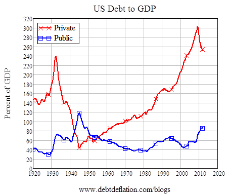

# Applied Understanding

This chapter presents a number of models, offered primarily by Beyond Connecting the Dots sponsors, in different subjects areas. These models are designed to be more directly related to real situations than those in prior chapters.

## Systemic Strategy ##

As we think about the problems we face today it is readily evident that most of these are the direct result of yesterday’s solutions. To enable a better tomorrow we must develop a viable approach for dealing with situations. We need an approach that addresses the situation while minimizing the likelihood of making the situation worse or creating new problems that will have to be addressed in the future. The foundation of this approach, as with all real progress, is learning. The next two models present a basis for the requisite learning.

### Background ###

Numerous new approaches to problem solving have been developed and promoted over the years. Some of these became fads and were readily adopted by many. But the fads were not well founded and in time proved not to deliver the expected results. When the expected results were not delivered, the fads were discarded in favor of the next fad. As Michael McGill points out [@McGill:1991vv], the real difficulty lies in a flawed mental model under which both the promoters and the adopters operate. That flawed mental model is their belief that there can be a quick fix.

In contrast, well grounded and proven approaches to problem solving have not been widely adopted. Those with flawed mental models consider the proven approaches to be too complicated or time consuming. The quest for the ever elusive quick fix condemns us to endlessly solving the new problems created by the prior quick fixes. This is the type of result expected from operating with flawed mental models [@Senge:1994uw]. We must realize the quick fix is a myth and invest the time to learn proven methods and create sound solutions.

### Creating the Future ###

Whether we’re considering a problem, a situation, an objective, or a desire, the underlying essence of the manner in which we deal with the situation is as presented in the following "Creating the Future"^[Creating the Future [http://insightmaker.com/insight/8892](http://insightmaker.com/insight/8892)] model.

# Model
{"title": "Creating the Future", "description": "The intent is to solve problems without creating new ones.", "load": "http://insightmaker.com/insight/8892"}
# End Model

Whether we realize it or not, this model can be applied to just about everything that happens in our lives. Even when we don’t consciously think about it, the interactions depicted are operating. The extent to which people consciously think about these relations varies. Some people think about the implication of their actions and stop there. And some people think about the implications of implications of implications. They do this because they understand that things are highly interconnected and the implications are generally not obvious and often difficult to foresee.

### Systemic Strategy ###

Realizing that there is an underlying set of interactions as depicted in the "Creating the Future" model, which is essentially the foundation of all our endeavors, it seems sensible to seek a deeper awareness of how we develop the requisite understanding. An introduction to developing this understanding is depicted in the "Systemic Strategy"^[Systemic Strategy [http://insightmaker.com/insight/1366](http://insightmaker.com/insight/1366)] model.

# Model
{"title": "Systemic Strategy", "description": "Relevant pieces of the puzzle for real progress.", "load": "http://insightmaker.com/insight/1366"}
# End Model

"Systemic Strategy" represents an iterative unfolding of understanding. This understanding forms the basis for developing a strategy which, when implemented, is highly likely to address the situation of interest as intended. At the same time, the strategy minimizes the likelihood of unintended consequences or creating new problems. There is another Interactive Learning Environment in the works based on this model titled, "Enabling a Better Tomorrow."

## Victims of the System or Systems of the Victim ##

American business is in its seventh decade of management fads. In some organizations the fads have worked, in most they have not, and in some they have even made matters worse. Many reasons have been advanced for the failure of fads; none of them quite complete. The fault lies not with the fads, but with our attempt to use them to change things for which we have insufficient understanding. 

Experience has taught us well to react to events and to respond to patterns of behavior. Yet, there is a deeper level of understanding possible. An understanding on the level of structure. There are underlying structures responsible for the patterns of behavior and the events. Our lack of awareness of these structures often makes us the victim of them, even though many of the structures are of our own creation. The structures are not hidden, they are simply not obvious. We have never developed a way to see and understand the structures we operate within. Once we become aware of structures, know how to look for them, and understand them, they become readily apparent all around us. A "Home Heating System"^[Home Heating System [http://insightmaker.com/insight/910](http://insightmaker.com/insight/910)] will be used to demonstrate how easy it is to be caught in our own short shortsightedness. 

# Model
{"title": "Home Heating System", "description": "How an understanding of a home heating system improves our ability to deal with dilemmas.", "load": "http://insightmaker.com/insight/910"}
# End Model

Yes, we're being very redundant though the message we're trying to convey is essential. Models are a critical component of developing understanding and we have to keep asking AND? And what else is happening here that's relevant and essential to include for the understanding we're trying to achieve?

## Managing Time in Time Management ##

Often we are victims of our own beliefs and thus pursue approaches to deal with situations that are doomed to fail. Why are they doomed to fail? Because the basis of our approach is flawed to begin with. The following "Managing Time in Time Management"^[Managing Time in Time Management [http://insightmaker.com/insight/913](http://insightmaker.com/insight/913)] model demonstrates a very prominent example of this.

# Model
{"title": "Managing Time in Time Management", "description": "Should you be surprised if pursuing the wrong course of action doesn't produce the desired result?", "load": "http://insightmaker.com/insight/913"}
# End Model

Hopefully this model provides an additional sense of the importance of soft variables in some models. Quite often soft variable are the real key to understanding what's really happening in the web of extended interactions.

This model, like so many others, also serves to point out how true Pogo really was. "We have met the enemy and he is us!"

## Are There Limits ##

Are there really limits to the development of humanity on a finite planet? The "Are There Limits"^[Are There Limits [http://insightmaker.com/insight/9569](http://insightmaker.com/insight/9569)] model from Tom Fiddaman provides some thought provoking perspectives.

# Model
{"title": "Are There Limits", "description": "Are there ways to overcome the limits presented by life on a finite plant?", "load": "http://insightmaker.com/insight/9569"}
# End Model

While the model provides food for thought, the answer to the question remains to be determined.

## Productivity Challenge ##

Assume you are responsible for a project that's behind schedule. What alternatives might you consider for getting it back on track? The "Joe P. Management Challenge"^[Joe P. Management Challenge [http://insightmaker.com/insight/9576](http://insightmaker.com/insight/9576)] model investigates several possible alternatives.

# Model
{"title": "Joe P. Management Challenge", "description": "What are the most obvious options when a project is behind schedule? Do they work?", "load": "http://insightmaker.com/insight/9576"}
# End Model

The previous model was an initial set of thoughts about the possible options for getting the project back on track. The "Credit Never Happened: Relations"^[Credit Never Happened: Relations [http://insightmaker.com/insight/752](http://insightmaker.com/insight/752)] model will dig deeper into what are considered additional relevant relationships.

# Model
{"title": "Credit Never Happened: Relations", "description": "There are more relevant relations needed to really understand the situation.", "load": "http://insightmaker.com/insight/752"}
# End Model

While the "Credit Never Happened: Relations" model may have provided additional perspectives on the relations that might be considered, there is limited understanding to be derived from the picture. The "Credit Never Happened: Simulation"^[Credit Never Happened: Simulation [http://insightmaker.com/insight/9781](http://insightmaker.com/insight/9781)] is intended to investigate the dynamic implications of the relations considered relevant for this situation.

# Model
{"title": "Credit Never Happened: Simulation", "description": "A dynamic simulation typically provides insights that one simply can't derive from a picture.", "load": "http://insightmaker.com/insight/9781"}
# End Model

The reality that we hope was surfaced in this model is that you can't get something for nothing. Everything has an associated cost. If you want things to get better you have to invest. Investing wisely is even better.

## Restaurant Covers ##

Have you ever considered the dynamics associated with arriving at a restaurant, being seated, served, and then the seating being used by another party once you leave? The "Restaurant Covers"^[Restaurant Covers [http://insightmaker.com/insight/10000](http://insightmaker.com/insight/10000)] model, developed by Lise Inman and Keith Margerison, is provides an introduction to those dynamics.

# Model
{"title": "Restaurant Covers", "description": "Serving customers at a restaurant can have substantial variation.", "load": "http://insightmaker.com/insight/10000"}
# End Model

## Control Theory ##

Control systems act to make their own input match internal standards or reference signals. Competent control systems create illusions of stimulus-response causality. Stimulus-response theory can approximate the relationship between disturbance and action, but it can't predict the consequences of behavior. These consequences are maintained despite disturbances.

The "Control Theory: A Model of Organisms"^[Control Theory: A Model of Organisms [http://insightmaker.com/insight/9786](http://insightmaker.com/insight/9786)] presents an initial view of the interrelations responsible for the behavior of an organism in response to an input stimulus.

# Model
{"title": "Control Theory: A Model of Organisms", "description": "The environment and the active system are both engaged in the output.", "load": "http://insightmaker.com/insight/9786"}
# End Model

The "Double Loop Control Theory"^[Double Loop Control Theory [http://insightmaker.com/insight/9787](http://insightmaker.com/insight/9787)] model is an elaboration of the previous model. It provides further insights into the relevant relations responsible for the behavior of organisms in response to stimulus.

# Model
{"title": "Double Loop Control Theory", "description": "There is a an equivalence between control theory and double loop learning.", "load": "http://insightmaker.com/insight/9787"}
# End Model

## Increasing Indebtedness to Banks ##

The issue of increasing private and government debt to banks is a major concern after the financial crisis of 2008, as depicted in Figure 1. To understand why our society and government are increasingly indebted to banks we need to understand how our current money system works, and why we need a continuous infusion of new money in a growing economy. “Increasingly Indebted To Banks”^[Increasing Indebtedness to Banks [http://insightmaker.com/insight/9788](http://insightmaker.com/insight/9788)] investigates the reasons behind this and suggest a possible solution. This model was developed by Dr. Jin Lee, Consultant and Trainer, Malaysia and New York.

# Model
{"title": "Increasing Indebtedness to Banks", "description": "This model investigates why we are continually more indebted to banks and provides an option.", "load": "http://insightmaker.com/insight/9788"}
# End Model

## Sustainable Capitalism ##

The current life expectancy for a Fortune-500 company is 40 to 50 years, less than 10 years for a newly started company, and about 12.5 years for all companies together. During this lifespan the tendency is to focus on short-term profits with little or no concern for the impact the company has on society or the environment. Have you ever wondered about the reasons behind this? The "Sustainable Capitalism"^[Sustainable Capitalism [http://insightmaker.com/insight/7691](http://insightmaker.com/insight/7691)] model is derived from a presentation by Mark Van Clieaf, Managing Director of MVC Associates International and sponsored by Ken Shepard, President at Global Organization Design Society.

# Model
{"title": "Sustainable Capitalism", "description": "The influences leading to short term focus and long term decline.", "load": "http://insightmaker.com/insight/7691"}
# End Model

Structure influences behavior. An often used definition of insanity is to continue taking the same actions and expecting different results. If you want different behavior you need a different structure, otherwise aren't you simply practicing insanity?

## Swamping Insights ##

"Swamping Insights"^[Swamping Insights [http://insightmaker.com/insight/1769](http://insightmaker.com/insight/1769)] represents a common archetype of systems that include relapse or recidivism. This model allows exploration of the unintended effects of increasing upstream capacity and swamping downstream capacity. The increase in the relapse rate eventually returns to swamp upstream capacity as well.

# Model
{"title": "Swamping Insights", "description": "Enhancing one part of a process may ensure the whole process gets worse.", "load": "http://insightmaker.com/insight/1769"}
# End Model

Russell L. Ackoff often commented that one should never improve a part of the system unless it improves the whole. If you think about this for a while you should get a sense of how profound the implications of this would be were it followed.

## To Degree or Not ##

Decision making around one's career may be a lot like chutes and ladders; well made early decisions produce great results later. Racing to the top of a career to find out it is NOT your passion may indeed land you on a chute that takes you way back.

My friend and fellow scout leader Andy became a dentist because his dad, brother, and uncle all were dentists. After 7 years of school, more than $100,000 of debt and no savings, and three years of hating to get up in the morning to go to work - he finally admitted to himself and family that he hates looking in peoples' mouths!  Andy started a new career as a computer programmer not all the way at the bottom, but close - 10 years behind where he might have been with a more deliberate exploration of career options and costs.

While choosing one's career has always been a mix of exploration, finding one's passion, mentoring, formal and informal education, our world and labor economy has changed dramatically in the past 40 years. Our schools and employers, especially public employers like utilities, are just catching up.  Moreover, [our k-12 system may have been designed for a different age and time](http://www.youtube.com/watch?v=zDZFcDGpL4U) when jobs were plentiful and employers had formal training programs. College grads used to spend 3-5 years in a job and a department before moving to another and another over a 20-30 year career.  

In those days, the classical discussion on the merits and ROI of going to college centered around the employers' well documented data that hiring high school and college educated employees led to lower job training costs. A more literate and capable workforce permitted the corporation to save training dollars and produce revenue faster. (Gary Becker, Human Capital, (NY:NBER 1964)). 

There is no longer a world full of blue chip employers looking for high school and college grads to fill entry level jobs, complete with corporate training plans. Unemployment at all time highs also has great social costs in crime, foreclosures, poverty, and health. 

Many college grads today find themselves up to their ears in debt and living in the basement working minimum wage jobs in retail and fast food. Some economists believe that student loan debt and the [SALLYMAE bubble is the next shoe to drop](http://blogs.reuters.com/great-debate/2013/03/07/student-loan-bubble-babble/). College grad starting salaries are at all time lows, while student loans are at all time highs. Employees change jobs every 2-3 years (often a victim of economic downturns) and hold seven careers in a 30-40 year work life. As retirement becomes out of reach for many, older employees are working longer if they can for all sorts of reasons, competing for the same few spots, keeping wages depressed, and blocking ports of entry for others.

Want to be a doctor today? You still have to get good grades, complete a BS degree, go to medical school, and work through a residency. Climbing the ladder still works in some careers. But if ever there was a place for Strategic Thinking it is in how one starts, manages, builds, grows, or extends one's career.  We want to tease these issues in a short but engaging and appropriate way.

These Insight Models are meant to leave three types of readers with the following...

1. **For the teacher or parent** - how to coach your student or child on some of the decisions and opportunity costs; to begin to model income over a career path; basic assumptions involved in finding their passion
2. **For the student** - on their path to become a talented engaged motivated employee - when to go fast? The benefits of taking it slow, going to community college before committing to a career that requires an advanced degree;
3. **For the employer and human resource managers** - what are the implications of our new normal on assessing talent, staffing, on-boarding, on the job training, and mentoring in the culture of the organization?

Public-private college initiatives like Siemens, Olympic High School, and Central Piedmont Community College in Charlotte, NC are finding great success in growing their own talent. They target talent and optimize educational and corporate resources. We may try to use the model to show how these types of programs limit social costs, while maximizing individual student, college, and employer resources.  

Career education partnerships becomes one possible cure for the profoundly disconnected system we have today.

The following three models were developed by Matt Sadinsky, CEO at [Prequalified Ready Employees for Power International](http://www.prepintl.com/).

The first insight in the series, "Traditional Career Model"^[Traditional Career Model [http://insightmaker.com/insight/8727](http://insightmaker.com/insight/8727)], is a simple, more traditional naive model of how education works, with increased lifetime earnings from attending college.

# Model
{"title": "Traditional Career Model", "description": "Comparing the potential for No High School Education, High School Education, and College Education earnings/savings potential.", "load": "http://insightmaker.com/insight/8727"}
# End Model

The second insight in the series, "Loan Cost Model"^[Loan Cost Model [http://insightmaker.com/insight/8727](http://insightmaker.com/insight/8729)], takes into account the potential cost of student loans in the event that the student does not complete college or does not succeed in their career. 

# Model
{"title": "Loans Cost", "description": "Comparing the cost of switching careers mid stream.", "load": "http://insightmaker.com/insight/8729"}
# End Model

The third insight in the series, "Savings Over Time"^[Savings Over Time [http://insightmaker.com/insight/8727](http://insightmaker.com/insight/8735)], illustrates the difference in savings over time for a doctor or for a skilled worker who went to a trade school.

# Model
{"title": "Savings Over Time", "description": "Comparing the savings potential for a doctor and a skilled worker.", "load": "http://insightmaker.com/insight/8735"}
# End Model

What are the implications for K-12 and college advising? Perhaps career choice decisions are one of the most relevant areas of strategic thinking in which any parent and counselor could involve their children and students. See Mike Rowe's website [Proundly Disconnected](http://profoundlydisconnected.com/alternative-education/) for more information on the importance of reconnecting education to more effective career choices. Also watch [Bill Maher interview Mike Rowe](http://roadshow.slate.com/mike-rowe-on-bill-maher-time-to-close-the-skills-gap/).

## The Rain Barrel ##

Even with some of the simplest models, at times it's difficult to intuit the likely behavior. This should be rather evident from "The Rain Barrel"^[The Rain Barrel [http://insightmaker.com/insight/10016](http://insightmaker.com/insight/10016)] model developed by Richard Turnock.

This model presents the implications of inflow and outflow on a stock that are not likely to be intuitive. This generic model is an important pre-requisite to learning about intravenous drugs in the body, radioactivity, self-esteem, water flowing from a bathtub, climate change, and many other basic natural systems.

# Model
{"title": "The Rain Barrel", "description": "Even simplicity can be deceptive.", "load": "http://insightmaker.com/insight/10016"}
# End Model

## New Learning Inhibited ##

New Learning tends to reduce Outdated Thinking, Communicating & Learning though our Outdated Thinking, Communicating & Learning tends to inhibit new learning. How do we break this cycle?
"New Learning Inhibited"^[New Learning Inhibited [http://insightmaker.com/insight/7018](http://insightmaker.com/insight/7018)] is adopted from "An Introduction to Systems Thinking with STELLA" by Barry Richmond.
 
# Model
{"title": "New Learning Inhibited", "description": "Is it possible to break out of a vicious cycle?", "load": "http://insightmaker.com/insight/7018"}
# End Model

## Innovation Diffusion ##

The "Innovation Diffusion"^[Innovation Diffusion [http://insightmaker.com/insight/9818](http://insightmaker.com/insight/9818)] model provides a basis for understanding the dynamics associated with the rate at which new ideas and technology become known or adopted though cultures.

# Model
{"title": "Innovation Diffusion", "description": "The relationship between Potential Adopter and Adopters is quite well defined.", "load": "http://insightmaker.com/insight/9818"}
# End Model

What we hope you find so amazing about dynamic models is that they allow you to create an explicit representation of what you think, and then provide you with the implications of what you think. This provide a marvelous basis for learning to evolve your thinking.

## Hospital Fixes that Fail ##

The "Hospital Fixes that Fail"^[Hospital Fixes that Fail [http://insightmaker.com/insight/9826](http://insightmaker.com/insight/9826) model presents another example of how our best (short-sighted) attempts to do something that seems logical can produce results that are counterproductive to what we wanted to accomplish. 

# Model
{"title": "Hospital Fixes that Fail", "description": "At times our best efforts defeat our intent.", "load": "http://insightmaker.com/insight/9826"}
# End Model

## World2 Model ##

The "World2 Model"^[World2 Model [http://insightmaker.com/insight/9812(http://insightmaker.com/insight/9812)] presents interactions among population, industrial growth, food production, and limits in the Earths' ecosystems. The World2 model was adopted by Geoff McDonnell from Mark Heffernan's ithink version. The World3 Limits to Growth Model was developed based on the earlier, simpler version developed by Jay Forrester in his 1971 book World Dynamics.

# Model
{"title": "World 2 Model", "description": "Investigate the dynamics among capital investment, population, pollution, and natural resources on the Earth", "load": "http://insightmaker.com/insight/9812"}
# End Model

## Conclusion ##

If we are to evolve beyond the Pogo predicament, “We have met the enemy and he is us” [Kelly, 1970] we must embrace learning and become far more adept at developing truly viable approaches for dealing with situations. Attempting to deal with situations without the requisite level of understanding has repeatedly proven to be little more than meddling. This in turn simply makes the situation worse or creates new problems that have to be dealt with. There are well defined and proven approaches for developing each aspect of the "Systemic Strategy"^[Systemic Strategy [http://insightmaker.com/insight/1366](http://insightmaker.com/insight/1366)] model, and these will be presented in the "Enabling a Better Tomorrow" Interactive Learning Environment soon to be released.
