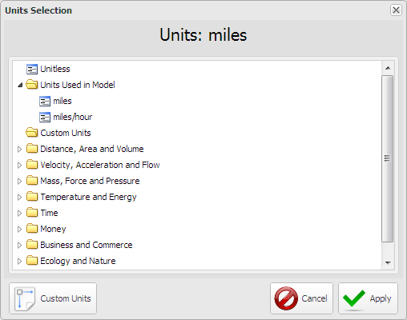
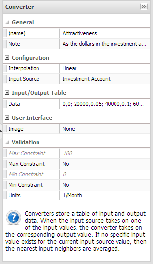
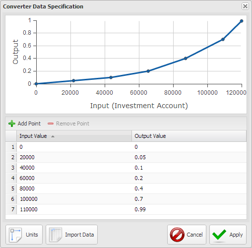
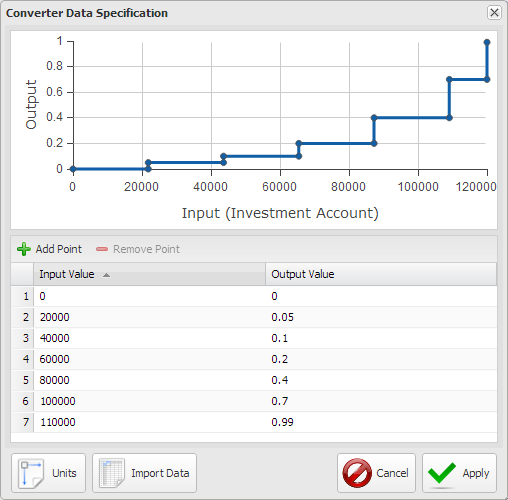
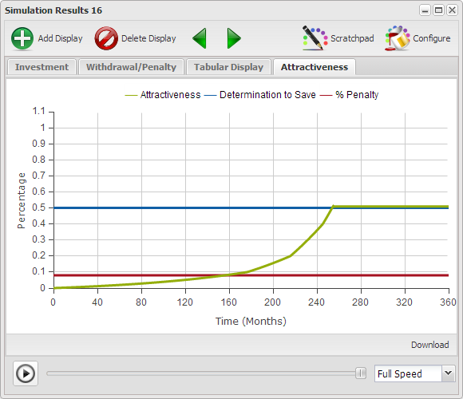
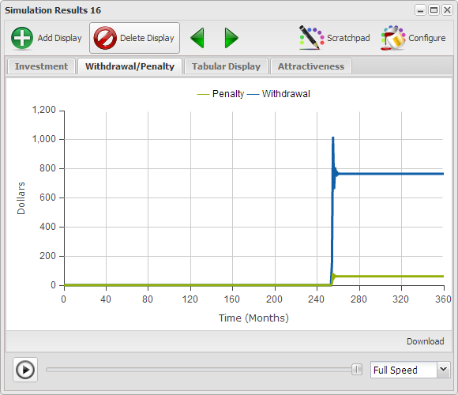

# Building a Model

The difference between \p{Real Events} and \p{Conclusions and Behaviors} result in the creation of an \p{Abstract Version of Real Events}. The abstraction is then used to develop a \p{Model} which promotes a revision to \p{Conclusions and Behaviors}. This cycle continues until the \p{Model} produces a set of \p{Conclusions and Behaviors} which are congruent with \p{Real Events}. At this point there's no longer a need to create an \p{Abstract Version of Real Events}, meaning you have achieved the understanding you were seeking.

## Modeling Guidelines ##

Figure 4 presents a number of guidelines or rules of thumb it would be good for you to keep in mind as you develop models. Some of the following are only relevant to Stock & Flow simulations, and which they are should be quite obvious.

[** Figure 4](http://www.insightmaker.com/insight/1784)

Remember that model development and the understanding that comes with it is an iterative process. It's almost impossible to create all the pieces as they should be the first time around. Look at it as do a little, learn a little, and repeat.

- **Purpose**. Have a sense of what you want the model to accomplish and expect the thought to evolve as you develop the model.
- **Boundary**. A boundary allows you to explicitly define what's part of the model and what's not part of the model. If you're unclear on the purpose of the model and unable to establish a boundary how will you ever know when to stop adding things to the model?
- **Time Units**. Will the interactions in this model be depicted over Years, Months, Days, etc. And you should realize that you initial thought may have to be revised once you begin developing the model.
- **Simulation Length**. How long might the interactions have to be modeled for. Here again the answer may be obvious, or you may have to start with an estimate and revise it after working with the model.
- **Time Step**. Here again you have to estimate a value based on the smallest time of transition you expect in the interactions and then test it to see if you you're close enough.
- **Notes Notes Notes**. As you build your model add notes to the elements so you can refer back to them later to get a sense of what you were thinking when you created them. Yes, you tell yourself you know what you're doing at the moment, though you'll be surprised at what you won't remember a week, a month or even a year from now. Notes also make it much easier for others to understand what you intended when you created elements.
- **Variable Names**. A stock represents a quantity and should be labeled with a directionless noun our noun phrase, you know, a person, place or thing. Avoid directional modifiers such as increasing, decreasing, growing, slowing, etc. as they tend to make a model very difficult to understand. A flow represents something moving over time so it's label should be something one would easily think of as moving over time as walk, speed, flow, etc.
- **Loop Labels**. If you're developing a Causal Loop Diagram or Stock & Flow Diagram be sure to label and sequence your loops so others have a sense in what order to read your story.
- **Goals**. Balancing loops always have goals. Make sure they're explicitly identified.
- **Influences**. Make sure you include all relevant influences and only the relevant influences. Sometimes you include items because you can't figure out if they're relevant or not. That's OK as long as you remember to later take out the ones that aren't relevant. If you leave influenced which aren't relevant they are likely to result in confusion later.

The following items are most likely relevant only for Stock & Flow simulations.

- **Stocks**. Identify which items are the the stocks, or accumulations, in the model that will change over time. Stocks are often easy to identify if you think about stopping time. When time stops a stock still has a quantity. In this case it's the distance from Grandma's house as Red walks toward it.
- **Flows**. Identify the flows which are responsible for changing the stocks over time. If time stops a flow has no value. In this case it's walking.
- **Delay**. Delays can have very unexpected impacts on the behavior of a model. Where there are delays make sure they're explicitly identified.
- **Units**. Units can be very instrumental in assuring model validity. While consistency of units doesn't guarantee model validity if the units are inconsistent you can be sure the model is not valid.
- **Limits**. If there are limits on Stocks, Variables or Flows be sure they are explicitly stated so Insight Maker can inform you if the model generates out of limit value. This will signal you that there is a problem with assumptions or initial values.
- **Reality Check**. Ensure the model is producing results which are consistent with reality. If it is not then it's an opportunity for learning.

The guidelines are far too much to memorize though if you refer to them as a check list over time they will actually become second nature and you'll find yourself checking them as you're adding elements to a model.

## Can Red Get to Grandma's House ##

Here's a simple example of a question that might be answered with a model. And yes, it is quite obvious you could just do the math though would you get any better at building models if you did?

## Setting Units ##

If you click on the stock and look at the configuration panel you'll notice that the last item in the list, \a{Units}, has a value of unitless. Units were not addressed in the first three chapters as they are so important we wanted to ensure we could provide them the focus they deserve. You use units to help ensure that your models are sound. Not that units will guarantee that your model is sound, though if the units don't work out right you can be sure there's a problem, so Insight Maker checks them for you.

Figure 5 shows the Configuration Panel for the stock where Units is assigned a value of miles. For this particular model miles makes sense as we're trying to figure out how long it takes Red to get to Grandma's House and we know it's 4.5 miles away.

If you click on the flow and look at the configuration panel you'll notice that the Units for walk is miles/hour as depicted in Figure 6. A flow represents the movement of something during a time period which is why this is 1/hours.

The flow has a units of hours as that's what will be set up in \u{Time Settings} as the \u{Time Units} for the model. All the time settings are shown in Figure 7.

You might now be asking, how the \p{Walk} in miles/hour gets turned in to \p{Distance to Grandma's} in miles? Because we've selected a \a{Time Step} of 0.5 each simulation step multiplies 0.5 hours x 2 miles/hour to get 1 mile traveled each time step. And the units are consistent. Later you can try changing the \u{Time Units} and running the model to see how that affects the answers. It's not actually this simple though with a constant flow rate this description is close enough.

----------

### Modeling Tip ###

There are a large number of units predefined in Insight Maker. If you click in the Units field and then click on the drop down on the right the \u{Units Selection} window will open as depicted in Figure 8. Here you can select from predefined units, though it's usually easier to just enter the appropriate units into the \a{Units} field. There is  also a way to define Custom Units thought we'll cover this option in a later chapter.

[** Units Selection Window](http://www.insightmaker.com/insight/6767)

----------

# Model

{"title": "Stopping At Grandma's", "description": "We'll begin with the previous model and add an option that tells the model to stop when Red actually gets to Grandma's.", "load": "http://insightmaker.com/insight/6778"}

# End Model

If you look at the \u{Configuration Panel} for \p{Stop at Grandmas} you'll notice that the \a{Units} are unitless. The variable itself doesn't need a definition of units because it's not participating in any calculations. It's just a test.

As for the formula what you should remember is that when you start using units in a model, which you should do, all formulas have to be consistent from a units perspective otherwise Insight Maker will raise an error message. Just as a test change {0 miles} to 0 and run the model. Because [Distance to Grandmas House] has units what it is compared to has to have units.

~ Exercise

In the [Stop at Grandmas] variable change {0 miles} to {0 kilometers}. Does the model still work? Why?

~ Answer

The simulation engine in Insight Maker is smart enough to convert between the myriad of similar dimensions, e.g., miles, kilometers, feet, etc. Though it's recommended that you make conversions explicit otherwise models become very difficult to understand.

Insight Maker doesn't complain because you're still comparing distance to distance and it doesn't matter that they're in different scales simply because zero = zero in any scale. It's really better to keep your units in the same scale.

~ End Exercise

~ Exercise

Seldom is there ever just one right way to build a model. You build the model to help you understand something and you might do that in different ways. Even for a model as simple as Going to Grandma's can be structured in several different ways other than starting with a stock of 2.5 and reducing it by walking. Try to build one or two alternatives to this model.

~ Answer

One alternative would be to start with Distance to Grandmas House = 0 and add to the stock as one walks toward it. This way you're tracking the distance traveled rather than the distance left to travel.

~ End Exercise

Hopefully the Going to Grandma's model has given you a sense of an approach for developing models along with some useful tips and an introduction to using units and why they can be so useful to you. Oh, and don't forget about putting notes in your models. Wiring diagrams without knowing what the pieces mean are generally not very useful.

## Why Aren't We All Rich ##

If one can put money in an investment account and it grows over time, and it grows even faster with regular deposits, why aren't more people rich and ready for retirement? I've started numerous retirement programs through the years though for one reason or another they've all evaporated in time. What is the basis of this sad state of affairs?

The following is intended to be another example of he development of a model, though somewhat more involved than the previous one. Here's the initial question describing what I'd like to understand.

This figure presents the initial set up for this model.

- **Investment Account**. represents the amount of money, in Dollars, in the account. If you look at the Configuration Panel you'll notice that Units are set to Dollars.
- **Initial Deposit**. is a variable used to specify the amount of money that is initially put into the [Investment Account] when it is opened. Remember we said only a flow can increase or decrease a stock, though you can use a external variable to set the initial value for a stock. This is done done to make the [Initial Deposit] explicit with a slider for testing. The Units for [Initial Deposit] is also set to Dollars.
- **Time Setting**. We've assumed that this is an investment account that will compute and add interest on a monthly basis so the time settings are set up to run for 36 months with an initial Time Step = 1 knowing that we will have to test this later on.

----------

### Modeling Tips ###

Before you run a model you should develop a sense of the result you expect from the model at this point in its development. Once you run the model you should be certain that is it performing as expected. When the result is not what you expect then either the structure is wrong, your assumptions are wrong, or you simply have an opportunity to further develop your understanding.

You should never be more than a single concept change away from a running model that produces a result that you understand. You may think this a bit strict though after you add several elements to a model and it doesn't work and you spend hours trying to figure out why you may have a better appreciation for this guideline.

Making all the elements of a model visible makes it much easier for others to understand it. This is why Months per Year and Initial Deposit were created as explicit variables rather than embedding the valued inside other elements.

And what's definitely worth repeating is that providing comments for all the elements of a model will also make it much easier for others to understand. All one need do is mouse over an element and click on the "i" that appears to read the comment.

You have the option of adding notes to the Picture element and there are a number of predefined images  that you can select from the pull down that can be assigned to the element. There are images for balancing and reinforcing loops, both clockwise and counter clockwise. These pictures can be assigned to Variables and Stocks also.

The other option is that you can put a URL in this field for an image somewhere on the web and that image will be displayed and may be resized.

----------

**Penalty** is levied by the Government if the funds are withdrawn before you reach 59 1/2 and is meant to be an encouragement to save. The % Penalty is a variable with a slider defined to you can test the value during runs. The Units for Penalty are Dollars/Month.

**Withdrawal** represents money taken out of the account to purchase things with. As the amount of money in the Investment Account grows it becomes more and more attractive for use to purchase other things and there develops a tug of war between the Attractiveness of the money in the Investment Account and one's Determination to Save. Attractiveness and Determination to Save both represented by percentages between 0 and 100%. Attractiveness is represented with a Converter, a modeling element not previously described.

----------

### Modeling Tip ###

It is often the case that a variable to be used in a model can not be represented as a constant or some well defined formula. The variable is actually a function of Time or some other variable. In the case of this model Attractiveness is a function of Investment Account and is defined as a set of data points.

The next figure shows the Configuration Panel for Attractiveness Principle. Note that many of the configuration options are the same as other modeling elements. The ones that are different are in Configuration and Input/Output Table.

[** Figure 9](http://www.insightmaker.com/insight/6827)

Because the variable is defines as a set of XY coordinates the Data has to be defined point by point as depicted below, or the table may be imported.

[** Figure 10](http://www.insightmaker.com/insight/6827)

Also notice on the Converter Configuration Panel there is an option for Interpolation. This option defines how Insight Maker figures out the Y values in between the defined X points. The graph displayed in Figure 21 depicts the Linear Interpolation meaning that Insight Maker treats the line between two points as a straight line and if computes the Y value from the XY values at the two points on either side of the X value.

Figure 11 shows the curve for the Interpolation option of None meaning that it treats all the Y values between point X1Y1 and X2Y2 as Y1.

[** Figure 11](http://www.insightmaker.com/insight/6827)

----------

The following figures show the various display tabs for a run of this model with a Determination to save of 50%.

[** Figure 12](http://www.insightmaker.com/insight/6827)

When the Investment Account reaches $87,000 dollars after 255 months it is sufficiently attractive to overcome the Determination to Save so money is withdrawn from the account every month and the account no longer grows. Is this a bad thing? That depends on the intent.

[** Figure 13](http://www.insightmaker.com/insight/6827)

Figure 24 just shows that the Attractiveness has reached the Determination to Save level so withdrawals begin happening every month.

[** Figure 14](http://www.insightmaker.com/insight/6827)

The above figure shows that there is almost $800 dollars a month being withdrawn from the account monthly and the account doesn't decrease. Maybe it's accomplishing what it needs to if $800 a month is sufficient to augment other income.

Note the large overshoot on the Withdrawal curve and a small one on the Penalty curve. This is most likely because the Time Step is too large. The next figure is the same display tab for the model run with a Time Step of 0.5. Notice how the curve cleans up.

[** Figure 15](http://www.insightmaker.com/insight/6827)

----------

### Exercise 3-4 ###

There is a logic flaw in this model which you might try to repair. The Penalty is not actually taken from the Investment Account but from the Withdrawal itself so it reduces the amount you actually get from the Withdrawal. Be warned that is might be a tricky fix.

----------

We now have a model which provides some incentives to start and continue to deposit in an Investment Account, and some disincentives toward the withdrawal of funds, though have we really addressed the initial situation posed? Not really. As far as starting the Investment Account and regularly depositing money, there are incentives, and for many these incentives were enough to get them to invest. For many the incentive, for one reason or another, has not been sufficient. And, any more strict incentives would likely be looked on unfavorably. People do not like to be manipulated, even when it is for their own benefit. The penalty for withdrawal is a deterrent in some respects though as the Investment Account continues to grow its attractiveness in terms of what it can purchase continues to entice. The best answer for this situation is to legally tie up the withdrawal process so it's only an option in the case of dire emergencies. Though as much as people find being manipulated by others distasteful, being controlled by themselves is just as distasteful.

Is the model done? As usual, the answer is; "It Depends!" If it has provided sufficient understanding to address the situation posed then it is sufficient. If not then it should be taken further, though once it is sufficient you should STOP!

## Where Have All The Trees Gone? ##

We had a forest reserve of over a million trees and the logging company guaranteed us they would plant a new tree for every one they cut down, yet all of a sudden there are no trees left to harvest. What happened?

# Model

{"title": "Where Have All The Trees Gone", "description": "Investigating the implications of different time horizons.", "load": "http://insightmaker.com/insight/8238"}

DIAGRAM

# End Model

~ Exercise

What have you come to understand about the difference between short term and long term perspectives and how do delays figure into surprises?

~ Answer

While it is difficult to guess at the results of two or more dynamic interactions delays in the structure will make it even worse. In many cases simulations are the only way to develop a meaningful understanding.

~ End Exercise

## Moose and Wolves Revisited ##

In Chapter 1 a model which revealed the dynamic relationship between the population of Moose and Wolves. The model is presented here with an exercise to test your intuition.

# Model

{"title": "Moose and Wolves Revisited", "description": "The populations of Moose and Wolves are dynamically linked.", "load": "http://insightmaker.com/insight/8590"}

# End Model

~ Exercise

What would you expect to happen in the Moose and Wolves model if there were no Moose or no Wolves? Open the model and run it for each situation.

~ Answer

If there are no Moose in time the Wolves will starve to death. If there are no Wolves the Moose will eventually over populate and probably starve to death though that's not shown because the Moose food supply isn't built into the model.

~ End Exercise

## Building a Model Summary ##

- **Intent**. Be sure you have a good idea of what you want the model to help you understand. This may evolve as you develop the model.
- **Time Frame**. Ensure you have a sense of the time frame over which you intend to simulation the model. As you build the mode you may find you need to adjust your initial thought on this.
- **Stocks & Flows**. Identify the Stocks & Flows first as they are key elements of the model.
- **Use Units**. Units help to ensure your model is sound and Insight Maker will test for consistency of units. If the units are consistent it doesn't guarantee the model is sound though it does add a level of confidence.
- **Variables & Links**. Add Variables & Links to influence the flows.
- **Test Often**. Each time you make a logical addition to the model think about how you expect the model to behave then run the model and see if there is agreement with your expectation. If it isn't then it's an opportunity to learn and improve the model. And if it does agree you should still consider the output. It may be that your expectation and the model are both wrong.
- **Time Step**. Test the Time Step to ensure it's small enough to capture all relevant transitions in the model.
- **Stop at the End**. When the model serves the purpose for which you are developing it, STOP! There is always more you can add to a model. You should only include what is relevant to satisfy the initial intent.

## References ##

- Catalina Foothills School District. 2003. Tips for Using System Dynamics Tools. [http://www.clexchange.org/ftp/documents/Implementation/IM2003-12TipsUsingSDTools.pdf](http://www.clexchange.org/ftp/documents/Implementation/IM2003-12TipsUsingSDTools.pdf)
- Ford, Andrew. 2009. Modeling the Environment. [http://www.amazon.com/Modeling-Environment-Second-Andrew-Ford/dp/1597264733/](http://www.amazon.com/Modeling-Environment-Second-Andrew-Ford/dp/1597264733/)
- Keeting, Elizabeth K. Internet 2013. Everything You Ever Wanted to Know about How to Develop A System Dynamics Model, But Were Afraid to Ask. [http://www.systemdynamics.org/conferences/1998/PROCEED/00024.PDF](http://www.systemdynamics.org/conferences/1998/PROCEED/00024.PDF)
- Newell, Barry & Proust, Katrina. 2012. Introduction to Collaborative Conceptual Modelling. [https://digitalcollections.anu.edu.au/bitstream/1885/9386/3/Newell_IntroductionCollaborative_2012.pdf](https://digitalcollections.anu.edu.au/bitstream/1885/9386/3/Newell_IntroductionCollaborative_2012.pdf)
- Whiftield, Caraig. 2012. What Returns Should We Expect from the Stock Market. [http://www.whitfieldco.com/blog/?p=39](http://www.whitfieldco.com/blog/?p=39)
