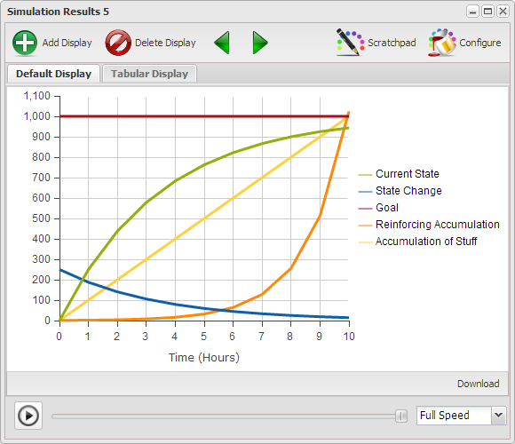

# Recurring Structures

Chapter 1 presented Bertalanffy's premise that that the same basic structures operated across all disciplines, and if one learned how these structures operated one could transfer much of their learning from one discipline to another. In the previous chapters there has been a focus on three basic structures in support of Bertalanffy's premise. In this chapter will will build on those three basic structures in such a way as to demonstrate that there exists a set of more complex structures composed of combinations of the basic three which also repeatedly occur across all disciplines of science.

## Basic Structures ##

The three basic structures are depicted in Figure 1 along with their characteristics behavior curves in Figure 2.

[** Figure 1](http://insightmaker.com/insight/5138)

[** Figure 2](http://insightmaker.com/insight/5138)

In the Chapter 1 and Chapter 2 we covered these three basic structures in some detail and it was claimed that all the models you will ever create will simply be a combination of some number of these basic structures. We don't expect that you take this on faith, and while we can't prove it, though in this chapter we will provide you an opportunity to experience some of the more common structures which repeatedly occur across all disciplines of science.

## Typical Evolving Relationships ##

When you undertake something it is either to fix a problem, represented by the Balancing/Goal Seeking structure, or promote growth represented by the Reinforcing/Exponential growth structure. Seldom will you encounter either of these structures in their elementary form. Typically there are multiple structures interacting and even if you create an elementary structure is it likely to readily evolve into a more complex form. Figure 3 depicts the manner in which the Balancing/Goal Seeking and Reinforcing/Exponential Growth structures tend to found as part of, or evolve into, more complex structures. And each structure has a characteristics pattern of behavior, which in conjunction with its structure, help to identify the recurring structure.

[** Figure 3](http://insightmaker.com/insight/538)

## Summary ##

The chapter should explicitly depict the relationships between the structures presented in the previous sections and explain the natural evolution paths for the structures.

## References ##

- Bellinger, Gene. 2013. Systems Archetypes. [http://www.systemswiki.org/index.php?title=Systems_Archetypes](http://www.systemswiki.org/index.php?title=Systems_Archetypes)
- Braun, Bill. 2002. The Systems Archetypes. [http://wwwu.uni-klu.ac.at/gossimit/pap/sd/wb_sysarch.pdf](http://wwwu.uni-klu.ac.at/gossimit/pap/sd/wb_sysarch.pdf)
