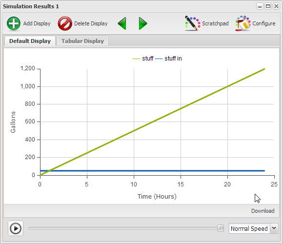

# Tools for Understanding

# Model

{"title": "Valid Stock & Variable Connections", "description": "The following sequence presents, and explains, the valid connections for elements of a simulation model."}

{"geometry":{"x":230,"y":230,"width":100,"height":40},"name":"Stock 1","create":"Stock"}

A [Stock] represents a quantity of something that will increase or decrease during the simulation.

{"geometry":{"x":0,"y":0,"width":100,"height":100,"sourcePoint":{"x":50,"y":250},"targetPoint":{"x":0,"y":100}},"alpha":null,"omega":"Stock 1","name":"Flow 1","create":"Flow"}

A [Stock] can only change via a [Flow]. To create an inflow first create an outflow and then select [Reverse] to change the direction of the flow. This is just a quirk of the environment. A flow that doesn't have a specific origin simply means we're not concerned with where the flow comes from. When you fill the bathtub do you think about where the water comes from?

{"geometry":{"x":500,"y":230,"width":100,"height":40},"name":"Stock 2","create":"Stock"}

{"geometry":{"x":0,"y":0,"width":100,"height":100},"alpha":"Stock 1","omega":"Stock 2","name":"Flow 2","create":"Flow"}

A [Flow] can move stuff from one [Stock] to another. [Stock 1] decreases by the same amount that [Stock 2] increases. Flows need to be conserved because you can't create something form nothing in a model.

{"geometry":{"x":0,"y":0,"width":100,"height":100,"targetPoint":{"x":760,"y":250}},"alpha":"Stock 2","omega":null,"name":"Flow 3","create":"Flow"}

A [Flow] that doesn't have a specific destination simply means we're not concerned with where the [Flow] goes.

DIAGRAM

The diagram presents the valid [Flow] connections which can only be to, from, or between [Stocks]

{"geometry":{"x":0,"y":0,"width":100,"height":100,"points":[{"x":240,"y":190},{"x":200,"y":180},{"x":150,"y":200}]},"alpha":"Stock 1","omega":"Flow 1","create":"Link"}

You can connect a [Stock] to a [Flow] with a [Link] to indicate that somehow the [Flow] depends on the value of the [Stock]. The [Link] does not change the value of the [Stock].

If you select a link then hold the *shift key* while you click on the link you create \u{handles} that you can move separately to create a segmented curve.

{"geometry":{"x":280,"y":370,"width":120,"height":50},"name":"Variable 1","create":"Variable"}

{"geometry":{"x":0,"y":0,"width":100,"height":100},"alpha":"Variable 1","omega":"Flow 2","create":"Link"}

A [Link] can be used to have a [Variable] influence a [Flow] and the [Link] does not change the value of the [Variable].

{"geometry":{"x":500,"y":100,"width":120,"height":50},"name":"Variable 2","create":"Variable"}

{"geometry":{"x":0,"y":0,"width":100,"height":100},"alpha":"Stock 1","omega":"Variable 2","create":"Link"}

{"geometry":{"x":0,"y":0,"width":100,"height":100},"alpha":"Flow 3","omega":"Variable 2","create":"Link"}

You can use a [Link] from a [Stock] or a [Flow] to influence a [Variable]. The [Link] does not change the value of the [Stock] or the [Flow].

{"geometry":{"x":580,"y":370,"width":120,"height":50},"name":"Initial Value","create":"Variable"}

{"geometry":{"x":0,"y":0,"width":100,"height":100},"alpha":"Initial Value","omega":"Stock 2","create":"Link"}

You can use a [Link] from a [Variable] to a [Stock] to assign an initial value to the [Stock] when the simulation starts. The [Link] does not change the value of the [Variable].

{"geometry":{"x":0,"y":0,"width":100,"height":100},"alpha":"Initial Value","omega":"Variable 1","create":"Link"}

You can use a [Link] from a [Variable] to influence another [Variable]. The [Link] does not change the value of the source [Variable].

DIAGRAM

You have now completed a model that represents the valid connections for a simulation model.

# End Model

[** Valid Primitive Connections](http://insightmaker.com/insight/5275)

### User Interface ###

It is in this segment of the configuration panel that you define a slider for an element, if there is to be one. You can define a sliders for Stocks, Flows or Variables and use them to establish their value at the start of the simulation. Once you indicate there is to be a slider you then define the maximum and minimum values it may have, as well as the step size, how small are the variations allowed. If you leave the step size field blank then the slider can vary continuously.

An element may have a slider or a formula though not both. Sliders override equations. If you enter an equation and it disappears check to see if there was a slider defined and it hasn't been turned off.

### Validation ###

This section allows you to indicate if there are Maximum and/or Minimum constraints on a Stock, Flow or Variable.

Additionally it is in this section that you assign the Units for an Stock, Flow, and Variable. Units are very useful in helping to ensure the soundness of a model. Units will be covered extensively in Chapter 4.

#### Time Settings ####

Time Settings as depicted in Figure 9 are used to indicate when the simulation starts, how long it runs, and the time step it increments during the simulation. Just how to determine the step size will be addressed shortly.

[** Figure 9](http://insightmaker.com/insight/4990)

#### Simulation Results ####

When you click the \u{Run} button the model is stepped through the defined time period and produces a display of the results as depicted in Figure 10. There are various options for the type of display and which elements are displayed as shown in Figure 11.

[** Figure 10](http://insightmaker.com/insight/4990)

#### Configure Simulation Results ####

A default configuration is put together when the model is constructed on the canvas. If you click the \u{Configure} button in the upper right corner of the \{Simulation Results} window the \u{Chart/Table Configuration} window as depicted in Figure 11 will open. It is in this window you indicate what type of display you want and which items of the model are to be displayed. The only part you need to be concerned about at the moment is the Y-Axis Label field. This where it was indicated that the items displayed were in Gallons. You will need to change this shortly in the next exercise.

Note that if you change items in the configuration they will be immediately reflected in the \u{Simulation Results} window when you click \u{Apply}. You don't need to run the model again to see a different configuration of the data. This makes it very convenient when when you decide you need another display for some items of the model.

[** Figure 11. Chart/Table Configuration](http://insightmaker.com/insight/4990)

Hopefully you haven't found this short introduction to the modeling environment too overwhelming. Different parts of the environment will be presented just as you need them to interact with the models presented. 

Too much explaining and not enough hands on interaction may get real boring in a hurry. As such you are encouraged to actually do the exercises. By interacting with the various aspects of the modeling environment you will develop a level of comfort and expertise which will serve you well throughout the rest of the book.

## Common Property # 1 ##

To this point you've learned how to develop a static picture of a model. It is actually a model and provides a sense of the relationships between the various elements. What it doesn't give you a sense of is the dynamic nature of these over time. What are the implications of the relationships? In the next few sections you'll learn how to bring your model to life.

Look at the images in Figure 12 and ask yourself what these images have in common. The images all represent very different kinds of things, some living, some not, though there is a characteristic they all have in common. Have you figured it out?

[** Figure 12](http://www.insightmaker.com/insight/4548)

Maybe you notice the rabbits from the previous chapter? All the images represent things that grow over time in one way or another, and some faster than others.

## Reinforcing Growth Structure ##

A reinforcing growth structure is one where growth produces a result which promotes even more growth.
 
# Model

{"title": "Reinforcing Growth Model", "description": "We're going to create a generic exponential growth structure for study and reuse."}

{"geometry":{"x":230,"y":110,"width":100,"height":40},"name":"stuff","create":"Stock"}

{"geometry":{"x":0,"y":0,"width":100,"height":100,"sourcePoint":{"x":520,"y":130},"targetPoint":{"x":0,"y":100}},"alpha":null,"omega":"stuff","name":"Flow","create":"Flow"}

First we build the linear accumulator model.

{"geometry":{"x":-1.4285714285714448,"y":0,"width":100,"height":100,"sourcePoint":{"x":-1.4285714285714448,"y":100},"targetPoint":{"x":98.57142857142856,"y":0},"points":[{"x":320,"y":70},{"x":360,"y":60},{"x":390,"y":70}]},"alpha":"stuff","omega":"Flow","create":"Link"}

Then we add the reinforcing feedback loop.

{"attribute":"InitialValue","target":"stuff","value":"1"}

{"attribute":"FlowRate","target":"Flow","value":"[stuff]"}

{"attribute":"TimeLength","value":"10"}

{"attribute":"TimeStep","value":"1"}

DIAGRAM

RESULTS

The graph shows the value of [stuff] after 10 Years is 1,024 which you should realize is just 2^10 as expected because we started with a value of 1 and doubled it every year. This curve is referred to as an exponential growth curve.

# End Model

[** Model](http://insightmaker.com/insight/5351)

~ Exercise

Notice that the curve in the previous model is a bit choppy where it turns up. Run the model with a Time Step of .5, .25, .125, .0625 and compare the results. What questions are raised by the the results?

~ End Exercise

### Time Units and Time Step Selection ###

The \u{Time Units} and \u{Time Step} selected for a model should be consistent with the time frame and level of detail of the model. You probably wouldn't develop a model about filling a bathtub with water and use \u{Time Units} of months. Minutes are probably more appropriate for this model. The \u{Time Step} is then selected to ensure none of the relevant transitions associated with the dynamic nature of the model are missed. A \u{Time Step} of .25, meaning 15 seconds for a model with \u{Time Units} in minutes, is probably sufficiently small to ensure there are no transitions missed.

Trial is actually the most appropriate approach to determine if you have an appropriate value for \u{Time Step}. If you think .5 is appropriate then run the model with 1, .5, and .25 and if the results for 1 and .25 don't differ from .5 then you're probably OK. If .25 produced a different result then compare the .25 result with the .125 result. Once you get two runs where the values don't change then use the larger value.

~ Exercise

Given this guidance how would you interpret the results you experienced in the previous exercise?

~ Answer

You haven't been given enough information about what's being modeled to determine what might be the appropriate \u{Time Units} or \u{Time Step}.

### References ###

- [How does DT work? from isee Systems](http://www.iseesystems.com/Helpv9/Content/DT/How_does_DT_work_.htm)
- [DT Situations Requiring Special Care from isee Systems](http://www.iseesystems.com/Helpv9/Content/DT/DT_Special_Care.htm)

~ Exercise

Consider the images in Figure 12 and think about what \u{Time Units} and \u{Time Step} you would use in a model representing the growth in each of these areas.

~ End Exercise

One aspect of trying to model the contexts of Figure 12 that should have become apparent is that there is a piece of the model that's missing. 

# Model

{"title": "Feedback Dependent Growth with Control", "description": "We're now going to add a factor to the previous model so you can control the extent to which the stock influences the flow."}

{"load": "http://insightmaker.com/insight/5887"}

DIAGRAM

{"geometry":{"x":450,"y":190,"width":120,"height":50},"name":"factor","create":"Variable"}

{"geometry":{"x":0,"y":0,"width":100,"height":100},"alpha":"factor","omega":"Flow","create":"Link"}

We begin with the previous model and we add a factor to control the flow.

{"attribute":"FlowRate","target":"Flow","value":"[stuff]*[factor]"}

{"attribute":"ShowSlider","target":"factor","value":"true"}

{"attribute":"SliderMax","target":"factor","value":"1"}

{"attribute":"SliderStep","target":"factor","value":"0.1"}

{"attribute":"Equation","target":"factor","value":"1"}

And we'll add a slider to the [factor] to make it easy to adjust its values.

DIAGRAM

With this version of the model you can vary the values of [factor] to get a sense of the impact the [factor] has on the growth of [stuff]].

RESULTS

# End Model

~ Exercise

Using the Feedback Dependent Growth model to implement the models does this structure allow you to construct more realistic representations of the growth situations presented in Figure 12? Why?

~ Answer

While each of the situations in Figure 12 represents growth dependent on the current value of the situation each one has a different growth factor.

~ End Exercise

~ Exercise

Imagine that the feedback dependent growth model is actually a Savings Account that is defined as compounding annually, i.e. calculating and adding interest once a year. This means that the most appropriate \u{Time Units} would be years with a \u{Time Step} of 1. There are no other transitions in this model that need to be accommodated. If you run this model with any \u{Time Step} other than 1 it will result in a less accurate result. Why does this happen?

~ Answer

Other values for \u{Time Step} produce less correct answers because 1 is the value most appropriately representing what the model was created to model.

~ End Exercise

This model just developed is the standard reinforcing growth model depicted at the beginning of this chapter. In the process of arriving at this model the linear growth was developed first, and then evolved. Hopefully through the exercises to this point you have gained a deeper understanding of how this structure works and the extent to which it may be applied to various situations.

## Common Property # 2 ##

Look at the activities depicted by the images in Figure 13 and ask yourself what it is that these activities have in common. The images represent very different kinds of activities though there is a characteristics they all have in common. Have you figured it out?

[** Figure 13](http://www.insightmaker.com/insight/6120)

Each activity depicted in Figure 13 represents the pursuit of some goal or objective. Admittedly the goals are very different and each is pursued in a very different manner.

## Constructing a Balancing/Goal Seeking Structure ##

A Balancing/Goal Seeking structure is one where there is a difference between two values and the activity of relationships works to develop a balance between the two values. Essentially what the structure does is move the \p{Current} value to the value of the \p{Goal}.
[** This model was fixed 13.07.25
# Model

{"title": "Balancing/Goal Seeking Model", "description": "As we have done repeatedly to this point we begin with a linear model consisting of a flow and a stock, along with a flow rate variable. To this we simply have to add a goal and the appropriate feedback and we end up with a goal seeking model."}

{"geometry":{"x":480,"y":160,"width":100,"height":40},"name":"Current","create":"Stock"}

{"geometry":{"x":0,"y":0,"width":100,"height":100,"sourcePoint":{"x":280,"y":180},"targetPoint":{"x":0,"y":100}},"alpha":null,"omega":"Current","name":"Flow","create":"Flow"}

{"geometry":{"x":260,"y":260,"width":120,"height":50},"name":"factor","create":"Variable"}

{"geometry":{"x":0,"y":0,"width":100,"height":100},"alpha":"factor","omega":"Flow","create":"Link"}

First we build the linear accumulator model with a control factor.

DIAGRAM

{"geometry":{"x":270,"y":20,"width":120,"height":50},"name":"Goal","create":"Variable"}

{"geometry":{"x":450,"y":60,"width":120,"height":50},"name":"Gap","create":"Variable"}

{"geometry":{"x":0,"y":0,"width":100,"height":100},"alpha":"Goal","omega":"Gap","create":"Link"}

{"geometry":{"x":0,"y":0,"width":100,"height":100},"alpha":"Current","omega":"Gap","create":"Link"}

{"geometry":{"x":0,"y":0,"width":100,"height":100},"alpha":"Gap","omega":"Flow","create":"Link"}

Now we add a goal and compare the goal to the current value.

DIAGRAM

When you look at the model admittedly we added [Gap] which we haven't addressed before. This was done so we could explicitly plot the difference between the value of [Current] and [Goal].

{"attribute":"InitialValue","target":"Current","value":"0"}

{"attribute":"Equation","target":"Goal","value":"1"}

{"attribute":"Equation","target":"Gap","value":"[Goal]-[Current]"}

{"attribute":"Equation","target":"Flow","value":"[Gap]*[factor]"}

Create the slider to adjust the [factor] value and set it to 0.5.

{"attribute":"ShowSlider","target":"factor","value":"true"}

{"attribute":"SliderMax","target":"factor","value":"1"}

{"attribute":"SliderStep","target":"factor","value":"0.1"}

{"attribute":"Equation","target":"factor","value":"0.5"}

{"attribute":"TimeLength","value":"10"}

{"attribute":"TimeStep","value":"0.5"}

{"attribute":"TimeUnits","value":"Hours"}

RESULTS

Take a look at the Time Settings for the model and you'll see that the model was set up to run from 0 to 10 with a [Time Step] of 0.5 and a [Units] of hours. These were just selected to create a generic model where you could consider the Goal to be 100% and the other values as having values between 0 and 100%. This way we can consider the implications of the interactions without getting hung up on the actual values.

The graph shows that as [Current] moves toward the [Goal] the [Gap] decreases as does [Change] which is moving [Current] in the direction of [Goal]. Once [Current] reaches [Goal] the [Gap] is zero is [Change]. This structure endeavors to remove the tension between [Current] and [Goal], the [Gap], to bring a balance to the situation.

# End Model

[** Balancing/Goal Seeking](http://insightmaker.com/insight/6168)

~ Exercise

Run the above model with various values for factor. What do you notice about the relation between \p{Current} and \p{Gap}? And what do you notice about the curves as the factor gets larger and larger?

~ End Exercise

Under Time Units and Step Selection we talked about it being essential that the the \u{Time Units} were selected appropriate to what was being modeled. In this case since it's a generic model one Time Unit is pretty much as appropriate as any other. The Time Step is another matter though, or is it? We said one chooses a Time Step such that none of the relevant interactions are missed and the change from one Time Step to another doesn't change the result.

~ Exercise

Set up the previous model to run with Current = 0, Goal = 1, and factor = .75. Now run the model with a Time Step of 1, .5. 25. .125. Does the result actually change? Look at the Tabular Display associated with the Simulation Result. As you make the Time Step smaller and smaller are the results more correct?

~ End Exercise

Considering that we don't know anything about a real environment being modeled it's a bit difficult to determine if the result is actually more correct as the Time Step used is smaller and smaller.

You might have also realized by this point that it would be quite difficult if we attempted to use this model to model any of the situations depicted in Figure 13. While progress toward the goal in the situations depicted is promoted by the Gap between the Goal and Current the change in those situations isn't likely to be proportional to that Gap.

## Work Completion Model ##

The following model presents a modification to the previous model where the factor has been replaced by a constraint. It looks like there have been lots of changes though they all cosmetic except the way Workers influence work on a daily basis.

# Model

{"title": "Work Completion Model", "description": "In this model [Workers] is not a factor but a limit on the amount of [work] that can be performed in a time period."}

{"load": "http://insightmaker.com/insight/6171"}

DIAGRAM

Settings for the model are: Project Days Work = 60, Workers = 8 and Days Work Completed set at the default of zero and Time Step = 1.

RESULTS

The reason the graph looks like this is because of the constraint placed on the the work by the number of Workers available. This is accomplished by the formula embedded in the flow.

*[Work] = IfThenElse([Work Remaining] > [Workers],[Workers],[Work Remaining])*

This says that if there is more [Work Remaining] than there are [Workers] available to do the work then the amount of work that day equals the number of [Workers]. This goes on for the first 7 days then on the 8th day there are only four days work required to finish the project which is represented by the different slope on the line on the 8th day. You can see this in detail if you look at the Tabular Display.

# End Model

Note that in this model you might have considered the \p{Workers} as a \p{Stock} as they are actually a collection. The reason they're not considered as a \p{Stock} in this model is that the number remains constant in the context of this particular model. In a different model \p{Workers} might actually be a \p{Stock} with an inflow and and outflow.

~ Exercise

Set up the above model to run with Time Step of 0.5. Compare the results of this run with the results of the previous run above. By making the time step smaller have we improved the accuracy of result? Why?

~ End Exercise

Again the appropriate Time Step is one that captures the activity occurring within the model. In this case the Workers are in integers and Project Work in days, both of which are in integers, and with the Time Units in days the appropriate Time Step is 1. If there were events which happened in the model on the order of hours then you would have to decide whether to alter the model to run in hours or reduce the Time Step to ensure it was small enough so no interactions in the model were missed.

~ Exercise

Use the previous model and reconfigure it for a couple of the activities depicted in Figure 13. Note that for this exercise you will have to relabel the stock, flow, and variables accordingly. You will also have to decide on the most appropriate Time Units and Time Step to use.

~ End Exercise

## Summary ##

Hopefully this chapter has helped you become more familiar with the modeling environment and the four model elements you will use most often.

- **Stock**. An accumulation of something that can only be changed by something flowing into or out of it.
- **Flow**. Something moving over time which adds to a stock or subtracts from a stock.
- **Variable**. Constant or equation computed each time the simulation steps.
- **Link**. Used to communicate a value from a Stock, Flow, or Variable, to a Stock, Flow or Variable. The source is not changed and a link to a stock can only be used to set it's initial value.

Because of the nature of the building blocks themselves there are only a small number of valid connections as depicted in valid connections model.

These valid connections are used to create only three different types of structures, linear growth, goal seeking and reinforcing growth. If you are comfortable with these you should be relieved to know that's all there are. Just three simple structures will be used for all the models you will ever build. Of course at times there may be quite a few of these connected together though you should be confident that you know about the pieces.

The models that you have experienced in Chapter 1 and Chapter 2 are referred to as Stock & Flow Simulation Models. They are also referred to as quantitative models because of the values associated with the simulation of these models. In the next chapter we'll investigate a number qualitative models which are also used in developing understanding. These are referred to as qualitative models because there are no numerical values associated with them, though there are times when they can be quite useful.