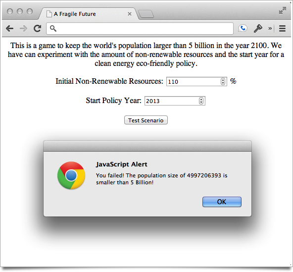
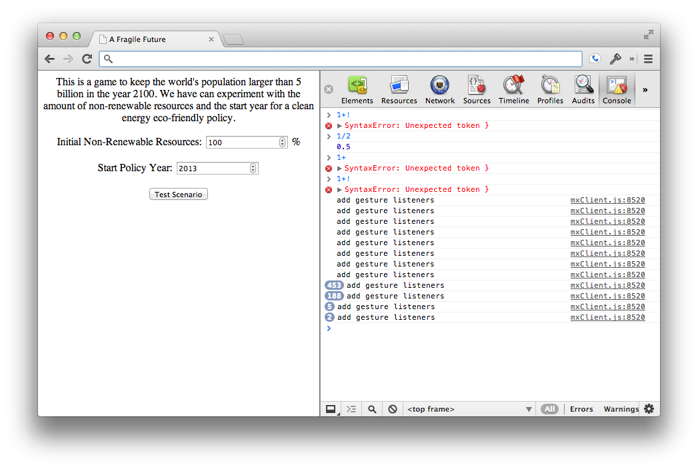

# Going Global

A key goal of systems thinking and modeling is engaging people to cause positive action and change. The growth of the Internet has created amazing opportunities to connect with people in ways that have never before been possible.

The Internet also makes it easy to share models with other people. You can email a specific person the tables and graphs of a model's results, or build webpages and publish these results to share with the world. What is more, these results do not have to be limited to static data. Using Insight Maker, you can include an interactive version of your model, allowing others to experiment with it directly on your webpage. This can be done on any page you have rights to edit, including your personal website, a blog, and a company's information page.

Furthermore, the information flow doesn't have to be one-way from you to others. You can include a feedback or comment form in a webpage to allow people to share their thoughts on the model - right next to the model itself. These comments can be saved directly on the page, allowing other people to read them and enabling a discussion to form around the model. This creates many avenues for collaboration and learning that would simply be impossible without the Internet.

In this chapter, we will show you how to develop webpages to showcase your insights and models to the world. We'll also show how to include tools to engage viewers and start a dialogue about your models. Before jumping into the models themselves, we will lay the groundwork by introducing the basic principles of web development. Once we have introduced these key principles, we'll walk through two examples of developing interactive models.

## The Web in a Nutshell

The World Wide Web is based on a collection of many different technologies that work together. When developing a webpage you need to be familiar with three major technologies: HTML, CSS, and JavaScript. Each of these technologies or languages plays a different role in webpage development.

Technology | Commonly Called | Usage
--|--|--
Hypertext Markup Language | HTML | Webpage Structure
Cascading Style Sheets | CSS | Webpage Style
ECMAScript | JavaScript | Webpage Interactivity

The web is interesting in that each of these technologies is based on old-fashioned, simple text files. You write HTML text files, you write CSS files, and you write JavaScript files. ^[Please note that when you write CSS and JavaScript, your text is case-sensitive. This means that “ABC”, “abc”, and “Abc” will all be understood differently. HTML, on the other hand, is case-insensitive. In HTML, “ABC”, “abc”, and “Abc” will all be understood to mean the same thing.] You do not need any fancy tools to create these files. Any simple text editor will do. A web browser converts the simple instructions and code in these files to the rich interactive webpages you see when you browse the Internet.

Many books and sources on web development recommend that you use some kind of interactive web site builder (like Adobe Dreamweaver <http://www.adobe.com/products/dreamweaver.html>). That is certainly a great way to get up and running, but ultimately you will find the approach very limiting. To truly harness the different tools offered by the Internet, you will need a basic understanding of the underlying technologies and be able to work with them directly. So, rather than using a website builder as a crutch, we recommend jumping right into learning HTML, CSS, and JavaScript.

In the following sections we'll briefly introduce you to each of these fundamental web technologies. This introduction will be rapid, so please do not worry if you do not fully understand everything. Just do your best to engage with this material, as it will provide you with everything you need to know to get the most out of our later examples of interactive modeling webpages.

### HTML Basics

HTML defines the structure of a webpage or document. An HTML document is a set of *tags*. Each tag is enclosed in triangular brackets. For instance, the tag called "\<hr>" will create a horizontal division line in your document ("hr" is an abbreviation of "horizontal rule").

Many types of tags will consist of an opening and closing tag paired together. A closing tag is written the same way as an opening tag except there is a also backslash immediately after the first triangular bracket. For instance, you could use a pair of "\<b>...\</b>" tags to make some text bold:
 
````html
This is some text. <b>This text is bold.</b> This text is not bold.
````

Some tags may also have "attributes" which modify the behavior of the tag. Attributes are included within the opening brackets of the tag after the tag name. For instance, the "\<a>" tag is used to make links between webpages. The "<a>" tag has an attribute "href", which is the URL to which the link should connect.^[The tag name "a" comes from "anchor" and "href" is an abbreviation of "hyperlink reference". Many of the conventions with web development may seem strange, so you should understand the long history of these technologies and the resulting historical baggage that comes with them.] The following HTML creates a link to Google:

````html
If you ever need to search something, just go
to <a href="http://Google.com">Google.</a>.
````

Every HTML page contains some general boilerplate that structures the document. This boilerplate will look almost identical from webpage to webpage. The boilerplate contains several unique tags that split the document into two sections. The "head" section stores the page title and page keywords for search engines, and the "body" section contains the page content (what the user sees). You will spend most of your time editing the body section. The standard template for a webpage is as follows: 

````html
<html>
<head>
	<title>A Sample webpage</title>
</head>
<body>
	Document contents goes here...
</body>
</html>
````

There are dozens of different tags you can use to structure your document. We can't cover them all here, but the following table summarizes a few of the most useful ones:

Tag | Usage | Example
--|--|--
a|Creates a link|\<a href="http://google.com">Google\</a>.
b|Makes text bold|This text is \<b>bold\</b>.
i|Makes text italic|This text is \<i>italic\</i>.
u|Makes text underlined|This text is \<u>underlined\</u>.
center|Centers a paragraph|\<center>In the middle.\</center>
p|Creates a paragraph of text|\<p>This is a paragraph.\</p>
hr|Creates a dividing line|Something \<hr> Something Else
h1|Creates a heading|\<h1>This is a Heading\</h1>
img|Embeds an image|\

We can combine these tags to form more complex documents. The following is an example of a full-featured webpage. 


````html
<html>
<head>
	<title>A Sample webpage</title>
</head>
<body>
	<h1>Introduction</h1>
		<p>Here is some information about my page.</p>
	<h1>The Content</h1>
		<p>Here we have the meat of the page.</p>
	<hr>
	<h2>For Further Information</h2>
		<p>Here we have links to other sites about this content:<p>
		<p>We could check out <a href="http://BeyondConnectingTheDots.com">
			this book's site</a> for instance.</p>
</body>
</html>
````

Open whatever word processor you use on your computer and save this to *MyPage.html* as a plain text file or a Rich Text Format document (.rtf extension). ^[Webpages are always stored as plain text. This differs from, for instance, a Microsoft Word document (".doc" or ".docx" extension.) Save your document as a plain text document with the extension ".html" or ".htm". You can use any text editor you want, but an editor designed for writing webpages will have helpful features such as coloring your tags differently from the standard text as you edit the webpage. We recommend Sublime Text (<http://www.sublimetext.com/>) as a high quality editor for serious work.]. You can then open this file in your web browser (Internet Explore, Firefox, Chrome, Safari, etc.). Experiment by adding some more paragraphs and formatting to see how the document changes.

For more information and tutorials on HTML, we recommend the Mozilla Developer Network’s guides (<https://developer.mozilla.org/en-US/docs/Web/HTML>).

~ Exercise

Replicate the following formatting in an HTML document:

This **text is *italic* and bold.**

~ Answer

````html
This <b>text is <i>italic</i> and bold.</b>
````

~ End Exercise

~ Exercise

Research HTML on-line. Learn how to make a list of items. Create both an ordered and unordered list of the top three countries you wish to visit.

~ Answer

Ordered list:

````html
<ol>
	<li>Croatia</li>
	<li>Greece</li>
	<li>Peru</li>
</ol>
````

Unordered list:

````html
<ul>
	<li>Croatia</li>
	<li>Greece</li>
	<li>Peru</li>
</ul>
````

~ End Exercise

~ Exercise

Create an HTML document containing your resume. Use heading tags to separate sections. Include a picture of yourself in the document.

~ End Exercise

### CSS Basics

Where HTML is used to define the structure of a document, CSS is responsible for styling this structure. In addition to the general layout, this styling includes aspects like font and color choices. A CSS document is a list of rules where each rule has two parts: a selector that tells the browser to what elements of the page the rule applies, and a set of styles that tells the browser how to style those elements. For example, take the following CSS code.

````css
p {
	margin: 20px;
}

h1, h2 {
	font-size: 72px;
	color: red;
}
````

This code has two rules. In the first rule the selector is "p", meaning the rule will apply to all "\<p>" tags in the document. The styling for this rule says to apply a 20-pixel margin around each of these paragraph tags. The second rule has the selector "h1, h2". This means apply the rule to both "\<h1>" and "\<h2>" tags and to set the contents of those tags to have an extra large font and to be colored red.

You can set numerous aspects of an element's style with CSS. For a full and detailed reference we recommend the Mozilla Developer Network's coverage of CSS (<https://developer.mozilla.org/en-US/docs/Web/CSS/Reference>).

CSS for a webpage can be placed in a standalone file referenced by the webpage, or it can be included directly within the webpage. Both these can be accomplished by placing CSS rules within a special tag in the *head* section of the document. For example, taking the *head* section from our earlier document, we could either embed the CSS directly:

````html
<head>
	<title>A Sample webpage</title>
	<style>
		p {
			margin: 20px;
		}
		h1, h2 {
			font-size: 72px;
			color: red;
		}
	</style>
</head>
````

Alternatively we could save the CSS to an external text file (such as *MyStyles.css*) and link to it in the *head* of our document:

````html
<head>
	<title>A Sample webpage</title>
	<link rel="stylesheet" type="text/css" href="MyStyles.css">
</head>
````

~ Exercise

Create a CSS rule to make \<u> tags set their text color to green and add underlining.

~ Answer

````css
u {
	color: green;
}
````

~ End Exercise

~ Exercise

Read up about CSS online and create a tag that creates a red box round every link on the web page.

~ Answer

````css
a {
	border: solid 2px red;
}
````

~ End Exercise

### JavaScript Basics

JavaScript provides interactivity for webpages.^[The name “JavaScript” is a source of perpetual confusion. What we know colloquially as JavaScript is officially called ECMAScript. Due to trademark issues, Microsoft refers to it as JScript when you are using Internet Explorer. It is important to note that *JavaScript* and *Java* are different technologies. They share part of a name due to historic branding purposes but they are completely different languages.] JavaScript is a powerful programming language that you can use to respond to user actions, run calculations, or modify a webpage. An example of using JavaScript code to calculate a Fibonacci number follows. ^[Where the first two Fibonacci numbers are 1 and the Fibonacci numbers thereafter are the sum of the two preceding numbers. The Fibonacci sequence begins: 1, 1, 2, 3, 5, 8, 13, 21, 44...]

````javascript
function fib(n){
	if(n==1 || n==0){
		return 1;
	}
	return fib(n-1) + fib(n-2);
}

alert("The tenth Fibonacci number is: "+fib(10));
````

Like CSS, there are two ways to embed JavaScript into an HTML document. The first is to include the JavaScript directly in the document like we did for the CSS:

````html
<head>
	<title>A Sample webpage</title>
	<script>
		function fib(n){
			if(n==1 || n==0){
				return 1;
			}
			return fib(n-1) + fib(n-2);
		}

		alert("The tenth Fibonacci number is: "+fib(10));
	</script>
</head>
````

The second method is to save the JavaScript into a text file (such as *MyScript.js*) and link to it in the document:

````html
<head>
	<title>A Sample webpage</title>
	<script src="MyScript.js"></script>
</head>
````

JavaScript is a very powerful, but complex tool. This chapter will illustrate usages of JavaScript but we cannot hope to teach you how to write new JavaScript yourself in this single chapter. Again, we refer you to the Mozilla Developer Network to learn more about JavaScript (<https://developer.mozilla.org/en-US/docs/Web/JavaScript>).

~ Exercise

Learn about JavaScript online. Create a script that prompts the user for two numbers and then adds them.

~ Answer

````javascript
var a = prompt("Enter the first number:");
var b = prompt("Enter the second number:");
var sum = a+b;

alert("Their sum is: "+sum);
````

~ End Exercise

## Creating a Webpage for Engagement

Now that we have made it through some of the technical details, let's jump into building a webpage for an interactive model that users can comment on. There are three basic things we want this webpage to have:

1. A description of the challenge we are tackling, why we built the model, and what the model contains.
2. An interactive version of the model that the user can explore and use to run simulations.
3. A discussion forum where users can post comments on the model and see what others have posted.

This might seem ambitious, and it is! But using freely available technologies and services we will be able to put this webpage together very quickly. Let us split the webpage development process into three steps: first we'll create the general page framework, then we will add the interactive model, and lastly we will add the discussion forum.

### Creating the Page and Description

Assume we decide to create a webpage exploring population growth and whether the Earth can sustain humanity into the future. We start building our webpage by creating an HTML file and putting the following text in it.

````html
<html>
<head>
	<title>A Fragile Future</title>
</head>
<body>
	<h1>Introduction</h1>
		<p>This is a model of world population
			changes into the future.</p>
			
	<h1>The Model</h1>
		[Model goes here]
		
	<h1>Discussion</h1>
		[Discussion forum goes here]
</body>
</html>
````

This creates a page with three sections: Introduction, The Model, and Discussion. We can fill in the Introduction section with text describing the problem we face and our approach to understanding it in our model. In this example page, we have just written a single sentence but you could extend it with more details on the model to fully explain to the viewer why this is important and how we have modeled it.

The placeholders [Model goes here] and [Discussion forum goes here] are where we will insert our model and discussion forum later on. For now though, we just want to layout the structure of the page.

### Adding an Interactive Model

Now that we have created the structure for our webpage, we can add the interactive model. There are several ways to do this. One way would be to write the model in JavaScript and include it directly in the webpage. JavaScript is a full-featured programming language and could be used to implement any of the models described in this ILE. Although implementing a model in JavaScript is definitely possible, it would require a lot of work. Writing a model in JavaScript would be time consuming and would not be possible without extensive programming experience.

Fortunately, using Insight Maker there is a much easier approach. Insight Maker models can be easily embedded in a webpage without any special effort on your part. So rather than writing our world population model in JavaScript, we can simply build the model in Insight Maker and embed the resulting model in our webpage. So build your model in Insight Maker just as you would build one normally. You can also use existing model. For this example, we will use the World3 model, (<http://InsightMaker.com/insight/1954>) which has a detailed worldwide model of population change. ^[This model was described and discussed in detail in the book *The Limits to Growth*.]

Once you have finished constructing your model, click the \u{Embed} button in the \u{Tools} section of the Insight Maker toolbar. A window will open containing HTML code that you should paste into your webpage. This code will embed a version of the insight when it is placed in a webpage document. For the World3 model this code is something like:

````html
<IFRAME SRC="http://InsightMaker.com/insight/1954/embed?topBar=1&sideBar=1&zoom=1"
TITLE="Embedded Insight" width=600 height=420></IFRAME>
````

Use this code to replace the [Model goes here] placeholder in your webpage. Save the webpage and open it in a browser. You now have a rich interactive version of your model embedded directly in your webpage!

You can control several features of the embedding by editing the "\<IFRAME>" tag. For instance the "width" and "height" attributes control the size of the embedded model. They are specified in pixels and you may change them to make the embedded model smaller or larger. The "topBar" and "sideBar" parts of the URL control whether the toolbar and the sidebar will be shown in the embedded model's interface. By default, they are set to 1, which means these elements will be shown. Set them to 0 to hide the bars when the model is displayed. The "zoom" part determines whether the model diagram is shown at its full size or if it is zoomed to fit the window (the default). Set this to 0 to prevent the model diagram from automatically being resized to fit the window.
	
### Adding a Discussion Section

Now we have one last piece to add before we have completed our webpage. We want people to be able to carry on a discussion about the model directly within the page. To make this possible, we need to add some sort of forum or discussion software.

We could program our own custom discussion system, but, as with the model itself, it is easier to leverage existing free software than it is to develop our own. A number of free commenting and discussion systems are available. One of these is called Disqus (<http://disqus.com>). If you read a number of different news sites or blogs you have probably already used Disqus, as many sites use their software.

You will need to sign up for a Disqus account to be able to embed their discussion software, but fortunately (like Insight Maker) it should not cost you a thing. Once you have signed up at <http://disqus.com>, follow the site for directions on how to embed Disqus in your own webpage. You should be given code that looks similar to the following to place into your webpage:

````html
<div id="disqus_thread">Discussion Here</div>
<script type="text/javascript">
    var disqus_shortname = 'SHORT-NAME-DEMO'; // required: replace example with your forum shortname
    (function() {
        var dsq = document.createElement('script'); dsq.type = 'text/javascript'; dsq.async = true;
        dsq.src = '//' + disqus_shortname + '.disqus.com/embed.js';
        (document.getElementsByTagName('head')[0] || document.getElementsByTagName('body')[0]).appendChild(dsq);
    })();
</script>   
````

First edit this code as instructed (e.g., replace any usernames or ids with the ones you have been provided by Disqus) and then replace the [Discussion forum goes here] placeholder in your page with this code. Load the page and test to see if it is working. One issue with Disqus is that it might not work if the webpage is being opened from a file on your computer. You may need to upload it to the domain name you entered when you signed up for Disqus to ensure it works correctly.

### Completed Page


We have just put together a powerful site very quickly. Our site lets us share an interactive model with people anywhere in the world and allows them to comment directly on the model. All that it took to do this was the following completed code:

````html
<html>
<head>
	<title>A Fragile Future</title>
</head>
<body>
	<h1>Introduction</h1>
		<p>This is a model of world population
			changes into the future.</p>
			
	<h1>The Model</h1>
		<IFRAME SRC="http://InsightMaker.com/insight/1954/embed?topBar=1&sideBar=1&zoom=1"
		TITLE="Embedded Insight" width=640 height=480></IFRAME>
		
	<h1>Discussion</h1>
		<div id="disqus_thread">Discussion here</div>
		<script type="text/javascript">
		    var disqus_shortname = ''; // required: replace with your forum shortname
		    (function() {
		        var dsq = document.createElement('script'); dsq.type = 'text/javascript'; dsq.async = true;
		        dsq.src = '//' + disqus_shortname + '.disqus.com/embed.js';
		        (document.getElementsByTagName('head')[0] || document.getElementsByTagName('body')[0]).appendChild(dsq);
		    })();
		</script>     
</body>
</html>
````

A working version of this site may be viewed at <http://BeyondConnectingTheDots.com/book/embedded-model/>. There is a lot more we could do with the site. Spend some time now experimenting with it. Add some more descriptive text, maybe add some images, and try to use CSS to adjust the styling.

~ Exercise

Use CSS to make a rule to automatically underline the headings in this web page.

~ Answer

````css
h1 {
	text-decoration: underline;
}
````

~ End Exercise

~ Exercise

Use CSS to add a background color to this page.

~ Answer

````css
body {
	background-color: azure;
}
````

~ End Exercise

~ Exercise

Go through these same steps with a model of your choosing. Make your own custom interactive webpage.

~ End Exercise


## Flight Simulators and Serious Games

In the preceding section we described how to rapidly develop a website that contains an interactive model and provides users the ability to comment and discuss the model directly on the page. By leveraging Insight Maker, we embedded an interactive version of our model in our webpage just by copying a few lines of code. By leveraging Disqus, we included a discussion forum with a similar amount of effort.

In many cases, what we created may be exactly what you are looking for. In other cases you may wish to provide your users with a unique experience tailored to understanding a specific problem. For instance, maybe you would like to develop what is known as a "flight simulator", a simulation tool that puts the user in the position of trying to manage a problem or achieve an outcome. For example, if you had a model of a business going through a disruptive change, you could place the user in the position of the company's leader and provide instructions to adjust parameters in the model in order to safely shepherd the company through this challenge.

Similarly, "serious games" are tools designed to both engage and educate about a system. You can create a simulation model at the heart of a serious game or a flight simulator. You could give users direct access to this simulation model's interface, but generally you want to display a control panel type interface to the user. You do this by building a customer interface on top of the model to  hide the stock and flow diagram.

Fortunately, web technologies provide a rich environment for developing these flight simulators and serious games. Furthermore, using Insight Maker you can build your model and simulation engine using its model building tools and then build a custom interface on top of the model to provide the exact experience you want the user to have. In the following sections we will develop a custom interface to control our world population simulation.

### Setting up the Page

We'll start by stripping down our page from the previous example. Let's remove the commenting system and the introduction so the page just contains the model (later on you can add these other items back as an exercise). After we do this, we will be left with a page that just contains the embedded world simulation model.

In this case, however, we do not want the user to actually interact with or even see the embedded model. We will add our own custom interface and just use the embedded model to run simulation in the background. To hide the embedded model we can add a CSS rule that makes the \<iframe> tag invisible:

````css
iframe {
	display: none;
}
````

This rule turns off the display of all \<iframe> tags in the page. They are still there and in the page, but they are not shown to the user. The resulting completed template for our page is shown below. When you open this in your browser you should see a completely blank webpage.

````html
<html>
<head>
	<title>A Fragile Future</title>
	<style>
		iframe {
			display: none;
		}
	</style>
</head>
<body>
	<IFRAME SRC="http://InsightMaker.com/insight/1954/embed?topBar=1&sideBar=1&zoom=1"
	TITLE="Embedded Insight" width=600 height=420></IFRAME>	 
</body>
</html>
````

### Creating the Control Panel

You can create form elements for users to input data by using the HTML tag "\<input>". The \<input> tag has an attribute called "type" that determines the type of the input element. There are many types, including "number", "text", "color", "textarea", "date", and "button". We'll design our control panel to modify two parameters of the model, and to provide a button that users can press to run the simulation. In addition to specifying the type of the inputs, we should also specify their initial values in the control panel. We can do that using the "value" attribute of the \<input> tag.

Finally, we will need some method to reference the inputs and to later load their values. Each tag in an HTML document has an optional "id" attribute. This attribute can be used to obtain a reference to that element from JavaScript. We'll set the id attribute for our two input fields so we can obtain their values when we are ready to run the simulation.

The resulting control panel will look something like the following code. As you can see, we have presented the user with a simple task - to find a combination of settings that results in over 5 billion people in the year 2100 (which is in fact a significant decrease from the current population size so it should not be too hard). You should place this code after the \<iframe> tag in your document.

````html
<center>
	<p>This is a game to keep the world's population larger than 5 billion in the year 2100.
		We can experiment with the amount of non-renewable resources in the world and the
		start year for a clean energy eco-friendly policy.</p>
	<p> Initial Non-Renewable Resources: <input type="number" value="100" id="resources" /> % </p>
	<p> Start Policy Year: <input type="number" value="2013" id="year" /> </p>
	<p> <input type="button" value="Test Scenario" /> </p>
</center>
````

This will create two input fields into which users can input numeric values. The first, *Initial Non-Renewable Resources* will allow the user to increase or decrease the amount of non-renewable resources assumed in the model at the start of the simulation. The second, *Start Policy Year* allows the user to specify the start date to implement a clean technology policy, which will reduce the amount of pollutants being generated in the simulation. A button is also created that lets the user test the scenario in the simulation.


### Making it Interactive

We use JavaScript to add interactivity to the webpage. Let's define a JavaScript function *testScenario* that we will use to read in the user-specified options from the control panel, run the simulation with these parameter values, and finally report to the user whether or not they were successful in keeping the population size above 5 billion.

We will fill out the *testScenario* function with steps later; for now, just add the following code to the head section of your webpage.

````javascript
<script>
	function testScenario(){
		alert("Scenario tested!");
	}
</script>
````

This creates the function, but we also need a way for the function to be executed when the "Test Scenario" button is pressed. There are several ways to do this. The easiest is to set the "onClick" attribute of the button to call the function. The "onClick" attribute of an input may contain JavaScript code that is executed when the button is clicked. To link up our button with the *testScenario* function, we change our input button in the HTML to:

````html
<p> <input type="button" value="Test Scenario" onclick="testScenario()" /> </p>
````

Implement the webpage up to this point and check to make sure that you see a message pop up saying "Scenario tested!" when you press the "Test Scenario" button.

Now that we have implemented basic interactivity, let's flesh out the *testScenario* function.

#### Load Parameter Values from the Control Panel

We use the *document.getElementById* function to access an input field from JavaScript. This function is built into your browser and allows you to obtain a reference to one of the input elements based on its "id" attribute. Once we have a reference to the input element we can use the element's "value" property to obtain the number the user has entered into the input field.

The following code defines two variables in JavaScript with the same values as the ones the user has entered. Enter this code at the top of your *testScenario* function.

````javascript
var resources = document.getElementById("resources").value;
var year = document.getElementById("year").value;
````

#### Inject the Parameter Values into the Model

Insight Maker has an extensive JavaScript API that can be used to modify and script models.^[An API, or Application Programming Interface, is a set of commands and functions that can be used to interface programmatically with an application.] This is the same API that may be used with Button primitives. Refer to the API reference at <http://insightmaker.com/sites/default/files/API/files/API-js.html> for full details about the API.

The API instructions provide examples about how to integrate and modify an embedded model. We will adapt those instructions to our own case. First, as the instructions indicate, we need to update our \<iframe> tag to add an "id" attribute. We adjust our \<iframe> tag like so:

````html
<IFRAME id="model" SRC="http://InsightMaker.com/insight/1954/embed?topBar=1&sideBar=1&zoom=1"
TITLE="Embedded Insight" width=600 height=420></IFRAME>	
````

Now we can obtain a reference to the model using the *document.getElementById* function from before and then we can send API commands to it using its *postMessage* function. Within Insight Maker, we use the *findName* API command to get a reference to a specific primitive and then use the *setValue* API command to set the value of that primitive to the value of the parameter in the control panel. Add the following code to the *testScenario* function.

````javascript
var model = document.getElementById("model").contentWindow;

model.postMessage("setValue(findName('Initial Nonrenewable Resources'), '"+(resources/100)*1000000000000+"')", "*");
model.postMessage("setValue(findName('Progressive Policy Adoption'), '"+year+"')", "*");
````

This convoluted *postMessage* mechanism to pass JavaScript commands to the embedded model is a constraint necessitated by your browser's security mechanisms. It makes the processing of interacting with embedded models more complex than we would like, but fortunately it is still possible to do everything we need to do even using it.

#### Run Simulation and Access Results 

To run the model, we use the *runModel* Insight Maker API command. We indicate that the simulation should be run in “silent” mode so the results are returned. ^[There are two primary ways of running Insight Maker models using the *runModel* API command. One is the regular way where a results diagram will be shown but the results will not automatically be returned in JavaScript. The second way is in silent mode where the results are returned, but results graphs are not shown in the model interface.] We then use the *lastValue* function to obtain the final population size for the simulation in the year 2100. Copy this into your webpage at the end of the *testScenario* function:

````javascript
model.postMessage("runModel({silent: true}).lastValue(findName('Population'))", "*");
````

So far we have just demonstrated one-way communication between the control panel and the embedded model. This is the first point in time when we need to be able to communicate the other way: to receive data back from the embedded model.

Unfortunately, due to the security constraints imposed by your browser, this is slightly complex. To receive a message back from the embedded model, we need to register an event handler with your main browser window. Don't worry if you don't fully understand this, just copy the code below into the script tag of your window. 

````javascript
function scenarioComplete(event)
{
	if(event.data){
		var pop = Math.round(event.data);
		if(pop > 5000000000){
			alert("You won! The population size of "+pop+" is larger than 5 Billion!");
		}else{
			alert("You failed! The population size of "+pop+" is smaller than 5 Billion!");
			alert("Please try again.");
		}
	}
}

window.addEventListener("message", scenarioComplete, false);
````

#### Final Result



The code for the completed webpage is provided below and a working version of the page may viewed at <http://BeyondConnectingTheDots.com/book/control-panel/>.

````html
<html>
<head>
	<title>A Fragile Future</title>
	<style>
		iframe {
			display: none;
		}
	</style>
	<script>
	function testScenario(){
		var resources = document.getElementById("resources").value;
		var year = document.getElementById("year").value;
		
		var model = document.getElementById("model").contentWindow;

		model.postMessage("setValue(findName('Initial Nonrenewable Resources'), '"+(resources/100)*1000000000000+"')", "*");
		model.postMessage("setValue(findName('Progressive Policy Adoption'), '"+year+"')", "*");
		
		model.postMessage("runModel({silent: true}).lastValue(findName('Population'))", "*");
	}
	
	function scenarioComplete(event)
	{
		if(event.data){
			var pop = Math.round(event.data);
			if(pop > 5000000000){
				alert("You won! The population size of "+pop+" is larger than 5 Billion!");
			}else{
				alert("You failed! The population size of "+pop+" is smaller than 5 Billion!");
				alert("Please try again.");
			}
		}
	}

	window.addEventListener("message", scenarioComplete, false);
	</script>
</head>
<body>
	<IFRAME id="model" SRC="http://InsightMaker.com/insight/1954?embed=1&topBar=1&sideBar=1&zoom=1"
	TITLE="Embedded Insight" width=600 height=420></IFRAME>	 
	
	<center>
		<p>This is a game to keep the world's population larger than 5 billion in the year 2100.
			We can experiment with the amount of non-renewable resources in the world and the
			start year for a clean energy eco-friendly policy.</p>
		<p> Initial Non-Renewable Resources: <input type="number" value="100" id="resources" /> % </p>
		<p> Start Policy Year: <input type="number" value="2013" id="year" /> </p>
		<p> <input type="button" value="Test Scenario" onclick="testScenario()" /> </p>
	</center>
	
</body>
</html>
````

The key goal of this chapter is to enable you to adapt these techniques into your own model. It is not important, or even necessary, for you to completely understand these concepts. Numerous additional changes could be made to this demonstration. You could clean up the control panel and make it look more attractive by adding some CSS rules. You could add additional inputs to control other parts of the model. You could show the user the trajectory of the population instead of just the final value. Go ahead and experiment with this example to see what you can make it do.

~ Exercise

Use CSS to change the style of the inputs. Make inputs have a yellow background and blue text.

~ Answer

````css
input {
	background-color: yellow;
	color: navy;
}
````

~ End Exercise

~ Exercise

Adjust the result message when the users have failed to reach the target population size. Tell them how far away from the target size they are.

~ Answer

Change the alert to:

````javascript
alert("Failed! You need "+(5000000000-pop)+" more people!");
````

~ End Exercise

~ Exercise

Add another input to allow users to adjust the initial amount of potentially arable land in the model.

~ End Exercise

## Additional Tips

Web development is a very complex topic with a lot of nuances. The preceding sections should have given you a brief introduction in creating interactive models for engaging an audience and encouraging discussion and learning. Although we cannot give you a comprehensive course in web development, a few additional web development tips will be very useful when you start to develop your own webpages.

### Frameworks and Toolkits

Making an attractive web application is difficult. Admittedly, the control panel application we developed does not look very good. We could spend some time improving its appearance by adding additional CSS rules, but since we are not professional designers it is quite possible that the results of our efforts would only look amateurish and unattractive. Additionally, writing JavaScript to interact with webpages is also difficult. These web technologies were developed over decades and many of the functions and techniques are slightly archaic and hard to learn.

Fortunately, a number of toolkits and frameworks have been developed that make it easier to develop powerful and attractive web pages and control panels. Below we highlight some important toolkits that you might want to explore and consider adopting for your own usage. These toolkits can be embedded within your webpage, extending its functionality. They will help you make more attractive and powerful applications quicker. The ones listed are all also available under open source licenses, allowing you to use them for free.

Twitter Bootstrap (<http://GetBootstrap.com>)
: Bootstrap is a framework for developing attractive webpages. It has many tools and rules that can be combined to create visually pleasing webpages with minimal effort. If you don't have a good sense of design, Twitter Bootstrap could be a great help to you.

JQuery (<http://jquery.com/>)
: JQuery is a library designed to improve the JavaScript functions needed to interact with a webpage. It generally greatly simplifies and reduces the number of keystrokes you need to carry out some task. For instance "document.getElementById('item')" becomes in jQuery simply "$('#item')".

JQuery UI (<http://jqueryui.com/>)
: A spin-off from the JQuery project, this toolkit provides control panel elements that are themable and more extensive than the built-in \<input> tags. Grids, sliders, and more are all available from this project.

ExtJS (<http://www.sencha.com/products/extjs>)
: ExtJS is a comprehensive library for developing powerful applications. It has extensive tools to develop interface and control panels. It is also what is used to develop Insight Maker's interface.

~ Exercise

Install the Twitter Bootstrap toolkit and use it to redesign the control panel web page to make it more attractive.

~ End Exercise

### Debugging Webpages

It it almost certain that you will make many mistakes and typos as you develop your webpage. If you make a mistake within the HTML or CSS of the page you will receive an immediate visual indication that something is wrong and you can experiment with your code until it is fixed.

On the other hand, JavaScript errors generally won't provide any visual feedback that an error has occurred. The most likely indication that a JavaScript error has occurred is that nothing happens when you click a button or expect an action to occur. Debugging issues like this can be quite difficult. Fortunately, with just a little bit of additional work you can access very rich and informative JavaScript error messages, letting you know exactly what went wrong and when.

There are two approaches to accessing the JavaScript error messages. The first is to actually edit your webpage and add code to show an error message when an error occurs. Adding the following to a \<script> tag in the head section of your document will do that:

````javascript
window.onerror = function(message, url, line) {
  alert("JavaScript Error: \n\n" + message + " (line: " + line + ", url: " + url + ")";
}
````

Now when an error occurs, an alert will pop up with a brief description of the error and information about where in your code it occurred.

The second approach is to use the developer tools that are built into your web browser to study the webpage and observe errors as they occur. Excellent developer tools are built into all modern browsers. These tools let you study the structure of the webpage, profile the performance of your code, and examine how the webpage behaves.

One particular tool is very useful: the JavaScript console. Once you have opened the JavaScript console (search on-line for the exact directions on how to do this for your specific web browser) errors and messages from the webpage will appear in the console as they occur. What's more, the console allows you to evaluate JavaScript commands in the webpage simply by typing the commands into the console.



One approach to debugging code is to put *alert* functions into the code. These will update you on the progression of the code or display values of the JavaScript variables. This works, but can be very clumsy and disruptive. When you have the console open, a better approach is available. You can send messages directly to the console providing information on the status of the program. For example:

````javascript
console.log("The value of the variable is: " + myVariable);
console.error("An error has occurred!");
````
~ Exercise

Open up a complex web page such as <http://nytimes.com>. Then use you web browser develope tools to explore how the webpage is structured and designed.

~ End Exercise

### Sending Complex Data Back and Forth

The *postMessage* communication technique to send data back and forth to the embedded model is only reliable for sending strings and objects that can easily be converted to strings (like numbers).^[The specification for this feature provides that any type of JavaScript object should be supported, however a number of recent browsers only support strings.] Oftentimes you will want to pass more complex data from the simulation to the containing window. For instance, you might want to pass the entire time series of values taken on by one or more primitives over the course of the simulation.

To handle these more complex objects you must convert them to strings. JavaScript provides a number of techniques to do so. For instance, you can convert an array back and forth from a string using the *join* and *split* functions:

````javascript
var data = [1, 4, 9, 16, 25];
var str = data.join("; "); // "1; 4; 9; 16; 25"
str.split(", "); // [1, 4, 9, 16, 25]
````

By far the JSON commands are the most useful and flexible for converting JavaScript objects to and from strings. JSON  (JavaScript Object Notation) is a general file format for storing data. It is based on the standard method for declaring JavaScript objects (e.g., {key: value}) into a string and then later back into an object. What is great about JSON is that your browser already has built-in commands for converting JavaScript objects (a number, array, or other object)but has some differences.

You can use this technique to send arbitrarily complex objects back and forth from your simulation to your webpage. Let's see how the JSON commands works:

````javascript
var obj = {title: "I'm a complex object", data: [1, 4, 9]};
var str = JSON.stringify(obj); // '{"title":"I'm a complex object","data":[1,4,9]}'
JSON.parse(str); // {title: "I'm a complex object", data: [1, 4, 9]};
````


### Hosting a webpage

In this chapter, we saved the webpages we have created to our personal computers' hard drives and opened them in a browser from there. This works great for development, but it does not allow us to share our creations with others.

Once you are ready to publish your webpages, you must move the HTML, CSS, and JavaScript files off your computer and onto a web-server or web-host so that others can access them over the Internet. There are a number of options for web-hosting that range from the simple to the complex and from the free to the expensive.

On the simple and free end of the spectrum there are free blogging sites like Blogger (<http://www.blogger.com>) or WordPress (<http://wordpress.com/>). These sites allow you to create free blogs but they also allow you to do much more than that. These types of sites will generally let you edit the source HTML of your pages allowing you to implement the demos in this chapter directly within a blog post.

A step up from simple sites like these blogging platforms are shared hosting providers. Shared hosting providers such as DreamHost (<http://dreamhost.com>) allow multiple people to purchase space on a server to run their webpages. There are numerous shared hosting providers available. A more advanced version of shared hosting is Virtual Private Server (VPS) hosting. VPS providers such as RimuHosting (<http://rimuhosting.com/>) are similar to shared hosting providers in that they fit many customers on a single server. Where they differ is that a VPS host will give each customer a virtualized computer. Each individual customer will feel like they have complete control over their own computer and operating system even though they are sharing the actual hardware with others.

At the high end of the spectrum of complexity, cost, and power are dedicated servers. In this case you purchase or rent a machine dedicated solely to hosting your projects. This gives you complete control of your hosting situation but is expensive and may take a lot of effort to set up and maintain.

In general, we recommend starting small. Sign up for a Blogger account and experiment with these techniques there. If you keep at it and your site grows, at some point you will outgrow this simple solution and at that time you can upgrade to a more advanced hosting solution.

