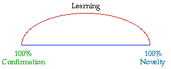

# It's The Pattern That Connects #

What you learn, and your capacity to learn, serves as a basis for everything you do in life. Yet, have you ever really thought about how you learn about the world around you? There are some things you memorize early in life, like the times tables. While you memorize these is that really learning? Do you remember that if you put your hand on something very hot it will burn you, or is that something you learned? And if you learned that, how was it that the learning happened? In this chapter we will investigate how you actually learn. We will also present a introduction to how you can improve your learning and actually test whether what you have learned is actually correct.

## Patterns ##

Consider the following

- I have a box that’s about 3 feet wide, 3 feet deep and 6 feet high
- It’s a rather heavy box
- The box has a couple of doors on it
- When you open the doors it’s cooler inside the box than outside
- One compartment is much colder than the other
- When you open the door a light comes on
- There’s food inside the box
- The box is in the kitchen
- There are sticky notes all over the front of the box
- There’s a collection of papers and stuff on top of the box
- If you move the box you’ll probably find a lot of dust under it
- The box is plugged into an electrical outlet
- From time to time you can hear the box running

At some point in this sequence you probably became convinced that what was being described was a refrigerator. Now stop for a moment and ask yourself just how you realized what was being described was a refrigerator? Yes it would have been easier if you had just been shown you a picture of a refrigerator, though that would have spoiled it, wouldn't it.

[** Figure 1](http://coastappliancerepair.com/los-angeles-blog/appliance-repair/ge-refrigerator-repair-los-angeles/)

As long as you knew beforehand what a refrigerator was, the statements could have been given to you in any order, and at some point you would have finally realized what was being described. If you had never seen, nor heard about, a refrigerator before, you would still be wondering what was being described and what to call it.

You have also most likely come to understand that all refrigerators are not identical. Some have one door with a separate compartment inside. Some have two doors and a drawer. Some are much smaller than others. Some can fit under a counter and some even fit on top of a counter. Some can be so large you can walk into them.

[** Figure 2](http://www.applianceexpert24-7.com/refrigerators.html)

If you see any of the items in Figure 2 you quickly decide it's a refrigerator. How does that happen? Gregory Bateson, one of the great thinkers of our time, said, “It’s the pattern that connects.” If you reflect on this statement you should come to realize there are actually different ways to interpret what it means. In this particular case the pattern connects you to the following purpose

- The box keeps food from readily spoiling by keeping it cold
- Part of the box is a freezer which keeps food from spoiling for even longer

and you understand it to be a refrigerator. Though now that we've arrived at this point we still haven't addressed the question of how you know. You were probably not actually taught that it's the above purpose that defines the essence of a refrigerator. Most people were not, though they have essentially learned it over time.

## Models ##

Models are the way we look at, and understand the world around us. All we have are our models. They are the way we understand everything. This is so because we build our understanding based on what we already understand. The world around us simply has too much detail for us to pay attention to everything. A refrigerator has many pieces though how many do you really pay attention to? Probably not many unless you build or repair refrigerators. We choose what to pay attention to in the world around us and we filter out much of the detail so we don't become overloaded. Sometimes we do this consciously and sometimes we do it subconsciously though experience. In the midst of what we choose to pay attention to there are patterns. Whether we realize it or not it is these patterns that we pay attention to and attempt to make sense of. We understand these patterns by linking them to extend patterns we already understand while we ignore much of the detail around us.

----------

#### Model ####

A model is a simplified version of some aspect of the world around us to help us understand something.

----------

## Learning ##

When we experience something that experience falls somewhere between complete novelty, meaning that we can't connect it with anything in our past experience, and complete confirmation, meaning that it represents something we already completely understand. Experiences which lie somewhere between complete novelty and complete confirmation provide a basis for learning. They represent a basis for connecting to understood patterns, extending those patterns and our understanding, and what results is learning. {Cite: Jantach, Eric. 1980. The Self-Organizing Universe: Scientific and Human Implications. Pergamon Press. http://www.amazon.com/The-Self-Organizing-Universe-Implications-Innovations/dp/0080243118/}

[** Figure 3](http://www.systemswiki.org/images/7/7c/Tkco2.gif)

Consider running into a refrigerator that looks like no refrigerator you've ever seen before. From an initial view you are unlikely to perceive it as a refrigerator. As you inspect it and find it serves the purpose you've come to understand for refrigerators, or if someone tells you it's a refrigerator, you then expand or extend your awareness of the range of patterns that constitute a refrigerator. And as Bateson said, "It's the pattern that connects."

## A Basis for Flawed Learning ##

While reading the previous paragraphs did it dawn on you that much of this pattern recognition/connection/extension learning doesn't happen consciously? We connect with patterns and extend our knowledge at times without even being consciously aware that it is happening. And when this happens subconsciously there isn't really any critical validation that happens along with the learning. Because this ongoing learning happens without critical validation there are things we learn and come to believe which are actually incorrect. We have perceived patterns and extended our learning in a flawed manner. The really annoying thing is that we then act on these beliefs, and when we produce results that don't go the way we planned we wonder why. Or even worse, we don't actually learn from the results and correct the flawed models which served as the basis for our flawed actions.

When we act on flawed beliefs attempting to solve problems we typically create more problems. It has been said repeatedly that the majority of today's problems are the direct result of yesterday's solutions. Wouldn't this provide a sense that we might really benefit from a better way to think about the world around us, develop better understanding, and develop solutions that don't come back to haunt us in the future?

## Simulations ##

While models can help us understand the world around us we live in a dynamic ever changing world, where the only real constant is change. Simulations allow us to bring the models we build to life and get a sense of the implications of the relations over time. It has been said that we as humans have a very limited capacity to understand the implication of two or more dynamic relations over time. To help us develop our understanding in this area we simulate the models we build.

# Model

{"title": "Moose and Wolves", "description": "The populations of Moose and Wolves are dynamically linked."}

{"load": "http://insightmaker.com/insight/8590"}

DIAGRAM

If we begin with 150 [Moose], 100 [Wolves], [Wolf Birth Rate] = 16%, [Moose Death Rate] = .08% * [Wolves], [Wolf Birth Rate] = 0.1% * [Moose] and [Wolf Death Rate] = 12% what does your intuition tell you the [Moose] and [Wolves] populations should look like over the next 100 years? It isn't expected that anyone can answer this question without some help. The help is a simulation of the relations. Press *Step Forward* to see the results.

DISPLAY

Was this anything close to what you expected? 

# End Model

In this book you will learn how to develop models and simulations to understand the implications of relations over time. We will start slow and build piece by piece so don't let this first simulation seem overwhelming. Later you'll get a chance to change the parameters of the Moose and Wolves model to investigate how changes affect the populations over time.

----------

#### Simulation ####

A simulation is a dynamic model that allows us to understand the implications of relations as they unfold over time.

----------

## A Better Way ##

Based on what has been presented to this point it should be obvious that we could benefit from a better way to develop models of what we believe. Models that are more likely to be correct, as well as surface flaws in many of our current beliefs.

Ludwig von Bertalanffy first proposed, in 1937, that the same basic structures operated across all disciplines, and if one learned how these structures operated one could transfer much of their learning from one discipline to another.{Davidson, Mark. 1983. Uncommon Sense: The Life and Thought of Ludwig von Bertalanffy. J.P. Tarcher, Inc. http://www.amazon.com/Uncommon-Sense-Thought-Bertalanffy-1901-1972/dp/087477165X/} When moving from one discipline to another, one would simply have to learn the structures that were operating, and the labels on the elements of the structures. On first reading this may seem most profound, or maybe even preposterous. However, if you think about it, maybe there is some truth to it after all.

We're not asking you to believe the previous statement because it was provided here. Through the experience presented shortly it is hoped that you will arrive at a sensibility of the statement from your own perspective.

Consider the following images and ask yourself what is it that all these different images actually have in common.

[** Figure 4](http://insightmaker.com/insight/4957)

Each of these items represents a collection of stuff. Admittedly each image represents different stuff, though stuff just the same. Because in each case the collection of stuff collected over time it's really more appropriate to refer to the collections of stuff as accumulations. As you will come to realize it is extremely important to remember that accumulations take time to accumulate, and often even longer to get rid of when you find out you don't want them.

The shorter term often used to refer to an accumulation is "stock." Just where this term originated is uncertain. What you call an accumulation of stuff isn't nearly as important as remembering it's a bunch of stuff that collects, or goes away, over time. How much time is different for each one of the accumulations. Now is probably a good time to talk about how accumulations happen over time.

How each of the accumulations in Figure 4 changes is a bit different, as are the time frames of concern. Time frame being the time it takes for some noticeable change in the accumulation. The following segments describe each accumulation in some detail.

#### Coffee Cup ####

You usually fill a coffee cup from a coffee pot and it takes a few seconds. Then you take a few minutes to drink the coffee as it's usually too hot to drink when you initially pour it.

#### Dump ####

A dump generally accumulates by the truckload after the garbage is picked up at houses or businesses in your community. If the dump were just getting started you'd probably notice it grow with each additional truck load. As it gets bigger and bigger it's gets more difficult to notice that it's growing, even though it is. While the dump is likely to grow almost every day we are probably more likely to think about the growth of the dump in months or years. And does it ever really go away? Usually when it gets to be too much a new dump is started somewhere else and the current dump is buried. Though when the dump is buried it doesn't really go away does it? It's still there and we'll probably talk more about dumps later on.

#### Glacier ####

A glacier is a long term accumulation of snow which packs down and turns to ice. Glaciers generally get bigger in winter when it's colder and snow falls, then they get smaller in summer when some portion of the glacier melts. The time frame one usually uses to think about glaciers is years, or even decades.

#### Lake ####

Lakes are bigger than a pond and smaller than an ocean and usually filled with fresh water, not salty, unless it's The Great Salt Lake or course. The lake is filled by rivers and streams that flow into it as well as rain water. One might think of this filling in terms of gallons per hour, or gallons per minute in the case of a large inflow such as at Niagara Falls where the water flows into Lake Ontario in the USA. Water leaves the lake through rivers and streams as well as evaporation into the air. For a lake one might think about the water flowing into or out of the lake in hours though when considering the level of the lake itself the change might be considered over days or weeks. It sort of depends on what you're interested in.

#### Pile of Sand ####

The pile of sand probably showed up in a truck that dumped it right where it is. While it may have taken a while for the truck to drive from wherever it was filled it probably only took a few minutes to dump the sand once the truck arrived. The sand is probably referred to in cubic yards, which is how much sand it takes to fill a box that's 1 yard wide, 1 yard deep, and 1 yard high. How long it takes for the sand to go away depends on how it's taken away. If you use a wheel barrow then you have to shovel the sand into the wheel barrow and take it to wherever you're going to use it. At this rate it may take days to move it. If you move it with a small piece of machinery, a Bobcat or a Backhoe, then will will probably only take a few minutes to an hour to get it moved.

#### Rabbits ####

A population of rabbits gets larger with new rabbit births and gets smaller with rabbit deaths. Have you ever heard the phrase "multiply like rabbits?" What it means is that it doesn't take very long for a few rabbits to become many rabbits, as long as there is a good food supply and not to many predators like wolves and coyotes. The time frame for considering a rabbit population is probably months to years.

#### Savings Account ####

A savings account is an account where if you put money in, and keep it there, you will periodically be given money just for keeping your money there. You won't get very much, though some. If you keep putting money in your savings account every so often and never take it out one day you'll be rich. Yet, for some reason that doesn't seem to happen for too many people. We'll have to talk about that sometime later. One generally thinks about the money associated with a savings account in dollars, the interest rate as a percentage, and the time frame in months to years.

#### Swimming Pool ####

Swimming pools usually hold thousands of gallons of water and you usually have a couple of options to fill one. You might use a garden hose, which will take days, or a hose from a fire hydrant, which will take a few hours, or from a tanker truck, which probably takes a few loads. In each case the water to fill the pool is probably measured in gallons. Once you fill the pool you loose a little water when people in the pool get out, thought not too much. Most of the water loss from a pool is though evaporation due to the sun and when you backwash the filter used to keep the pool clean. The change in the amount of water is usually measured in gallons per hour or per day.

~ Exercise

Take a few minutes and identify half a dozen situations you're familiar with where there are stocks that increase, or decrease, over time. What are the quantities for those stocks, e.g., gallons, pounds, kilograms, etc? What are the flows that increase or decrease those stocks? What are the time frames over which you think about the increase, or decrease of the stock?

~ End Exercise

At this point you may be wondering why so much time was spent walking though all these examples for increasing and decreasing accumulations of stuff. Since we said this was an interactive book you're probably wondering where the interaction is.

All the accumulations depicted in Figure 4 can be represented in a general form by the model in Figure 5. Remember we defined a model as a simplified version of some aspect of the world around us that we use to help us understand something. It doesn't get much simpler than this does it?

[** Figure 5](http://insightmaker.com/insight/4990)

Some amount of \p{stuff in} flowing causes \p{stuff} to increase over time and the amount of \p{stuff out} flowing causes stuff to decrease over time. With both of these happening at the same time \p{stuff} increases if \p{stuff in} is larger than \p{stuff out}. And if \p{stuff out} is greater than \p{stuff in} then the accumulation of \p{stuff} gets smaller. The most critical aspect of this to remember is that it takes time for \p{stuff} to increase or decrease. How fast the change happens depends on the amount of stuff in the flows.

# Model

{"title": "Swimming Pool", "description": "The following model investigates a swimming pool as a stock."}

{"load": "http://insightmaker.com/insight/4990"}

DIAGRAM

The diagram represents a swimming pool being filled with a hose at a rate of 50 gallons an hour. The drain is closed so there is no water draining out of the pool. If we let the hose run for 24 hours how much water will be in the pool? Admittedly the math is pretty straight forward though the idea here is to show how you can use a model, a simulation of a model actually, to show changes over time.

RESULTS

This graph indicates that after 24 hours the swimming pool will have 1,200 gallons of water in it. Yes, it's about as interesting as watching paint dry. Actually, as we hope you will come to find out, that's a good thing because this is really easy. A more interesting question might be, if the swimming pool holds 20,000 gallons of water how long with it take to fill it with water at 50 gallons per hour? We'll get to this shortly.

# End Model

The next chapter will present an introduction to Insight Maker so you can build models and run simulations. Building and working with simulations will allow you to extend your understanding of the world around you.

## Rabbit Population Growth ##

If you considered the accumulation of rabbits in Figure 4 you may have already realized that the model of Figure 5 is missing something. Yes, if you add rabbits to rabbits you get more rabbits. Though if you have more rabbits don't they create even more rabbits?

# Model

{"title": "Rabbit Population Growth", "description": "This model that reflects the the notion that more rabbits create even more rabbits."}

{"load": "http://insightmaker.com/insight/5123"}

DIAGRAM

This model indicates that if you start with some population of [Rabbits] and each time period the current number of [Rabbits] times the [Rabbit Birth Rate] will result in a number of [Births]. This number of [Births] will then be added to the accumulation of [Rabbits] and figure into the calculation for the next period.

Suppose we start with 10 rabbits, half of which are male and half of which are female. Research indicates that a female rabbit can give birth to between 18 and 26 Rabbits a year. The average for this, (18 + 24) / 2 = 22, though we'll round this up to 24 just because it will make the math easier. If a female rabbit can produce 24 Rabbits a year, that's 2 per months, though it actually takes two Rabbits, one male and one female. With all these assumptions we get about 1 new Rabbit per month for each Rabbit.

RESULTS

Forty thousand Rabbits in a year? That seems a bit bizarre doesn't it? This result actually points out the real value of modeling, which is learning. You build a model based on what you think you understand. You then populate it with assumptions about the relations and values, and then you run it. The result then either seems to make sense or seems really bizarre. When the results are really bizarre what the model is telling you is that either the structure is wrong, the assumptions are wrong, or both, because the world can't possibly be this bizarre. As a result you investigate the model and your assumptions. As your understanding improves the model gets better. At some point the model finally serves its purpose, to be a simplification of some aspect of the world which leads to a better understanding. Hopefully you come to find that going round and round with a model can be a delightful learning process.

Also, did you notice the choppy nature of the graph? This is a result of some incorrect settings and we'll talk about why this is happens and how to address it in Chapter 2.

After that sidetrack lets get back to our 40,000 Rabbits that can't possibly exist after a year. You can be pretty sure how many Rabbits you started with at the beginning. And when you check the formula for Births it seems to be in order. This sort of means the assumption for Rabbit Birth Rate must be too big. If you think about what the model is doing it's probably not too difficult to figure out that the model assumes that a Rabbit can be born this month and then give birth to another Rabbit next month. If a Rabbit has to mature for six months before it gives birth to Rabbits then the Rabbit Birth Rate might be something more like 20%.

{"attribute":"Equation","target":"Rabbit Birth Rate","value":".2"}

RESULTS

Is this right? A good thing to remember at this point is that "Is it right?" is actually the wrong question. A better question might be, "What have I learned, and is there more I can learn?" The graph sure seems more reasonable than what the model presented in the previous run, though do you have a high degree of confidence in the current Rabbit Birth Rate. Are there a number of other questions we could ask about our Rabbits. What is the Rabbit Death Rate? Do they have enough food to eat? Are they living out in the open where Coyotes and Foxes can get at them? Does their owner have a passion for Rabbit Stew? These might each be a basis for building a better model, though at this point we're going to leave the Rabbits alone and move on to something else.

# End Model

The most important learning you should take away from this model is that when what flows into the accumulation increases as the accumulation increases the accumulation can get real big in a hurry. This is actually called exponential grown and we'll talk in more detail about this in Chapter 2.

## Filling A Swimming Pool ##

The filling a swimming pool model previous presented was not not very detailed. A more useful question might be, if the pool holds 20,000 gallons of water and the hose fills the pool at 50 gallons per hour, how long will it take to fill the pool. Yes, you can do the math faster than it will take to build the model. Please bear with as there's another aspect of models right around the corner you will find very useful on an ongoing basis.

# Model

{"title": "Filling a Swimming Pool Revisited", "description": "This version of the model adds a goal representing a full swimming pool."}

{"load": "http://insightmaker.com/insight/5128"}

DIAGRAM

We begin with a Swimming Pool that needs to be filled with a hose. We know how many gallows of water it takes to fill the pool and we don't want to put too much water in the pool. The model is created to compare the amount of the water in the Swimming Pool with the the Full Level and use that to decide whether water is flowing in the hose or not.

*Hose = IfThenElse([Swimming Pool] < [Full Level], [Full Level]-[Swimming Pool], 0)*

RESULTS

This is really great. We can fill the Swimming Pool in just 1 day, or can we? Either it's a really really big hose or we've done something wrong because it's probably not possible to fill the Swimming Pool with a Hose in one day if it takes 20,000 gallons or water.

# End Model

Isn't it curious that the structure of this model looks just like the one for the Rabbit Population growth? How a model behaves depends on more than how it looks. We'll come back to this after we figure out how long it's going to take to fill the Swimming Pool.

Hopefully you will come to understand that when your models don't do what you expect them to do it's not a problem -- it's an opportunity for learning. This is the real reason why we do modeling - to understand and learn. Just think of it as, the more things don't go the way you expect them too, the more opportunities you have to learn.

If you look back at the formula for the Hose, notice it didn't take into account the initial statement that the Hose could only deliver 50 gallons per hour. And, might it be useful if we could see what happened with different Hose capacities?

Lets us a revised version of the model with Hose Capacity as a variable so you can set the capacity of the hose before you run the model.

# Model

{"title": "Filling a Swimming Pool One More Time", "description": "This version of the model uses a an explicit Hose Capacity."}

{"load": "http://insightmaker.com/insight/5130"}

DIAGRAM

The new formula for Hose takes into account both the current amount of water in the [Swimming Pool], [Full Level] and [Hose Capacity]

*[Hose] = IfThenElse([Swimming Pool] < [Full Level], min([Full Level]-[Swimming Pool],[Hose Capacity]), 0)*

RESULTS

With [Hose Capacity] = 50 over a period of 24 hours we've not even come close to filling the [Swimming Pool].

{"attribute":"TimeLength","value":"600"}

RESULTS

This graph indicates we need to wait 400 hours to fill the pool. That's a little over 16.5 days. Do we need a bigger hose?

# End Model

While there are a number of things we could do to improve the model at this point we've gone far enough. We'll begin to get far more sophisticated in the next chapter.

## Similar Structures / Different Behavior ##

If you compare the models presented to this point you should find them quite similar. And yet, the behavior of the models are distinctly different.

# Model

{"title": "Similar Structures / Different Behavior", "description": "The behavior of a model depends on the structure as well as the formulas that define the nature of the relationships."}

{"load": "http://insightmaker.com/insight/5138"}

DIAGRAM

These three models are in a general form so you can compare the different behavior of the structures that are very similar. [Flow Rate], [Seeking Factor] and [Growth Factor] are each factors which govern he rate of flow. [Goal] is a target value which the Growth model doesn't have.

RESULTS

The difference that makes a difference is what happens in the connection between the accumulation, or stock, and the flow.

# End Model

The link between the stock and the flow provides information from the stock to the flow and is generally referred to as feedback, mostly likely because the information travels in the opposite direction as the flow. The nature of feedback results in the three types of models.

#### Linear ####

In the Linear/Linear Growth model the Flow simply depends on the \p{Flow Rate} variable, which is expected to be some constant value. This model is referred to as linear because the \p{Accumulation of Stuff} is a straight line as you can see in the graph. Note that if the \p{Flow Rate} isn't a constant, or linear, the \p{Accumulation of Stuff} won't be linear.

#### Balancing ####

In the Balancing/Goal Seeking model the \p{State Change} depends on the difference between the \p{Goal} and the \p{Current State}. This difference influences the \p{State Change} to increase the \p{Current State} until it reaches the \p{Goal}. The structure tries to bring about a balance between the \p{Current State} and the \p{Goal} so the difference is zero, and then there's no more \p{State Change}.

#### Reinforcing ####

In the Reinforcing/Exponential Growth model \p{Added} depends on the value of \p{Reinforcing Accumulation}. This influences \p{Added} to increase the \p{Reinforcing Accumulation} which increases \p{Added}. One might consider a Reinforcing structure to be a Balancing structure that's out of control.

Would you believe that no matter how complicated a model may look it's really only some number of these structures connected together? In the next chapter you will learn about the Insight Maker modeling and simulation environment so you can begin building models and investigating their implications.

~ Exercise

The values in the previous model were contrived so when you click the Demo button the model will produce the graph in displayed graph. 

- Can you figure out why the values assigned are responsible for the curves produced?
- Alter the slider values for the parameters in the \u{Configuration Panel} and run the model to get a sense of the impact initial values have on the behavior of these structures.
- Can you explain to someone else the difference between the Linear, Balancing and Reinforcing models in terms of why the structures produce the behavior they do?

~ End Exercise

## Summary ##

- Models are simplified versions of the world around us.
- Simulations are dynamic models that help us understand changes over time.
- We build models to help us understand and learn.
- We build simple models and add to them as we learn with them.
- Building models and learning is an iterative process.
- We learn as we go and seldom do we get models right the first time.
- Linear, Reinforcing and Balancing structures are the basic building blocks for all models.
- These building blocks can aid in understanding aspects of our interactions with the world around us.

Please continue to the next chapter where you will learn about the Insight Maker environment so you can actually build the models that were presented in this chapter.

## References ##

- Kauffman, Draper L. 1980. Systems One: An Introduction to Systems Thinking. http://www.amazon.com/Systems-One-An-Introduction-Thinking/dp/9996280519/
- Meadows, Donella. 2013. Thinking in Systems: A Primer. http://www.amazon.com/Thinking-Systems-A-Primer-ebook/dp/B005VSRFEA/
- McDermott, Ian & O'Connor, Joseph. Unk. The Art of Systems Thinking. http://www.amazon.com/The-Art-Systems-Thinking-ebook/dp/B0091XFU70/
- Sherwood, Dennis. 2002. Seeing the Forest for the Trees: A Manager's Guide to Applying Systems Thinking. http://www.amazon.com/Seeing-Forest-Trees-Managers-ebook/dp/B004GCK63Y/
