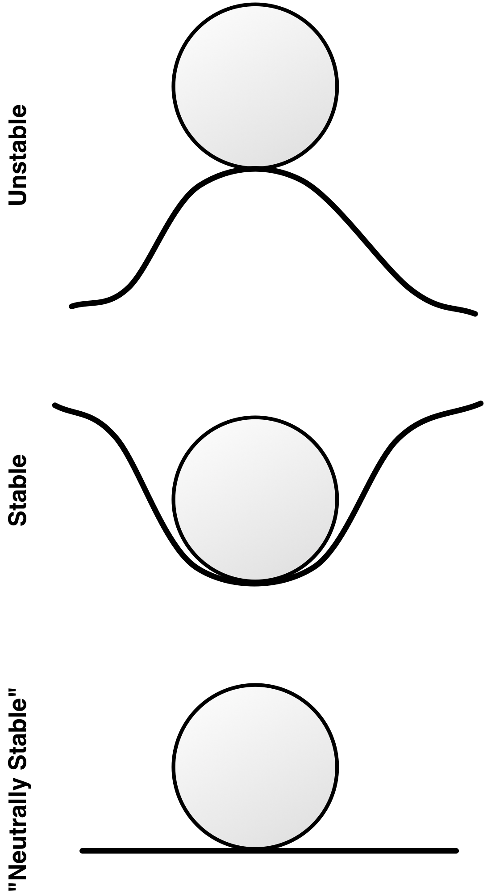

# Equilibria and Stability Analysis

This chapter extends on our mathematical analysis of models by introducing the concepts of points of equilibria and stability analysis. These types of analyses allow you to determine many behaviors of a system without needing to fully solving its differential equation model.

Although the trajectory for the state variables in differential equation models generally cannot be determined analytically, several key properties of models can often still be determined. These properties include:

* The location of equilibrium points
* The stability of the equilibrium points

An equilibrium point is defined as a set of state variable values that will cause the system to cease to change. Once the system enters an equilibrium configuration, it will not leave that configuration without an external stimulus. For instance, in our exponential growth model a single equilibrium point exists: that of zero people. If the population is empty, then the population will not grow and instead remain at 0 indefinitely.

In the exponential growth population model there is only one equilibrium point ($P=0$). In other models you may have multiple equilibrium points. In a model of a highly infectious, incurable disease you can imagine a system where two equilibrium points exist: one where no one is infected and a second point where everyone is infected. As long as there were no infectious individuals, the population would remain healthy. If just a single infected individual were introduced into the population, the infection would, however, spread until everyone was infected and the population would then remain at that point (remember this hypothetical disease is incurable).

Multiple types of equilibria exist. Figure 1 illustrates what is known as the *stability* of equilibrium points. Each of the three panes in this figure show a different form of equilibrium for the ball. In all three the balls are in equilibrium: if the no external forces come into play, the balls will not move. What differs in each of the three is what occurs if the balls are displaced a small amount.

Stable Equilibrium
: In this type of equilibrium the ball will return to its original position if it is displaced. The structure of the system is such that the system is naturally attracted to the point of equilibrium. To use the physical metaphor, the equilibrium is at the bottom of a dip and the system naturally rolls into it.

Unstable Equilibrium
: Here the ball will move further and further away from the point of equilibrium if it is displaced even a small amount. The equilibrium is unstable in that if we are just a small distance away from it, we move further away from it. To use the physical metaphor, the equilibrium is at the top of the hill and the system will move away from it unless it is placed at the exact point of equilibrium.

"Neutrally Stable Equilibrium"
: This is a less common form of equilibrium and goes by several different names. In this case if the ball is moved it will stay fixed at its new location. It will not move closer to or further from the original equilibrium. Of the three types of equilibrium, this one is less interest or relevance in practice.

In the case of the highly infectious disease model, an equilibrium of everyone being healthy would be classified as an unstable equilibrium. The equilibrium would persist as long as no one brought the disease into the population (someone would not just spontaneously become ill), but if as little as a single sick person entered the population, the population would move further and further away from the equilibrium point of everyone being healthy and would never naturally return to it.

The equilibrium point of everyone being sick is, on the other hand, a stable equilibrium as no one recovers from the disease on their own. Even if you introduced healthy people into a population of sick individuals -- moving the population away from the equilibrium -- they too will eventually become sick restoring the population to the equilibrium of everyone being sick.

~ Exercise
Provide two examples each of situations where stable and unstable equilibria occur in nature. Describe these equilibria.
~ Answer

Stable Equilibria: A piece of rubber that returns to its original shape after pulled, a forest where trees grow back once cut down.

Unstable Equilibria: A ball balanced on top of a sloped roof, a pole balanced perfectly on the floor.

~ End Exercise

## Equilibrium  Points

Often, we can determine the equilibrium points for a system without fully needing to solve the trajectory for the state variables. Let's implement the simple disease model we've been discussing. We'll do so for both a differential equation model and a System Dynamics model, but we'll rely on differential equation version to do our analytic analysis.

One way to express the differential version of the model is to define two state variables: the number of healthy people ($H$) and the number of sick people ($S$). The rate of infection between sick and healthy people can be made a function of the number of people in each category. Clearly, if there are no sick people the infection rate is 0; but, just as clearly, if everyone is already sick then the infection rate will also be zero. One workable differential equation model to implement this behavior is shown below:

$$
\begin{aligned}
H(0) &= 100 \\
S(0) &= 1 \\
\frac{dH}{dt} &= - \alpha \times H \times S \\ 
\frac{dS}{dt} &= \alpha \times H \times S
\end{aligned}
$$

This model uses a single parameter ($\alpha$) to control the infection rate. $alpha$ is a non-zero positive value; the smaller $\alpha$ is, the slower the infection will progress and vice versa. This notation illustrates one of the clumsier aspects of implementing stock and flow models using differential equations. The flow values between two stocks have to be repeated twice once for each of the two connected state variable's derivatives.

# Model

{"title":"Incurable Disease", "description": "This model illustrates stable and unstable equilibria using the scenario of an incurable disease in a population."}

{"geometry":{"x":380,"y":180,"width":100,"height":40},"name":"Healthy","create":"Stock"}

{"geometry":{"x":380,"y":340,"width":100,"height":40},"name":"Sick","create":"Stock"}

{"geometry":{"x":0,"y":0,"width":100,"height":100},"alpha":"Healthy","omega":"Sick","name":"Infection","create":"Flow"}

{"geometry":{"x":210,"y":200,"width":120,"height":50},"name":"Infection Rate","create":"Variable"}

{"geometry":{"x":0,"y":0,"width":100,"height":100},"alpha":"Infection Rate","omega":"Infection","create":"Link"}

DIAGRAM

This is the structure of our model. We have two stocks of people with people moving from the healthy stock to the sick stock as they become infected. Let's add the values and equations now.

{"attribute":"InitialValue","target":"Healthy","value":"100"}

{"attribute":"InitialValue","target":"Sick","value":"0"}

{"attribute":"Equation","target":"Infection Rate","value":"0.01"}

{"attribute":"FlowRate","target":"Infection","value":"[Infection Rate]*[Healthy]*[Sick]"}

There our model is fully setup. We've set it to start with everyone being healthy.

RESULTS

These results are quite stable. Everyone is healthy and no one gets sick. That indicates we have an equilibrium here. Let's now experiment by making a single person in the population sick.

{"attribute":"InitialValue","target":"Sick","value":"1"}

{"attribute":"InitialValue","target":"Healthy","value":"99"}

RESULTS

That's more interesting! We can see that everyone being healthy is an unstable equilibrium as the system moves away from it if we deviate from it by even a small amount. We can also see that the second equilibrium (everyone being sick) is stable as the system moves towards it naturally.

# End Model

Finding the equilibria for differential equation models is by-and-large straightforward analytically. We simply need to harness the definition of an equilibrium point: an equilibrium point is one where the state variables are constant and unchanging. Since the derivatives represent changes in the state variables, this statement is equivalent to saying the derivatives for the model are 0 at equilibrium points.

Based on this, in order to find the equilibrium points we simply need to set the derivatives in our model to 0 and solve the resulting equations. For the disease model we get:

$$
\begin{aligned}
H(0) = 99 \\
S(0) = 1 \\
0 = - \alpha \times H \times S \\ 
0 = \alpha \times H \times S
\end{aligned}
$$

The initial conditions will determine what equilibrium is arrived at but they do not affect the existence of the equilibria. Furthermore, the two equations we have set to 0 are equivalent^[Although we expressed this model as a function of two state variables $H$ and $S$, it only has one independent state variable. Given the fixed population size, you know the value of $H$ given $S$ and vice versa.] so we can simplify these equations to simply be:

$$ 
0 = \alpha \times H \times S
$$

Simple inspection reveals that this equation is true if and only if either $H=0$, $S=0$, or $\alpha=0$. Thus we have mathematically shown that our equilibria are either when everyone is sick or everyone is healthy (or there is no infection whatsoever). Granted this is a trivial conclusion for this model and we stated it earlier. However, for more complex models this type of analysis can be very useful and will often reveal that equilibria are functions of the different parameter values in the model and they may enable you to explicitly determine how the equilibria changes as the model configuration changes.

Let's try a more complex example. Remember the predator prey model from earlier? We had the following set of equations to simulate the relationship between a moose and wolf population:

$$ \frac{dM}{dt} = \alpha \times M - \beta \times M \times W $$
$$ \frac{dW}{dt} = \gamma \times M \times W - \delta \times W  $$

Let's determine what the equilibrium values are for this model. As before, we start by setting the derivatives to 0:

$$ 0 = \alpha \times M - \beta \times M \times W $$
$$ 0 = \gamma \times M \times W - \delta \times W $$

Solving this set of equations is more difficult than for the disease model. However a little bit of algebra reveals two solutions. One when $M=0$ and $W=0$ (there are no animals at all), and the second when $M=\delta/\gamma$ and $W=\alpha/\beta$. This is an example of where the equilibrium location depends on the values of the model parameters.

~ Exercise
Find the equilibrium points for the system:

$$ \frac{dX}{dt} = X^2+X-3$$

~ Answer

$X=-2.30$ and $X=1.30$

~ End Exercise

~ Exercise
Find the equilibrium points for the system:

$$ \frac{dX}{dt} = \sin(X)$$

~ Answer

$X=0,\pi,2\pi,3\pi,4\pi,...$

~ End Exercise

~ Exercise
Find the equilibrium points for the system:

$$
\begin{aligned}
\frac{dX}{dt} = 2 \times X + Y + 5\\
\frac{dY}{dt} = 3 \times X - 4 \times Y
\end{aligned}
$$

~ Answer

$X=-1.82, Y=-1.36$

~ End Exercise

~ Exercise
Find the equilibrium points for the system:

$$
\begin{aligned}
\frac{dX}{dt} &= X^2 - Y \\
\frac{dY}{dt} &= -2 \times X^2 - Y^2
\end{aligned}
$$

~ Answer

$X=0, Y=0$ and $X=-1.41, Y=-2$ and $X=1.41, Y=-2$

~ End Exercise

~ Exercise
Do the locations of equilibria depend on the starting conditions? Does the system arriving at an equilibrium depend on the starting conditions?

Why or why not? 
~ End Exercise

## The Phase Plane

Up until now, when looking at model results we have been focused on time series plots and we have mainly been interested in the trajectory of the variables and stocks over time. For the mathematical analysis of differential equations, however, the primary graphical tool is not this time series plot; instead it is what is known as a phase plane plot.

Phase planes are almost like scatterplots. They show one of the state variables plotted against another of the state variables. A scatterplot could be used to show the path for these two variables over the course of a simulation. In the predator prey model the results of a scatterplot of the wolf and moose population will be an ellipsoid. The two populations will cycle continuously. A phase plane plot is similar to this, but rather than just showing one of these cycles for a given simulation run, the phase plane shows the trajectories for *all* combinations of moose and wolf population sizes.

Figure 2 illustrates a phase plane plot for the predator prey system. The trajectory for one set of parameter and state variable values is highlighted in red and, as expected, we see a continual oscillation. We can also see the trajectories for all the other combinations of state variables. We see that the system will always oscillate and the size of this oscillation depends on the initial conditions for the state variables. This illustration provides us with a good deal of information in a single graphic and the phase plane plot is a great way to summarize the behavior of a system with two state variables.

Let's quickly explore the phase plane plots for a simpler system than our predator prey model. Take a system consisting of two state variables^[Just a helpful reminder if you are starting to get lost in some of this differential equation jargon. A "state variable" is just a stock. Return to the table at the beginning of this chapter to see how these terms relate to the system dynamics modeling terminology we have already learned.] both of which grow (or decay) exponentially. These state variables will be assumed to be independent from each other so the value of one does not affect the value of the other:

$$
\begin{aligned}
\frac{dX}{dt} &= \alpha \times X \\
\frac{dY}{dt} &= \beta \times Y \\
\end{aligned}
$$

Clearly, there is an equilibrium point for this model at $X=0$ and $Y=0$. There are four general types of behavior around this equilibrium. One when $\alpha>0$ and $\beta>0$, one when $\alpha<0$ and $\beta>0$, one when $\alpha>0$ and $\beta<0$, and one when $\alpha<0$ and $\beta<0$. The phase planes for each of the four cases are shown in Figure 3.

From these plots we can visually determine how the stability of the equilibrium point at $X=0, Y=0$ changes as we change $\alpha$ and $\beta$. When $\alpha<0$ and $\beta<0$, we have a stable equilibrium; in all other cases we have an unstable equilibrium.

~ Exercise

Sketch out the phase plane for the differential equation model:

$$
\begin{aligned}
\frac{dX}{dt} &=  -1 \\
\frac{dY}{dt} &= Y \\
\end{aligned}
$$

~ End Exercise

~ Exercise

Sketch out the phase plane for the differential equation model:

$$
\begin{aligned}
\frac{dX}{dt} &=  X \\
\frac{dY}{dt} &= Y^2 \\
\end{aligned}
$$

~ End Exercise

## Stability Analysis

Now that we have learned how to analytically determine the location of equilibrium points, we may want to determine what type of stability occurs at these equilibria. As we stated earlier, for the incurable disease model it is trivial to arrive at the conclusion that the state of everyone being healthy is unstable while the state of everyone being sick is stable. In more complex models, it may be harder to draw conclusions or the stability of an equilibrium point may change as a function of the model's parameter values. Fortunately, there is a general way to determine the precise stability nature of the equilibrium points analytically.

The procedure to do this is relatively straightforward, but the theory behind it can be difficult to understand. The first key principle that must be understood is that of "linearization". To get a feel for linearization, let's take the curve in Figure 4. Clearly this curve is not linear. It has lots of bends and does not look at all like a line.

If we zoom in on any one part of the curve, however, the section we are zoomed in on starts to straighten out. If we keep zooming in, we will eventually reach a point where the section we are zoomed in on is effectively linear: basically a straight line. This is true for whatever part of the curve we zoom in on^[The one exception to this rule is if your curve is some sort of fractal. In this case no matter how much you zoom in on it, it will never become straight. In practice, however, this caveat is a non-issue.]. The more bendy parts of the curve will just take more zooming to convert them to a line.

We can conceptually do the same process for the equilibrium points in our phase planes. Even if the trajectories of the state variables in the phase planes are very curvy, if we zoom in enough on the equilibrium points, the trajectories at a point will eventually become effectively linear. The simple, two-state variable exponential growth model we illustrated with phase planes above are examples of a fully linear model. If we zoom in sufficiently on the equilibrium points for most models, the phase planes for the zoomed-in version of the model will eventually start to look like one of these linear cases.

Mathematically, we apply linearization to an arbitrary model by first calculating what is called the Jacobian matrix of the model. The Jacobian matrix is the matrix of partial derivatives of each of derivatives in the model with respect to each of the state variables:

$$ \text{Jacobian} = \begin{bmatrix} \dfrac{\partial }{\partial X} X' & \cdots & \dfrac{\partial }{\partial Z} X' \\ \vdots & \ddots & \vdots \\ \dfrac{\partial }{\partial X} Z' & \cdots & \dfrac{\partial }{\partial Z} Z'  \end{bmatrix} $$

The Jacobian is a linear approximation of our (potentially) non-linear model derivatives. Let's take the Jacobian matrix for the simple exponential growth model:

$$
\begin{aligned}
\frac{dX}{dt} &= \alpha \times X \\
\frac{dY}{dt} &= \beta \times Y \\
\end{aligned}
$$

$$
\begin{aligned}
\text{Jacobian} &= \begin{bmatrix} \dfrac{\partial}{\partial X } \alpha \times X & \dfrac{\partial}{\partial Y } \alpha \times X  \\  \dfrac{\partial}{\partial X } \beta \times Y & \dfrac{\partial}{\partial Y } \beta \times Y \end{bmatrix}
&= \begin{bmatrix} \alpha  & 0 \\ 0 & \beta \end{bmatrix}
\end{aligned}
$$

~ Exercise 

Calculate the Jacobian matrix of the system:

$$
\begin{aligned}
\frac{dX}{dt} &=  X \\
\frac{dY}{dt} &= Y^2 \\
\end{aligned}
$$

~ Answer

$$
\begin{bmatrix}
1 & 0 \\
0 & 2 \times Y
\end{bmatrix}
$$

~ End Exercise

~ Exercise 

Calculate the Jacobian matrix of the system:

$$
\begin{aligned}
\frac{dX}{dt} &= X^2 - Y \\
\frac{dY}{dt} &= -2 \times X^2 - Y^2
\end{aligned}
$$

~ Answer

$$
\begin{bmatrix}
2 \times X & -1  \\
-4 \times X & -2 \times Y
\end{bmatrix}
$$

~ End Exercise

~ Exercise 

Calculate the Jacobian matrix of the system:

$$
\begin{aligned}
\frac{dX}{dt} &= X \times Y + \beta \times Y^2 \\
\frac{dY}{dt} &= \alpha \times X^3 + X^2 \times Y
\end{aligned}
$$

~ Answer

$$
\begin{bmatrix} Y \times X & X+2 \times \beta \times Y \\ 3 \times \alpha \times X^2 + 2 \times X \times Y & X^2 \end{bmatrix}
$$

~ End Exercise

This is complicated so don't worry if you don't completely understand it! Once you have the Jacobian, you calculate what are known as the eigenvalues of the Jacobian at the equilibrium points. This is also a bit complicated, so if your head is starting to spin, just skip forward in this chapter!

Nonetheless, eigenvalues and their sibling eigenvectors are an interesting subject. Given a square matrix (a matrix where the number of rows in equals the number of columns), an eigenvector is a vector which, when multiplied by the matrix, results is the original vector multiplied by some factor. This factor is known as an eigenvalue as is usually denoted $\lambda$. Given a matrix $\mathbf{A}$, an eigenvalue $\lambda$ with associated eigenvector $\mathbf{V}$; the following equation will be true:

$$\mathbf{A} \times \mathbf{V} = \lambda \times \mathbf{V}$$

Let's look at an example for a $2\times2$ matrix:

$$\begin{bmatrix} 1 & 2 \\ 1 & 0 \end{bmatrix} \times \mathbf{V} = \lambda \times \mathbf{V}$$

What eigenvector and eigenvalue combinations satisfy this equation? It turns out there are two key ones:

$$\begin{bmatrix} 1 & 2 \\ 1 & 0 \end{bmatrix} \times \begin{bmatrix} 2 \\ 1 \end{bmatrix}= 2 \times \begin{bmatrix} 2 \\ 1 \end{bmatrix}$$

$$\begin{bmatrix} 1 & 2 \\ 1 & 0 \end{bmatrix} \times \begin{bmatrix} -1 \\ 1 \end{bmatrix} = -1 \times \begin{bmatrix} -1 \\ 1 \end{bmatrix}$$

Naturally, any multiple of an eigenvector will also be an eigenvector. For instance, in the case above, $[1, 0.5]$ and $[-2, 2]$ are also eigenvectors of the matrix.

We can interpret eigenvectors geometrically. Looking at the $2\times2$ matrix case, we can think of a vector as representing a coordinate in a two-dimensional plane: $[x,y]$. When we multiply our $2\times2$ matrix by the point, we transform the point into another point also in the two-dimensional plane. Due to the properties of eigenvectors, we know that when we transform an eigenvector, the transformed point will just be a multiple of the original point. Thus when a point that is on a matrix's eigenvector is transformed by that matrix, it will move inwards or outwards from the origin along the line defined by the matrix's eigenvector.

We can now relate the concept of eigenvalues and eigenvectors to our differential equation models. Take a look back at the phase planes for the exponential model example. For each of the phase planes, there are at least two straight lines of trajectories. In these cases the *x*- axis and the *y*-axis are the locations of these trajectories. If you have a system on the *x*- or *y*-axis in this example it will remain on that axis as it changes. This indicates that for this model, the eigenvectors are the two axises as a system on either of them does not change direction as it develops. That's the definition of of an eigenvector.

For our purposes though, we do not really care about the actual direction or angle for these eigenvectors. We instead care about whether the state variables move inwards or outwards along these vectors. We can determine this from the eigenvalues of the Jacobian matrix. If the eigenvalue for an eigenvector is negative, then the values move inwards along that eigenvector; while if the eigenvalue is positive, they move outward along the eigenvector.

These eigenvalues tell us all we need to know about the stability of the system. Returning to our illustration of stability as a ball on a hill, we can think of these eigenvalues as being the slopes of the hill around the equilibrium point. If the eigenvalues are negative, the ground slopes down towards the equilibrium point forming a cup (leading to a stable equilibrium). If the eigenvalues are positive, the ground slopes away from the equilibrium point creating a hill (leading to an unstable equilibrium).

Eigenvalues can be calculated straightforwardly for a given Jacobian matrix. Briefly, for the Jacobian matrix $J$, the eigenvalues $\lambda$ are the values that satisfy the following equation where $det$ is the matrix determinant and $I$ is the identity matrix.

$$
0=det(J-\lambda \times I)
$$

We can do a quick example of calculating the eigenvalues for the Jacobian matrix we derived for our two-state variable exponential growth model.

$$
\begin{aligned}
0 &= det\left(\begin{bmatrix} \alpha  & 0 \\ 0 & \beta \end{bmatrix} - \lambda  \times  \begin{bmatrix} 1 & 0 \\ 0 & 1 \end{bmatrix} \right) \\
 &= det\left(\begin{bmatrix} \alpha -\lambda & 0 \\ 0 & \beta-\lambda \end{bmatrix}\right) \\
 &= (\alpha-\lambda) \times (\beta-\lambda) - 0 \times 0 \\
\lambda = \alpha, \lambda = \beta
\end{aligned}
$$

That is a fair amount of work to do. It's even more complicated if you have more than two state variables. However, once you have gone through the calculations and determined the linearized eigenvalues for your equilibrium points, you know everything you might want to know about the stability of the system.

~ Exercise 

Find the eigenvalues of the following matrix:

$$
\begin{bmatrix} 2 & 4 \\  4 & 2 \end{bmatrix}
$$

(Bonus: Determine the associated eigenvectors.)

~ Answer

Eigenvalue of 6 with eigenvector of $[1,1]$. Eigenvalue of -2 with eigenvector of $[-1,1]$.

~ End Exercise

~ Exercise 

Find the eigenvalues of the following matrix:

$$
\begin{bmatrix} 2 & 0 \\  5 & 1 \end{bmatrix}
$$

(Bonus: Determine the associated eigenvectors.)

~ Answer

Eigenvalue of 2 with eigenvector of $[1,5]$. Eigenvalue of 1 with eigenvector of $[0,1]$.

~ End Exercise

~ Exercise 

Find the eigenvalues of the following matrix:

$$
\begin{bmatrix} \alpha & \beta \\  \beta & \alpha \end{bmatrix}
$$

(Bonus: Determine the associated eigenvectors.)

~ Answer

Eigenvalue of $\alpha-\beta$ with eigenvector of $[-1,1]$. Eigenvalue of $\beta+\alpha$ with eigenvector of $[1,1]$.

~ End Exercise

~ Exercise

$$
\begin{bmatrix} \alpha & \beta \\  0 & \beta \end{bmatrix}
$$

(Bonus: Determine the associated eigenvectors.)

~ Answer

Eigenvalue of $\alpha$ with eigenvector of $[1,0]$. Eigenvalue of $\beta$ with eigenvector of $\left[\frac{-\beta}{\alpha-\beta},1 \right]$.

~ End Exercise

In the exponential growth model we can see that when the eigenvalues are both negative we have a stable equilibrium (refer to the graphs we developed earlier), while if either one is positive (or they both are) we have an unstable equilibrium. This makes a lot of sense as if either one is positive it pushes the system away from the equilibrium making it unstable.  While if they are both negative then they both push the system towards the equilibrium point. Visualize the ball sitting in the cup or on the hill.

Looking at it this way, we realize that *all we need in order to understand the stability of an equilibrium point are the eigenvalues of the Jacobian at the equilibrium point*. This is an incredibly powerful tool. It reduces the complex concept of stability, into an analytical procedure that can be applied straightforwardly.

Let's now look at some more examples.

First let's take our simple disease model from earlier. If you recall that model was:

$$
\begin{aligned}
\frac{dH}{dt} &= - \alpha \times H \times S \\ 
\frac{dS}{dt} &= \alpha \times H \times S
\end{aligned}
$$

First let's calculate the Jacobian for this model. We take the partial derivatives of each of the two derivatives with respect to each of the two state variables to create a two-by-two matrix:

$$
\text{Jacobian} = \begin{bmatrix} \dfrac{\partial}{\partial H }  - \alpha \times H \times S& \dfrac{\partial}{\partial S }  - \alpha \times H \times S  \\  \dfrac{\partial}{\partial H } \alpha \times H \times S & \dfrac{\partial}{\partial S } \alpha \times H \times S \end{bmatrix} =\begin{bmatrix}
-\alpha \times S & -\alpha \times H \\
\alpha \times S & \alpha \times H
\end{bmatrix}
$$

Next, we evaluate this Jacobian at one of our equilibrium points. Let's choose the one where the $S=0$ (no one is sick) and $H=P$ (where $P$ is the population size) so everyone is healthy:

$$
\begin{bmatrix}
0 & -\alpha \times P \\
0 & \alpha \times P
\end{bmatrix}
$$

We can now find the eigenvalues for this matrix. Once we go through the math we get two eigenvalues: 0 and $\alpha \times P$. What do these mean? Well, since one of the eigenvalues is positive, this indicates we have movement away from the equilibrium point along at least one of the eigenvectors. The other vector has no movement (0 as the eigenvalue), but this one positive value will ensure we have an unstable equilibrium. Again, think of the ball, the positive eigenvalue indicates the ground slopes downwards from the equilibrium point so a ball balanced on top of this hill will be very unstable.

Now let's do the second equilibrium. The one where $S=P$ and $H=0$ (everyone is sick). Let's evaluate the Jacobian at this equilibrium:

$$
\begin{bmatrix}
-\alpha \times P & 0 \\
\alpha \times P & 0
\end{bmatrix}
$$

Now let's find the eigenvalues for this matrix. Once we go through the math we get two eigenvalues: this time 0 and $-\alpha \times P$. Again, the 0 eigenvalue can be ignored as it does not cause growth or change. The second eigenvalue however is negative, indicating the system moves toward the equilibrium point again. Look back at our exponential growth phase planes. Negative coefficients indicate trajectories towards the equilibrium (create a cup for the ball). Thus this second equilibrium is a stable one.

It's time to look at a more complex example, we'll consider our predator prey model. First we calculate the Jacobian matrix for this model:

$$
\text{Jacobian} = \begin{bmatrix} \dfrac{\partial}{\partial M }  \alpha \times M - \beta \times M \times W & \dfrac{\partial}{\partial W }  \alpha \times M - \beta \times M \times W  \\  \dfrac{\partial}{\partial M } \gamma \times M \times W - \delta \times W & \dfrac{\partial}{\partial W } \gamma \times M \times W - \delta \times W \end{bmatrix} = \begin{bmatrix}
\alpha - \beta \times W & -\beta \times M \\
\gamma \times W & \gamma \times M - \delta
\end{bmatrix}
$$

Now that we have the Jacobian, we'll evaluate it at the trivial equilibrium of $M=0$ and $W=0$. The resulting matrix is:

$$
\begin{bmatrix}
\alpha  & 0 \\
0 & -\delta
\end{bmatrix}
$$

The eigenvalues of this matrix are $\alpha$ and $-\delta$. Thus one of the eigenvectors approach the equilibrium and the other moves away from it. This means we have an unstable equilibrium, which is actually good news as it indicates that the two animal populations will not spontaneously go extinct.

Let's now evaluate the more complex equilibrium point we identified earlier of $M=\delta/\gamma$ and $W=\alpha/\beta$. First we calculate the Jacobian at this point:

$$
\begin{bmatrix}
0 & \frac{-\beta \times \delta}{\gamma} \\
\frac{\gamma \times \alpha}{\beta} & 0
\end{bmatrix}
$$

When we calculate the eigenvalues for this point we obtain $i\sqrt{\alpha \times \delta}$ and $-i\sqrt{\alpha \times \delta}$. Here the $i$ indicates the imaginary number $\sqrt{-1}$. That's a little strange, so how do we interpret this? Well, it turns out that imaginary numbers in the eigenvalues indicate oscillations in the phase planes, thus this results means we have oscillations around the point of equilibrium. Since we have no real component in the eigenvalues, there is neither attraction towards the point of equilibrium or repulsion away from it so we have a stable oscillation around the equilibrium.

Of course we already knew that from our simulations, but this stability analysis allows us to mathematically determine this relationship, a capability that is a very powerful tool. The following table summarizes the different types of eigenvalues that can be found for a system with two state variables and their associated stabilities.

Real Parts | Imaginary Part? | Stability
---|---|---
Both Equal to 0| No | Neutrally Stable
Both Equal to 0| Yes | Stable Oscillations
Both greater than or equal to 0 | No | Unstable
Both greater than or equal to 0 | Yes | Unstable Oscillations
Both less than or equal to 0 | No | Stable
Both less than or equal to 0 | Yes | Damped Oscillations (Stable)

~ Exercise

A system's Jacobian matrix has two eigenvalues at an equilibrium point. Determine the stability of the system at this point for the following pairs of eigenvalues:

1. 0.5 and 4
2. -3 and 0.2
3. -3 and -1

~ Answer

1. Unstable
2. A saddle (unstable)
3. Stable

~ End Exercise

~ Exercise

A system's Jacobian matrix has two eigenvalues at an equilibrium point. Determine the stability of the system at this point for the following pairs of eigenvalues:

1. $1+2i$ and $1-2i$
2. $-3+0.2i$ and $-3-0.2i$
3. $0.2i$ and $0.2i$

~ Answer

1. Unstable oscillations
2. Damped oscillations (stable)
3. Stable oscillations

~ End Exercise

~ Exercise

A system's Jacobian matrix has a single eigenvalue at an equilibrium point. Determine the stability of the system at this point for the following eigenvalues:

1. 2.5
2. -1.2
3. 0.5

~ Answer

1. Unstable
2. Stable
3. Unstable

~ End Exercise

## Analytical vs. Numerical Analysis

The majority of this book has been focused on the numerical analysis of models and the qualitative conclusions that can be drawn from these results. This chapter has introduced a set of analytical tools that can be used -- for the most part -- to analyze the same models we have presented elsewhere in the book. Now take a moment to reflect on these different forms of analysis and what each one can offer.

The great benefit of the analytical techniques we present here is that they can provide precise answers to the general behavior of the system. Most of these same answers can also be determined numerically (e.g. running the simulation many times and exploring the results), but those answers will be less precise and definite. If you manually attempt to explore the parameter space of your model, it is possible that you could miss some set of parameter values that will give you unexpected behavior. An analytical analysis may be fully comprehensive and can guarantee the completeness of your conclusions.

A weakness of analytical methods is that your model must be solvable analytically. This means that you will probably need to keep your model from growing too complex in order to keep it analytically tractable. Also, some common functions such as \e{IfThenElse} logic can make analytical work much more difficult. Further, some models may simply be impossible to analyze analytically and these insolvable models may in fact be very simple in practice. For example, any model containing both $X$ and $\log(X)$ in the same equation will be intractable to many forms of analysis. 

We think both analytical and numerical work has a lot of applicability in practice. We do worry, though, about some of the analytical models and work we see presented or published. Sometimes these models seem to us to be much too simple to adequately represent the system they are supposed to be modeling. True, analytically the results of the models appear elegant and clear, but if the model is too simple to be relevant these results have little use and may actually be very misleading in practice. We worry sometimes that a focus on analytical work^[And, rightly or wrongly, analytical work is generally considered more prestigious and "serious" than numerical work.] leads to modelers prioritizing analytical tractability over model utility in their decisions. We believe a focus on analytical results can lead to reductionist models with reduced practical utility and we caution modelers against becoming too focused on elegant solutions and the expense of relevance. Where available, more realistic models are preferable, even if they require numerical solutions than overly simplistic analytically solvable ones.

~ Exercise

What are the equilibrium points of the following system and their associated stabilities?

$$
\begin{aligned}
\frac{dX}{dt} &= X \times Y + X^2  \\
\frac{dY}{dt} &= Y + 2
\end{aligned}
$$

~ Answer

Equilibrium $X=2, Y=-2$ is unstable.
 
$X=0, Y=-2$ is an unstable saddle point.
 
 
~ End Exercise

~ Exercise

What are the equilibrium points of the following system and their associated stabilities? $\alpha$ is a scalar number that may be positive or negative.

$$
\begin{aligned}
\frac{dQ}{dt} &= -XQ\times R + R \\
\frac{dR}{dt} &= \alpha - \alpha \times R^2
\end{aligned}
$$

~ Answer

Equilibrium $Q=1, R=1$ is stable if $\alpha \geq 0$. Otherwise it is unstable.
 
$Q=1, R=-1$ is unstable.
 
~ End Exercise

~ Exercise

You have a system dynamics model of a population of wolves. This model consists of a single stock \p{Wolves} (initial value 100), a single flow going into the stock \p{Net Growth}, a parameter \p{Growth Rate} (value of 0.05), and a parameter \p{Carrying Capacity} (value of 6,000). The flow has the equation \e{[Growth Rate]*[Wolves]*(1-[Wolves]*[Carrying Capacity])}.

Build this model determine the location of the equilibria and their stability. Then prove these conclusions analytically.

~ Answer

The first equilibrium has no wolves and is unstable.

The second equilibrium is when the population size is equal to the carrying capacity. This equilibrium is stable.

~ End Exercise

