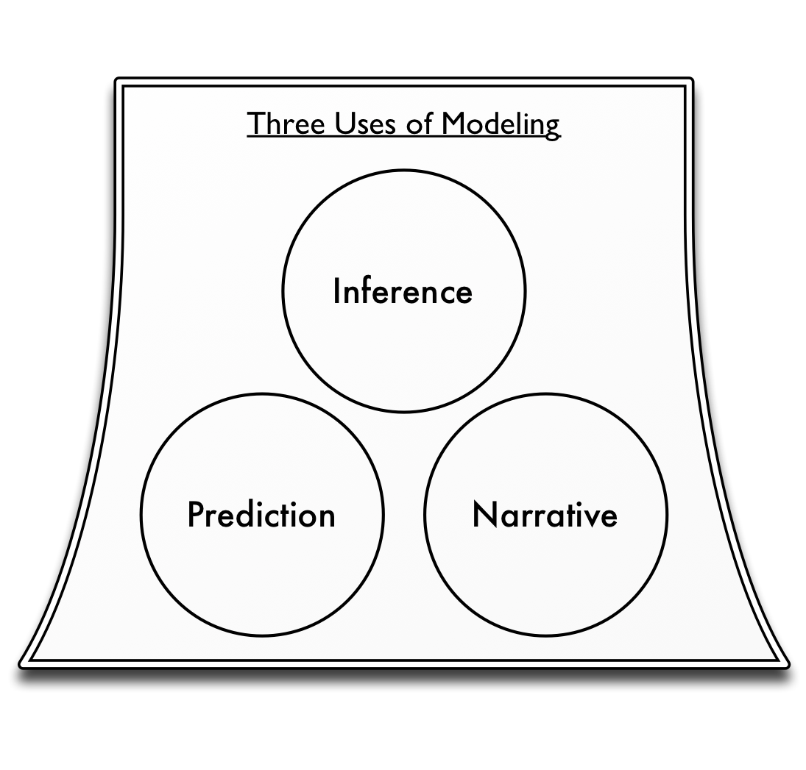

# Models and Truth

> All models are wrong, but some are useful -- George E.P. Box

A model is a tool designed to reflect reality. A model is never a perfect mirror of reality, but often models can still be useful even given their imperfections. In this chapter, we will take a journey exploring different types of models and distinctions that are commonly used to classify and understand them. We will consider several approaches to modeling that are quite different from the ones we have introduced throughout this book. These will help to understand the richer ecosystem of modeling tools and techniques that exist and how the ones we have learned fit within this ecosystem. 

The ultimate destination of this exploration will be a clear understanding of the fundamental principles and approaches used to construct models. There will be many detours that we must make to arrive at this destination, but in the end we will be able to divide models into two overarching categories based on their purposes and the techniques used to construct them. By mastery this divide, and how the work we and others do fits into it, we will obtain a rich perspective and understanding of the relationship between models and truth. We will also have a renewed appreciation for the strength and power of the techniques introduced in this book for tackling a wide swath of modeling problems.

Before we get there, however, let's introduce some of the terminology that is commonly used to describe models. It is useful to take a step back and first discuss different kinds of models. Modeling is a wide-ranging field with many distinctions made by modelers and mathematicians. Three of these distinctions are presented below:

### Deterministic versus Stochastic Models

There are two polar opposite views of the world. One view says the fate of the universe is governed by strictly predictable laws of physics. In this view, the universe acts as if it were a giant machine, where if its current state is known (down to each individual atomic particle), its future states through the rest of time are predetermined. The opposite view is that the universe is ruled by chance and randomness. Random quantum mechanical fluctuations merge and amplify leading to an infinite range of diverging possibilities.

Which of these two views holds more of the truth? We certainly do not know and it is possible that this will be a question that physicists will never cease exploring. Albert Einstein had a viewpoint of special interest, however. He was a strong partisan of the more deterministic view, famously remarking, "God does not play dice with the world."

When creating a model of a system, we must choose how we treat chance. Do we build our model deterministically, such that each time we run it we obtain the same results? Or do we instead incorporate elements of uncertainty so that each time the model is run we may see a different trajectory of outcomes?

### Mechanistic versus Statistical Models^[This relates, more broadly, to the contrasting research approaches of induction and deduction. Induction starts with data and observations which are analyzed to create a broader theory (similar to a statistical approach to modeling). Deduction starts with a theory and finishes with the collection of data to confirm the theory (similar to a more mechanistic approach to modeling). It is easy to become mixed up with the meanings of induction and deduction and even great minds have confused them. While Sir Arthur Conan Doyle's character Sherlock Holmes attributes his impressive powers to "deduction", he is actually using induction. Treating what we are calling "statistical" models here as a form of induction, we can also refer to them as "phenomenological" or "empirical" models. ]

When beginning to build a model of a system, there are many questions you should ask, two of which are:

1. Do I know (or have a hypothesis of) the mechanisms that drive the system?
2. Do I have data that describe the observed behavior of the system?

If the first question is answered in the affirmative, you can build a mechanistic model that replicates your understanding (or hypothesis of) the true mechanisms in the system. If, on the other hand, the second question is answered in the affirmative, you can use statistical algorithms such as regressions to create a model of the system based purely on the data.

If neither question is answered affirmatively... well in that case there isn't much of anything you can build.

~ Exercise

A credit card company has hired you to build a model to predict defaults of new applicants. They give you a data set containing information on one million of their customers along with whether or not the customer defaulted.

Would it be better to build a mechanistic or statistical model for this data?

~ Answer

It would be better to build a statistical model in this case.

~ End Exercise

~ Exercise

You have been commissioned to build a model of population growth for a herd of Zebra in Namibia. You have some data on the historical size of the population of Zebras but this data is limited. You also have access to over a dozen experts who have studied Zebras their whole life and have an intimate understanding of the behavior of the Zebras.

~ Answer

It would be better to build a mechanistic model in this case.

~ End Exercise

### Aggregated versus Disaggregated

When building a model, the issue of scale becomes very important. Imagine we are concerned about the effects of Global Climate Change on water resources. We may wish to examine the question of whether there will be sufficient water supplies given a rise in future temperatures.

At what scale do we build this model? The range of possible scales is wide:

* At the most aggregate, we could estimate total worldwide water demands and supplies into the future.
* Maybe that is too coarse a scale, however, as clearly having excess water in Norway has little direct impact on the situation in Egypt. We could instead create a finer resolution model that separately looked at water demand and consumption in each country.
* Even that may still be too coarse, maybe we should make our model more granular to look at specific cities or population clusters around the globe.
* At the extreme disaggregated level, we might even want to model individual people -- all 7 billion of them -- and their needs and movements around the world.

There is no simple answer to this question of optimal scale. The best choice is highly context-sensitive and depends on the needs of the specific modeler and application.

~ Exercise

You have been hired to build a model of world population growth. What is an appropriate level of aggregation/disaggregation for this model? Does your answer change if you very the time scale? What would be the differences between a model designed to work 10 years in the future, one designed to work for 100 years, and one designed to work for a 1,000 years?

~ End Exercise

~ Exercise

Your company builds rulers. You have been asked to develop a model of global demand for rulers. What is an appropriate level of aggregation/disaggregation for this model?

~ End Exercise

## Prediction, Inference and Narrative

The three distinctions just presented -- deterministic vs. stochastic, mechanistic vs. statistical, aggregated vs. disaggregated -- can be used to classify models. We can even use them to classify the models we have discussed in this book. Most of our models would be classified as deterministic (random chance is generally not explicitly incorporated in these models), mechanistic (we generally assume mechanisms rather than estimating dependencies from data), and highly aggregated (the agent based models are an exception).

There are many nuances to these broad distinctions that can also be made (e.g. the type of statistical techniques used for a statistical model) and there are also many other distinctions that can be made between model implementations such as the programming language or software that was used to implement the model. These distinctions and technical choices are important when constructing a model, however what is of key importance is the utility of the model for fulfilling a specific goal.

Technical details matter -- they can affect maintainability and other factors -- but they are of secondary interest to the adequacy of a model in fulfilling it main purpose. It would make as little sense to say a model was fundamentally bad because it was written in a relatively ancient programming language -- like Pascal -- as it would be to say a model was fundamentally bad because it was, for instance, deterministic. Let's look back at Box's quote at the beginning of this chapter. We know all models are wrong, what we should really care about is their utility in meeting a specific task.

So instead of using the aforementioned technical classifications to discuss models, we think it is more useful to base our discussions of models on the model’s driving purpose. This allows us to leave behind relatively mundane technical and implementation details to focus on what we really care about. Among the many different reasons for building models, they all boil down basically to three broad purposes: prediction, inference and narrative.

Prediction
: Models used for prediction are the most straightforward. They attempt to forecast some outcome given information about variables that may influence that outcome. A weather forecast is an example of a model used for prediction. Likewise, when you apply for a credit card at a bank, they run a predictive model to determine your risk of not paying them back what you owe and defaulting. When you apply for life insurance, the company has a model that predicts how long they think you will live in order to determine how much they should charge you. All these models take in data (the current temperature for the weather forecast, the amount of money in your bank account for your risk of default, your age for the life insurance application) and apply various forms of analysis to generate a prediction of the outcome.

Inference
: Models used for inference are most common in academic research. Often, academic research questions distills down to this simple template: "Does *X* affect *Y*?" These are inferential questions^[Predictions are also inferential results, but we prefer to discuss prediction and more hypothesis-testing types of inference separately. This distinction makes our understanding of modeling clearer.]. As an example, a researcher may make a hypothesis statement such as, "The wealthier a high-school student's family is, then the higher the student's test scores will be." The researcher may then build a model to test the validity of this hypothesis and the model's results will generally be phrased in terms of a *p* value indicating the statistical significance of the evidence in support of the hypothesis.

Narrative
: Models are often used to tell a persuasive story. When the Obama administration wanted to persuade lawmakers and the public to support their economic stimulus, they famously published the graph shown in Figure 2. A great deal of complex modeling and mathematics surely went into constructing this figure. However its core purpose was to tell the nation a story: Things are going to be bad, but the recovery plan will make them less so. Such stories are at the heart of narrative models and we will return to this figure later on and why it is not really a predictive model despite it generating predictions.

![Figure 2. The Obama Administration's Predictions for the Effects of the Recovery Plan [@Romer:2009tx]](Stimulus.png)

All models can be classified in terms of these three primary purposes and we will see how useful it is to discuss modeling projects in terms of them^[And we strongly recommend doing so. It is important to clearly define the purpose at the start of a project. The techniques used and data required depend significantly on the model's overall purpose. To be very clear, it is important to clarify at the outset whether your primary goal is to use a model for prediction or for narrative. Many modeling projects may attempt to do both only to find themselves with a model that does neither.].

~ Exercise

Classify each of these modeling tasks as either primary prediction, inference, or narrative tasks:

1. A model to determine the average ocean temperature in 2020.
2. A model to determine whether deforestation affects temperatures.
3. A model to determine whether a company should supply a credit card to a specific applicant.
4. A model to help students understand the risks of global climate change.
5. A model to convince your manager to green-light your new initiative.
6. A model to assess whether nutrition has an effect of infant mortality.

~ Answer

1. Prediction
2. Inference
3. Prediction
4. Narrative
5. Narrative
6. Inference

~ End Exercise

## The Strange Case of Inference

To help us get at this fundamental classification scheme, let's first talk for a moment about the process of inference. Take the earlier example of determining whether wealth results in increased high-school test scores. We phrased this hypothesis in a specific way: that increased wealth will always increase test scores. This illustrative statement, however, actually differs from what is often done in practice. In general, researchers simply asks the question "Does *X* affect *Y*?" rather than "Does *X* increase *Y*?" It’s just a slight difference, but it is a more flexible question that allows for many forms of relationships. For our example, we would ask the question "Does wealth affect tests scores?"

The gold standard to answering questions like this is the controlled experiment. Controlled experiences allow you to develop strong inferences as you can see how a system responds when you hold all variables constant except for the single one you are interested in. For our example, we could imagine an experiment where we took a sample of a thousand families from a school district. When these families' children enter high school we would randomly select them to be in a "poor" category and the other half to be in a "rich" category. Families in the rich category are given grants of $500,000 a year to spend how they wish while the parents in the poor category are fired from their jobs and have their savings frozen for the duration of the experiment. Once the students graduate from high school, we would compare the scores for the students in the poor and rich categories.

These controlled randomized experiments are considered the ideal approach to answering inferential questions like these as they allow you to truly determine the effect of your variables, in this case wealth. For many types of questions, such experiments can be implemented (for instance does consumption of a new drug help treat a disease). Unfortunately, in general complex social questions are simply impossible to answer with them. We can consider the testing procedure we just imagined to assess the effect of wealth on scores, but it would be impossible and unethical to undertake in a real community. Furthermore, even if you were to implement the experiment as described, the behavior of a family that was poor or wealthy to begin with might very well differ from a family that experiences a sudden change in income.

### Traditional Model Based Inference

Given our general inability to undertake the ideal controlled experiment, how do we answer inferential questions? The standard way is to collect data and then construct a model enabling us to measure the statistical significance of our hypothesis given the data. Due to history and simplicity, linear regression models are by far the most commonly used type of model today. A linear regression predicts an outcome ($Y$) based on the multiplication of variables ($X$’s) by a set of coefficients determining the effect of the variables on the outcome ($\beta$’s):

$$ Y = \beta_0 + \beta_1 \times X_1 + \beta_2 \times X_2 ... $$

For the education example we could collect data on a number of students, measuring their families' wealth ($X_1$ in the equation above) and the student’s test scores ($Y$). We would then run the linear regression to determine the coefficient values ($\beta_0$ -- the intercept -- and $\beta_1$ -- the effect of wealth on test scores). If we thought there were other factors that affected test scores, we could measure them and include them as addition $X$'s in the regression.

In addition to obtaining the values of these coefficients, we also obtain as a result from the regression the statistical significances or "*p* values" of these coefficients. Although *p* values are commonly used in statistics, they are ubiquitously misunderstood^[These misunderstandings are not only made by on-the-ground practitioners and analysts, they are frequently shared, and propagated, by university-level statistics instructors; see, for instance, @Haller:2002vo.] so it is useful to briefly review them.

In short a *p* value measures the probability of seeing the measured data (or more extreme data) assuming the null hypothesis is true. Generally the null hypothesis will be that there is no relationship between the variables and the outcomes.

When assessing the significance of coefficients, a *p* value means the probability of seeing that value of a coefficient (or one even further from 0), assuming that the (unknown) truth is that the coefficient actually has a value of 0. In other words, it is the probability of seeing the observed non-zero value, assuming that the true value is in fact 0. Frequently, probabilities of 10%, 5% or 1% or smaller are taken as indicating statistical significance. These low values indicate that the coefficient value is so far from 0, and the probability of this occurring by chance so small, that we can reject the null hypothesis and accept the fact that the coefficient is not 0.

Using the *p* values enables inference by relying on the statistical significance of the coefficients. If the probability of  $\beta_1$ (the coefficient for the effect of wealth) occurring due to chance (given it is 0 in reality) is less than, say 5%, we can claim with reasonable strength that wealth does in fact affect test scores. This is the standard approach researchers take to model-based inference and is used ubiquitously.

### A Troubled Sea of Assumptions

Let’s stop for a second and consider what we have done here. In carrying out these logical steps to apply model based inference to determine whether wealth affects test scores, we have had to make one very large assumption: that the relationship between test scores and wealth is linear.

Our linear regression equation assumes that for every increase in one unit of wealth ($X_1$), test scores ($Y$) will increase on average by the amount of the coefficient ($\beta_1$). What if this were not in fact the truth? For instance, we could easily imagine the case where wealth initially helped test scores by providing students more resources and opportunities to learn. After a certain point, however, wealth might negatively impact scores as very wealthy students might lack the pressure or motivation to study hard.

If we believed this were the case, then our linear regression model from earlier would be wrong as would the inferences we obtained from the model. We could correct our model and inferences by changing our regression formula to contain a squared term that could replicate this type of relationship:

$$ Score = \beta_0 + \beta_1 \times \text{Wealth} + \beta_2 \times \text{Wealth}^2 $$

Using this equation, at low values of wealth the $\beta_1 \times \text{Wealth}$ term will have the most effect on scores. Conversely, at high levels of wealth, the $\beta_2 \times \text{Wealth}^2$ term will have the most effect on scores. Thus by having a positive $\beta_1$ and a negative $\beta_2$ we can model wealth as having an initially beneficial and then detrimental effect. If our assumptions about the quadratic relationship are correct, then this model will yield accurate inferences. If they are wrong, our inferences will be wrong again.

What are we really doing when we assume regression forms like this? Now it might not be immediately obvious, but what we are in fact doing is telling a story. Using our first equation, we are telling the story that as wealth increases test scores will almost always increase. Bill Gate's children will preform amazingly well here! Using the second equation we are telling a different story: As wealth increases test scores initially do as well but after a certain point increased wealth will hurt test scores. That picture isn't so rosy for the Bill Gates of the world!

And so we arrive at a key insight. By choosing our equations to tell a story, our inferences are in fact based on narrative modeling approaches. True, these inferences build upon numerous calculations and very advanced theoretical underpinnings, but ultimately what governs our conclusions and inferences are the stories or narratives we tell about our system. These are choices that we as narrators make and they not determined by an objective truth or reality.

~ Exercise

You are given the following linear regression model that predicts the growth rate of a tree (in meters per year):

$$\text{Growth Rate} = 3.2 + 0.013 \times \text{Mean Annual Temperature} + 0.021 \times \text{Annual Precipitation} - 2.3 \times \text{Moose Density}$$

Take this mathematical model and convert it to a textual narrative.

~ End Exercise

~ Exercise

You are given the following linear regression model that predicts the demand for hats (in thousands of hats sold per day):

$$\text{Hat Demand} = 23.4 + 3.4 * (\text{Temperature in Celsius} - 22)- 1.2 \times \text{Wind Speed} - 0.21 \times \text{Unemployment Rate}$$

Take this mathematical model and convert it to a textual narrative.

~ End Exercise

### Predictive Inference

Is there an alternative approach to inference that does not rely so heavily on narrative? Can we accomplish it without assuming the relationships between variables? The answer is yes. Although they are not often used, alternative prediction-based approaches to inference are available. In these approaches, rather than calculating statistical significances as a function of an assumed model, we calculate significances as a function of the simple question: "Does knowing *X* help us to predict *Y*?" This question is effectively identical to our earlier question -- "Does *X* affect *Y*?" -- but it is structured in an explicitly predictive manner. If the answer to the question is true, then we can say that there is a relationship between *X* and *Y*.

The techniques to accomplish prediction-based inference are much newer than classic techniques as linear regression as they rely upon extensive computing power and would not be possible without modern technology. One of these approaches is the *A3* method (XXX Citation) which uses resampling based algorithms to obtain estimates of predictive accuracy and statistical significance. *A3* focuses purely on predictive accuracy of a model to determine whether a variable is significant and often requires the automatic exploration of hundreds or thousands of competing models to find the one that best describes the data. The results of these analyses are inferences that are founded in the data of model fits only, not on subjective assumptions.

## Predictive versus Narrative Modeling

As we can see, inferential techniques can be split into two categories: those based on narrative modeling methods and those based on predictive modeling methods. So -- and this is a key advance -- although there three categories of model purposes -- prediction, inference, and narrative -- there are only two fundamental approaches to constructing models: predictive modeling and narrative modeling.

This divide is not traditionally used in the modeling field, but it is truly at the heart of modeling. Understanding the distinction between these two types of modeling proves below to be much more valuable than mastering fine technical details. The choice of whether to build a predictive or a narrative model is a fundamental one that shapes every aspect of a model and determines its ultimate utility for a specific purpose. The following sections will describe these two types of models in more detail.

### Predictive Models

How do we define a predictive model? The naive answer is that a predictive model is one that makes predictions. If a model generates predictions for a future outcome or a given scenario, than it must be a predictive model. By this definition, a weather forecast is a predictive model as were the Obama administration's unemployment predictions we saw earlier.

Unfortunately, this straightforward definition is useless. Worse than being useless, it is actually quite dangerous.

***

Let us propose a model for next year's unemployment figures in the United States:

> Generate a random number from 0 to 1. If the number is less than 0.1, unemployment will be 20%. If the number is greater than or equal to 0.1, unemployment will be 0%.

There, we have just constructed a model of unemployment. Furthermore, our model creates predictions. With just a few calculations we can forecast unemployment for the coming year. Isn't that convenient?

Of course, this model is a joke. It is useless in predicting unemployment. However, using the naive definition of what it means to a predictive model, it would be classified as one.

What makes this simple model, such a poor model for prediction purposes?

There are several answers. We might start by saying it is too *simple*. If we are really trying to predict unemployment we should incorporate the current economic state and trends into our model. If the economy is improving, unemployment will probably drop and vice versa. This is a valid point. Let's address it by proposing an "improved" model:

> Generate a random number from 0 to 1. If the number is less than the percentage change in GDP over the past year, unemployment will be 20% plus the current unemployment rate. If the number is greater than or equal to 0.1, unemployment will be the net change in the consumer price index over the past 8 years.

Is this a better model? Clearly, it is more complex than the previous one and it incorporates some relevant economic data and indicators. Equally as clear, however, is that it is also a joke far from being a useful model.

These toy economic models show that just generating predictions is not a helpful criterion to define a predictive model. They also show that complexity and the use of relevant data is not a valid criterion. So how do we specify a predictive model? The answer is straightforward:

> A predictive model is a model that not only creates predictions but also must contain an *accurate assessment of prediction error*.

Read that statement again. The key point is that the assessment of prediction error must be accurate, which is different from the accuracy of the predictions themselves. Of course, ideally the predictions will be accurate; however this is often not possible. Many systems are governed to a significant extent by chance and no model, no matter how good it is, will be able to create accurate predictions for the systems.

If you know the level of prediction error, you can instead contextualize poorly fitting models. You can determine how much to discount their predictions in your decision-making and analysis. Furthermore, and this is crucial, you can compare different predictive models. If your current model is insufficiently accurate, you can develop another one and objectively test it to determine whether it is better than the current model.

Without measures of predictive accuracy, discussing predictions or comparing models that create predictions is an almost nonsensical endeavor. Such discussions will be governed by political concerns and partisanship as there is no objective foundation on which to base them. 

Our two proposed models to estimate unemployment are thus clearly not predictive as no estimate of predictive error has been established. We can apply same this requirement to Obama's employment predictions we saw earlier. When we first presented the model, we called it a narrative model, which might have been slightly perplexing as the model did generate predictions. However, using our above definition of a predictive model we can see also that it is in fact not a predictive model. The model contains no estimate of prediction error (and one is not available in the original report) so it simply cannot be considered to be predictive.

If accurate estimates of prediction error are available, you can directly compare the prediction errors between different models to select the one with the lowest error. We could estimate prediction errors for the two joke models we proposed here along with the Obama administration’s model to find the one with the lowest error. We would hope that the one the Obama administration presented to Congress would be the most accurate. Before we test it however, we must not make the error of fallaciously accepting a model to be good based on who presented it to us or its complexity.

Why do we so rarely hear about the predictive accuracy of models? There are numerous reasons but they boil down to three basic ones:

1. Assessing prediction error accurately is quite difficult.
2. Sharing prediction error may perversely decrease an audience’s belief in a model.
3. Most models people use for prediction are in reality narrative models and their predictive error is either abysmal or irrelevant.

Let's look at each point in detail. First consider the issue of the difficulty of assessing prediction error. In general, obtaining an accurate assessment of prediction error is much more difficult than developing the predictions themselves. Most commonly used approaches (for instance the standard $R^2$ from linear regression) have significant flaws. There are both theoretical and numerical methods that can be used to make more accurate prediction errors in many cases (this will be discussed further in the section the [Cost of Complexity](#ComplexityCost); see also @FortmannRoe:2012tf). When dealing with time series data, however, like most of the models explored in this book, it is often almost impossible to accurately assess model prediction error. Recently, theoretical technique to approach these issues have just begun to be developed (e.g. @He:2009jp or @King:2008jq) but they are still impractical to apply in many cases so far.

If the challenge of measuring prediction error is surmounted, there is an even more formidable barrier to its being published with the model. There is a perverse phenomena that the act of reporting prediction error can *decrease* the confidence an audience gives a model. An anecdote was relayed to us by a member of a team working on a model of disease spread. His team shared the predictions from the model with a group of policy-makers. Everything was going fine until the audience saw the error bars around the predictions. Where his audience had been content with the raw predictions, they were quite unhappy with the predictions when accompanied by their accurately estimated uncertainties. Why was this? Was the team's model particularly bad or did these policy-makers have a better model at their disposal? No. In a world where policy-makers and clients are constantly shown models (like Obama's unemployment figures) with no measure of uncertainty (or even worse, poorly calculated, artificially low uncertainty), they come to have unrealistic expectations and often turn away good science in favor of magical thinking.

Finally, the most likely reason supposedly predictive models do not include prediction error is that they simply are not predictive. We have seen how models developed for a purportedly predictive purpose can actually be narrative models in disguise. Just why is this too often the case? You need only look at the reason for most modeling projects. It is very rare that models are commissioned solely for the purpose of generating an accurate prediction. Frequently, models are part of some political process within an organization or across them (whether an organization be a for-profit company or a non-profit such as a university). Ultimately, the people funding the model expect it to prove a point to their benefit. In environments like these, it is to be expected that some predictive modeling efforts will be sidetracked by political concerns or compromised in the process.

We can see the results of such influences in the predictions generated for unemployment presented earlier. Figure 3 shows the projections for the unemployment rates with and without the stimulus plan just as in Figure 2. Overlaid on this are now the true values of unemployment the occurred after the predictions were made. As is readily evident, the original modeling and predictions were well off the mark. Not only was reality worse than the projections assuming the stimulus was enacted (which it was) it is much worse than the projections for the economy assuming the stimulus had never been enacted at all! This is just a small example -- one that is sadly replicated over and over again in business and policy-making -- of mistakenly treating a narrative model as a predictive one.

![Figure 3. Unemployment predictions versus reality [@TheHeritageFoundation:2013vu]](StimulusAndReality.png)

### Narrative Models

In contrast to predictive models, a narrative model is one built to persuade and transform an audience's mental models by telling a story. When many people first hear the "narrative" terminology, they respond negatively. “It’s just a story.” We find this strange, as narratives are the fundamental human form of communication. We tell narratives to our friends and relatives. Politicians communicate their policies to us using narratives. Of course the vast majority of our entertainment is focused on narratives^[Even sports, a form of entertainment that innately contains no narrative, becomes wrapped in narrative as the announcers and commentators attempt to create stories to engage us.]. Business leaders and managers attempt to describe their strategies to us using story lines; and business books are in general dominated by anecdotes plotted along the way to making their points.

We as a species do not view the world as a collection of numbers and probabilities; instead we see consequence and meaning. In short, narratives are how we see the world.

One critique of the term narrative is that it lacks numbers, quantified data, or mathematics. This could not be further off the mark. There are many ways to construct narratives. Words are one, pictures are another, and music is a third. Numbers and mathematics are just another way of telling a story.

In fact, most statistical and mathematical models are infused with narrative models. We looked earlier at the case of linear regression as a tool to predict test scores as a function of wealth. Again the mathematical equation for this simple model was:

$$ Score = \beta_0 + \beta_1 \times Wealth $$

This equation defines a narrative. Translating this narrative into words, we would say:

>  Test scores are only determined by the wealth of a student’s family. A child whose family is broke will have a test score, on average, of $\beta_0$. For every dollar of wealth a child's family accumulates, the child will score, on average, better on tests by $\beta_1$.

You might or might not agree with this storyline (in our view it is a nonsensical and reductionist view of child achievement) but it shows the strict equivalence between this mathematical narrative and narrative prose. This process can be applied to all mathematical models. The mathematical definition of the model can be converted directly, with more or less lucidity, into a story describing how the system operates. The same can also be done in the reverse: we can take a descriptive narrative of a system and convert it into a mathematical description. As we have seen (will see? XXX) this is what tools like reference modes and pattern matching are designed to do efficiently: elicit a narrative from a subject in a way which can be reformulated quantitatively.

The question of how to assess the quality of a narrative model is an important one. With predictive models, we can compare competing models based primarily on predictive accuracy^[Other criteria include ease of use, cost of filling data requirements, and computational requirements. But all those are generally secondary to prediction accuracy.]. But how do we evaluate and compare the quality of narrative models?

The key criterion in assessing a narrative model is its ability to be *persuasive*. Although persuasion is not an objective measure in the same sense prediction accuracy is, we can decompose persuasiveness into two components for our purposes: believability and clarity. A persuasive model is one that is both believable and effectively communicates its message.

When building a narrative it is very important to use tools that are well suited to meeting these components. Unfortunately, many statistical models, including regressions, are poorly suited to this two-fold task in many ways. Most statistical models depend on unrealistic and highly technical assumptions about the data. If these assumptions were enumerated in plain English, they would often conflict with people's understanding and in fact end up discrediting the model. The “alternative” has been to leave these assumptions hidden creating a black box model opaque to outside inspection.

This is a shame in our view. Such a stratagem can be successful if the authority presenting the model is prestigious enough. But the misdirection will quickly fail if any kind of rigorous scrutiny is applied to the model. Narrative models should never be given any real credence if the operation of the model is not transparent. Most statistical models are built on assumptions that are never made transparent to the audience.

The modeling techniques presented in this book, on the other hand, are well suited for narrative modeling. The techniques we present are "clear box" modeling where the workings of the model are transparently evident and accessible. Our models have their structure explicitly described using an accessible modeling diagram showing the interactions between the different components in the model. The equations governing the model’s evolution are clear and readily available for each part of the model^[Admittedly, for complex models it may still require a significant investment on the part of an audience to fully understand the logic and equations in the model. But the opportunity is available.]. Furthermore, these modeling techniques used here make it straightforward to generate animated illustrations and displays to clearly communicate model results.

~ Exercise

Summarize the distinction between predictive and narrative models.

~ End Exercise

## Synthesis

Now that we have thoroughly described the concepts of narrative and predictive models we can conclude this chapter by taking a step back and reemphasizing that these two categories do to represent specific modeling techniques. You can build a stock and flow model to tell a story about a system resulting in a narrative model. If your story of the system accurately represents how the system operates in reality, then you will also have a model that generates accurate predictions.

Similarly, you can apply a linear regression to a dataset. If the relationship in the data is truly a completely linear one, then the result of this regression will be the most accurate predictive model you could build. On the other hand, if you do not assess the predictive accuracy of the model and just use a linear regression because it is easy to interpret or because it matches you understanding of reality, then you have a narrative model.

The key criteria to remember when building your own models or assessing other peoples models is that a predictive model is one for which you have an accurate assessment of the errors of the predictions. A good predictive model is one that has low relative errors when compared to other predictive models for the same system. A narrative model is one that tells a story about the system. A good narrative model is one that persuades an audience and by persuading, the model transforms the mental models of its audience.
