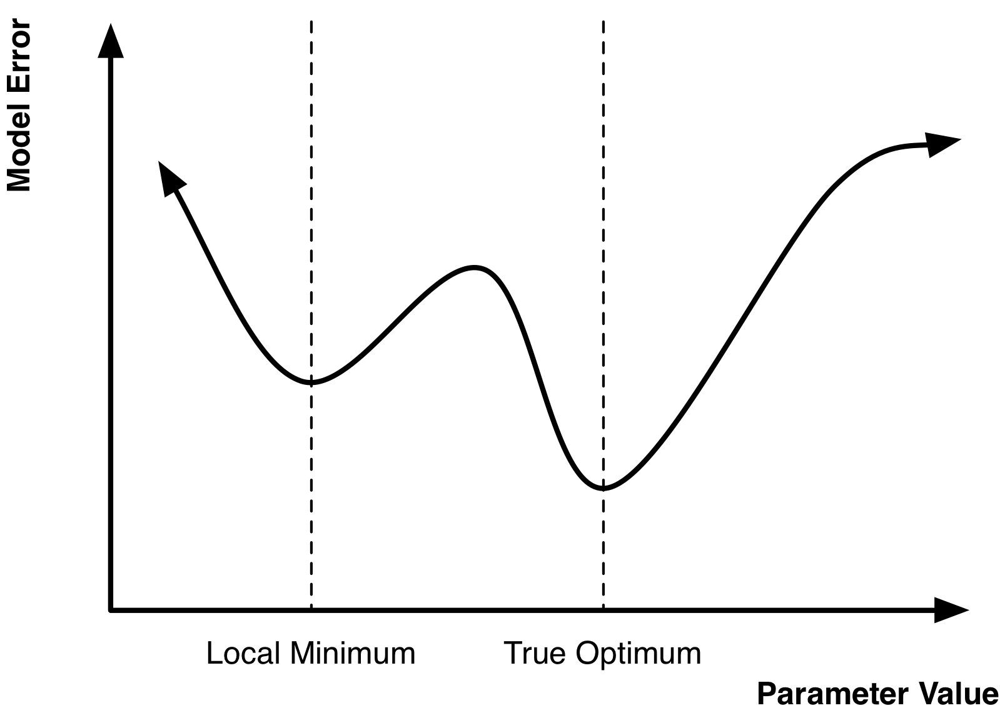
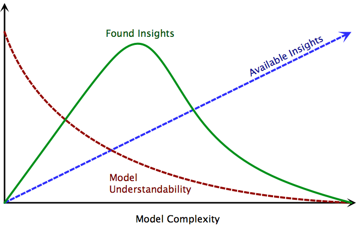
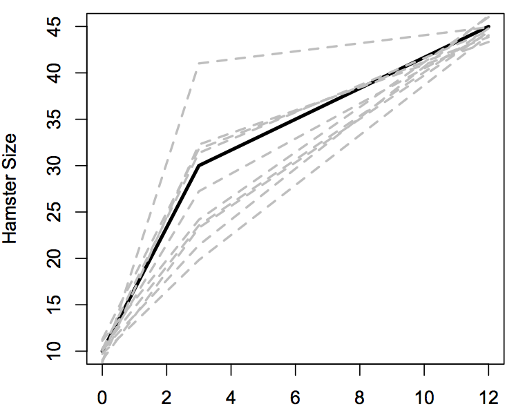
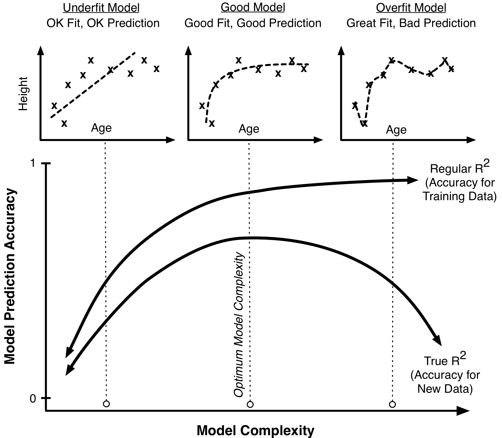

# Optimization and Complexity

We start this chapter by reconsidering our hamster population model from [The Process of Modeling](#ModelingProcess). As you recall, your friend requested our help in constructing a model to simulate the population of the endangered Aquatic Hamsters. There are many ways to exploit valuable empirical data to improve your models. For instance, if we had data on hamster fertility, we might be able to plug that information in directly as a parameter in our hamster population model.

One of the most useful kinds of empirical data is historical time series. Some of these time series might represent data and factors that we include in the model, but they are not directly modeled. For example, we might have historical temperature data. The temperature could be an important thing to include in the model, as it would affect hamster survival, however it is not something we directly model. By this we mean that we do not expect our hamsters to have any effect on the temperature in the region but we do expect the temperature to have an effect on the hamsters. Thus, we can include the temperature data in the model. We can do this by importing this historical temperature data and including it in the model using a converter primitive.

In other cases, the historical data may represent factors you are directly trying to model. For example, we have a data series of biannual hamster population surveys going back 20 years. This data series lets us know roughly how many hamsters there were over time. Because we are trying to model this data, it is not something we plug directly into our model as we could with the temperature, but it is something we can use to calibrate and assess the accuracy of our model.

How do we do this and what will be the results?

## Assessing Model Accuracy

We first import our historical data into a converter primitive. We then assess the qualitative and quantitative accuracy of the model. To assess how well our model fits the historical data qualitatively, we plot the simulated and historical data series next to each other. Ideally, they will match closely but if they do not we should pay close attention to how they differ.

If they have the same general shape (except for a vertical or horizontal displacement) that is good news, as it indicates that most likely the general dynamics of your model are correct and you may just need to fine-tune the relationships and parameter values. If the results look considerably different you may have more work to do in improving the model.

You can also assess the accuracy of models quantitatively. A standard tool used to assess the accuracy of a model is the $R^2$ metric^[Though this metric is not often used in systems dynamics or agent-based models, it is widely used for statistical models such as linear regressions.]. $R^2$ is the fraction of the squared error explained by the model compared to the “null” model. It ranges from 0 (the model basically provides no predictive power) to 1 (the model predicts perfectly). Mathematically, $R^2$ is calculated like so: 

$$ R^2 = \sum_{t} \frac{ (\overline{\text{Truth}}-\text{Truth})^2 - (\text{Model} - \text{Truth})^2}{(\overline{\text{Truth}} - \text{Truth})^2} $$

Naively used, $R^2$ has a number of issues that we will discuss later in this chapter. However, it is still a useful tool that many people use and with which they are familiar. It is also relatively straightforward to calculate. The following code calculates an $R^2$ for a model fit. This is code written in JavaScript and can be placed as the \a{Action} for a button primitive in Insight Maker. The code assumes two primitives: a converter \p{Historical Hamsters} containing historical population sizes and a stock \p{Hamsters} containing simulated population sizes. You can edit the code to reference the actual names of the primitives in your model.

````javascript
var simulated = findName("Hamsters"); // Replace with your primitive name
var historical = findName("Historical Hamsters"); // Replace with your primitive name

var results = runModel({silent: true});

var sum = 0;
for(var t = 0; t < results.periods; t++){
	sum += results.value(historical)[t];
}

var average = sum/results.periods;

var nullError = 0;
var simulatedError = 0;
for(var t = 0; t < results.periods; t++){
	nullError += Math.pow(results.value(historical)[t] - average, 2);
	simulatedError += Math.pow(results.value(historical)[t] - results.value(simulated)[t], 2);
}

showMessage("Pseudo R^2: "+((nullError-simulatedError)/nullError));
````

## Calibrating the Model

In addition to using historical data to assess the model fit, you can also use historical data to calibrate model parameters. Depending on the model, you may have many parameters for which you do not have a good way to determine their values. Earlier, we discussed how to use sensitivity testing to assess whether our results are resilient to this uncertainty and to build confidence in the model. Another way to build confidence in your parameter values is, rather than guessing the values of these uncertain parameters, to choose the set of values that results in the best fit between simulated and historical data. This is a semi-objective criterion that helps to remove potential personal biases from the modeling process.

## Goodness of Fit

The first step in using historical data to calibrate the model parameters is to understand  what is meant by "the best fit" between historical and simulated data. Conceptually, the idea of a "good fit" seems obvious. A good fit is one where the historical and simulated results are very close together (a *perfect* fit is when they are the same, but that is generally more than we can hope for). However, putting a precise mathematical definition on the concept is not trivial.

Many commonly used 'goodness of fit' measures exist; some key measures are listed below.

#### Squared Error

Squared error is probably the most widely used. ^[The main reason is that regular linear regression (ordinary least squares, the most widely used modeling tool) uses squared error as its measure of goodness of fit. Doing so simplifies the mathematics of the regression problem greatly in the linear case.] To calculate the squared error we carry out the following procedure. For each time period we determine the difference between the historical data value and the simulated value, and square that difference. We then determine the sum of these differences to obtain the total error for the fit. Higher totals indicate worse fits, and lower totals indicate better fits.

The following equation could be placed in a variable to calculate the squared error between a primitive named \p{Simulated} and one named \p{Historical}:

\e{ ([Simulated]-[Historical])^2 }

Please note that maximizing the $R^2$ measure we described earlier is equivalent to minimizing the squared error.

#### Absolute Value Error

A characteristic of squared error is that outliers have high penalties compared to other data points. Outliers are points in time where the fit is unusually bad. Since the squared error metric squares the differences between simulated and historical data, large differences can cause even larger errors when they are squared. This can sometimes be a negative feature of squared error if you do not want the outliers to have special prominence and weight in the analysis.

An alternative to squared error that treats all types of differences the same is the absolute value error. Here, the absolute value of the difference between the simulated and historical data series is taken. The following equation could be placed in a variable to calculate the absolute value error between a primitive named \p{Simulated} and one named \p{Historical}:

\e{ Abs([Simulated]-[Historical]) }

#### Other Approaches

Many other techniques are available for measuring error or assessing goodness of fit. Most statistical approaches function by specifying a full probability model for the data and then taking the goodness of fit not as a measure of error, but rather as the *likelihood* of observing the results we saw given the parameter values.^[Likelihood is a technical statistical term. It can be roughly thought of as equivalent to "probability", though it is not precisely that.] To be clear, the issue of optimizing parameter values for models is one that is more complex than what we have presented here. Many sources of error exist in time series, and analyzing them is a very complex, statistical challenge. The basic techniques we have presented are, however, useful tools that serve as gateways toward further analytical work.

~ Exercise

You have a model simulating the number of widgets produced at a factory. The model contains a stock, \p{Widgets}, containing the simulated number of widgets produced. You also have a converter, \p{Historical Production}, containing historical data on how many widgets were produced in the past.

Write two equations. One to calculate squared error for the model's simulation of historical production, and one to calculate the absolute value error of the same.

~ Answer

Squared error:

\e{ ([Widgets]-[Historical Production])^2 }

Absolute value error:

\e{ Abs([Widgets]-[Historical Production]) }

~ End Exercise

~ Exercise

You like the idea of penalizing outliers in your optimizations. In fact, you like this idea so much that you would like to penalize outliers even more than squared error does. Create an equation to calculate error that penalizes outliers more than squared error.

~ Answer

\e{ ([Simulated]-[Historical])^4 }

~ End Exercise

~ Exercise

Describe why this is not a valid equation to calculate error:

\e{ [Simulated]-[Historical] }

~ Answer

The optimizer can always minimize this simply making \p{Simulated} as small as possible. This will not result in a fit to the historical data.

~ End Exercise

## Multi-Objective Optimizations

So far our examples have focused on optimizing parameter values for a single population of animals. But what if we had two or more populations?

Imagine we were simulating two interacting populations of animals such as the hamsters and their food source, the Hippo Toads. If we had historical data on both the toads and the hamsters, we would want to choose parameter values that result in the best fit both between the simulated and historical hamster populations, and the simulated and historical toad populations. This is often quite difficult to achieve, as optimizing the fit for one population will often result in non-optimal fits for the second population.

A straightforward way to try to optimize both populations at once is to make our overall error the sum of the errors for the hamsters and the errors for the toads. For instance, if we had two historical data converters, one for the toads and hamsters, and two stocks, one for each population, the following equation would combine the absolute value errors for both populations.

\e{ Abs([Simulated Hamsters]-[Historical Hamsters]) + Abs([Simulated Toads]-[Historical Toads]) }

Simply summing the values can create issues in practice. Let us imagine that the toad population is generally 10 times as large as the hamster population. If this were the case, the error predicting the toads might be much larger than the error predicting the hamsters, thus the optimizer will be forced to focus on optimizing the toad predictions to the detriment of the accuracy of the hamster predictions.

One way to attempt to address this issue is to use the percent error instead of the error magnitude. For example:

\e{ Abs([Simulated Hamsters]-[Historical Hamsters])/[Historical Hamsters] + Abs([Simulated Toads]-[Historical Toads])/[Historical Toads] }

The percent error metric will be more resilient to differences in scales between the different populations. However, it will run into issues if either historical population becomes 0 in size or becomes very small.

Another wrinkle with multi-objective optimizations is that one objective may be more important than the other objectives. For instance, let's imagine our toad and hamster populations were roughly the same size so we do not have to worry about scaling. However, in this case we care much more about correctly predicting the hamsters than we do the toads. The whole point of the model is to estimate the hamster population, so we want to make that as accurate as possible, but we would still like to do well predicting the toads if we are able to.

You can tackle issues like these by "weighting" the different objectives in your aggregate error function. This is most simply done by multiplying the different objectives by a quantity, indicating their relative importance. For instance, if we thought getting the hamsters right was about twice as important as getting the toads right, we could use something like:

\e{ 2*Abs([Simulated Hamsters]-[Historical Hamsters]) + Abs([Simulated Toads]-[Historical Toads]) }
 
This makes one unit of error in the hamster population simulation count just as much as two units of error for the toad population simulation.^[Weighting is a useful technique you can use for other optimization tasks. Imagine you had a model simulating the growth of your business in the next 20 years. You want to use this model to adjust your strategy to achieve three objectives: maximizing revenue, maximizing profit, and maximizing company size. Potentially maximizing profit would be the most important objective, with maximizing company size being the least important. You can use weights to combine these three criteria into a single criterion for use by the optimizer.].

~ Exercise

Why does the percent error equation have issues when the historical data become very small? What happens when the historical data becomes 0?

~ End Exercise


## Finding the Best Fit

After choosing how to measure the quality of a fit quantitatively, we need to find the set of parameter values that maximize the fit and minimize the error. To do this we use a computer algorithm called an optimizer that automatically experiments with many different combinations of parameter values to find the set of parameters that has the best fit.

Many optimizers start with an initial combination of parameter values and measure the error for that combination. The optimizer then slightly changes the parameter values in order to check the error at nearby combinations of parameter values. For instance, if you are optimizing one parameter, say the hamster birth rate, and your initial starting value is a birth rate of 20% per year; the optimizer will first measure the error at 20% and then measure the errors at 19% and 21%.

If one of the neighbors has a lower error than the initial starting point, the optimizer will keep testing additional values in that direction. It will steadily "move" toward the combination of parameters that results in the lowest error, one step at a time. If, however, the optimizer does not find any nearby combination of parameter values with a lower error than its current combination of parameter values, it will assume it has found the optimal combination of parameter values and stop searching for anything better.

The precise details of optimization algorithms are not important. You need to be aware of one key thing however: these algorithms are not perfect and they sometimes make mistakes. The root cause of these mistakes are so-called "local minimums". An optimizer works by searching through combinations of different parameter values trying to find the combination that minimizes the error of the fit. The combination that has the smallest error is known as the true minimum or the "global" minimum.

A local minimum is a combination of parameter values that is not the global minimum, yet whose nearby neighbors all have higher errors. Figure 1 illustrates the problem of local minimum. If the optimizer starts near the first minimum in this figure it might head toward that minimum without ever realizing that another, improved minimum exists. Thus, if you are not careful, you may think you have found the optimal set of parameters when in fact you have only found a local minimum that might have much worse error than the true minimum.



There is no foolproof way to deal with local minimums and no guarantee that you have found the true minimum. ^[This is true for the type of optimization problems you will generally be dealing with. Other types of optimization problems are much easier than the ones you may be encountering; they are known as *convex* optimization problems and are guaranteed not to have any local minimums.] The primary method for attempting to prevent an optimization from settling in on a local minimum is to introduce stochasticity into the optimization algorithm. Optimization techniques such as *Simulated Annealing* or *Genetic Algorithms* will sometimes choose combinations of parameter values at random that are actually *worse* than what the optimizer has already found. By occasionally moving in the "wrong" direction, away from the nearest local minimum, these optimization algorithms are more resilient and less likely to become stuck on a local minimum and more likely to keep searching for the global minimum.

Unfortunately, we have not been satisfied by the performance of these types of stochastic optimization algorithms. They are generally very slow and without fine-tuning by an expert can still easily become stuck in a local minimum. We prefer to use non-stochastic deterministic methods as the core of our optimizations. We then introduce stochasticity into the algorithm by using multiple random starting sets of parameter values. For instance, instead of carrying out a single optimization we will do 10 different optimizations, each starting at a different set of parameter values. If all 10 optimizations arrive at the same final minimum that is strong evidence we have found the global minimum. If they all arrive at different minima, then there is a good chance we have not found the global minimum.

# Model
{"title": "Optimizing Parameter Values", "description": "This model illustrates the use of optimization and historical data to select the growth rate for a simulated population of hamsters."}

{"geometry":{"x":270,"y":150,"width":120,"height":50},"name":"Historical Hamsters","create":"Converter"}

{"attribute":"Data","target":"Historical Hamsters","value":"0, 22; 2, 49; 4, 40; 6, 61; 8, 100; 10, 104; 12, 153; 14, 243; 16, 236; 18, 370; 20, 560"}

DIAGRAM

We start by importing our historical population data into a converter primitive. In this illustrative example we have twenty years of data with a census of the hamster population being carried out every two years. We run the model to see what this historical data looks like.

RESULTS

There is a lot of variability and the population even declines in some years. However, it looks like in general the rate of growth increases as the population size increases. This is what we would expect to see with exponential growth. Let's build a simple exponential growth model to attempt to replicate what we see with the historical data.

{"geometry":{"x":480,"y":260,"width":100,"height":40},"name":"Hamsters","create":"Stock"}

{"geometry":{"x":0,"y":0,"width":100,"height":100,"sourcePoint":{"x":530,"y":120},"targetPoint":{"x":0,"y":100}},"alpha":null,"omega":"Hamsters","name":"Net Population Growth","create":"Flow"}

{"geometry":{"x":620,"y":105,"width":120,"height":50},"name":"Net Growth Rate","create":"Variable"}

{"geometry":{"x":0,"y":0,"width":100,"height":100},"alpha":"Net Growth Rate","omega":"Net Population Growth","create":"Link"}

{"geometry":{"x":0,"y":0,"width":100,"height":100},"alpha":"Historical Hamsters","omega":"Hamsters","create":"Link"}

DIAGRAM

That's the structure of our model. Now we can fill in the equations. We'll set the initial population size for our simulated hamster population to be the same as for the historical data.

{"attribute":"InitialValue","target":"Hamsters","value":"[Historical Hamsters]"}

{"attribute":"FlowRate","target":"Net Population Growth","value":"[Hamsters]*[Net Growth Rate]"}

What growth rate should we begin with? We do not have any data on this. Let's experiment by starting with 10% per year and see what we end up.

{"attribute":"Equation","target":"Net Growth Rate","value":"0.1"}

{"attribute":"Primitives","target":"DISPLAY","value":["Hamsters", "Historical Hamsters"]}

RESULTS

That does not look too great. Our simulated population is much smaller than the historical values. Let's try a larger growth rate, say 30%.

{"attribute":"Equation","target":"Net Growth Rate","value":"0.3"}

RESULTS

That's not good either, now our population is too large! We could keep experimenting with different growth rates to find a good one, but that might take a while. Let's just let the optimizer do the work for us. First we need to create a primitive to hold the error. We will use the squared error measure we discussed earlier.

{"geometry":{"x":330,"y":330,"width":120,"height":50},"name":"Squared Error","create":"Variable"}

{"geometry":{"x":0,"y":0,"width":100,"height":100},"alpha":"Hamsters","omega":"Squared Error","create":"Link"}

{"geometry":{"x":0,"y":0,"width":100,"height":100},"alpha":"Historical Hamsters","omega":"Squared Error","create":"Link"}

{"attribute":"Equation","target":"Squared Error","value":"([Hamsters]-[Historical Hamsters])^2"}

DIAGRAM

There, we have set up what we need for the optimizer to work. Now we can run the optimizer. We set the *Goal Primitive* to [Squared Error] and the *Primitive to Change* to [Net Growth Rate]. We tell the optimizer to minimize the integral of the error and set the optimizer to work.

The optimizer gets our results almost instantly: 0.172 or 17.2% is the optimal growth rate. When we run the model with this value the results look great. It's an almost perfect match between the historical and simulated data.

{"attribute":"Equation","target":"Net Growth Rate","value":"0.172"}

{"attribute":"Primitives","target":"DISPLAY","value":["Hamsters", "Historical Hamsters"]}

RESULTS

# End Model

~ Exercise

You are building a model to simulate company profits into the future. You will use 30 years of historical company profit data to calibrate parameter values using an optimizer.

Choose an error measure to use. Justify this choice and explain why you would use it instead of other measures.

~ End Exercise

~ Exercise

Calculate the pseudo $R^2$ for \p{Growth Rate} = \e{0.1}, \e{0.3}, and \e{0.172}.

~ End Exercise

~ Exercise

Adjust the JavaScript code to calculate pseudo $R^2$ to use absolute value error instead of squared error.

~ Answer

Change:

````javascript
nullError += Math.pow(results.value(historical)[t] - average, 2);
simulatedError += Math.pow(results.value(historical)[t] - results.value(simulated)[t], 2);
````

To: 

````javascript
nullError += Math.abs(results.value(historical)[t] - average);
simulatedError += Math.abs(results.value(historical)[t] - results.value(simulated)[t]);
````

~ End Exercise

~ Exercise

Describe local minimum, why they cause issues for optimizers, and strategies for dealing with them.

~ End Exercise


## The Cost of Complexity {#ComplexityCost}

After a good deal of work and many sleepless nights you have completed the first draft of your Aquatic Hamster population model. The results are looking great and your friend is really impressed. When he runs it by some colleagues however, they point out that your model does not account for the effects of the annual Pink Spotted Blue Jay migration.

Pink Spotted Blue Jays (PSBJ) migrate every fall from northern Canada to Florida. In the spring they return from Florida to Canada. Along the way, they usually spend a few days by the lake where the Aquatic Hamsters have their last colony. During this time they eat the same Orange Hippo Toads the hamsters themselves depend on. By reducing the Hippo Toad population, the PSBJ negatively affect the hamsters, at least for this period of time when there is less food available to support them.

The timing of the PSBJ migration can vary by several weeks each year; no one knows precisely when the PSBJ's will arrive at the lake or even how long they will stay there. Further, the population of migrating birds can fluctuate significantly with maybe 100 birds arriving one year and 10,000 another year. The amount of toads they eat is proportional to the number of birds. Not much data exist quantifying the birds' effects on the hamsters, but it is a well-established fact that they eat the Hippo Toads the hamsters rely upon for their survival and many conservationists are concerned about the migration.

Your friend's colleagues wonder why you have decided to not include the PSBJ migration in your model. They want to know how they can trust a model that does not include this factor that clearly has an effect on the hamster population.

In response, you may point out that though the migration clearly has an impact, it appears to be a small one that is not as important as the other factors in the model. You add that there are no scientific studies or theoretical basis to define exactly how the migration functions or how it affects the hamster population. Given this, you think it is probably best to leave it out.

You say all this, but they remain unconvinced. "If there is a known process that affects the hamster population, it should be included in the model," they persist. "How can you tell us we shouldn't use what we know to be true in the model? We know the migration matters, and so it needs to be in there."

### The Argument for Complexity

Your friend's colleagues have a point. If you intentionally leave out known true mechanisms from the model, how can you ask others to have confidence in the model? Put another way, by leaving out these mechanisms you ensure the model is wrong. Wouldn't the model *have* to be better if you included them?

On the surface this argument is quite persuasive. It innately makes sense and appeals to our basic understanding of the world: Really it seems to be "common sense".

It is also an argument that is wrong and very dangerous.

Before we take apart this common sense argument piece by piece, let us talk about when complexity is a good thing. As we will show, complexity is not good from a modeling standpoint, but it can sometimes be a very good tool to help build confidence in your model and to gain support for the model.

Take the case of the PSBJ migration. It might be that adding a migration component to the model ends up *not* improving the predictive accuracy of the model. However, if other people view this migration as important, you may want to include the migration in the model if for no other reason than to get them on board. Yes, from a purely "prediction" standpoint it might be a waste of time and resources to augment the model with this component, but this is sometimes the cost of gaining support for a model. A "big tent" type model that brings lots of people on board might not be as objectively good as a tightly focused model, but if it can gain more support and adoption it might be able to effect greater positive change.

### The Argument Against Complexity

Generally speaking, the costs of complexity to modeling are threefold. Two are self evident: there are computational costs to complex models, as they take longer to simulate, and there are cognitive costs, in that they are harder to understand. There is, however, a third cost to complexity that most people do not initially consider: complex models are often less accurate than simpler ones.

In the following sections we detail each of these three costs.

#### Computational Performance Costs

As a model becomes more complex, it takes longer to simulate. When you start building a model it may take less than a second to complete a simulation. As the model's complexity grows, the time required to complete a simulation may grow to a few seconds, then to a few minutes, and possibly even a few hours or more.

Lengthy simulation times can significantly impede model construction and validation. The agile approach to model development we recommend is predicated on rapid iteration and experimentation. As your simulation times cross beyond even something as small as 30 seconds, model results will no longer be effectively immediate and your ability to rapidly iterate and experiment will be diminished.

Furthermore, when working with an optimizer or sensitivity-testing tool, performance impacts can have an even larger effect. An optimization or sensitivity testing tool may run the model thousands of times or more in its analysis, so even a small increase in the computation time for a single simulation may have a dramatic impact when using these tools.

Optimizations themselves are not only affected by the length of a simulation, they are also highly sensitive to the *number* of parameters being optimized. You should be extremely careful about increasing model complexity if this requires the optimizer to adjust additional parameter values. A simplistic, but useful, rule of thumb is that for every parameter you add to be optimized, the optimization will take 10 times as long.^[In practice an optimizer should ideally perform a bit better than this, but this provides a useful guideline to understand optimizations. Also, it should be noted that the optimizations we are talking about here are for non-linear optimization problems, for which gradients (derivatives) cannot be directly calculated. For other types of optimization problems, such as linear problems, much faster optimization techniques are available.]

Thus, if it takes one minute to find the optimal value for one parameter, it takes 10 minutes to find the optimal values for two parameters and 100 minutes to find the optimal values for three parameters. Imagine we had built a model and optimized five parameters at once. We have increased the model complexity so we now have to optimize ten parameters. Our intuition would be that the optimization would now take twice as long. This is wrong. Using our power of ten rule we know that the time needed will be closer to $10^5$ or 100,000 times as long!

That is a huge difference and highlights the importance of managing model complexity. A rule of thumb is that you should have no difficulty optimizing one or two parameters at a time. As you add more parameters, the optimization task becomes rapidly more difficult. At approximately five parameters you have a very difficult but generally tractable optimization challenge. Above five parameters you may be lucky to obtain good results.

#### Cognitive Costs

In addition to the computational cost of complexity, there is also a cognitive cost. As humans we have a finite ability to understand systems and complexity. This is partly why we model in the first place: to help us simplify and understand a world that is beyond our cognitive capacity.

Let’s return to our hamster population model. Including the bird migration could make it more difficult to interpret the effects of the components of the model and extract insights from them. If we observe an interesting behavior in the expanded model we will have to do extra work to determine if it is due to the migration or some other part of the model. Furthermore, the migration may obscure interesting dynamics in the model, making it more difficult for us to understand the key dynamics in the hamster system and extract insights from the model. 

We can describe this phenomenon using a simple conceptual model defined by three equations. The number of available insights in a model is directly proportional to model complexity. As the model complexity increases, the number of insights available in the model also grows.

$$ \text{Available Insights} \propto \text{Complexity} $$

Conversely, our ability to understand the model and extract insights from it is inversely proportional to model complexity. $\alpha$ is a constant indicating the degree to which understandability decreases as complexity increases. This relationship is non-linear, as each item added to a model can interact with every other item currently in the model. Thus, the cognitive burden increases exponentially as complexity increases.

$$ \text{Understandability} \propto \alpha^{-\text{Complexity}} $$

The number of insights we actually gain from a model is the product of the number of available insights and our ability to understand the model:

$$ \text{Insights} = \text{Available Insights} \times \text{Understandability} $$



Thus when the model complexity is 0 -- in effect basically no model -- we gain no insights from the model. As the model complexity increases we begin to gain additional insights. After a certain point however, the added model complexity actually inhibits additional understanding. As complexity rises our insights will fall back down towars 0. This phenomenon is illustrated in Figure 2.

#### Accuracy Costs

The negative effects of complexity on computational performance and our cognitive capacity should not be a surprise. On the other hand, what may be surprising is the fact that complex models are in fact often *less accurate* than simpler alternatives.

To illustrate this phenomenon, let us imagine that for part of our hamster population model we wanted to predict the size of the hamsters after a year. ^[Size could affect hamster survival and fertility, so it could be an important variable to model.] The hamsters go through two distinct life stages in their first year: an infant life stage that lasts 3 months and a juvenile life stage that lasts 9 months. The hamsters’ growth patterns are different during each of these periods.

Say a scientific study was conducted measuring the sizes of 10 hamsters at birth, at 3 months, and at 12 months. The measurements at birth and at 12 months are known to be very accurate (with just a small amount of error due to the highly accurate scale used to weigh the hamsters). Unfortunately, the accurate scale was broken when the hamsters were weighed at 3 months and a less accurate scale was used instead for that period. The data we obtain from this study are tabulated below and plotted in Figure 3:

Hamster | Birth | 3 Months | 12 Months
---|---|---|---
1  |  9.0 | 23.2 | 44.4
2  |  9.7 | 19.8 | 44.0
3  | 10.2 | 23.5 | 44.7
4  |  8.8 | 32.2 | 43.3
5  | 10.1 | 31.3 | 44.5
6  | 10.0 | 27.2 | 44.2
7  | 10.0 | 21.4 | 46.1
8  | 11.1 | 24.1 | 46.0
9  |  8.7 | 41.0 | 44.9
10 | 11.2 | 31.7 | 43.8



Now, unbeknownst to us, there is a pair of very simple equations that govern Aquatic Hamster growth. During the infant stage (first 3 months) they gain 200% of their birth weight. Their growth rate slows down once they reach the juvenile stage such that at the end of the juvenile stage their weight is 50% greater than it was when they completed the infant stage. Figure 3 plots this true (albeit unknown) size trajectory compared to the measured values. The higher inaccuracy of the measurements at 3 months compared to 0 and 12 months is readily visible in this figure by the greater spread of measurements around the 3 month period.

We can summarize this relationship mathematically:

$$ \text{Size}_{t=\text{3 months}} = 3.00 * \text{Size}_{t=\text{0 months}} $$
$$ \text{Size}_{t=\text{12 months}} = 1.50 * \text{Size}_{t=\text{3 months}} $$

Naturally, we can combine these equations to directly calculate the weight of the hamsters at 12 months from their weight at birth:

$$ \text{Size}_{t=\text{12 months}} = 4.50 * \text{Size}_{t=\text{0 months}} $$

Again, we don't know this is the relationship, so we need to estimate it from the data. All we care about is the size of hamsters at 12 months given their birth size. The simplest way to estimate this relationship is to do a linear regression estimating the final size as a function of the initial size. This regression would result in the following relationship:

$$ \text{Size}_{t=\text{12 months}} = 4.65 * \text{Size}_{t=\text{0 months}} $$

This result is quite good. The estimated linear coefficient of 4.65 is very close to the true value of 4.50. So far our model is doing pretty well.

However, like with the bird migration, someone might point out that this model is too crude. "We know that the hamsters go through an infant and juvenile stage", they might say, "we should model these stages separately so the model is more accurate."

This viewpoint has actually been upheld in legal cases. For instance, there have been judicial decisions that "life-cycle" models, those that model each stage of an animal's life are the only valid ones. ^[Technically the determination is that life-cycle models are the "best available science". These decisions are misguided and frankly wrong, but that is what occurs when judges are put in the position of making highly technical scientific decisions.] If we were presenting this model to an audience that believed that, we would have to create two regressions: one for the infant stage and one for the juvenile stage.

Using the data we have, we would obtain these two regressions:

$$ \text{Size}_{t=\text{3 months}} = 2.74 * \text{Size}_{t=\text{0 months}} $$
$$ \text{Size}_{t=\text{12 months}} = 1.54 * \text{Size}_{t=\text{3 months}} $$

Combining these regression to get the overall size change for the 12 months we obtain the following:

$$ \text{Size}_{t=\text{12 months}} = 4.22 * \text{Size}_{t=\text{0 months}} $$

Now, in this example we are fortunate to know that the true growth multiplier should be 4.50, so we can test the accuracy of our regressions. The error for this relatively detailed life-cycle model is $(4.50-4.22)/4.50$ or 6.2%. For the "cruder" model where we did not model the individual stages, the overall error is $(4.50-4.65)/4.50$ or 3.3%.

So by trying to be more accurate and detailed, we built a more complex model that has almost twice the error of our simpler model! Let's repeat that: The more complex model is significantly less accurate than the simpler model.

Why is that? We can trace the key issue back to the problem that our data for the 3 month period are significantly worse than our data for 0 months or 12 months. By introducing this data into the model, we reduce the overall quality of the model by injecting more error into it. When someone asks you to add a feature to a model you have to consider if this feature may actually introduce more error into the model as it did in this example.

We can think of life-cycle and many other kinds of models as a chain. Each link of the chain is a sub-model that transforms data from the previous link and inserts them into the next. Like a chain, models may only be as good as their weakest link. It is often better to build a small model where all the links are strong, than a more complex model with many weak links.

~ Exercise

Implement a model tracking the growth of a hamster from birth to 12 months. Create the model for a single hamster and then using sensitivity testing to obtain a distribution of hamster size. Assume hamster are born with an average size of 10 and a standard deviation of 1. Use the true parameter growth rates and do not incorporate measurement uncertainty in the model;

~ End Exercise

~ Exercise

Define a procedure for fitting a System Dynamics model of hamster growth to the hamster growth data in the table. Assume you know that there are two linear growth rates for the infant and juvenile stages but you do not know the values of these rates.

~ Answer

Example procedure:

1. Find the average hamster size at each time period by taking the mean of observations at that period.
2. Define two variables in the model: \p{Infant Rate} and \p{Juvenile Rate}.
3. Define an error primitive \p{Error} the equation taking the absolute value of the difference between the simulated size and the average empirical size.
4. Run the optimizer to minimize this error term by adjusting the two rate variables.

~ End Exercise

~ Exercise

Apply the optimization procedure to your System Dynamics model to determine the hamster rates of growth from the empirical data.

~ End Exercise


##### Overfitting

The act of building models that are too complex for the data you have is known as "overfitting" the data. ^[The reverse -- building models that are too simple -- is called "underfitting". In practice, underfitting will be less of a problem, as our natural tendency is to overfit.] In the model of hamster sizes, the model where we look at each life stage separately is an overfit model; we do not have the data to justify this complex of a model. The simpler model (ignoring the different stages) is superior.

Overfitting is unfortunately too common in model construction. This is partially because the techniques people use to assess the accuracy of a model are often incorrect and inherently biased to cause overfitting. To see this, let's explore a simple example. Say we want to create a model to predict the heights of students in high school (this is seemingly trivial, but bear with us). To build the model we have data from five hundred students at one high school.

We begin by averaging the heights of all the students in our data set and find that the average student height is 5 feet 7 inches. That number by itself is a valid model for student height. It is a very simple model^[Statisticians would call this the "null" model, the simplest model possible.], but it is a model nonetheless: Simply predict 5 feet 7 inches for the height of any student.

We know we can make this model more accurate. To start, we decide to create a regression for height, where gender is a variable. This gives us a new model that predicts women high-school students have a height of 5 feet 5 inches on average, while men have a height of 5 feet 9 inches on average. We calculated the $R^2$ for the model to be 0.21.

That's not bad, but for prediction purposes we can do better. We decide to include students' race as a predictor, as we think that on average there might be differences in heights for different ethnicities. We complete this extended model including ethnic status as a predictor alongside gender and the $R^2$ fit of our model increases to 0.33.

We think we can do even better, so we add age as a third predictor. We hypothesize that the older the students are, the taller they will be. The model including age as an additional linear variable is significantly improved with an $R^2$ of 0.56. 

Once we have built this model, we realize that maybe we should not just have a linear relationship with age because as students grow older, their rate of growth will probably slow down. To account for this we decide to also include the square of age in our regression. With this added variable our fit improves to an $R^2$ of 0.59.

This is going pretty well; we might be on to something. But why stop with the square? What happens if we add higher order polynomial terms based on age? Why not go further and use the cube of age? The fit improves slightly again. We think we are on a roll and so we keep going. We add age taken to the fourth power, and then to the fifth power, and then to the sixth, and so on.

We get a little carried away and end up including 100 different powers of age. Each time we add a new power our $R^2$ gets slightly better. We could keep going, but it's time to do a reality check.

Do really we think that including $\text{AGE}^{100}$ made our model any better than when we only had 99 terms based on age? According to the $R^2$ metric it did (if only by a very small amount). However, intuitively we know it did not. Maybe the first few age variables helped, but once we get past a quadratic ($\text{AGE}+\text{AGE}^2$) or cubic ($\text{AGE}+\text{AGE}^2+\text{AGE}^3$) relationship, we probably are not capturing any more real characteristics of how age affects a person's size.

Variables | $R^2$
---|--
Gender | 0.21
Gender, Race | 0.33
Gender, Race, Age | 0.56
Gender, Race, $\text{Age}^2$ | 0.59
Gender, Race, $\text{Age}^2$, ..., $\text{Age}^{100}$  | 0.63
Gender, Race, $\text{Age}^2$, ..., $\text{Age}^{500}$  | 1.00

So why does our reported model accuracy -- $R^2$ -- keep getting better and better as we add these higher order power terms based on age to our regression?

This question is at the heart of overfitting. Let's imagine taking our exploitation of age to its logical conclusion. We could build a model with 500 different terms based on age ($\text{AGE}+\text{AGE}^2+\text{AGE}^3+...+\text{AGE}^{500}$). The result of this regression would go through every single point in our population of five hundred students. ^[Remember a polynomial equation with two terms can perfectly pass through two data points, an equation with three terms can perfectly pass through three points, and so on.] This model would have a perfect $R^2$ of one (as it matches each point perfectly) but intuitively we know that it would be a horrible model.

Why is this model so bad? Imagine two students born a day apart. Today one has a height of 6 feet 2 inches the other has a height of 5 feet 5 inches. Our model would indicate that a single day caused a 7-inch difference in height.  Even more ridiculous, the model would predict a roller coaster ride for students as they aged. According to the model they would gain inches one day and lose them the next. Clearly this model is nonsensical. However, this nonsensical model has a perfect $R^2$. It is a paradox!

The key to unlocking the solution to the paradox and overcoming overfitting turns out to be surprisingly simple: *assess the accuracy of a model using data that were not used to build the model*.

The reason our overfit model for students looks so good using the $R^2$ error metric is that we measured the $R^2$ using the same data that we just used to build the model. Clearly this is an issue, as we can force an arbitrarily high $R^2$ simply by continually increasing the complexity of our model. In this context the $R^2$ we are calculating turns out to be meaningless.

What we need to do is to find new data -- new students -- to test our model on. That will be a more reliable test of its accuracy. If we first built our model, applied it to a different high school, and calculated the $R^2$ using this new data, we would obtain a truer measure of how good our model actually was.

Figure 4 illustrates the effect of overfitting using observation from 9 students. The top three graphs plot the heights and ages for these nine students. We fit three models to these data: a simple linear one, a quadratic polynomial, and an equation with nine terms so that it goes through each point exactly.

Below the three graphs we show the regular $R^2$ that most people use when fitting models, and what the true $R^2$^[You might have heard of $R^2$ variants such as the Adjusted $R^2$. The Adjusted $R^2$ is better than the regular $R^2$; however it is important to note that it is not the true $R^2$. Adjusted $R^2$ also has some issues with overfitting.] would be if we applied the resulting model to new data. The regular $R^2$ always increases, so if we used this naive metric we would always choose the most complex model. As we can see, the true accuracy of the model decreases after we reach a certain complexity. Therefore, in this case the middle model is really the better model. When illustrated like this, this concept of overfitting should make a lot of sense; but, surprisingly, it is often overlooked in practice even by modeling experts. 



In general, overfitting should be watched for carefully. If you do not have a good metric of model error, the inclination to add complexity to your model will be validated by misleadingly optimistic measures of error that make you think your model is getting better, when it is actually getting worse. The optimization techniques we described earlier in this chapter are also susceptible to these problems, as every time you add a new variable to be optimized the optimization error will always go down further (assuming the true optimal parameter configuration can be found). The more parameters you add the worse this effect will be. 

How do we estimate the true error of the model fit? The simplest approach is to split your dataset into two parts. Build the model with one half of the data and then measure the accuracy using the other half. With our high-school students we would randomly assign each dataset to be used either to build the model or to assess the model’s error. Advanced statistical techniques such as *cross-validation* or *bootstrapping* are other approaches and can be more effective given a finite amount of data. Unfortunately, we do not have space to discuss them here, but we would recommend exploring these on your own if you are interested in this topic. 

No one ever got fired for saying, "Let's make this model more complex." After this chapter, we hope you understand why this advice, though safe to say, is often exactly the wrong advice.

~ Exercise

What is overfitting? What is underfitting?

~ End Exercise

~ Exercise

You have been asked to evaluate a model built by a consulting company. The company tells you that their model has an $R^2$ of 0.96 and is therefore a very accurate model.

Do you agree? What questions or tests do you need to do to determine if the model is good?

~ End Exercise

