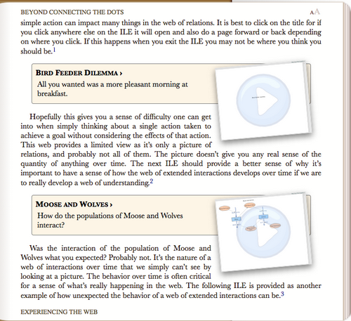

## Preface ##

We set out to develop an interactive ebook on modeling and simulation introducing Insight Maker. As it turned out, after a few months we had actually developed an interactive book on modeling and simulation introducing Insight Maker. What we realized, upon arriving at the goal, was that the world didn't need another book on modeling and simulation and it surely didn't need an Insight Maker users guide. And, glitzy technology couldn't turn what we had developed into what it needed to be. Though a glitzy technology oriented book on modeling and simulation that read like an Insight Maker users guide was just what we had created.

Fortunately for us a couple of our insightful and courageous sponsors were willing to tell us in no uncertain terms that the emperor had no clothes, and they were willing to repeat this until we got the message. So the reconstruction, along with a couple of intense positioning discussions ensued. During that exchange our thoughts migrated from thinking of the creation as a book, to thinking of it as an app, and finally as an Interactive Learning Environment (ILE), though not an ILE about modeling and simulation or about Insight Maker. The realization that emerged was that the ILE needed to present an approach for the user to better understand and deal with the world around them in a manner significantly better than they would have been able too before interacting with this ILE.

With this awakening the label for this creation began to look something like "Systems Insights for Y/Our Future: An Interactive Learning Environment." Aren't you pleased we decided to name it something else? The August 30, 2013 beta release of Chapter 1 and Chapter 2 served as a good model for the direction of the first few chapters. And with this emphasis on interactive there was a question as to the sensibility of trying to create a physical copy of the ILE. There are valuable aspects of interaction that would be completely lost in a physical copy of the ILE. You can let us know your whether our thoughts were appropriate after you experience this interactive learning environment.

An additional realization is that the ILE is just that, an interactive learning environment. It is not a development environment. While one can construct models and simulations in the environment any serious development should be done in Insight Maker at InsightMaker.com. There are critical functions that can be performed on a workstation for which there are no equivalent on a tablet or cell phone, e.g., mouseover, shift+click, ctrl+click, which are critical operations for some  aspects of development. As you experience the restructured first few chapters you'll get a sense of this if you're on a tablet or cell phone, and the alternatives will be described initially where appropriate.

## Introduction ##

People tend to read books in different ways. With that in mind we've designed this ILE so all the essential concepts are presented in the first chapter. We recommend that you read Chapter 1 and interact with the models presented. Chapter 2 and 3 provide examples which reinforce these concepts and are recommended. The remainder of the chapters contain related modeling and simulation concepts that may be read in any desired order.\

In the first three chapters you will be presented with concepts and access to models as in the following figure. Clicking the title of the model will open the model and place you in a storytelling mode.

Read the directions at the bottom of the page and click **Step Forward** at the bottom right to unfold the model. When you click **Close** at the top of the model you will be returned you to the same point in the content where you entered the model.

As you unfold the model you will be provided with a description of aspects of the model along with associated concepts. Some models are qualitative and only contain pictorial relationships and some are actually simulations where parameters will be changed and the simulation run to produce a relationship trends over time. In most of these simulation models you will be placed in an interactive mode where you get to alter parameters and run the simulation to develop a better sense of the implications of the relationships. A few also provide the opportunity for you to construct simple example models for certain concepts. The intent it to allow you to learn through interaction with models and simulations. Each situation will be explained when presented.

For each model there is an footnote which will provide a link to the actual source of the model at InsightMaker.com. There you may clone a copy of the model that you will own. You can then interact with your copy of the model with all the features of Insight Maker.

There are numerous exercises presented. Some of these are presented with answers you can review and others are simply presented as questions related to concepts that it is considered appropriate to reflect on. Doing this reflection with others can be very beneficial.

There are a couple of the implications of this being an interactive learning environment rather than a development environment are:

- **No Storytelling Exit**. There is no way to exit from the storytelling mode. You can open the Toolbar and Configuration Panel and make changes to any model while in storytelling mode, and run simulations where appropriate, though these changes can not be saved.
- **Insight Maker Model Link**. For each model that exists in Insight Maker there will be a footnote that contains a link to that model in Insight Maker. You can follow this link to access the source model. There you can clone the model and make changes to your copy to as you wish.

~~~~~
September 16, 2013
Gene & Scott
~~~~~
