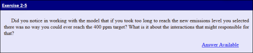
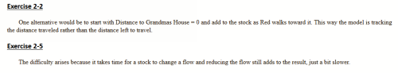

## Preface ##

What you are reading now is the product of a long journey with many twists and turns.

We set out to develop an interactive book on modeling and simulation using Insight Maker. As it turned out, after a few months what had actually been developed was, as expected, an interactive ebook on modeling and simulation using Insight Maker. What we realized, upon arriving at the goal, was that the world didn't need another book on modeling and simulation and it surely didn't need an Insight Maker users guide. And, glitzy technology couldn't turn what we had developed into what it needed to be.

Fortunately for us, our insightful and courageous backers were willing to tell us in no uncertain terms that the emperor had no clothes, and they repeated this until we got the message. So the reconstruction, along with a couple of intense positioning discussions ensued. During that exchange our thoughts migrated from thinking of the creation as an regular book, to thinking of it as an App, and finally as an Interactive Learning Environment (ILE).

In our minds, the key aspect of an ILE is that it moves the reader from being a pure consumer of content towards a role that is closer to that of being an experimentalist: a hands-on explorer of ideas and concepts. The central characteristic of the ILE is that it is interactive: it allows -- no, it *requires* -- the reader to get their hands dirty with the concepts we present and engage with them in a way that moves beyond consumption towards true learning.

On one level, *Beyond Connecting the Dots* is a book about Systems Thinking and Modeling. Our sincere hope, however, is that it will provide you with a way to better understand and deal with the world around you in a meaningful and effective way. To get the most out of this book and ILE, you will need to seriously engage with the contents. Do not take the easy route of simply flipping from page to page. Instead we request that you spend most of your time experimenting with the models and even extend them so that they go beyond what we have created and become truly your own.

We sincerely hope that you find this effort meaningful and that it provides a basis for developing a more useful understanding of the world around you.

~~~~~
December 7, 2013
Gene & Scott
~~~~~

## Introduction ##

People tend to read books in different ways. With that in mind we've designed this ILE so all the essential concepts are presented in the first chapter. We recommend that you read Chapter 1 and interact with all the models presented. Chapter 2 and 3 provide examples which reinforce the concepts of Chapter 1 and are recommended though you can probably interact with them in any order you desire. The remainder of the chapters contain related modeling and simulation concepts that may be read in any desired order.

### Navigation ###

Navigating within the content is rather easy though there are no page numbers as there is no physical version of the content to reference. The number of pages that exist depends on the size of the window you view the content though.

- **Page Forward**. Click anywhere to the right of the center of the page.
- **Page Back**. Click anywhere to the left of the center of the page.
- **Table of Contents**. Click on the title in the upper left of the window and a Table of Contents will be displayed. You can scroll through the Table of Contents and clicking an entry will take you to that location.
- **Location Bar**. If you click the section title in the lower left of the window a relative location slider will be displayed. You can click on the ball and move it to the right or left to change your location in the content.
- **Text Size**. Clicking the AA in the upper right will toggle the size of the size of the text.

In the first three chapters you will be presented with concepts and access to models as in the following figure. Clicking on the title of the model will open the model in a storytelling mode.

Once you open the model in storytelling mode read the text at the bottom of the screen and step through the story by clicking the **Step Forward** button at the bottom right. Once you're finished with the story click the **Close** tab at the top of the model to return to where you were in the text.

Some of the models simply tell a story by unfolding a model in pictures as you step through it.

Some models will actually run simulations as you step though the model. 

The storytelling mode will close the graph and continue when you click on **Step Forward**.

In some models you will be presented with the option to change parameters and then run one or more simulations on your own to get more familiar with the implications of the relationships in the model.

In this mode you can alter parameters and run simulations as many times as you like. Once you've looked at the simulation output you'll have to click the **red x** in the upper right corner of the graph to close it and get back to the model.

If you click on an element of the model the **Configuration Panel** on the right shows all the attributes for the element you've selected. If you click anywhere on the background this panel will return to the variables control panel depicted in Figure 4.

Notice in the upper right of the **Configuration Panel** there is a double caret symbol. If you click this it will close the panel and the double caret will reverse direction and look like it does in Figure 2.

There are only two fields you really need to be interested in here so don't be overwhelmed by all the items. The first is the **Note** field and the second one in the **Configuration** section will have different names depending on which type of model element you select. It should be obvious which field contains the formula defining the way that element behaves based on the other elements that are connected to it. Some of this isn't expected to make sense until you get through part of Chapter 1 though it's appropriate to have a sense of what to expect.

If you click in either the **Note** field or the **Equation Field** (which will have different names) a downward arrow will appear in the right of the field. If you click this downward arrow it will open a window that allows you to read the notes or inspect the equation.

Figure 6 is an example of what the **Equations Editor** window looks like. Once you have finished viewing this window you will need to click the **x** in the upper right to close the window.

Figure 7 is an example of what the **Notes Editor** window looks like. Once you've finished reading the notes you will need to click the **x** in the upper right corner to close the window.

Even though the windows in Figure 6 and Figure 7 are labeled as editor windows don't worry as you can't make any permanent changes. Anything you change is only retained while you're in the model. Once you leave a model and return to the text the model will be returned to its original state.

If you look closely at Figure 8 you'll notice an **= equal sign** and an **i** visible on the **current state** element. If you're working on a device that has a mouseover function then these will show up when you mouseover the element. You can click the **= equal sign** to open the **Equations Editor** and the **i** to open the **Note** for the element.

You can open the **Configuration Panel**, or use mouseover, to look at any element, at any time during the storytelling of a model.

There are numerous exercises presented as in Figure 9. Some of these are presented with answers you can review and others are simply presented as questions related to concepts that it is considered appropriate to reflect on. Doing this reflection with others can be very beneficial.

If there is an answer then the inset will have an **Answer Available** link, which when clicked, will take you to the answers section as depicted in Figure 10.

Once you have read the answer you can click the exercise number to return the to place in the text where the actual exercise is.

There are a couple of the implications of this being an interactive learning environment rather than a development environment are:

- **No Storytelling Exit**. There is no way to exit from the storytelling mode. You can open the **Toolbar** and **Configuration Panel** and make changes to any model while in storytelling mode, and run simulations where appropriate, though these changes can not be saved.
- **Insight Maker Model Link**. For each model there is an footnote which will provide access to a link to the actual source of the model in [InsightMaker.com](http://insightmaker.com/). In Insight Maker you may clone the model creating a copy that you own. You can then interact with your copy of the model with all the features of Insight Maker.

You can read and interact with the content of this Interactive Learning Environment without being connected to the Internet though there are some of the models which reference images on the Internet. If you're not connected to the Internet these will display as missing images with labels below them. You will also not be able to follow any of the embedded links unless you are connected to the Internet.

If you have questions about this work please direct them to Gene Bellinger at [systemswiki@gmail.com](mailto:systemswiki@gmail.com).

### Additional Resources ###

- [Beyond Connecting the Dots Q&A](http://www.systemswiki.org/index.php?title=Beyond_Connecting_the_Dots_Q%26A). A reference that continues to evolve as people raise questions while interacting with the content.
- [Insight Maker](http://insightmaker.com/). The free web based modeling and simulation environment used to create the models contained herein.
- [The MARS Project](http://www.linkedin.com/groups/MARS-Project-5180568). A LinkedIn discussion group focused on the collaborative development of models and simulations.
- [Systems Thinking World](http://www.linkedin.com/groups/Systems-Thinking-World-2639211). A more general Systems Thinking discussion group on LinkedIn.
- [SystemsWiki.org](http://www.systemswiki.org/). A Wiki dedicated to Systems Thinking, Modeling and Simulation.