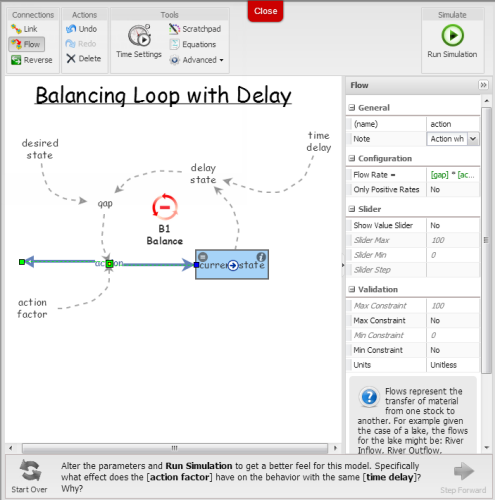

## Preface ##

We set out to develop an interactive ebook on modeling and simulation introducing Insight Maker. As it turned out, after a few months, what had actually been developed was an interactive book on modeling and simulation introducing Insight Maker. What we realized, upon arriving at the goal, was that the world didn't need another book on modeling and simulation and it surely didn't need an Insight Maker users guide. And, glitzy technology couldn't turn what we had developed into what it needed to be. Though a glitzy technology oriented book on modeling and simulation that read like an Insight Maker users guide was just what we had created.

Fortunately for us a few of our insightful and courageous sponsors were willing to tell us in no uncertain terms that the emperor had no clothes, and they were willing to repeat this until we got the message. So the reconstruction, along with a couple of intense positioning discussions ensued. During that exchange our thoughts migrated from thinking of the creation as a book, to thinking of it as an app, and finally as an Interactive Learning Environment (ILE), though not an ILE about modeling and simulation or about Insight Maker. The realization that emerged was that the ILE needed to present an approach for the user to better understand and deal with the world around them in a manner significantly better than they would have been able too before interacting with this ILE.

With this awakening the label for this creation began to look something like "Systems Insights for Y/Our Future: An Interactive Learning Environment." Aren't you pleased we decided to name it something else? The August 30, 2013 beta release of Chapter 1 and Chapter 2 served as a good model for the direction of the first few chapters. And with this emphasis on interaction there was a question as to the sensibility of trying to create a physical copy of the ILE. There are valuable aspects of interaction that would be completely lost in a physical copy of the ILE. You can let us know whether our thoughts were appropriate after you experience this interactive learning environment.

An additional realization was that the ILE is just that, an interactive learning environment. It is not a development environment. While one can construct models and simulations in the environment any serious development should be done in Insight Maker at [InsightMaker.com](http://insightmaker.com/). Additionally, there are critical functions that can be performed on a workstation for which there are no equivalent on a tablet or cell phone, e.g., mouseover, shift+click, ctrl+click, which are critical operations for some  aspects of development. Alternatives for these are presented in the Introduction.

We sincerely hope that you find this effort meaningful and provides you a basis for developing a more useful understanding of the world around you.

~~~~~
November 13, 2013
Gene & Scott
~~~~~

## Introduction ##

People tend to read books in different ways. With that in mind we've designed this ILE so all the essential concepts are presented in the first chapter. We recommend that you read Chapter 1 and interact with all the models presented. Chapter 2 and 3 provide examples which reinforce the concepts of Chapter 1 and are recommended though you can probably interact with them in any order you desire. The remainder of the chapters contain related modeling and simulation concepts that may be read in any desired order.

In the first three chapters you will be presented with concepts and access to models as depicted in the following figure. 

- **Navigation** - Clicking to the right of center on the display will advance to the next page. Clicking to the left of center on the display will advance to the previous page.
- **Table of Content** - Clicking on the title in the upper left corner will display a Table of Contents that you can scroll through and click on a particular section to go directly to that section.
- **Navigation Slider** - Clicking on the title in the lower left corner will display a slider you can use to navigate directly to other sections of the content.
- **Page Numbers** - The concept of page numbers isn't relevant in this context because you can size the display window altering the size of the virtual page.
- **Text Size** - Clicking the "AA" in the upper right corner of the page can be used to toggle between two text sizes.
- **Model Access** - Clicking on the title of the model will open the model in a storytelling mode. Once you open the model read the text at the bottom of the screen and step through the story by clicking the **Step Forward** button at the bottom right. Once you're finished with the model click the **Close** tab at the top of the model to return to where you were in the text.

Some of the models simply tell a story by unfolding a model in pictures as you step through it.

Some models will actually run simulations at certain steps as you step though the model. 

The storytelling mode will close the graph and continue when you click on **Step Forward**.

In some models you will be presented with the option to change parameters and then run one or more simulations on your own to get more familiar with the implications of the relationships in the model.

In this mode you can alter parameters and run simulations as many times as you like. Once you've looked at the simulation output you'll have to click the **red x** in the upper right corner of the graph to close it and get back to the model.

If you click on an element of the model the **Configuration Panel** on the right shows all the attributes for the element you've selected. If you click anywhere on the model background this panel will return to the variables control panel depicted in Figure 4.

Notice in the upper right of the **Configuration Panel** there is a double caret symbol. If you click this it will close the panel and the double caret will reverse direction and look like it does in Figure 2.

There are only two fields you really need to be interested in here so don't be overwhelmed by all the items. The first is the **Note** field and the second one in the **Configuration** section will have different names depending on which type of model element you select. It should be obvious which field contains the formula defining the way that element behaves based on the other elements that are connected to it. Some of this isn't expected to make sense until you get through part of Chapter 1 though it's appropriate to have a sense of what to expect.

If you click in either the **Note** field or the **Equation Field** (which will have different names) a downward arrow will appear in the right of the field. If you click this downward arrow it will open a window that allows you to read the notes or inspect the equation associated with that element.

Figure 6 is an example of what the **Equations Editor** window looks like. Once you have finished viewing this window you will need to click the **x** in the upper right to close the window.

Figure 7 is an example of what the **Notes Editor** window looks like. Once you've finished reading the notes you will need to click the **x** in the upper right corner to close the window.

Even though the windows in Figure 6 and Figure 7 are labeled as editor windows don't worry as you can't make any permanent changes. Anything you change is only retained while you're in the model. Once you leave a model and return to the text the model will be returned to its original state.

If you look closely at Figure 8 you'll notice an **= equal sign** and an **i** visible on the **current state** element. If you're working on a device that has a mouseover function then these will show up when you mouseover the element. You can click the **= equal sign** to open the **Equations Editor** and the **i** to open the **Note** for the element.

You can open the **Configuration Panel**, or use mouseover, to look at any element parameter, at any time during the storytelling of a model.

There are numerous exercises presented. Some of these are presented with answers you can review and others are simply presented as questions related to concepts that it is considered appropriate to reflect on. Doing this reflection with others can be very beneficial.

There are a couple of the implications of this being an interactive learning environment rather than a development environment are:

- **No Storytelling Exit**. There is no way to exit from the storytelling mode. You can open the **Toolbar** and **Configuration Panel** and make changes to any model while in storytelling mode, and run simulations where appropriate, though these changes can not be saved.
- **Insight Maker Model Link**. For each model there is an footnote which will provide access to a link to the actual source of the model in [InsightMaker.com](http://insightmaker.com/). There you may clone the model creating a copy that you own. You can then interact with your copy of the model with all the features of Insight Maker.

You can read and interact with this content without being connected to the Internet though there are some of the models which reference images on the Internet. If you're not connected to the Internet these will display as missing images with labels below them. You will also not be able to follow any of the embedded links unless you are connected to the Internet.

### Additional Resources ###

- [Insight Maker](http://insightmaker.com/). The free web based modeling and simulation environment used to create all the models contained herein.
- [The MARS Project](http://www.linkedin.com/groups/MARS-Project-5180568). A discussion group on LinkedIn dedicated to the development of understanding though the collaborative development of models.
- [Systems Thinking World](http://www.linkedin.com/groups/Systems-Thinking-World-2639211). A more general Systems Thinking discussion group on LinkedIn.
- [SystemsWiki.org](http://www.systemswiki.org/). A Wiki dedicated to Systems Thinking, Modeling and Simulation.