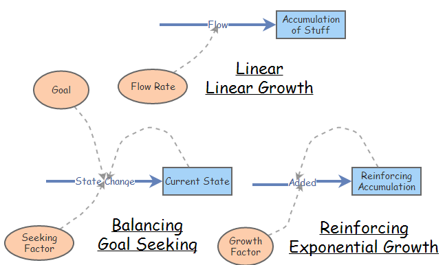
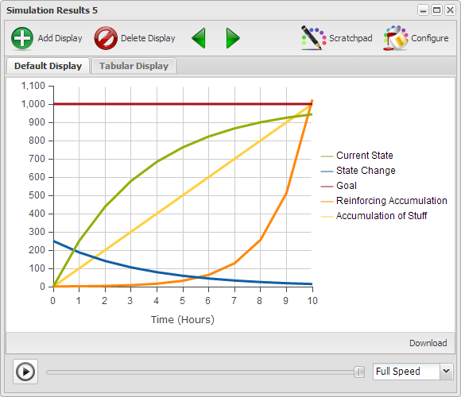
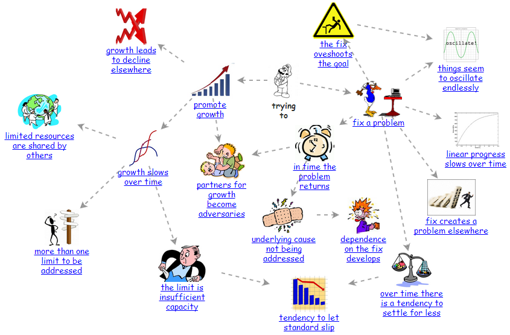

# Implications of Reality

Chapter 1 presented Bertalanffy's premise that that the same basic structures operated across all disciplines, and if one learned how these structures operated one could transfer much of their learning from one discipline to another. In the previous chapters there has been a focus on three basic structures in support of Bertalanffy's premise. In this chapter will will build on those three basic structures in such a way as to demonstrate that there exists a set of more complex structures composed of combinations of the basic three which also repeatedly occur across all disciplines of science.

## Basic Structures ##

The three basic structures are depicted in Figure 1 along with their characteristics behavior curves in Figure 2.

[** Figure 1](http://insightmaker.com/insight/5138)

[** Figure 2](http://insightmaker.com/insight/5138)

In the Chapter 1 and Chapter 2 we covered these three basic structures in some detail and it was claimed that all the models you will ever create will simply be a combination of some number of these basic structures. We don't expect that you take this on faith, and while we can't prove it, though in this chapter we will provide you an opportunity to experience some of the more common structures which repeatedly occur across all disciplines of science.

## Typical Evolving Relationships ##

When you undertake something it is either to fix a problem, represented by the Balancing/Goal Seeking structure, or promote growth represented by the Reinforcing/Exponential growth structure. Seldom will you encounter either of these structures in their elementary form. Typically there are multiple structures interacting and even if you create an elementary structure is it likely to readily evolve into a more complex form. Figure 3 depicts the manner in which the Balancing/Goal Seeking and Reinforcing/Exponential Growth structures tend to found as part of, or evolve into, more complex structures. And each structure has a characteristics pattern of behavior, which in conjunction with its structure, help to identify the recurring structure.

[** Figure 3](http://insightmaker.com/insight/538)

The sections of this chapter will present an investigation of the more frequently experienced structures and their characteristic patterns of behavior. Links will be provided at the end of the chapter to allow you to continue investigation of those structures not presented here.

Each structure will be presented in a generic form so you can focus on the implications of the relationships rather than what the actual elements are. Each section will also provide appropriate strategies for dealing with the structure as well as a number of explicit example of this structure in different areas.

Because the Balancing/Goal Seeking and Reinforcing/Exponential Growth structures have already been presented we'll simply begin with more complex structures.

## Linear Progress Slows Over Time ##

A Limits to Results structure represents a situation where a Balancing Loop moving toward its goal is slowed in its progress due to some limiting factor. This is generally due to some resource restriction or constraint.

# Model

{"title": "Limits to Results", "description": "A balancing loop seldom progresses simply based on the difference between the [current state] and the [desired state]."}

{"load": "<mxGraphModel> <root> <mxCell id=\"0\"\/> <mxCell id=\"1\" parent=\"0\"\/> <Setting Note=\"\" Version=\"28\" TimeLength=\"10\" TimeStart=\"0\" TimeStep=\"1\" TimeUnits=\"Days\" Units=\"\" HiddenUIGroups=\"Validation,User Interface\" SolutionAlgorithm=\"RK1\" BackgroundColor=\"white\" Throttle=\"-1\" Macros=\"\" SensitivityPrimitives=\"\" SensitivityRuns=\"50\" SensitivityBounds=\"50, 80, 95, 100\" SensitivityShowRuns=\"false\" id=\"2\"> <mxCell parent=\"1\" vertex=\"1\" visible=\"0\"> <mxGeometry x=\"20\" y=\"20\" width=\"80\" height=\"40\" as=\"geometry\"\/> <\/mxCell> <\/Setting> <Display name=\"Display\" Note=\"Identify which elements are to be displayed and in which of the available formats.\" Type=\"Time Series\" xAxis=\"Time (%u)\" yAxis=\"\" ThreeDimensional=\"false\" Primitives=\"4,6,7,8,12\" AutoAddPrimitives=\"false\" Image=\"Display\" yAxis2=\"\" Primitives2=\"\" showMarkers=\"false\" showLines=\"true\" showArea=\"false\" legendPosition=\"Automatic\" id=\"3\"> <mxCell style=\"roundImage;image=\/builder\/images\/DisplayFull.png;\" parent=\"1\" vertex=\"1\" visible=\"0\"> <mxGeometry x=\"20\" y=\"70\" width=\"64\" height=\"64\" as=\"geometry\"\/> <\/mxCell> <\/Display> <Stock name=\"current state\" Note=\"The state of things at the beginning of the simulation assumed to be less than the desired state.\" InitialValue=\"0\" StockMode=\"Store\" Delay=\"10\" Volume=\"100\" Units=\"Unitless\" MaxConstraintUsed=\"false\" MinConstraintUsed=\"false\" MaxConstraint=\"100\" MinConstraint=\"0\" ShowSlider=\"false\" SliderMax=\"1\" SliderMin=\"0\" NonNegative=\"false\" Image=\"None\" LabelPosition=\"Middle\" FlipHorizontal=\"false\" FlipVertical=\"false\" SliderStep=\"0.1\" AllowNegatives=\"true\" id=\"4\"> <mxCell style=\"stock;labelBackgroundColor=none\" parent=\"1\" vertex=\"1\"> <mxGeometry x=\"400\" y=\"190.5\" width=\"100\" height=\"40\" as=\"geometry\"\/> <\/mxCell> <\/Stock> <Flow name=\"action\" Note=\"If gap is greater than limit then action = limit, otherwise it equals gap.\" FlowRate=\"IfThenElse([gap] &gt; [limit], [limit], [gap])\" OnlyPositive=\"true\" TimeIndependent=\"false\" Units=\"Unitless\" MaxConstraintUsed=\"false\" MinConstraintUsed=\"false\" MaxConstraint=\"100\" MinConstraint=\"0\" ShowSlider=\"false\" SliderMax=\"100\" SliderMin=\"0\" id=\"6\"> <mxCell style=\"\" parent=\"1\" target=\"4\" edge=\"1\"> <mxGeometry x=\"50\" y=\"-14.5\" width=\"100\" height=\"100\" as=\"geometry\"> <mxPoint x=\"190\" y=\"205.5\" as=\"sourcePoint\"\/> <mxPoint x=\"50\" y=\"85.5\" as=\"targetPoint\"\/> <\/mxGeometry> <\/mxCell> <\/Flow> <Variable name=\"desired state\" Note=\"The desired state, assumed to be greater than the current state in this example.\" Equation=\"1\" Units=\"Unitless\" MaxConstraintUsed=\"false\" MinConstraintUsed=\"false\" MaxConstraint=\"100\" MinConstraint=\"0\" ShowSlider=\"false\" SliderMax=\"1\" SliderMin=\"0\" Image=\"None\" LabelPosition=\"Middle\" FlipHorizontal=\"false\" FlipVertical=\"false\" SliderStep=\"0.1\" id=\"7\"> <mxCell style=\"parameter;fillColor=none;labelBackgroundColor=none;strokeColor=none\" parent=\"1\" vertex=\"1\"> <mxGeometry x=\"210\" y=\"25.5\" width=\"60\" height=\"50\" as=\"geometry\"\/> <\/mxCell> <\/Variable> <Variable name=\"gap\" Note=\"The difference between the desired state and the current state which provides the basis for action.\" Equation=\"[desired state] - [Current State]\" Units=\"Unitless\" MaxConstraintUsed=\"false\" MinConstraintUsed=\"false\" MaxConstraint=\"100\" MinConstraint=\"0\" ShowSlider=\"false\" SliderMax=\"100\" SliderMin=\"0\" Image=\"None\" LabelPosition=\"Middle\" FlipHorizontal=\"false\" FlipVertical=\"false\" id=\"8\"> <mxCell style=\"parameter;fillColor=none;labelBackgroundColor=none;strokeColor=none\" parent=\"1\" vertex=\"1\"> <mxGeometry x=\"326\" y=\"75.5\" width=\"40\" height=\"30\" as=\"geometry\"\/> <\/mxCell> <\/Variable> <Link name=\"Link\" Note=\"\" BiDirectional=\"false\" id=\"9\"> <mxCell style=\"entity\" parent=\"1\" source=\"7\" target=\"8\" edge=\"1\"> <mxGeometry x=\"50\" y=\"-14.5\" width=\"100\" height=\"100\" as=\"geometry\"> <mxPoint x=\"50\" y=\"85.5\" as=\"sourcePoint\"\/> <mxPoint x=\"150\" y=\"-14.5\" as=\"targetPoint\"\/> <Array as=\"points\"> <mxPoint x=\"290\" y=\"55.5\"\/> <mxPoint x=\"310\" y=\"55.5\"\/> <mxPoint x=\"320\" y=\"75.5\"\/> <\/Array> <\/mxGeometry> <\/mxCell> <\/Link> <Link name=\"Link\" Note=\"\" BiDirectional=\"false\" id=\"10\"> <mxCell style=\"entity\" parent=\"1\" source=\"4\" target=\"8\" edge=\"1\"> <mxGeometry x=\"50\" y=\"-14.5\" width=\"100\" height=\"100\" as=\"geometry\"> <mxPoint x=\"50\" y=\"85.5\" as=\"sourcePoint\"\/> <mxPoint x=\"150\" y=\"-14.5\" as=\"targetPoint\"\/> <Array as=\"points\"> <mxPoint x=\"440\" y=\"165.5\"\/> <mxPoint x=\"431\" y=\"130.5\"\/> <mxPoint x=\"402\" y=\"106.5\"\/> <\/Array> <\/mxGeometry> <\/mxCell> <\/Link> <Link name=\"Link\" Note=\"\" BiDirectional=\"false\" id=\"11\"> <mxCell style=\"entity\" parent=\"1\" source=\"8\" target=\"6\" edge=\"1\"> <mxGeometry x=\"30\" y=\"-33.65652570442285\" width=\"100\" height=\"100\" as=\"geometry\"> <mxPoint x=\"30\" y=\"66.34347429557715\" as=\"sourcePoint\"\/> <mxPoint x=\"130\" y=\"-33.65652570442285\" as=\"targetPoint\"\/> <Array as=\"points\"> <mxPoint x=\"290\" y=\"113.5\"\/> <mxPoint x=\"271\" y=\"146.5\"\/> <mxPoint x=\"270\" y=\"185.5\"\/> <\/Array> <\/mxGeometry> <\/mxCell> <\/Link> <Variable name=\"limit\" Note=\"A resource or process limit which action is not allowed to exceed.\" Equation=\"0.3\" Units=\"Unitless\" MaxConstraintUsed=\"false\" MinConstraintUsed=\"false\" MaxConstraint=\"100\" MinConstraint=\"0\" ShowSlider=\"true\" SliderMax=\"1\" SliderMin=\"0\" Image=\"None\" LabelPosition=\"Middle\" FlipHorizontal=\"false\" FlipVertical=\"false\" SliderStep=\"0.1\" id=\"12\"> <mxCell style=\"parameter;fillColor=none;labelBackgroundColor=none;strokeColor=none\" parent=\"1\" vertex=\"1\"> <mxGeometry x=\"160\" y=\"245.5\" width=\"60\" height=\"30\" as=\"geometry\"\/> <\/mxCell> <\/Variable> <Link name=\"Link\" Note=\"\" BiDirectional=\"false\" id=\"13\"> <mxCell style=\"entity\" parent=\"1\" source=\"12\" target=\"6\" edge=\"1\"> <mxGeometry x=\"50\" y=\"-14.5\" width=\"100\" height=\"100\" as=\"geometry\"> <mxPoint x=\"50\" y=\"85.5\" as=\"sourcePoint\"\/> <mxPoint x=\"150\" y=\"-14.5\" as=\"targetPoint\"\/> <Array as=\"points\"> <mxPoint x=\"250\" y=\"265.5\"\/> <mxPoint x=\"270\" y=\"255.5\"\/> <mxPoint x=\"290\" y=\"235.5\"\/> <\/Array> <\/mxGeometry> <\/mxCell> <\/Link> <Picture name=\"B1 Goal&#xa;Seeking\" Note=\"\" Image=\"Negative Feedback Counterclockwise\" FlipHorizontal=\"false\" FlipVertical=\"false\" LabelPosition=\"Bottom\" id=\"0b767fbc4cac5e1f4dff786f98f75235-14\"> <mxCell style=\"picture;image=\/builder\/images\/SD\/Negative Feedback Counterclockwise.png;imageFlipV=0;imageFlipH=0;fontStyle=1\" parent=\"1\" vertex=\"1\"> <mxGeometry x=\"340\" y=\"105.5\" width=\"34\" height=\"34\" as=\"geometry\"\/> <\/mxCell> <\/Picture> <\/root> <\/mxGraphModel>"}

DIAGRAM

Initial settings are: [current state] = 0, [desired state] = 1, [limit] = 0.3 and [action] = IfThenElse([gap] > [limit], [limit], [gap])

RESULTS

 Action is a constant value until the gap < limit. The choppy nature of the diagram will be addressed in the exercise below.

# End Model

[** Limits to Results Stock & Flow Simulation](http://insightmaker.com/insight/543)

~ Exercise

- Run the model with different values for limit. What difference do you see in the curve when the limit is evenly divisible into 1.
- What happens if you change the Time Step to 0.5, 0.25 and 0.125. What is the most appropriate value to use for Time Step?

~ Answer

- If the limit is evenly divisible into 1 then there is no change in the cure as the goal is reached.
- There isn't a noticeable difference between the graph for 0.25 and 0.125 so 0.25 would be the most appropriate value to use for Time Step.

~ End Exercise

### Examples ###

Numerous example for this structure should readily come to mind.

- Any undertaking to complete a project is restricted by the availability of resources.
- The flow of anything to fill or empty a stock is restricted by the capacity of what the liquid must flow through.
- The rate of production of a process is limited by the capacity of the process.

### Effective Strategy ###

- The effective way to avoid a Limits to Results scenario is simply to plan ahead to ensure there are sufficient resources available so progress toward results is not limited to a greater extent than acceptable. That said, remember that more of a good thing is not always the best answer. There is often a trade off and more resources may cost more than one gains by reducing the time by using more resources. There's always more than one thing that should be considered.

## The Fix Overshoots the Goal ##

Have you ever pursued a goal and later found that you actually overshot the goal and had to back up to get back to the goal? The Balancing Loop with Delay structure is a variation of the standard Balancing Loop. The variation being that there are one or more delays in the structure which are responsible for producing, as will be demonstrated, a very different behavior pattern than the standard Balancing Loop.

If you look at the Balancing Loop with Delay structure it looks identical to the standard balancing loop with the exception of the delay near the reduces link. The implication is that it takes some amount of time after the current state changes before it is actually realized and figures into the calculation of the gap which influences the subsequent action. Essentially what's happening is that action is being based on old data and therefore is probably not the appropriate action. The implications of this will become evident when we look at the simulation for this structure.

# Model

{"title": "The Fix Overshoots The Goal", "description": "Lets take a look at the implications of varying delays on the effect of a balancing loop."}

{"load": "<mxGraphModel> <root> <mxCell id=\"0\"\/> <mxCell id=\"1\" parent=\"0\"\/> <Setting Note=\"\" Version=\"28\" TimeLength=\"20\" TimeStart=\"0\" TimeStep=\"0.25\" TimeUnits=\"Days\" Units=\"\" HiddenUIGroups=\"Validation,User Interface\" SolutionAlgorithm=\"RK1\" BackgroundColor=\"white\" Throttle=\"-1\" Macros=\"\" SensitivityPrimitives=\"\" SensitivityRuns=\"50\" SensitivityBounds=\"50, 80, 95, 100\" SensitivityShowRuns=\"false\" id=\"2\"> <mxCell parent=\"1\" vertex=\"1\" visible=\"0\"> <mxGeometry x=\"20\" y=\"20\" width=\"80\" height=\"40\" as=\"geometry\"\/> <\/mxCell> <\/Setting> <Display name=\"Graph Display\" Note=\"\" Type=\"Time Series\" xAxis=\"Time (%u)\" yAxis=\"%o\" ThreeDimensional=\"false\" Primitives=\"4,5,7,9,10\" AutoAddPrimitives=\"true\" Image=\"Display\" yAxis2=\"\" Primitives2=\"\" showMarkers=\"false\" showLines=\"true\" showArea=\"false\" legendPosition=\"Automatic\" id=\"3\"> <mxCell style=\"roundImage;image=\/builder\/images\/DisplayFull.png;\" parent=\"1\" vertex=\"1\" visible=\"0\"> <mxGeometry x=\"20\" y=\"20\" width=\"64\" height=\"64\" as=\"geometry\"\/> <\/mxCell> <\/Display> <Stock name=\"current state\" Note=\"The current state of things as a result of action. Note that in this instance current state is allowed to go negative, which is actually simply something worse than when things started.\" InitialValue=\"0\" StockMode=\"Store\" Delay=\"10\" Volume=\"100\" Units=\"Unitless\" MaxConstraintUsed=\"false\" MinConstraintUsed=\"false\" MaxConstraint=\"100\" MinConstraint=\"0\" ShowSlider=\"true\" SliderMax=\"1\" SliderMin=\"0\" NonNegative=\"false\" Image=\"None\" LabelPosition=\"Middle\" FlipHorizontal=\"false\" FlipVertical=\"false\" SliderStep=\"0.1\" id=\"4\"> <mxCell style=\"stock;labelBackgroundColor=none\" parent=\"1\" vertex=\"1\"> <mxGeometry x=\"392\" y=\"190\" width=\"100\" height=\"40\" as=\"geometry\"\/> <\/mxCell> <\/Stock> <Flow name=\"action\" Note=\"Action which is supposed to move the current state toward the desired state. Note that this action may be in either direction.\" FlowRate=\"[gap] * [action factor]\" OnlyPositive=\"false\" TimeIndependent=\"false\" Units=\"Unitless\" MaxConstraintUsed=\"false\" MinConstraintUsed=\"false\" MaxConstraint=\"100\" MinConstraint=\"0\" ShowSlider=\"false\" SliderMax=\"100\" SliderMin=\"0\" id=\"5\"> <mxCell style=\"startArrow=block;startFill=0\" parent=\"1\" target=\"4\" edge=\"1\"> <mxGeometry x=\"-128\" y=\"-34.25\" width=\"100\" height=\"100\" as=\"geometry\"> <mxPoint x=\"152\" y=\"205.75\" as=\"sourcePoint\"\/> <mxPoint x=\"-128\" y=\"65.75\" as=\"targetPoint\"\/> <\/mxGeometry> <\/mxCell> <\/Flow> <Variable name=\"action factor\" Note=\"A factor to control the amount of the gap that actually results in the action which results.\" Equation=\"0.5\" Units=\"Unitless\" MaxConstraintUsed=\"false\" MinConstraintUsed=\"false\" MaxConstraint=\"100\" MinConstraint=\"0\" ShowSlider=\"true\" SliderMax=\"1\" SliderMin=\"0\" Image=\"None\" LabelPosition=\"Middle\" FlipHorizontal=\"false\" FlipVertical=\"false\" SliderStep=\"0.1\" id=\"6\"> <mxCell style=\"parameter;fillColor=none;labelBackgroundColor=none;strokeColor=none\" parent=\"1\" vertex=\"1\"> <mxGeometry x=\"132\" y=\"250\" width=\"70\" height=\"40\" as=\"geometry\"\/> <\/mxCell> <\/Variable> <Variable name=\"desired state\" Note=\"The state which serves as the goal for the structure.\" Equation=\"1\" Units=\"Unitless\" MaxConstraintUsed=\"false\" MinConstraintUsed=\"false\" MaxConstraint=\"100\" MinConstraint=\"0\" ShowSlider=\"true\" SliderMax=\"1\" SliderMin=\"0\" Image=\"None\" LabelPosition=\"Middle\" FlipHorizontal=\"false\" FlipVertical=\"false\" SliderStep=\"0.1\" id=\"7\"> <mxCell style=\"parameter;fillColor=none;labelBackgroundColor=none;strokeColor=none\" parent=\"1\" vertex=\"1\"> <mxGeometry x=\"142\" y=\"30\" width=\"70\" height=\"40\" as=\"geometry\"\/> <\/mxCell> <\/Variable> <Variable name=\"delay state\" Note=\"The delay holdup of the value before it&#39;s passed on to the gap.\" Equation=\"Delay([Current State], [time delay], 0)\" Units=\"Unitless\" MaxConstraintUsed=\"false\" MinConstraintUsed=\"false\" MaxConstraint=\"100\" MinConstraint=\"0\" ShowSlider=\"false\" SliderMax=\"100\" SliderMin=\"0\" Image=\"None\" LabelPosition=\"Middle\" FlipHorizontal=\"false\" FlipVertical=\"false\" id=\"8\"> <mxCell style=\"parameter;fillColor=none;labelBackgroundColor=none;strokeColor=none\" parent=\"1\" vertex=\"1\"> <mxGeometry x=\"372\" y=\"64\" width=\"60\" height=\"40\" as=\"geometry\"\/> <\/mxCell> <\/Variable> <Variable name=\"time delay\" Note=\"The time period the current state value is to be delayed. It&#39;s simply as though one looks at the value some time after it actually happened.\" Equation=\"0\" Units=\"Unitless\" MaxConstraintUsed=\"false\" MinConstraintUsed=\"false\" MaxConstraint=\"100\" MinConstraint=\"0\" ShowSlider=\"true\" SliderMax=\"5\" SliderMin=\"0\" Image=\"None\" LabelPosition=\"Middle\" FlipHorizontal=\"false\" FlipVertical=\"false\" SliderStep=\"0.1\" id=\"9\"> <mxCell style=\"parameter;fillColor=none;labelBackgroundColor=none;strokeColor=none\" parent=\"1\" vertex=\"1\"> <mxGeometry x=\"532\" y=\"20\" width=\"60\" height=\"40\" as=\"geometry\"\/> <\/mxCell> <\/Variable> <Variable name=\"gap\" Note=\"The difference between the desired state and the delayed value of the current state.\" Equation=\"[desired state] - [delay state]\" Units=\"Unitless\" MaxConstraintUsed=\"false\" MinConstraintUsed=\"false\" MaxConstraint=\"100\" MinConstraint=\"0\" ShowSlider=\"false\" SliderMax=\"100\" SliderMin=\"0\" Image=\"None\" LabelPosition=\"Middle\" FlipHorizontal=\"false\" FlipVertical=\"false\" id=\"10\"> <mxCell style=\"parameter;fillColor=none;labelBackgroundColor=none;strokeColor=none\" parent=\"1\" vertex=\"1\"> <mxGeometry x=\"242\" y=\"110\" width=\"50\" height=\"30\" as=\"geometry\"\/> <\/mxCell> <\/Variable> <Link name=\"Link\" Note=\"\" BiDirectional=\"false\" id=\"11\"> <mxCell style=\"entity\" parent=\"1\" source=\"4\" target=\"8\" edge=\"1\"> <mxGeometry x=\"-133.12470993693444\" y=\"-38.93113257820869\" width=\"100\" height=\"100\" as=\"geometry\"> <mxPoint x=\"-133.12470993693444\" y=\"61.068867421791\" as=\"sourcePoint\"\/> <mxPoint x=\"-33.12470993693438\" y=\"-38.93113257820869\" as=\"targetPoint\"\/> <Array as=\"points\"> <mxPoint x=\"452\" y=\"160\"\/> <mxPoint x=\"442\" y=\"130\"\/> <\/Array> <\/mxGeometry> <\/mxCell> <\/Link> <Link name=\"Link\" Note=\"\" BiDirectional=\"false\" id=\"12\"> <mxCell style=\"entity\" parent=\"1\" source=\"9\" target=\"8\" edge=\"1\"> <mxGeometry x=\"-128\" y=\"-40\" width=\"100\" height=\"100\" as=\"geometry\"> <mxPoint x=\"-128\" y=\"60\" as=\"sourcePoint\"\/> <mxPoint x=\"442\" y=\"40\" as=\"targetPoint\"\/> <Array as=\"points\"> <mxPoint x=\"542\" y=\"90\"\/> <mxPoint x=\"512\" y=\"110\"\/> <mxPoint x=\"482\" y=\"110\"\/> <\/Array> <\/mxGeometry> <\/mxCell> <\/Link> <Link name=\"Link\" Note=\"\" BiDirectional=\"false\" id=\"13\"> <mxCell style=\"entity\" parent=\"1\" source=\"8\" target=\"10\" edge=\"1\"> <mxGeometry x=\"-128\" y=\"-40\" width=\"100\" height=\"100\" as=\"geometry\"> <mxPoint x=\"-128\" y=\"60\" as=\"sourcePoint\"\/> <mxPoint x=\"-28\" y=\"-40\" as=\"targetPoint\"\/> <Array as=\"points\"> <mxPoint x=\"342\" y=\"80\"\/> <mxPoint x=\"302\" y=\"90\"\/> <\/Array> <\/mxGeometry> <\/mxCell> <\/Link> <Link name=\"Link\" Note=\"\" BiDirectional=\"false\" id=\"14\"> <mxCell style=\"entity\" parent=\"1\" source=\"7\" target=\"10\" edge=\"1\"> <mxGeometry x=\"-128\" y=\"-40\" width=\"100\" height=\"100\" as=\"geometry\"> <mxPoint x=\"-128\" y=\"60\" as=\"sourcePoint\"\/> <mxPoint x=\"-28\" y=\"-40\" as=\"targetPoint\"\/> <Array as=\"points\"> <mxPoint x=\"182\" y=\"90\"\/> <mxPoint x=\"192\" y=\"110\"\/> <mxPoint x=\"212\" y=\"120\"\/> <\/Array> <\/mxGeometry> <\/mxCell> <\/Link> <Link name=\"Link\" Note=\"\" BiDirectional=\"false\" id=\"15\"> <mxCell style=\"entity\" parent=\"1\" source=\"10\" target=\"5\" edge=\"1\"> <mxGeometry x=\"-128\" y=\"-40\" width=\"100\" height=\"100\" as=\"geometry\"> <mxPoint x=\"-128\" y=\"60\" as=\"sourcePoint\"\/> <mxPoint x=\"-28\" y=\"-40\" as=\"targetPoint\"\/> <Array as=\"points\"> <mxPoint x=\"262\" y=\"180\"\/> <\/Array> <\/mxGeometry> <\/mxCell> <\/Link> <Link name=\"Link\" Note=\"\" BiDirectional=\"false\" id=\"16\"> <mxCell style=\"entity\" parent=\"1\" source=\"6\" target=\"5\" edge=\"1\"> <mxGeometry x=\"-128\" y=\"-40\" width=\"100\" height=\"100\" as=\"geometry\"> <mxPoint x=\"-128\" y=\"60\" as=\"sourcePoint\"\/> <mxPoint x=\"-28\" y=\"-40\" as=\"targetPoint\"\/> <Array as=\"points\"> <mxPoint x=\"212\" y=\"270\"\/> <mxPoint x=\"252\" y=\"260\"\/> <mxPoint x=\"272\" y=\"240\"\/> <\/Array> <\/mxGeometry> <\/mxCell> <\/Link> <Picture name=\"B1 Balance\" Note=\"\" Image=\"Negative Feedback Counterclockwise\" FlipHorizontal=\"false\" FlipVertical=\"false\" LabelPosition=\"Bottom\" id=\"45204529d57ed5763521f04ccdd107d2-17\"> <mxCell style=\"picture;image=\/builder\/images\/SD\/Negative Feedback Counterclockwise.png;imageFlipV=0;imageFlipH=0;fontStyle=1\" parent=\"1\" vertex=\"1\"> <mxGeometry x=\"327\" y=\"107\" width=\"44\" height=\"44\" as=\"geometry\"\/> <\/mxCell> <\/Picture> <\/root> <\/mxGraphModel> "}

DIAGRAM

Notice in the stock & flow structure the delay has been placed between the current state and the gap. The delay could have just as well been between the gap and action or there could have been a delay between the action and the actual change of the current state though this one is a bit more difficult to structure.

Notice the action flow in the diagram actually has an arrow at both ends. Click on the flow and notice the Configuration section of the configuration panel indicates Only Positive Rates is set to No. This means that the flow can flow in either direction based on whether the results of the equation are positive or negative.

Initial parameters are [currents state] = 0, [action factor] = 0.5, [desired state] = 1 and [Time Step] = 0.25

{"attribute":"Equation","target":"time delay","value":"0"}

RESULTS

With [Time Delay] = 0 the results are simply those of the standard balancing loop.

{"attribute":"Equation","target":"time delay","value":"0.25"}

RESULTS

Notice that now with a delay the change in the gap and action are delayed for one time period and then the current state actually overshoots the goal and a negative action is required to bring the current state back to the goal.

{"attribute":"Equation","target":"time delay","value":"2"}

RESULTS

With a longer time delay the overshoot is even more severe though after a few time periods the current state actually will reach the goal.

{"attribute":"Equation","target":"time delay","value":"3"}

RESULTS

We've now reached a delay where the action is so out of sync with an awareness of the results that the goal is never reached and the current state continually oscillates around the goal.

{"attribute":"Equation","target":"time delay","value":"3.5"}

RESULTS

Now the situation is described as being out of control because rather oscillations continue to get worse because of the length of the time delay.

# End Model

[Balancing Loop with Delay Stock & Flow Simulation](http://insightmaker.com/insight/133)

You might ask how could it be that it might take 3.5 days for someone to get a sense of what the results of the previous actions were, which would be a good question. It's probably difficult to find a situation where this is realistic in days though what's important to realize is this structure could operate in this manner if the time units were hours, minutes, seconds or microseconds.

~ Exercise 

Run this model varying the values of action factor, time delay and time step to develop a sense of how each of these variables influences the behavior of the model.

~ End Exercise

### Examples ###

- **Adjusting the Shower**. When you adjust the hot and cold water for the shower it takes time for the new mixing ratio to actually be felt in the water temperature to it's easy to over compensate due to impatience.

### Effective Strategies ###

- Advice for dealing with this structure is quite simple. Patience is a virtue. If you know you're dealing with a balancing structure and things are not going as expected then study the structure to see if there could be one or more delays that your impatience is simply having difficulty dealing with. This structure proves that there are times when taking additional action is worse than not taking additional action. More is not always better. If things are waffling back and forth endlessly or out of control a little less effort might be appropriate.
- An alternative is to monitor the Current State on a more frequent basis and ensure the result of the monitoring impacts the action appropriately in a more timely manner. In short, take the delay out of the structure.

## Over Time There Is A Tendency To Settle For Less

Have you ever noticed how difficult it is to bring the best of intentions to fruition? How so many people's New Years resolutions only last a few days? Our inability to achieve the things we set out to achieve is very much a result of the operation of a Drifting Goals structure we generally have little awareness of.

# Model

{"title": Drifting Goals"", "description": "If it takes an extended period of time to achieve a goal there is a tendency to settle for achieving a lesser goal."}

{"load": "<mxGraphModel> <root> <mxCell id=\"0\"\/> <mxCell id=\"1\" parent=\"0\"\/> <Setting Note=\"\" Version=\"28\" TimeLength=\"10\" TimeStart=\"0\" TimeStep=\"0.5\" TimeUnits=\"Days\" Units=\"\" HiddenUIGroups=\"Validation,User Interface\" SolutionAlgorithm=\"RK1\" BackgroundColor=\"white\" Throttle=\"-1\" Macros=\"SquaredPI &lt;- 3.1459^2\" SensitivityPrimitives=\"\" SensitivityRuns=\"50\" SensitivityBounds=\"50, 80, 95, 100\" SensitivityShowRuns=\"false\" id=\"2\"> <mxCell parent=\"1\" vertex=\"1\" visible=\"0\"> <mxGeometry x=\"20\" y=\"20\" width=\"80\" height=\"40\" as=\"geometry\"\/> <\/mxCell> <\/Setting> <Display name=\"Data Display\" Note=\"\" Type=\"Time Series\" xAxis=\"Time (%u)\" yAxis=\"\" ThreeDimensional=\"false\" Primitives=\"8,4,10,11,6,5,9\" AutoAddPrimitives=\"true\" ScatterplotOrder=\"X Primitive, Y Primitive\" Image=\"Display\" yAxis2=\"\" Primitives2=\"\" showMarkers=\"false\" showLines=\"true\" showArea=\"false\" legendPosition=\"Automatic\" id=\"3\"> <mxCell style=\"roundImage;image=\/builder\/images\/DisplayFull.png;\" parent=\"1\" vertex=\"1\" visible=\"0\"> <mxGeometry x=\"10\" y=\"8\" width=\"64\" height=\"64\" as=\"geometry\"\/> <\/mxCell> <\/Display> <Stock name=\"desired state\" Note=\"The desired state we wish to achieve.\" InitialValue=\"1\" StockMode=\"Store\" Delay=\"10\" Volume=\"100\" NonNegative=\"false\" Units=\"Unitless\" MaxConstraintUsed=\"false\" MinConstraintUsed=\"false\" MaxConstraint=\"100\" MinConstraint=\"0\" ShowSlider=\"true\" SliderMax=\"1\" SliderMin=\"0\" Image=\"None\" LabelPosition=\"Middle\" FlipHorizontal=\"false\" FlipVertical=\"false\" SliderStep=\"0.1\" id=\"4\"> <mxCell style=\"stock;labelBackgroundColor=none\" parent=\"1\" vertex=\"1\"> <mxGeometry x=\"109\" y=\"104.79179606750057\" width=\"100\" height=\"40\" as=\"geometry\"\/> <\/mxCell> <\/Stock> <Flow name=\"goal reduction\" Note=\"The goal reduction is simply the tension times the foal change factor.\" FlowRate=\"[tension]*[goal chg fact]\" OnlyPositive=\"true\" TimeIndependent=\"false\" Units=\"Unitless\" MaxConstraintUsed=\"false\" MinConstraintUsed=\"false\" MaxConstraint=\"100\" MinConstraint=\"0\" ShowSlider=\"false\" SliderMax=\"100\" SliderMin=\"0\" id=\"5\"> <mxCell style=\"\" parent=\"1\" source=\"4\" edge=\"1\"> <mxGeometry x=\"-31\" y=\"-10.20820393249943\" width=\"100\" height=\"100\" as=\"geometry\"> <mxPoint x=\"-31\" y=\"89.79179606750057\" as=\"sourcePoint\"\/> <mxPoint x=\"549\" y=\"110.31966011250097\" as=\"targetPoint\"\/> <\/mxGeometry> <\/mxCell> <\/Flow> <Link name=\"Link\" Note=\"\" BiDirectional=\"false\" id=\"7\"> <mxCell style=\"entity;strokeColor=#000000\" parent=\"1\" source=\"6\" target=\"5\" edge=\"1\"> <mxGeometry x=\"-15.117647058823536\" y=\"-27.70820393249943\" width=\"100\" height=\"100\" as=\"geometry\"> <mxPoint x=\"-15.117647058823536\" y=\"72.29179606750057\" as=\"sourcePoint\"\/> <mxPoint x=\"84.88235294117646\" y=\"-27.70820393249943\" as=\"targetPoint\"\/> <Array as=\"points\"> <mxPoint x=\"329\" y=\"40.31966011250097\"\/> <mxPoint x=\"359\" y=\"70.31966011250097\"\/> <\/Array> <\/mxGeometry> <\/mxCell> <\/Link> <Stock name=\"current state\" Note=\"The current state that is to be migrated in the direction of the desired state.\" InitialValue=\"0\" StockMode=\"Store\" Delay=\"10\" Volume=\"100\" NonNegative=\"false\" Units=\"Unitless\" MaxConstraintUsed=\"false\" MinConstraintUsed=\"false\" MaxConstraint=\"100\" MinConstraint=\"0\" ShowSlider=\"true\" SliderMax=\"10\" SliderMin=\"0\" Image=\"None\" LabelPosition=\"Middle\" FlipHorizontal=\"false\" FlipVertical=\"false\" SliderStep=\"0.1\" id=\"8\"> <mxCell style=\"stock;labelBackgroundColor=none\" parent=\"1\" vertex=\"1\"> <mxGeometry x=\"449\" y=\"323.31966011250097\" width=\"100\" height=\"40\" as=\"geometry\"\/> <\/mxCell> <\/Stock> <Flow name=\"action\" Note=\"Action intended to migrate the current state in the direction of the desired state.\" FlowRate=\"[tension]*[pct chg fact]\" OnlyPositive=\"true\" TimeIndependent=\"false\" Units=\"Unitless\" MaxConstraintUsed=\"false\" MinConstraintUsed=\"false\" MaxConstraint=\"100\" MinConstraint=\"0\" ShowSlider=\"false\" SliderMax=\"100\" SliderMin=\"0\" id=\"9\"> <mxCell style=\"\" parent=\"1\" target=\"8\" edge=\"1\"> <mxGeometry x=\"19\" y=\"60.31966011250097\" width=\"100\" height=\"100\" as=\"geometry\"> <mxPoint x=\"69\" y=\"350.31966011250097\" as=\"sourcePoint\"\/> <mxPoint x=\"19\" y=\"160.31966011250097\" as=\"targetPoint\"\/> <\/mxGeometry> <\/mxCell> <\/Flow> <Variable name=\"tension\" Note=\"tension created based on the difference between the current state and the desired state.\" Equation=\"[desired state]-[current state]\" Units=\"Unitless\" MaxConstraintUsed=\"false\" MinConstraintUsed=\"false\" MaxConstraint=\"100\" MinConstraint=\"0\" ShowSlider=\"false\" SliderMax=\"100\" SliderMin=\"0\" Image=\"None\" LabelPosition=\"Middle\" FlipHorizontal=\"false\" FlipVertical=\"false\" id=\"10\"> <mxCell style=\"parameter;fillColor=none;labelBackgroundColor=none;strokeColor=none\" parent=\"1\" vertex=\"1\"> <mxGeometry x=\"287\" y=\"230.31966011250097\" width=\"60\" height=\"20\" as=\"geometry\"\/> <\/mxCell> <\/Variable> <Link name=\"Link\" Note=\"\" BiDirectional=\"false\" id=\"16\"> <mxCell style=\"entity;strokeColor=#000000\" parent=\"1\" source=\"10\" target=\"5\" edge=\"1\"> <mxGeometry x=\"-31\" y=\"-10.20820393249943\" width=\"100\" height=\"100\" as=\"geometry\"> <mxPoint x=\"-31\" y=\"89.79179606750057\" as=\"sourcePoint\"\/> <mxPoint x=\"69\" y=\"-10.20820393249943\" as=\"targetPoint\"\/> <Array as=\"points\"> <mxPoint x=\"369\" y=\"210.31966011250097\"\/> <mxPoint x=\"389\" y=\"170.31966011250097\"\/> <\/Array> <\/mxGeometry> <\/mxCell> <\/Link> <Picture name=\"B1 Desired State\" Note=\"\" Image=\"Negative Feedback Counterclockwise\" FlipHorizontal=\"false\" FlipVertical=\"false\" LabelPosition=\"Bottom\" id=\"17\"> <mxCell style=\"picture;image=\/builder\/images\/SD\/Negative Feedback Counterclockwise.png;imageFlipV=0;imageFlipH=0;shape=image;fontStyle=1\" parent=\"1\" vertex=\"1\"> <mxGeometry x=\"308\" y=\"260.31966011250097\" width=\"82\" height=\"34\" as=\"geometry\"\/> <\/mxCell> <\/Picture> <Picture name=\"B2 Current State\" Note=\"\" Image=\"Negative Feedback Counterclockwise\" FlipHorizontal=\"false\" FlipVertical=\"false\" LabelPosition=\"Bottom\" id=\"18\"> <mxCell style=\"picture;image=\/builder\/images\/SD\/Negative Feedback Counterclockwise.png;imageFlipV=0;imageFlipH=0;shape=image;fontStyle=1\" parent=\"1\" vertex=\"1\"> <mxGeometry x=\"251\" y=\"140.31966011250097\" width=\"78\" height=\"34\" as=\"geometry\"\/> <\/mxCell> <\/Picture> <Link name=\"Link\" Note=\"\" BiDirectional=\"false\" id=\"15\"> <mxCell style=\"entity;strokeColor=#000000\" parent=\"1\" source=\"8\" target=\"10\" edge=\"1\"> <mxGeometry x=\"19\" y=\"60.31966011250097\" width=\"100\" height=\"100\" as=\"geometry\"> <mxPoint x=\"19\" y=\"160.31966011250097\" as=\"sourcePoint\"\/> <mxPoint x=\"119\" y=\"60.31966011250097\" as=\"targetPoint\"\/> <Array as=\"points\"> <mxPoint x=\"459\" y=\"280.31966011250097\"\/> <mxPoint x=\"399\" y=\"250.31966011250097\"\/> <\/Array> <\/mxGeometry> <\/mxCell> <\/Link> <Link name=\"Link\" Note=\"\" BiDirectional=\"false\" id=\"14\"> <mxCell style=\"entity;strokeColor=#000000\" parent=\"1\" source=\"10\" target=\"9\" edge=\"1\"> <mxGeometry x=\"19\" y=\"60.31966011250097\" width=\"100\" height=\"100\" as=\"geometry\"> <mxPoint x=\"19\" y=\"160.31966011250097\" as=\"sourcePoint\"\/> <mxPoint x=\"119\" y=\"60.31966011250097\" as=\"targetPoint\"\/> <Array as=\"points\"> <mxPoint x=\"259\" y=\"270.31966011250097\"\/> <mxPoint x=\"249\" y=\"300.31966011250097\"\/> <\/Array> <\/mxGeometry> <\/mxCell> <\/Link> <Link name=\"Link\" Note=\"\" BiDirectional=\"false\" id=\"13\"> <mxCell style=\"entity;strokeColor=#000000\" parent=\"1\" source=\"4\" target=\"10\" edge=\"1\"> <mxGeometry x=\"-31\" y=\"-10.20820393249943\" width=\"100\" height=\"100\" as=\"geometry\"> <mxPoint x=\"-31\" y=\"89.79179606750057\" as=\"sourcePoint\"\/> <mxPoint x=\"69\" y=\"-10.20820393249943\" as=\"targetPoint\"\/> <Array as=\"points\"> <mxPoint x=\"179\" y=\"190.31966011250097\"\/> <mxPoint x=\"209\" y=\"220.31966011250097\"\/> <\/Array> <\/mxGeometry> <\/mxCell> <\/Link> <Link name=\"Link\" Note=\"\" BiDirectional=\"false\" id=\"12\"> <mxCell style=\"entity;strokeColor=#000000\" parent=\"1\" source=\"11\" target=\"9\" edge=\"1\"> <mxGeometry x=\"19\" y=\"60.31966011250097\" width=\"100\" height=\"100\" as=\"geometry\"> <mxPoint x=\"19\" y=\"160.31966011250097\" as=\"sourcePoint\"\/> <mxPoint x=\"119\" y=\"60.31966011250097\" as=\"targetPoint\"\/> <Array as=\"points\"> <mxPoint x=\"319\" y=\"410.31966011250097\"\/> <mxPoint x=\"279\" y=\"390.31966011250097\"\/> <\/Array> <\/mxGeometry> <\/mxCell> <\/Link> <Variable name=\"pct chg fact\" Note=\"A factor used to control the rate of action influence during the simulation.\" Equation=\"0.5\" Units=\"Unitless\" MaxConstraintUsed=\"false\" MinConstraintUsed=\"false\" MaxConstraint=\"100\" MinConstraint=\"0\" ShowSlider=\"true\" SliderMax=\"1\" SliderMin=\"0\" Image=\"None\" LabelPosition=\"Middle\" FlipHorizontal=\"false\" FlipVertical=\"false\" SliderStep=\"0.1\" id=\"11\"> <mxCell style=\"parameter;fillColor=none;labelBackgroundColor=none;strokeColor=none\" parent=\"1\" vertex=\"1\"> <mxGeometry x=\"389\" y=\"400.31966011250097\" width=\"60\" height=\"40\" as=\"geometry\"\/> <\/mxCell> <\/Variable> <Variable name=\"goal chg fact\" Note=\"This is just a factor to control the rate of goal reduction.\" Equation=\"0\" Units=\"Unitless\" MaxConstraintUsed=\"false\" MinConstraintUsed=\"false\" MaxConstraint=\"100\" MinConstraint=\"0\" ShowSlider=\"true\" SliderMax=\"1\" SliderMin=\"0\" Image=\"None\" LabelPosition=\"Middle\" FlipHorizontal=\"false\" FlipVertical=\"false\" SliderStep=\"0.1\" id=\"6\"> <mxCell style=\"parameter;fillColor=none;labelBackgroundColor=none;strokeColor=none\" parent=\"1\" vertex=\"1\"> <mxGeometry x=\"219\" y=\"9.79179606750057\" width=\"60\" height=\"40\" as=\"geometry\"\/> <\/mxCell> <\/Variable> <\/root> <\/mxGraphModel> "}

DIAGRAM

Again we have two balancing loops which each provide a goal for the other and because of the delays in the time it takes for the action to produce results one goal overrides the other. What I Want server as the goal for B1 and Pressure to Settle for Less serves as the goal for B2.

The initial settings are: [desried state] = 1, [current state] = 0, [pct chg fact] = 0.2, [Time Step] = 0.5.

{"attribute":"Equation","target":"goal chg fact","value":"0"}

RESULTS

With [goal chg fact] = 0 the results are those of the simple balancing loop.

{"attribute":"Equation","target":"goal chg fact","value":"0.1"}

RESULTS

In this example with the extent to which the goal drifted is about 30% which is very significant. The extent to which the goal drifts is very dependent on the [pct chg fact] and the [goal chg fact] variable.

# End Model

[** Drifting Goals Stock & Flow Simulation](http://insightmaker.com/insight/984)

~ Exercise

Vary the \p{pct chg fact}, \p{goal chg fact} and \p{Time Step} values to get a sense of the impact on the extent to which the goal for the structure is degraded over time.

~ End Exercise

### Examples ###

- New years resolutions. Need I say more?
- Weight loss programs.

### Effective Strategies ###

- There is only one real effective way to deal with this structure, which is to disconnect the feedback from tension to goal reduction to Desired State so it can no longer subtract from Desired State.
- An alternative strategy is to further increase the action toward the Current State so it reduces the time delay such that there is no time for the tension to reduce the Desired State. This is fine if there are sufficient resources to increase the action.

### Areas of Concern ###

- The action toward the Desired State requires resources, which may have to be developed. Consideration needs to be given as to whether or not there really are sufficient resources to achieve the Desired State. For further insights into this see Growth and Underinvestment with a Drifting Standard.

## In Time The Problem Returns ##

Have you noticed how often your best intentions go awry? You set out to fix a problem and shortly thereafter you find yourself fixing the same problem again, and again. This generally results from some unexpected consequences, things that come into play because of your action, or the results of your action, that you never expected, which is why they're called unexpected consequences.

# Model

{"title": "Fixes that Fail", "description": "This structure consists of a balancing loop intended to achieve a particular result which is foiled by an insidious reinforcing loop."}

{"load": "<mxGraphModel> <root> <mxCell id=\"0\"\/> <mxCell id=\"1\" parent=\"0\"\/> <Setting Note=\"\" Version=\"28\" TimeLength=\"10\" TimeStart=\"0\" TimeStep=\"0.5\" TimeUnits=\"Days\" Units=\"\" HiddenUIGroups=\"Validation,User Interface\" SolutionAlgorithm=\"RK1\" BackgroundColor=\"white\" Throttle=\"-1\" Macros=\"\" SensitivityPrimitives=\"\" SensitivityRuns=\"50\" SensitivityBounds=\"50, 80, 95, 100\" SensitivityShowRuns=\"false\" id=\"2\"> <mxCell parent=\"1\" vertex=\"1\" visible=\"0\"> <mxGeometry x=\"20\" y=\"20\" width=\"80\" height=\"40\" as=\"geometry\"\/> <\/mxCell> <\/Setting> <Display name=\"Display\" Note=\"Identify which elements are to be displayed and in which of the available formats.\" Type=\"Time Series\" xAxis=\"Time (%u)\" yAxis=\"\" ThreeDimensional=\"false\" Primitives=\"4,6,7,8,b41f3b6b54733e7b7d39314c0f484ef5-13\" AutoAddPrimitives=\"false\" Image=\"Display\" yAxis2=\"\" Primitives2=\"\" showMarkers=\"false\" showLines=\"true\" showArea=\"false\" legendPosition=\"Automatic\" id=\"3\"> <mxCell style=\"roundImage;image=\/builder\/images\/DisplayFull.png;\" parent=\"1\" vertex=\"1\" visible=\"0\"> <mxGeometry x=\"50\" y=\"70\" width=\"64\" height=\"64\" as=\"geometry\"\/> <\/mxCell> <\/Display> <Stock name=\"current state\" Note=\"The state of things at the beginning of the simulation assumed to be less than the desired state.\" InitialValue=\"0\" StockMode=\"Store\" Delay=\"10\" Volume=\"100\" Units=\"Unitless\" MaxConstraintUsed=\"false\" MinConstraintUsed=\"false\" MaxConstraint=\"100\" MinConstraint=\"0\" ShowSlider=\"true\" SliderMax=\"1\" SliderMin=\"0\" NonNegative=\"false\" Image=\"None\" LabelPosition=\"Middle\" FlipHorizontal=\"false\" FlipVertical=\"false\" SliderStep=\"0.1\" id=\"4\"> <mxCell style=\"stock;labelBackgroundColor=none\" parent=\"1\" vertex=\"1\"> <mxGeometry x=\"305\" y=\"181.5\" width=\"100\" height=\"40\" as=\"geometry\"\/> <\/mxCell> <\/Stock> <Flow name=\"action\" Note=\"\" FlowRate=\"[gap] * [action factor]\" OnlyPositive=\"true\" TimeIndependent=\"false\" Units=\"Unitless\" MaxConstraintUsed=\"false\" MinConstraintUsed=\"false\" MaxConstraint=\"100\" MinConstraint=\"0\" ShowSlider=\"false\" SliderMax=\"100\" SliderMin=\"0\" id=\"6\"> <mxCell style=\"\" parent=\"1\" target=\"4\" edge=\"1\"> <mxGeometry x=\"-45\" y=\"-23.5\" width=\"100\" height=\"100\" as=\"geometry\"> <mxPoint x=\"95\" y=\"196.5\" as=\"sourcePoint\"\/> <mxPoint x=\"-45\" y=\"76.5\" as=\"targetPoint\"\/> <\/mxGeometry> <\/mxCell> <\/Flow> <Variable name=\"desired state\" Note=\"The desired state, assumed to be greater than the current state in this example.\" Equation=\"1\" Units=\"Unitless\" MaxConstraintUsed=\"false\" MinConstraintUsed=\"false\" MaxConstraint=\"100\" MinConstraint=\"0\" ShowSlider=\"true\" SliderMax=\"1\" SliderMin=\"0\" Image=\"None\" LabelPosition=\"Middle\" FlipHorizontal=\"false\" FlipVertical=\"false\" SliderStep=\"0.1\" id=\"7\"> <mxCell style=\"parameter;fillColor=none;labelBackgroundColor=none;strokeColor=none\" parent=\"1\" vertex=\"1\"> <mxGeometry x=\"115\" y=\"16.5\" width=\"60\" height=\"50\" as=\"geometry\"\/> <\/mxCell> <\/Variable> <Variable name=\"gap\" Note=\"The difference between the desired state and the current state which provides the basis for action.\" Equation=\"[desired state] - [Current State]\" Units=\"Unitless\" MaxConstraintUsed=\"false\" MinConstraintUsed=\"false\" MaxConstraint=\"100\" MinConstraint=\"0\" ShowSlider=\"false\" SliderMax=\"100\" SliderMin=\"0\" Image=\"None\" LabelPosition=\"Middle\" FlipHorizontal=\"false\" FlipVertical=\"false\" id=\"8\"> <mxCell style=\"parameter;fillColor=none;labelBackgroundColor=none;strokeColor=none\" parent=\"1\" vertex=\"1\"> <mxGeometry x=\"220\" y=\"66.5\" width=\"50\" height=\"30\" as=\"geometry\"\/> <\/mxCell> <\/Variable> <Link name=\"Link\" Note=\"\" BiDirectional=\"false\" id=\"9\"> <mxCell style=\"entity\" parent=\"1\" source=\"7\" target=\"8\" edge=\"1\"> <mxGeometry x=\"-45\" y=\"-23.5\" width=\"100\" height=\"100\" as=\"geometry\"> <mxPoint x=\"-45\" y=\"76.5\" as=\"sourcePoint\"\/> <mxPoint x=\"55\" y=\"-23.5\" as=\"targetPoint\"\/> <Array as=\"points\"> <mxPoint x=\"195\" y=\"46.5\"\/> <mxPoint x=\"210\" y=\"51.5\"\/> <mxPoint x=\"220\" y=\"61.5\"\/> <\/Array> <\/mxGeometry> <\/mxCell> <\/Link> <Link name=\"Link\" Note=\"\" BiDirectional=\"false\" id=\"10\"> <mxCell style=\"entity\" parent=\"1\" source=\"4\" target=\"8\" edge=\"1\"> <mxGeometry x=\"-45\" y=\"-23.5\" width=\"100\" height=\"100\" as=\"geometry\"> <mxPoint x=\"-45\" y=\"76.5\" as=\"sourcePoint\"\/> <mxPoint x=\"55\" y=\"-23.5\" as=\"targetPoint\"\/> <Array as=\"points\"> <mxPoint x=\"350\" y=\"151.5\"\/> <mxPoint x=\"340\" y=\"121.5\"\/> <mxPoint x=\"300\" y=\"91.5\"\/> <\/Array> <\/mxGeometry> <\/mxCell> <\/Link> <Link name=\"Link\" Note=\"\" BiDirectional=\"false\" id=\"11\"> <mxCell style=\"entity\" parent=\"1\" source=\"8\" target=\"6\" edge=\"1\"> <mxGeometry x=\"-65\" y=\"-42.65652570442285\" width=\"100\" height=\"100\" as=\"geometry\"> <mxPoint x=\"-65\" y=\"57.34347429557715\" as=\"sourcePoint\"\/> <mxPoint x=\"35\" y=\"-42.65652570442285\" as=\"targetPoint\"\/> <Array as=\"points\"> <mxPoint x=\"190\" y=\"111.5\"\/> <mxPoint x=\"170\" y=\"141.5\"\/> <mxPoint x=\"175\" y=\"176.5\"\/> <\/Array> <\/mxGeometry> <\/mxCell> <\/Link> <Variable name=\"action factor\" Note=\"Because it is unlikely action can actually be the whole value of the gap action factor is included as a way specify the portion of the gap that results in action each time period.\" Equation=\"0.5\" Units=\"Unitless\" MaxConstraintUsed=\"false\" MinConstraintUsed=\"false\" MaxConstraint=\"100\" MinConstraint=\"0\" ShowSlider=\"true\" SliderMax=\"1\" SliderMin=\"0\" Image=\"None\" LabelPosition=\"Middle\" FlipHorizontal=\"false\" FlipVertical=\"false\" SliderStep=\"0.1\" id=\"12\"> <mxCell style=\"parameter;fillColor=none;labelBackgroundColor=none;strokeColor=none\" parent=\"1\" vertex=\"1\"> <mxGeometry x=\"65\" y=\"236.5\" width=\"60\" height=\"40\" as=\"geometry\"\/> <\/mxCell> <\/Variable> <Link name=\"Link\" Note=\"\" BiDirectional=\"false\" id=\"13\"> <mxCell style=\"entity\" parent=\"1\" source=\"12\" target=\"6\" edge=\"1\"> <mxGeometry x=\"-45\" y=\"-23.5\" width=\"100\" height=\"100\" as=\"geometry\"> <mxPoint x=\"-45\" y=\"76.5\" as=\"sourcePoint\"\/> <mxPoint x=\"55\" y=\"-23.5\" as=\"targetPoint\"\/> <Array as=\"points\"> <mxPoint x=\"155\" y=\"256.5\"\/> <mxPoint x=\"175\" y=\"246.5\"\/> <mxPoint x=\"195\" y=\"226.5\"\/> <\/Array> <\/mxGeometry> <\/mxCell> <\/Link> <Picture name=\"B1 Goal&#xa;Seeking\" Note=\"\" Image=\"Negative Feedback Counterclockwise\" FlipHorizontal=\"false\" FlipVertical=\"false\" LabelPosition=\"Bottom\" id=\"0b767fbc4cac5e1f4dff786f98f75235-14\"> <mxCell style=\"picture;image=\/builder\/images\/SD\/Negative Feedback Counterclockwise.png;imageFlipV=0;imageFlipH=0;fontStyle=1\" parent=\"1\" vertex=\"1\"> <mxGeometry x=\"245\" y=\"106.5\" width=\"34\" height=\"34\" as=\"geometry\"\/> <\/mxCell> <\/Picture> <Stock name=\"unexpected consequence\" Note=\"The unexpected consequences which negate the current state.\" InitialValue=\"0\" StockMode=\"Store\" Delay=\"10\" Volume=\"100\" NonNegative=\"false\" Units=\"Unitless\" MaxConstraintUsed=\"false\" MinConstraintUsed=\"false\" MaxConstraint=\"100\" MinConstraint=\"0\" ShowSlider=\"false\" SliderMax=\"100\" SliderMin=\"0\" Image=\"None\" LabelPosition=\"Middle\" FlipHorizontal=\"false\" FlipVertical=\"false\" SliderStep=\"null\" id=\"b41f3b6b54733e7b7d39314c0f484ef5-13\"> <mxCell style=\"stock;labelBackgroundColor=none\" parent=\"1\" vertex=\"1\"> <mxGeometry x=\"365\" y=\"261.5\" width=\"100\" height=\"40\" as=\"geometry\"\/> <\/mxCell> <\/Stock> <Flow name=\"uc flow\" Note=\"Inflow to the buildup of Unexpected Consequences.\" FlowRate=\"[action] * [uc factor]\" OnlyPositive=\"true\" TimeIndependent=\"false\" Units=\"Unitless\" MaxConstraintUsed=\"false\" MinConstraintUsed=\"false\" MaxConstraint=\"100\" MinConstraint=\"0\" ShowSlider=\"false\" SliderMax=\"100\" SliderMin=\"0\" id=\"b41f3b6b54733e7b7d39314c0f484ef5-14\"> <mxCell style=\"\" parent=\"1\" target=\"b41f3b6b54733e7b7d39314c0f484ef5-13\" edge=\"1\"> <mxGeometry x=\"-75\" y=\"-73.5\" width=\"100\" height=\"100\" as=\"geometry\"> <mxPoint x=\"175\" y=\"276.5\" as=\"sourcePoint\"\/> <mxPoint x=\"-75\" y=\"26.5\" as=\"targetPoint\"\/> <\/mxGeometry> <\/mxCell> <\/Flow> <Link name=\"Link\" Note=\"\" BiDirectional=\"false\" id=\"b41f3b6b54733e7b7d39314c0f484ef5-15\"> <mxCell style=\"entity\" parent=\"1\" source=\"6\" target=\"b41f3b6b54733e7b7d39314c0f484ef5-14\" edge=\"1\"> <mxGeometry x=\"-75\" y=\"-73.5\" width=\"100\" height=\"100\" as=\"geometry\"> <mxPoint x=\"-75\" y=\"26.5\" as=\"sourcePoint\"\/> <mxPoint x=\"25\" y=\"-73.5\" as=\"targetPoint\"\/> <\/mxGeometry> <\/mxCell> <\/Link> <Variable name=\"uc factor\" Note=\"A factor to control the extent to which action dictates the uc flow.\" Equation=\"0\" Units=\"Unitless\" MaxConstraintUsed=\"false\" MinConstraintUsed=\"false\" MaxConstraint=\"100\" MinConstraint=\"0\" ShowSlider=\"true\" SliderMax=\"1\" SliderMin=\"0\" Image=\"None\" LabelPosition=\"Middle\" FlipHorizontal=\"false\" FlipVertical=\"false\" SliderStep=\"0.1\" id=\"b41f3b6b54733e7b7d39314c0f484ef5-16\"> <mxCell style=\"parameter;fillColor=none;labelBackgroundColor=none;strokeColor=none\" parent=\"1\" vertex=\"1\"> <mxGeometry x=\"135\" y=\"321.5\" width=\"70\" height=\"35\" as=\"geometry\"\/> <\/mxCell> <\/Variable> <Link name=\"Link\" Note=\"\" BiDirectional=\"false\" id=\"b41f3b6b54733e7b7d39314c0f484ef5-17\"> <mxCell style=\"entity\" parent=\"1\" source=\"b41f3b6b54733e7b7d39314c0f484ef5-16\" target=\"b41f3b6b54733e7b7d39314c0f484ef5-14\" edge=\"1\"> <mxGeometry x=\"-75\" y=\"-73.5\" width=\"100\" height=\"100\" as=\"geometry\"> <mxPoint x=\"-75\" y=\"26.5\" as=\"sourcePoint\"\/> <mxPoint x=\"25\" y=\"-73.5\" as=\"targetPoint\"\/> <\/mxGeometry> <\/mxCell> <\/Link> <Flow name=\"diminish\" Note=\"A flow which diminishes the current state making it difficult, if not impossible, for it to arrive at the desired state.\" FlowRate=\"[unexpected consequence] * [ucd factor]\" OnlyPositive=\"true\" TimeIndependent=\"false\" Units=\"Unitless\" MaxConstraintUsed=\"false\" MinConstraintUsed=\"false\" MaxConstraint=\"100\" MinConstraint=\"0\" ShowSlider=\"false\" SliderMax=\"100\" SliderMin=\"0\" id=\"b41f3b6b54733e7b7d39314c0f484ef5-18\"> <mxCell style=\"\" parent=\"1\" source=\"4\" edge=\"1\"> <mxGeometry x=\"-75\" y=\"-73.5\" width=\"100\" height=\"100\" as=\"geometry\"> <mxPoint x=\"-75\" y=\"26.5\" as=\"sourcePoint\"\/> <mxPoint x=\"615\" y=\"196.5\" as=\"targetPoint\"\/> <\/mxGeometry> <\/mxCell> <\/Flow> <Link name=\"Link\" Note=\"\" BiDirectional=\"false\" id=\"b41f3b6b54733e7b7d39314c0f484ef5-19\"> <mxCell style=\"entity\" parent=\"1\" source=\"b41f3b6b54733e7b7d39314c0f484ef5-13\" target=\"b41f3b6b54733e7b7d39314c0f484ef5-18\" edge=\"1\"> <mxGeometry x=\"-75\" y=\"-73.5\" width=\"100\" height=\"100\" as=\"geometry\"> <mxPoint x=\"-75\" y=\"26.5\" as=\"sourcePoint\"\/> <mxPoint x=\"25\" y=\"-73.5\" as=\"targetPoint\"\/> <\/mxGeometry> <\/mxCell> <\/Link> <Variable name=\"ucd factor\" Note=\"A factor to control the extent to which the unexpected consequences is actually applied.\" Equation=\"1\" Units=\"Unitless\" MaxConstraintUsed=\"false\" MinConstraintUsed=\"false\" MaxConstraint=\"100\" MinConstraint=\"0\" ShowSlider=\"true\" SliderMax=\"1\" SliderMin=\"0\" Image=\"None\" LabelPosition=\"Middle\" FlipHorizontal=\"false\" FlipVertical=\"false\" SliderStep=\"0.1\" id=\"b41f3b6b54733e7b7d39314c0f484ef5-20\"> <mxCell style=\"parameter;fillColor=none;labelBackgroundColor=none;strokeColor=none\" parent=\"1\" vertex=\"1\"> <mxGeometry x=\"425\" y=\"106.5\" width=\"90\" height=\"30\" as=\"geometry\"\/> <\/mxCell> <\/Variable> <Link name=\"Link\" Note=\"\" BiDirectional=\"false\" id=\"b41f3b6b54733e7b7d39314c0f484ef5-21\"> <mxCell style=\"entity\" parent=\"1\" source=\"b41f3b6b54733e7b7d39314c0f484ef5-20\" target=\"b41f3b6b54733e7b7d39314c0f484ef5-18\" edge=\"1\"> <mxGeometry x=\"-75\" y=\"-73.5\" width=\"100\" height=\"100\" as=\"geometry\"> <mxPoint x=\"-75\" y=\"26.5\" as=\"sourcePoint\"\/> <mxPoint x=\"25\" y=\"-73.5\" as=\"targetPoint\"\/> <\/mxGeometry> <\/mxCell> <\/Link> <Picture name=\"R2\" Note=\"\" Image=\"Positive Feedback Counterclockwise\" FlipHorizontal=\"false\" FlipVertical=\"false\" LabelPosition=\"Bottom\" id=\"14\"> <mxCell style=\"picture;image=\/builder\/images\/SD\/Positive Feedback Counterclockwise.png;imageFlipV=0;imageFlipH=0;shape=image\" parent=\"1\" vertex=\"1\"> <mxGeometry x=\"304\" y=\"224.5\" width=\"34\" height=\"34\" as=\"geometry\"\/> <\/mxCell> <\/Picture> <\/root> <\/mxGraphModel>"}

DIAGRAM

The action of the Goal Seeking loop (B1) also influences, after some delay, unexpected consequences which diminishes the migration of the current sate in the direction of the desired state and creates the reinforcing loop (R2).

We begin with initial settings of [desired state] = 1, [current state] = 0, [action factor] = 0.5, [ucd factor] = 1 and [Time Step] = .5

{"attribute":"Equation","target":"uc factor","value":"0"}

RESULTS

With [uc factor] = 0 there is no unexpected consequences and therefor the value of [ucd factor] is irrelevant and the structure is essentially a standard goal seeking balancing loop (B1).

{"attribute":"Equation","target":"uc factor","value":"0.2"}

RESULTS

As the value of uc factor increases unexpected consequences will increase more rapidly and have a more marked impact on the current state as long as the value of ucd factor remains constant.

# End Model

[** Fixes that Fail Stock & Flow Simulation](http://insightmaker.com/insight/549)

~ Exercise

Run the Fixes that Fail structure with various values of action factor, uc factor, ucd factor, and Time Step to get a sense of how these four factors influence the behavior of the structure.

~ End Exercise

### Examples ###

- Your soccer ball is soft so you put air in it though in a few hours you have to put more air in it. And after a few weeks it seems like you spend all your time pumping up your soccer ball.
- Often times what appears to be the most appropriate way to deal with the situation doesn't really solve the problem and in time actually makes the situation worse.
- To deal with a cash shortage one often borrows money ensuring there will be more cash problems in the future.
- In response to cash flow problems companies often choose to layoff employees essentially ensuring they will have more cash flow problems in the future.

### Effective Strategies ###

- The most effective strategy for dealing with this structure is advance planning. Since you can never do just one thing, as everything affects everything else, before taking action to change the current state, think about what else that action, or change in the current state, is likely to affect. And, what effect the effect will have. Sometimes the unexpected consequence may be several effects away, so don't stop at just one. Essentially what one seeks to do is close the loop and identify the unexpected, which means it's no longer unexpected then, is it?
- A less effective strategy would be to figure out how to disconnect the unexpected consequence from influencing the action or the current state. Of course then it wouldn't be a consequence, would it?

### Areas of Concern ###

- There are times when attempts to deal with a situation in a particular way makes it even more difficult to deal with the situation in an appropriate manner later on which is often an indication of a Shifting the Burden Systems Archetype.

## Growth Slows Over Time ##

A Limits to Growth Systems Archetype consists of a Reinforcing Loop, the growth of which, after some success, is offset by the action of a Balancing Loop. As such it may produce exponential growth for a period of time before the growth slows.

# Model

{"title": "Limits to Growth", "description": "The natural exponential growth of the reinforcing structure is restricted by a balancing loop."}

{"load": "<mxGraphModel> <root> <mxCell id=\"0\"\/> <mxCell id=\"1\" parent=\"0\"\/> <Setting Note=\"\" Version=\"28\" TimeLength=\"15\" TimeStart=\"0\" TimeStep=\"1\" TimeUnits=\"Seconds\" Units=\"\" HiddenUIGroups=\"Validation,User Interface\" SolutionAlgorithm=\"RK1\" BackgroundColor=\"white\" Throttle=\"-1\" Macros=\"\" SensitivityPrimitives=\"\" SensitivityRuns=\"50\" SensitivityBounds=\"50, 80, 95, 100\" SensitivityShowRuns=\"false\" id=\"2\"> <mxCell parent=\"1\" vertex=\"1\" visible=\"0\"> <mxGeometry x=\"20\" y=\"20\" width=\"80\" height=\"40\" as=\"geometry\"\/> <\/mxCell> <\/Setting> <Display name=\"Graph\" Note=\"\" Type=\"Time Series\" xAxis=\"Time (%u)\" yAxis=\"%o\" ThreeDimensional=\"false\" Primitives=\"5,5b1b4bfd9b97b7d4fc7111d936eb52e2-15,5b1b4bfd9b97b7d4fc7111d936eb52e2-16\" AutoAddPrimitives=\"true\" Image=\"Display\" yAxis2=\"\" Primitives2=\"\" showMarkers=\"false\" showLines=\"true\" showArea=\"false\" legendPosition=\"Automatic\" id=\"3\"> <mxCell style=\"roundImage;image=\/builder\/images\/DisplayFull.png;\" parent=\"1\" vertex=\"1\" visible=\"0\"> <mxGeometry x=\"20\" y=\"20\" width=\"64\" height=\"64\" as=\"geometry\"\/> <\/mxCell> <\/Display> <Variable name=\"factor\" Note=\"Seldom is the action simply equal to the value of results. This is a factor to interact with results to define action.\" Equation=\"0.5\" Units=\"Unitless\" MaxConstraintUsed=\"false\" MinConstraintUsed=\"false\" MaxConstraint=\"100\" MinConstraint=\"0\" ShowSlider=\"true\" SliderMax=\"1\" SliderMin=\"0\" Image=\"None\" LabelPosition=\"Middle\" FlipHorizontal=\"false\" FlipVertical=\"false\" SliderStep=\"0.1\" id=\"7\"> <mxCell style=\"parameter;labelBackgroundColor=none;fillColor=none;strokeColor=none\" parent=\"1\" vertex=\"1\"> <mxGeometry x=\"62.5\" y=\"35\" width=\"50\" height=\"35\" as=\"geometry\"\/> <\/mxCell> <\/Variable> <Stock name=\"results\" Note=\"The accumulated result of action.\" InitialValue=\"1\" StockMode=\"Store\" Delay=\"10\" Volume=\"100\" Units=\"Unitless\" MaxConstraintUsed=\"false\" MinConstraintUsed=\"false\" MaxConstraint=\"100\" MinConstraint=\"0\" ShowSlider=\"true\" SliderMax=\"1\" SliderMin=\"0\" NonNegative=\"false\" Image=\"None\" LabelPosition=\"Middle\" FlipHorizontal=\"false\" FlipVertical=\"false\" SliderStep=\"1\" id=\"5\"> <mxCell style=\"stock;labelBackgroundColor=none\" parent=\"1\" vertex=\"1\"> <mxGeometry x=\"282.5\" y=\"140\" width=\"100\" height=\"40\" as=\"geometry\"\/> <\/mxCell> <\/Stock> <Flow name=\"action\" Note=\"Action arising from the interaction of results and factor adds to results.\" FlowRate=\"[results] * [factor]\" OnlyPositive=\"true\" TimeIndependent=\"false\" Units=\"Unitless\" MaxConstraintUsed=\"false\" MinConstraintUsed=\"false\" MaxConstraint=\"100\" MinConstraint=\"0\" ShowSlider=\"false\" SliderMax=\"100\" SliderMin=\"0\" id=\"11\"> <mxCell style=\"\" parent=\"1\" target=\"5\" edge=\"1\"> <mxGeometry x=\"22.5\" y=\"-50\" width=\"100\" height=\"100\" as=\"geometry\"> <mxPoint x=\"102.5\" y=\"155\" as=\"sourcePoint\"\/> <mxPoint x=\"22.5\" y=\"50\" as=\"targetPoint\"\/> <\/mxGeometry> <\/mxCell> <\/Flow> <Link name=\"adds to\" Note=\"Results adds to action.\" BiDirectional=\"false\" id=\"12\"> <mxCell style=\"entity;strokeColor=#3366FF;fillColor=none;fontColor=#0000FF;labelBackgroundColor=none\" parent=\"1\" source=\"5\" target=\"11\" edge=\"1\"> <mxGeometry x=\"-127.5\" y=\"-95\" width=\"100\" height=\"100\" as=\"geometry\"> <mxPoint x=\"22.5\" y=\"50\" as=\"sourcePoint\"\/> <mxPoint x=\"252.9593543907074\" y=\"76.48232211024276\" as=\"targetPoint\"\/> <Array as=\"points\"> <mxPoint x=\"322.5\" y=\"80\"\/> <mxPoint x=\"252.5\" y=\"60\"\/> <mxPoint x=\"182.5\" y=\"90\"\/> <\/Array> <mxPoint x=\"-1.25\" y=\"-95\" as=\"offset\"\/> <\/mxGeometry> <\/mxCell> <\/Link> <Link name=\"Link\" Note=\"\" BiDirectional=\"false\" id=\"14\"> <mxCell style=\"entity\" parent=\"1\" source=\"7\" target=\"11\" edge=\"1\"> <mxGeometry x=\"33.07428275285474\" y=\"-66.85393190303841\" width=\"100\" height=\"100\" as=\"geometry\"> <mxPoint x=\"33.07428275285474\" y=\"33.146068096961585\" as=\"sourcePoint\"\/> <mxPoint x=\"213.34251690296804\" y=\"21.421949806400335\" as=\"targetPoint\"\/> <Array as=\"points\"> <mxPoint x=\"123.07428275285474\" y=\"73.14606809696159\"\/> <mxPoint x=\"142.5\" y=\"90\"\/> <mxPoint x=\"152.5\" y=\"120\"\/> <\/Array> <\/mxGeometry> <\/mxCell> <\/Link> <Display name=\"Table\" Note=\"\" Type=\"Tabular\" xAxis=\"Time (%u)\" yAxis=\"%o\" ThreeDimensional=\"false\" Primitives=\"5\" AutoAddPrimitives=\"false\" Image=\"Display\" yAxis2=\"\" Primitives2=\"\" showMarkers=\"false\" showLines=\"true\" showArea=\"false\" legendPosition=\"Automatic\" id=\"15\"> <mxCell style=\"display\" parent=\"1\" vertex=\"1\" visible=\"0\"> <mxGeometry x=\"20\" y=\"140\" width=\"64\" height=\"64\" as=\"geometry\"\/> <\/mxCell> <\/Display> <Picture name=\"R1 Growth\" Note=\"\" Image=\"Positive Feedback Counterclockwise\" FlipHorizontal=\"false\" FlipVertical=\"false\" LabelPosition=\"Bottom\" id=\"4fe9dbfa5783f01cf070e332df4f0d1c-16\"> <mxCell style=\"picture;image=\/builder\/images\/SD\/Positive Feedback Counterclockwise.png;imageFlipV=0;imageFlipH=0;fontStyle=1\" parent=\"1\" vertex=\"1\"> <mxGeometry x=\"237.5\" y=\"75\" width=\"30\" height=\"35\" as=\"geometry\"\/> <\/mxCell> <\/Picture> <Flow name=\"slowing\" Note=\"\" FlowRate=\"IfThenElse([results] &gt; [limiting factor], ([results] - [limiting factor]) * [slowing factor], 0)\" OnlyPositive=\"true\" TimeIndependent=\"false\" Units=\"Unitless\" MaxConstraintUsed=\"false\" MinConstraintUsed=\"false\" MaxConstraint=\"100\" MinConstraint=\"0\" ShowSlider=\"false\" SliderMax=\"100\" SliderMin=\"0\" id=\"5b1b4bfd9b97b7d4fc7111d936eb52e2-15\"> <mxCell style=\"\" parent=\"1\" source=\"5\" edge=\"1\"> <mxGeometry x=\"-127.5\" y=\"-95\" width=\"100\" height=\"100\" as=\"geometry\"> <mxPoint x=\"-127.5\" y=\"5\" as=\"sourcePoint\"\/> <mxPoint x=\"552.5\" y=\"155\" as=\"targetPoint\"\/> <\/mxGeometry> <\/mxCell> <\/Flow> <Variable name=\"limiting factor\" Note=\"The value at which results begin to become limited.\" Equation=\"10\" Units=\"Unitless\" MaxConstraintUsed=\"false\" MinConstraintUsed=\"false\" MaxConstraint=\"100\" MinConstraint=\"0\" ShowSlider=\"true\" SliderMax=\"100\" SliderMin=\"0\" Image=\"None\" LabelPosition=\"Middle\" FlipHorizontal=\"false\" FlipVertical=\"false\" SliderStep=\"1\" id=\"5b1b4bfd9b97b7d4fc7111d936eb52e2-16\"> <mxCell style=\"parameter;labelBackgroundColor=none;fillColor=none;strokeColor=none\" parent=\"1\" vertex=\"1\"> <mxGeometry x=\"507.5\" y=\"30\" width=\"70\" height=\"40\" as=\"geometry\"\/> <\/mxCell> <\/Variable> <Link name=\"Link\" Note=\"\" BiDirectional=\"false\" id=\"5b1b4bfd9b97b7d4fc7111d936eb52e2-17\"> <mxCell style=\"entity\" parent=\"1\" source=\"5b1b4bfd9b97b7d4fc7111d936eb52e2-16\" target=\"5b1b4bfd9b97b7d4fc7111d936eb52e2-15\" edge=\"1\"> <mxGeometry x=\"-127.5\" y=\"-95\" width=\"100\" height=\"100\" as=\"geometry\"> <mxPoint x=\"-127.5\" y=\"5\" as=\"sourcePoint\"\/> <mxPoint x=\"-27.5\" y=\"-95\" as=\"targetPoint\"\/> <\/mxGeometry> <\/mxCell> <\/Link> <Link name=\"Link\" Note=\"\" BiDirectional=\"false\" id=\"5b1b4bfd9b97b7d4fc7111d936eb52e2-18\"> <mxCell style=\"entity\" parent=\"1\" source=\"5\" target=\"5b1b4bfd9b97b7d4fc7111d936eb52e2-15\" edge=\"1\"> <mxGeometry x=\"-127.5\" y=\"-95\" width=\"100\" height=\"100\" as=\"geometry\"> <mxPoint x=\"-127.5\" y=\"5\" as=\"sourcePoint\"\/> <mxPoint x=\"-27.5\" y=\"-95\" as=\"targetPoint\"\/> <Array as=\"points\"> <mxPoint x=\"362.5\" y=\"75\"\/> <mxPoint x=\"422.5\" y=\"65\"\/> <mxPoint x=\"462.5\" y=\"85\"\/> <\/Array> <\/mxGeometry> <\/mxCell> <\/Link> <Picture name=\"B2 Balance\" Note=\"\" Image=\"Negative Feedback Clockwise\" FlipHorizontal=\"false\" FlipVertical=\"false\" LabelPosition=\"Bottom\" id=\"5b1b4bfd9b97b7d4fc7111d936eb52e2-19\"> <mxCell style=\"picture;image=\/builder\/images\/SD\/Negative Feedback Clockwise.png;imageFlipV=0;imageFlipH=0;fontStyle=1;shape=image\" parent=\"1\" vertex=\"1\"> <mxGeometry x=\"397.5\" y=\"75\" width=\"30\" height=\"30\" as=\"geometry\"\/> <\/mxCell> <\/Picture> <Variable name=\"slowing factor\" Note=\"\" Equation=\"0\" Units=\"Unitless\" MaxConstraintUsed=\"false\" MinConstraintUsed=\"false\" MaxConstraint=\"100\" MinConstraint=\"0\" ShowSlider=\"true\" SliderMax=\"1\" SliderMin=\"0\" Image=\"None\" LabelPosition=\"Middle\" FlipHorizontal=\"false\" FlipVertical=\"false\" SliderStep=\"0.1\" id=\"5b1b4bfd9b97b7d4fc7111d936eb52e2-20\"> <mxCell style=\"parameter;labelBackgroundColor=none;fillColor=none;strokeColor=none\" parent=\"1\" vertex=\"1\"> <mxGeometry x=\"342.5\" y=\"210\" width=\"70\" height=\"45\" as=\"geometry\"\/> <\/mxCell> <\/Variable> <Link name=\"Link\" Note=\"\" BiDirectional=\"false\" id=\"5b1b4bfd9b97b7d4fc7111d936eb52e2-21\"> <mxCell style=\"entity\" parent=\"1\" source=\"5b1b4bfd9b97b7d4fc7111d936eb52e2-20\" target=\"5b1b4bfd9b97b7d4fc7111d936eb52e2-15\" edge=\"1\"> <mxGeometry x=\"-127.5\" y=\"-95\" width=\"100\" height=\"100\" as=\"geometry\"> <mxPoint x=\"-127.5\" y=\"5\" as=\"sourcePoint\"\/> <mxPoint x=\"-27.5\" y=\"-95\" as=\"targetPoint\"\/> <\/mxGeometry> <\/mxCell> <\/Link> <\/root> <\/mxGraphModel> "}

DIAGRAM

The structure is such that the action produces results which add to the action, the typical reinforcing structure. factor is just a value between 0 and 1 to allowing the variance of the rate of interaction. The balancing structure B2 is such that the slowing action drains from the results once the results actually reach the level of the limiting factor. The slowing factor is similar to factor in that allows for control of the rate of interaction.

[slowing] = IfThenElse([results] > [limiting factor], ([results] - [limiting factor]) * [slowing factor], 0)

RESULTS

With a [slowing factor] = 0 the balancing loop is disabled and the typical exponential growth curve is displayed.

{"attribute":"Equation","target":"slowing factor","value":"0.5"}

RESULTS

With a [slowing factor] = 0.5 and a [limiting factor] = 10 it is evident that the [results] are significantly diminished from the previous results.

{"attribute":"Equation","target":"slowing factor","value":"1.0"}

RESULTS

Now it's quite evident that the slowing action has actually affected the result to such an extent that it's no longer growing.

# End Model

[** Limits to Growth Stock & Flow Simulation](http://insightmaker.com/insight/551)

~ Exercise

The structure provided for Limits to Growth limits growth via a balancing loop that attempts to move [results] in the direction of the [limiting factor]. How else might you construct a limits to growth structure.

~ Answer

The [limiting factor] could interact with [results] in such a way that what becomes limited is the [action] that produces the [results].

~ End Exercise

### Examples ###

- Rabbits tend to multiply very rapidly so why is it we're not completely overrun by rabbits, well maybe everywhere except Australia?
- Keep playing instead of cleaning up the mess in the room, which makes further play difficult, AND the increased mess repels one from cleaning up.
- An epidemic begins with a infected person 

### Effective Strategies ###

- The best defense is a good offense. As defined in the effective strategies for the Reinforcing Loop, if there is a Reinforcing Loop operating start looking for what is going to become a limiting factor, and remove it before it even has a chance to create a substantial impact on the result.
- If the structure is already at a stage where the limiting factor is interacting with results to limit results the options are:
- Alter the limiting factor in such a way that it no longer interacts with the results to create a slowing action.
- Find a way to disconnect the results from the slowing action so it can no longer add to it.
- Disconnect the slowing action from the results so it can no longer have a negative impact.

### Areas of Concern ###

- There are often multiple limits to deal with which leads to an Attractiveness Principle.
- It is possible that limited shared resources are the source of the limiting factor leading to a Tragedy of the Commons.
- The limit may be insufficient capacity which leads to Growth and Underinvestment.