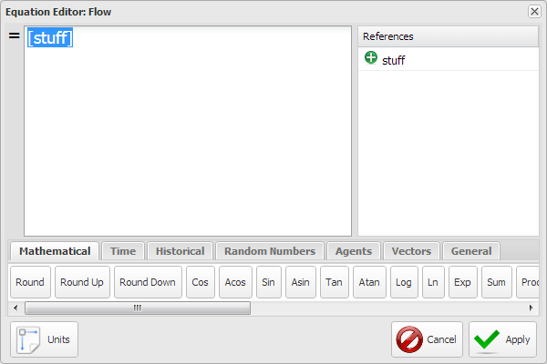
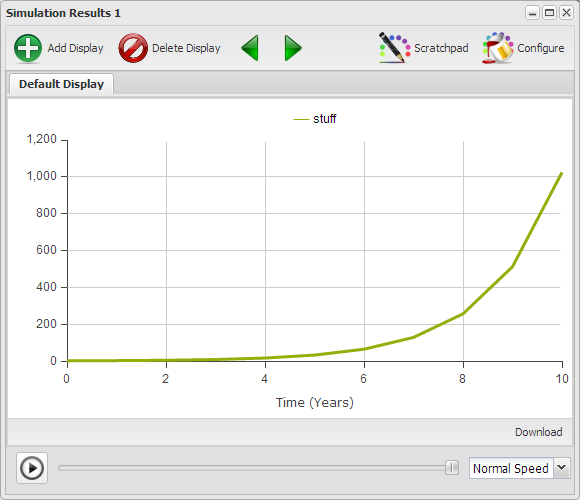
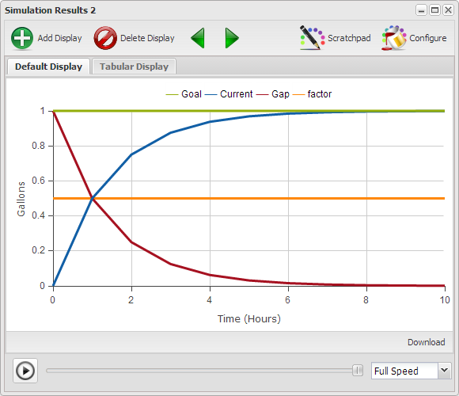
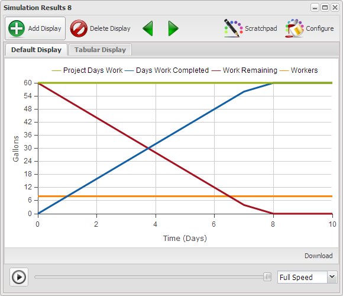

# Chapter 2 - Dynamic Building Blocks v2 13.05.31 #

When we build things our skill in using the tools we work with has a very definite impact on things we create. Figure 1 is the last model from the previous chapter. In this chapter we hope you will become far more familiar with, and comfortable with, the Insight Maker environment, the creation of these structures, as well as a deeper understanding of why these structures for the building blocks of everything else you will create in the Insight Maker environment to further your understanding and learning.

<IFRAME SRC="http://InsightMaker.com/insight/5138?embed=0&editor=1&topBar=0&sideBar=1&zoom=0" TITLE="Figure 1. Similar Structures/Different Behaviors" width=950 height=650></IFRAME>

## The Blank Canvas ##

When you create a New Insight you don't actually have to start with a blank canvas. Insight Maker presents you with a very simple working Rabbits Population model. This is just so there's something there to work with when you first start. If you click the **Clear Sample Model** button you will then have a blank canvas on which to create. In the next few segments you will learn how to create the three basic structures from which all models are constructed.

Notice in Figure 2 that similar tools are grouped together on the \u{Toolbar}. Only a portion of the \u{Toolbar} is displayed though it's enough for what will be covered in this section. If you wanted to see the rest of the \u{Toolbar} clicking the double caret at then end of the \u{Toolbar} will display the rest of the items on a drop down.

<IFRAME SRC="http://InsightMaker.com/insight/7070?embed=0&editor=1&topBar=1&sideBar=1&zoom=0" TITLE="Figure 2. New Insight" width=950 height=650></IFRAME>

To use any of the \u{Primitives} click on the icon on the \u{Toolbar} to select it, then click on the canvas where you want the item located. For each tool there are a set of allowed uses. Once you place the item on the canvas it is named for what it is, with that name selected so you can type in the name you want. Names can contain any characters except braces "{}", brackets "\[\]", parentheses \(\), and quotes '. If the label is not selected you can double-click it to select the label and then enter a new one, or you can enter the label in the \u{Configuration Panel} though we'll address that in a bit more detail later.

----------

### Exercise 2-1 ###

Practice placing \p{Stock} and \p{Variable} \p{Primitives} on the blank canvas in Figure 2 and naming them. You can remove a \p{Primitive} by clicking on it to select it and then pressing the \u{Delete} key or clicking the \u{Delete} button in the \u{Actions} section of the \u{Toolbar}. Note that the \u{Save} option is disabled so you won't be able to save what you create. **Note**: This is only for the review copy. In the final electronic copy you will be able to save what you create.

----------

## Stocks, Flows, Variables and Links ##

\p{Stocks} and \p{Variables} are connected to other \p{Stocks} and \p{Variables} using \p{Link} and \p{Flow} \p{Connections}. The rules for connections are very explicit because Insight Maker has to figure out how to simulate the model. The allowed connections are depicted in Figure 3. The next chapter will present several types of models where the rules for connections aren't nearly as rigid.

<IFRAME SRC="http://InsightMaker.com/insight/5275?embed=0&editor=1&topBar=1&sideBar=1&zoom=0" TITLE="Figure 3. Valid Primitive Connections" width=950 height=600></IFRAME>

If you select \u{Link} from the \u{Connections} segment of the \u{toolbar} then hover over a model \p{Primitives) on the canvas a small arrow pointing to the right shows at the center of the \p{Primitives). If you select a \u{Flow} the small arrow will only show up over a \p{Stock} as a \u{Flow} can only connect to a \p{Stock}.

Center the \u{cursor crossing double arrows} over the right arrow, which should then change to a \u{pointing finger hand}. Drag the mouse over to a second model element and the arrow tags along while the \u{Connections} is drawn. If neither \u{Link} or \u{Flow} is selected then there will be no right pointing arrow when you mouse over the primitive. We'll go into more detail about connections shortly.

----------

### Exercise 2-2 ###

Click on the \u{Unfold Model} button in the lower left corner of Figure 3, and then repeatedly click the \u{Step Forward} arrow to walk though an unfolding of the Valid Primitives model while you read the comments on the lower bar.

Note the setup takes a few seconds to please be patient. This will only be the case in the review copy, not the final eBook.

----------

Hopefully the rules associated with the connections were easy to understand. Just remember that Flows represent the movement of stuff while Links only communicate the value of something from one location to another.

## Valid Primitive Connections ##

The valid primitive connections of Figure 3 are described as follows.

### Flow ###

A Flow adds stuff to a Stock, subtracts stuff from a Stock, or moves stuff from one Stock to another. The only way to change the quantity of stuff in a Stock is with a Flow.

- A flow out of a stock decreases it. If where the flow goes isn't relevant to the model then it just flows from the stock to the canvas. Select Flow from the toolbar and then click on the arrow that appears on the stock when you mouse over it and drag onto the canvas and release. 
- A flow into a stock will increase it. If you don't care where the Flow is coming from then you first have to draw the Flow from the Stock to the canvas and click the Reverse button in the Connections section to get the Flow to come into the Stock from nowhere. It's just a quirk of the web implementation.
- A flow from one stock to another decreases the source and increases the destination. The get a flow between two Stocks draw the Stocks first and then draw the Flow from one Stock to the other.
- Flows can be bidirectional and we'll talk more about that the first time we use one in a model.
- Flows take time! Please remember this.

### Link ###

A Link is used to communicate a value from one element to another. There is no flow of stuff through the link itself. The communication is considered to be instantaneous.

- You can use a Link from a Stock to a Variable to communicate the value of the Stock to be used in an equation. This does not change the Stock.
- You can use a Link to communicate the value of a Stock to a Flow to be used in the equation determining the value of the Flow in the next iteration. The Link does not change the value of the Stock.
- You can use a Link to communicate the value of a Flow to a Variable to be used in an equation. This does not change the value of the flow.
- You can use a Link to communicate the value of a Variable to a Flow to be used in the equation that defines the flow. This does not change the value of the Variable.
- You can use a Link to communicate the value of a Variable to another Variable so that value can be used in an equation in the destination variable. The link does not change the value of the source Variable.
- You can use a Link to communicate the value of a Variable to a Stock to be used as it's Initial Value when the simulation begins. The value of the Variable is computed and assigned to the Stock as the simulation begins and it has no influence on the Stock during the simulation.

When you draw a link from one element to another it is created as a straight line. There are times when you would prefer that the connection be other than a straight line to make the diagram easier to follow. You can turn a straight line into a multiple segment line as follows.

- Click on the link to select it.
- Hold down the shift key and click somewhere in the middle of the link then release. This puts a little node on the line.
- Click on the node and move it as you wish to create a two segment link.
- You can create as many segments as you need, simply repeat the second step above.
- If you wish to remove the segments select the head of the link, move it off the element it's connected to and then reconnect it. It will now be a straight link.

----------

### Exercise 2-3 ###

Go back to Figure 2 and recreate Figure 3 for yourself and as you create each element think about what that particular element is for. Actually making the connections helps develop a level of skill and comfort which will serve you well in the future.

----------

## Configuration Panel ##

Each of the four elements used to build a model has some of the same configuration options though because each has a different function there are some unique configuration options for each item. Some of the most frequently used options will be described in the following sections. The ones not described here will be described the first time they are used.

The Configuration Panels for Stock 1, Flow 1 and Variable 1 form Figure 3 are displayed in Figure 3a and are described below.

### General ###

This section is where you can assign the (name) and Note for an item.

- **(name)**. This is the label that you see on the item. You can double-click the item on the canvas and edit the label on the item itself or change it here in the configuration panel.
- **Note**. Here you can enter a description of the item. You can enter short descriptions directly into the field. If you click the down arrow in right of the field it will open the **Note Editor** dialogue window which allows some formatting options. The note that you enter here will pop up when you mouse over an item and click on the little \u{i} that appears on the item. If the element of the model is selected you can also open the Note Editor window by CTRL+`(Control+Backquote). Adding comments to a model helps others to understand what you were thinking and when you go back to the model in the future the comments will help you understand what you were thinking when you put the model together. Yes, you completely understand now, though will you remember next week, or a year from now?

### Configuration ###

This section is used to define how the element behaves during the simulation and is a little different for Stock, Flow and Variables, though quite similar. The behavior is essentially controlled by an equation which is defined in terms of the variables connected to it. This is an initial value for a Stock. You may enter a short value into the field though if you click the down arrow in the right of the field the **Equation Editor** window will open. In this window you can define the formula that defines the behavior of the element. You can also open the **Equation Editor** for an element by mousing over the element and clicking on the **equals (=)** sign that appears. All the built in functions on the tabs at the bottom of the window have descriptions associated descriptions and examples.

Additionally in this section you define whether stocks can have negative values and whether flows can flow in both directions. We'll talk more about these options the first time we use them.

### User Interface ###

It is in this segment of the configuration panel that you define a slider for an element, if there is to be one. You can define a sliders for Stocks, to define it's initial value and for Flows and for Variables. Once you indicate there is to be a slider you then define the maximum and minimum values it may have, as well as the step size, how small are the variations allowed. If you leave the step size field blank then the slider can vary continuously.

An element may have a slider or a formula though not both. Sliders override equations. If you enter an equation and it disappears check to see if there was a slider defined and it hasn't been turned off.

### Validation ###

This section allows you to indicate if there are Maximum and/or Minimum constraints on a Stock, Flow or Variable.

Additionally it is in this section that you assign the Units for an Stock, Flow, and Variable. Units are very useful in helping to ensure the soundness of a model. Units will be covered extensively in Chapter 4.

## Common Property # 1 ##

To this point you've learned how to develop a static picture of a model. It is actually a model and provides a sense of the relationships between the various elements. What it doesn't give you a sense of is the dynamic nature of these interactions over time. What are the implications of the relationships? In the next few sections you'll learn how to bring your model to life.

Look at the pictures in Figure 4 and ask yourself what it is that these images have in common. The images all represent very different kinds of things, some living, some not, though there is a characteristics they all have in common. Have you figured it out?

Maybe you notice the rabbits from the previous chapter? The things depicted in the various images all grow in one way or another, and some faster than others.

## Constructing a Growth Structure ##

Lets use Figure 5 to construct a basic growth structure and in the process you'll learn about several of the parameters associated with the different elements of a model.

<IFRAME SRC="http://InsightMaker.com/insight/5351?embed=0&editor=1&topBar=1&sideBar=1&zoom=0" TITLE="Figure 5. Growth Structure" width=950 height=600></IFRAME>

- Click \u{Make New Insight} on the \u{Toolbar} and then click the \u{Clear Sample Model} button.
- Place a Stock on the canvas and label it Stuff.
- Now make sure the Stock is selected and take a look at the Configuration Panel on the right.
- Click on Flows to select that element.
- Mouse over the stock and click when the arrow appears at the center and drag onto the canvas somewhere outside the stock. Which direction doesn't make a difference though make sure you're a couple inches outside the stock before you release the mouse button.
- While the flow is still selected click on Reverse so you have a flow into the stock.
- Notice that the parameters in the Configuration Panel are different from those for the Stock.
- Click in the field to the right of Flow Rate = and change the zero to a 1.
- Click the Run Simulation button, which is on the ">>" drop down on the right end of the  toolbar. You've now successfully created, and run, your first model. Admittedly it may not be very exciting though it is the first one of many to follow and it runs.
- Save this as you will add to this model shortly.

Notice that the model ran for 20 years. That's because we used the default Time Settings.

----------

### Exercise 2-4 ###

Open the Time Settings dialogue associated with Figure 5 and setup and run the model for different values of Simulation Length and Time Units. In what way do your changes alter the output?

Try creating a slider for your stock and flow. Set them for different values and run the model. The idea is just to develop your skill as well as a level of comfort in working with the tools.

----------

Notice that in each case what you get is a rising slope for different time periods and at different angles. What you perceive in the graph is referred to a linear growth though this growth doesn't actually represent the growth associated with the images depicted in Figure 3. In those situations growth at each time is actually dependent on the size of the accumulation or stock at that time.

If we evolve the model of Figure 5 into Figure 8 so the flow is dependent on the amount of stuff we find the resultant growth to be very different.

<IFRAME SRC="http://InsightMaker.com/insight/5497?embed=0&editor=1&topBar=1&sideBar=1&zoom=0" TITLE="Figure 8. Feedback Dependent Growth" width=950 height=600></IFRAME>

Figure 8 represents only a couple of changes from Figure 5 as follows.

- Extend the model you created based on Figure 5 as follows.
- Connect a link from stuff to Flow and reshape it with a couple of handles to improve visibility.
- Mouse over the Flow and click on the \u{=} sign to open the \u{Equations Editor} and set the Flow to \u{\[stuff\]} as in Figure 9. You can do this just by clicking on \u{stuff} in the \u{References} list.
- Open \u{Time Settings} and set the \a{Simulation Length} to 10.
- Now Run the model. Note that because of the width of the embedded model you can't see the whole \u{Toolbar}. Clicking the \u{>>} just to the right of the \u{Tools} section of the \u{Toolbar} the rest of the options will drop down and you can select the \u{Run} option. You should now see the diagram in Figure 10.

The result of the run from the model in Figure 8 is depicted in Figure 9. The value after 10 Years is 1,024 which you should realize is just 2^10 as expected because we started with a value of 1 and doubled it every year. This curve is referred to as an exponential growth curve.

----------

### Exercise 2-5 ###

Notice that the curve in Figure 10 is a bit choppy where it turns up. Run the model in Figure 8 with a Time Step of .5, .25, .125, .0625 and compare the results. What questions are raised by the the results?

----------

### Time Units and Time Step Selection ###

The \u{Time Units} and \u{Time Step} selected for a model should be consistent with the time frame and level of detail of the model. You probably wouldn't develop a model about filling a bathtub with water and use \u{Time Units} of months. Minutes are probably more appropriate for this model. The \u{Time Step} is then selected to ensure none of the relevant transitions associated with the dynamic nature of the model are missed. A \u{Time Step} of .25, meaning 15 seconds, is probably sufficiently small to ensure there are no transitions missed.

Trial is actually the most appropriate approach to determine if you have an appropriate value for \u{Time Step}. If you think .5 is appropriate then run the model with 1, .5, and .25 and if the results for 1 and .25 don't differ from .5 then you're probably OK. If .25 produced a different result then compare the .25 result with the .125 result. Once you get two runs where the values don't change then use the larger one.

Given this guidance how would you interpret the results you experienced in Exercise 2-5?

----------

### References ###

- [How does DT work? from isee Systems](http://www.iseesystems.com/Helpv9/Content/DT/How_does_DT_work_.htm)
- [DT Situations Requiring Special Care from isee Systems](http://www.iseesystems.com/Helpv9/Content/DT/DT_Special_Care.htm)

----------

### Exercise 2-6 ###

Consider the images in Figure 4 and think about what \u{Time Units} and \u{Time Step} you would use in a model representing the growth in each of these areas.

----------

One aspect of trying to model the contexts of Figure 4 that should have become apparent is that there is a piece of the model that's missing. 

<IFRAME SRC="http://InsightMaker.com/insight/5887?embed=0&editor=1&topBar=1&sideBar=1&zoom=0" TITLE="Figure 11. Feedback Dependent Growth" width=950 height=600></IFRAME>

The model in Figure 11 adds a factor, which is allowed to vary between 0 and 1, which is simply used to govern the flow. Mouse over the Flow and click the equal (=) sign to view the formula governing the flow.

> Flow = [stuff] * [factor]

----------

### Exercise 2-7 ###

Use the model in Figure 11 to implement the models in Exercise 2-7. Does this structure allow you to construct more realistic representations of the growth situations presented in Figure 4?

----------

### Exercise 2-8 ###

The model in Figure 11 is the model for a Savings Account that is defined as compounding annually, i.e. calculating and adding interest once a year. This means that the most appropriate \u{Time Units} is years with a \u{Time Step} of 1. There are no other transitions in this model that need to be accommodated. If you run this model with any \u{Time Step} other than 1 it will result in a less accurate result. What does this happen?

----------

The model of Figure 11 is the standard reinforcing growth model depicted in Figure 1 at the beginning of this chapter. In the process of arriving this model the linear growth model of Figure 1 was developed first, and then evolved. Hopefully through the exercises to this point you have gained a deeper understanding of how this structure works and the extent to which it may be applied to various situations.

## Common Property # 2 ##

Look at the activities depicted by the images in Figure 12 and ask yourself what it is that these activities have in common. The images represent very different kinds of activities though there is a characteristics they all have in common. Have you figured it out?

Each activity depicted in Figure 12 represents the pursuit of some goal or objective. Admittedly the goals are very different and each is pursued in a very different manner.

## Constructing a Balancing/Goal Seeking Structure ##

As we have done repeatedly to this point we begin with a linear model consisting of a flow and a stock, along with a flow rate variable. To this we simply have to add a goal and the appropriate feedback and we end up with the model in Figure 13.

<IFRAME SRC="http://InsightMaker.com/insight/6168?embed=0&editor=1&topBar=1&sideBar=1&zoom=0" TITLE="Figure 13. Balancing/Goal Seeking" width=950 height=600></IFRAME>

When you look at Figure 13 admittedly we added Gap which we haven't addressed before. This was done so we could explicitly plot the difference between the Current value and the Goal. The factor is simply a multiplier between 0 and 1 to govern the extent to which the Gap governs the change.

> Gap = [Goal] - [Current]

> change = [Gap] * [factor]

Take a look at the Time Settings for Figure 13 and you'll see that the model was set up to run from 0 to 10 with a time step of 1 and a units of hours. These were just selected to create a generic model where you could consider the Goal to be 100% and the other values as having values between 0 and 100%. This way we can consider the implications of the interactions without getting hung up on the actual values.

If you run this model you should get the result depicted in Figure 14. This shows how the value of Current approaches the Goal as the value of Gap declines with a factor = 0.5.

Figure 14 shows that as Current moves toward the Goal the Gap decreases as does the change which is moving Current in the direction of Goal. Once Current reaches Goal the Gap is zero is change. This structure endeavors to remove the tension between Current and Goal, the Gap, to bring a balance to the situation. Figure 14 presents the characteristic behavior of a Balancing/Goal Seeking structure.

----------

### Exercise 2-9 ###

Run the model in Figure 13 with various values for factor. What do you notice about the relation between Current and Gap? And what do you notice about the curves as the factor gets larger and larger?

----------

Under Time Units and Step Selection we talked about it being essential that the the Time Units were selected appropriate to what was being modeled. In this case since it's a generic model one Time Unit is pretty much as appropriate as any other. The Time Step is another matter though, or is it? We said one chooses a Time Step such that none of the relevant interactions are missed and the change from one Time Step to another doesn't change the result.

----------

### Exercise 2-10 ###

Set up the model in Figure 13 to run with Current = 0, Goal = 1, and factor = .75. Now run the model with a Time Step of 1, .5. 25. .125. Does the result actually change? Look at the Tabular Display associated with the Simulation Result. As you make the Time Step smaller and smaller are the results more correct?

----------

Considering that we don't know anything about a real environment being modeled in Figure 13 it's a bit difficult to determine if the result is actually more correct as the Time Step used is smaller and smaller.

You might have also realized by this point that it would be quite difficult if we attempted to use this model to model any of the situations depicted in Figure 12. While progress toward the goal in the situations depicted is promoted by the Gap between the Goal and Current the change in those situations isn't likely to be proportional to that Gap.

Figure 15 presents a modification to the model of Figure 13 where the factor has been replaced by a constraint. It looks like there have been lots of changes though they all cosmetic except the way Workers influence work on a daily basis.

<IFRAME SRC="http://InsightMaker.com/insight/6171?embed=0&editor=1&topBar=1&sideBar=1&zoom=0" TITLE="Figure 15. Goal Seeking with Constraint" width=950 height=600></IFRAME>

If you run the model with Project Days Work = 60, Workers = 8 and Days Work Completed set at the default of zero and Time Step = 1 you should see the graph in Figure 16.

The reason the graph looks like this is because of the constraint placed on the the work because of the number of Workers available. This is accomplished by the formula embedded in the flow.

> work = IfThenElse([Work Remaining] > [Workers],[Workers],[Work Remaining])

This says that if there is more Work Remaining than there are Workers available to do the work then the amount of work that day equals the number of Workers. This goes on for the first 7 days then on the 8th day there are only four days work required to finish the project which is represented by the different slope on the line on the 8th day. You can see this in detail if you look at the Tabular Display.

----------

### Exercise 2-11 ###

Set up the model in Figure 16 to run with Time Step of .5. Compare the Tabular Display of this run with the results of the previous run above.  By making the time step smaller have we improved the accuracy of result? Why?

----------

Again the appropriate Time Step is one that captures the activity occurring within the model. In this case the Workers are in integers and Project Work days are in integers, and with the Time Units in days the appropriate Time Step is 1. If there were events which happened in the model on the order of hours then you would have to decide whether to alter the model to run in hours or reduce the Time Step to ensure it was small enough so no interactions in the model were missed.

----------

### Exercise 2-12 ###

Use the model in Figure 15 and reconfigure it for a couple of the activities depicted in Figure 12. Note that for this exercise you will have to relabel the stock, flow, and variables accordingly. You will also have to decide on the most appropriate Time Units and Time Step to use.

----------

## Summary ##

Hopefully this chapter has helped you become more familiar with the modeling environment and the four model elements you will use most often.

- **Stock**. An accumulation of something that can only be changed by something flowing into or out of it.
- **Flow**. Something moving over time which adds to a stock or subtracts from a stock.
- **Variable**. Constant or equation computed each time the simulation steps.
- **Link**. Used to communicate a value from a Stock, Flow, or Variable, to a Stock, Flow or Variable. The source is not changed and a link to a stock can only be used to set it's initial value.

Because of the nature of the building blocks themselves there are only a small number of valid connections as depicted in Figure 3.

These valid connections are used to create only three different types of structures, linear growth, goal seeking and reinforcing growth. If you are comfortable with these you should be relieved to know that's all there are. Just three simple structures will be used for all the models you will ever build. Of course at times there may be quite a few of these connected together though you should be confident that you know about the pieces.

The models that you have experienced in Chapter 1 and Chapter 2 are referred to as Stock & Flow Simulation Models. These are also referred to as quantitative models because of the values associated with the simulation of these models. In the next chapter we'll investigate a number qualitative models which are also used in developing understanding. These are referred to as qualitative models because there are no numerical values associated with them, though there are times when they can be quite useful.

