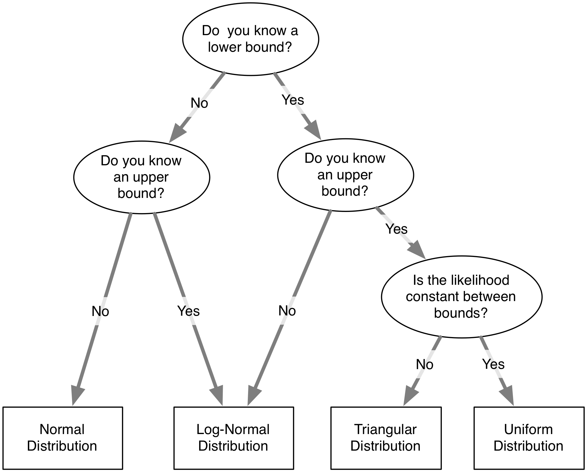

# Building Confidence in Models

When used correctly, the transparency of these modeling techniques results in models that are powerful persuasive tools. As with any model, however, there are concerns and questions will invariably be raised which could cause users to doubt the result of the modeling work. There are a number of techniques that you can use to help preemptively address these concerns and increase an audience’s confidence in your model.

The idea of building confidence in a model is closely tied to the standard concept of model verification and validation. We dislike this conceptual approach to assessing models as it seems to imply that a model can go through a process to get a big fat “VALID” or “VERIFIED” stamp on it. Returning to Box’s quote that "all models are wrong, but some are useful", in reality all models are wrong and none of them are valid, period. Models can however be useful, especially narrative models in which the audience has confidence. 

We favor the conceptual approach put forth by @Forrester:1978vy, that there is not any single test or suite of tests that will verify or validate a model and that validity should instead be thought of as a function of confidence. This is a view that differs from that held by some modelers and laypeople. As Forrester and Senge note, “the notion of validity as equivalent to confidence conflicts with the view many seem to hold which equates validity with absolute truth.” We share their belief that model confidence is built up piece by piece from a variety of tests that, though they cannot prove anything, together comprise a persuasive case for the quality of a model.

There are three distinct areas where confidence needs to be developed:

1. That the model itself is well designed.
2. Given a design of the model, this design is implemented correctly.
3. The conclusions drawn from the model are accurate.

## Model Design

Fundamentally the design of a narrative model is of utmost importance and needs to be justified to an audience^[This is different from predictive models where the results of the model are much more important than the design and the “proof is in the pudding” so to speak.]. There are two primary aspects to a model’s design design: the structure of the model and the data used to parameterize the model.

### Structure

The structure of the model should mirror the structure of the system being simulated. Depending on the system complexity, the model structure may need to carry out more or less aggregation and simplification of this reality. Nevertheless, all the primitives in the model should map on to reality in a way that is understandable and relatable to the audience. Furthermore, the model structure should include components that an audience thinks are important drivers of the system. Missing a factor that the audience considers to be a key driver can fatally discredit a model in an audience’s mind irrespective of the performance or other qualities of a the model. This is true even if the factor has in fact a negligible effect. Generally speaking, it is much easier to include a factor an audience views as important than it is to convince the audience that the factor does not in actuality matter later on.

### Data

The more a model uses real-world data, the more confidence an audience will have in the model. Ideally, you have empirical data to justify the value of every primitive in your model. In practice, such a goal may be a pipe dream. Indeed, for a complex model, obtaining data to parameterize every aspect of it is usually impossible^[Leading to the clichéd conclusion of many modeling studies: “We are unable to draw strong conclusions from this modeling work. Instead, our contribution has been to show where additional data needs to be collected.”]. When faced with model primitives that do not have empirical data to parameterize them, an approach must be taken to ensure that it does not appear that their values were chosen without justification or to arrive at a predetermined modeling conclusion. Sensitivity testing, as discussed later on, is one way to achieve this. Another is to carry out a survey of experts in the field in order to solicit a set of recommended parameter values that can then be aggregated or used to justify the ultimate parameterization. Remember, you cannot be definitive but still timely when it comes to using models for policymaking; even if you could achieve a full model based on comprehensive point in time data, by the time you are done, the model is out of date.

### Peer-Review

Going through a peer-review process can be extremely useful in establishing confidence in a model. Two general types of peer-review are available. In one, the model may be incorporated into an academic journal article and submitted for publication. The article will then peer-reviewed by generally two or three anonymous academics in the field who critique it and judge whether or not it is a worthy contribution to the literature, thus meriting publication. In the second type of peer-review, a peer-review committee may be assembled (hired) to review a specific model and provide conclusions and recommendations to clients.

Peer-review can be very useful in establishing the credibility of a model. A credible model is a model one can be more confident in, other things being equal. By engaging an independent group of exports to assess the model, their conclusions about its quality have the appearance of greater validity than those of the self-interested modelers^[When the peer review panel is hired by the client there is some conflict of interests, but the panel members should not be swayed by this.]. This can be especially useful when trying to meet some abstract standard such as that the model represents the “best available technology” or the “best available science”.

A key risk of a peer-review is, of course, that the peer-review members will find a model deficient in important respects. Good criticism can be very useful and help improve a model. However, some criticism received in practice may be nitpicking details or detrimental advice that would make the model worse if followed.

## Model Implementation

Although it is not as much a lightning rod as is model design, the implementation of a model specification is a point where significant error can occur. Programming mistakes or mistyped equations can introduce bugs into a model that can be hard to identify later on. This is a particular problem in black-box models but it is still an important point to consider for all types of models including those presented in this book. Fortunately, a number of steps can be taken to ensure the model is implemented correctly.

### Primitive Constraints

For many of the primitives in the model, there will be natural constraints. For instance, a stock representing the volume of water in a lake can never fall below 0. Similarly, if a variable represents the probability of an event occurring, it must be between 0 and 1.

Often these constraints are implicit without being formally specified in the model. A modeler may think, water volume can never become negative so why would I need to specify it? However, the existence of these constraints provides an opportunity to implement a level of automatic model checking. By specifying that a primitive can never go above or below a value (using the \a{Max Value} and \a{Min Value} properties in Insight Maker), you can create in effect a canary in the coal mine that warns if something is wrong in the model. If these constraints are violated an error message can be given letting you know that you need to correct some aspect of your model.

### Unit Specification

Since we introduced units in Chapter 3, we showed that they could be a useful tool in constructing models. Units can also be used to ensure that equations are entered correctly. If you fully specify the units in a model, many types of equation errors will result in invalid units, which will create an immediate error. By employing units in your model you can automatically catch a whole class of errors and mistyped equations.

### Regression Tests

Other tests than those specified above can be developed. For instance, the proper behavior of one part of the model may be determined and automated tests created to periodically confirm that the model continues to exhibit the correct behavior. Development of such tests are a common part of software engineering that we wish would see more use in model development. Insight Maker itself has a suite of over 1,000 individual regression tests that automatically test every aspect of its simulation engine.

In regards to regression testing, it is important to ensure these tests are automated. It is not enough to examine a portion of the model, determine it is currently working correctly, and leave it at that. The problem is that future changes may break the existing functionality. Especially for complex models, a change in one part of the model may have an unexpected effect in another part. By implementing a set of automatic checks, you can protect your model against unintended changes and regressions.

### A Second Pair of Eyes

That is not to say, however, that spot and point-in-time checks are not worthwhile. It can be very useful to have a second modeler review your models and cross-check the equations. This helps not only to check simple mistakes but also to question and critique the fundamental structure and choices of the model.

The gold standard in verifying that a model is implemented correctly according to specification is to have a second modeler completely reimplement the model according to that specification. Such reimplementation should ideally occur without access to the original model’s code base to ensure that the second modeler does not simply copy bugs from the original model into the reimplementation. If the results from the two implementations concur, that is strong evidence that the model has been implemented correctly. Although potentially an expensive exercise, it will also most likely identify numerous ambiguities in the specification, which could be valuable in and of itself.

## Model Results

Given that the design of the model and its implementation are assumed to be correct, the burden still falls upon the modeler to transfer her confidence in the model’s results to her audience. There are several different ways this can be done.

### Expected Results

The first way is to demonstrate that the model generates expected results for normal inputs. For instance, if you had a model a reservoir, you would expect the volume of the reservoir to decline over time during the summer due to evaporation if no more water flowed into it. You can additionally test extreme scenarios and show that they generate the expected results. If, for example, your reservoir were empty, you would expect the amount of water to evaporate from it to be zero. By enumerating these standard cases and showing the model results match the expected results you can help build confidence in the model.

### Counterintuitive Results

Another attempt to increase confidence in a model is to show unexpected results that are justifiable. Imagine a model that for a certain set of inputs would create what, at first glance, appeared to be the “wrong” behavior. Some lever in the model could lead to unexpected results. When first shown these results, they could decrease an audience’s confidence in the model. If the audience was then walked through the model step by step to show how those results proved to be correct and mirrored reality, then that could well increase their confidence in the model results.

### Forecasting

Possibly the most persuasive action to convince an audience of the effectiveness of a model is to forecast the future and then to show this forecast to be correct. This, of course, is difficult to do in practice for multiple reasons including the fact that the scale of a model is often such that it could take several years or decades to generate data to test the model. Additionally, it must be remembered that most narrative models are poor predictors and should not be used for predictive purposes solely.

### Sensitivity Testing

Sensitivity testing is a broad field that has the potential to address many questions and doubts that may arise about a model. In general, the variables and numeric configuration values in a model will never be known with complete certainty. When the results from an election poll are published, the pollsters publish not only their predictions but also the uncertainty in the prediction (e.g., "the Democratic candidate will obtain $52\% \pm 3\%$ of the vote"). Similarly when a building is constructed, the materials used will have certain properties -- such as strength -- that again are only known up to some errors or tolerance. It is the engineer’s and contractor's responsibilities to ensure that the materials are sufficient even given the uncertainty of their exact strengths.

The same occurs when modeling. Most primitive values in the model will have to be estimated by the modeler and there will be an error associated with these values. Of course the error will also be propagated through the model when it is simulated and affect the results output by the model. This error is one factor that can create doubt about a model and reduce an audience's confidence.

As a modeler, one approach to address this doubt would be to try to measure all the model's variables with great accuracy. You could search the available literature, undertake a meta-analysis of current results, carry out new experiments, and survey experts to get as precise a set of parameter values as possible. If you were able to say with strong certainty that these values were so accurate and the errors so small that their effect on the results in negligible, then that would be one way of addressing the issue of uncertainty.

However, all of this is often impossible to do. When dealing with complex systems it is almost always the case that at least a couple variable values will never be known fully with certainty. In this case, no matter how much research or experiments you do, you will never be able to pin down the precise values of these variables. How do we handle these cases?

The answer is straightforward: Rather than trying to eliminate the uncertainty, we embrace it by explicitly including it in the model. If you can then show that the results of your model do not significantly change even given the uncertainty, you have a persuasive case for the validity of your results. Of course the results will always change when the uncertainty is introduced, but if the model conclusions persist even in the face of this uncertainty it will greatly increase your audience's confidence in the results.

Uncertainty can be explicitly integrated into a model by replacing constant primitive values with a construct that represents the uncertainty in that value. Imagine you had a simple population model of rabbits in a cage. You want to know how many rabbits you will have after two years. However, you don't know how many rabbits there initially are in the cage. You have been told that there are probably 12 rabbits, but the true number could range anywhere from 6 to 18.

If you model your population as a single stock, what should the initial value be? A naive model could be built where you the initial value of the rabbit stock was specified as 12. However, that does not incorporate the uncertainty and could be a source of criticism or doubt for the model. An alternative would be to specify that the initial value of the stock is a random number with a minimum value of 6 and a maximum value of 18. So each time you run the model you will get a different result. If you ran the model once, the initial value might be chosen to be 7 and you would obtain one result. If you ran the model again, the initial value might be 13 and you would get another result.

If you run this stochastic model many times, you obtain a range of results. These results can be automatically aggregated to show the range of outputs. For instance if you ran the model 100 times you could see what the maximum and minimum final populations were. This would give you a good feeling for how many rabbits you needed to prepare for after two years. In addition to the maximum and minimum you might be interested in the average of these 100 runs: the expected number of rabbits you would see. You could also plot the distribution of the final population sizes using a histogram to see how the results are distributed. This distribution would show how sensitive the outputs are to the uncertainty in the inputs: a form of sensitivity testing.

There are four key distributions that are useful for specifying the uncertainty in a variable:

Uniform Distribution
: The uniform distribution is defined by two parameters: a minimum and a maximum. Each number within these two boundaries has an equal probability of being sampled. The uniform distribution is useful when you know the boundaries on the values a variable can take on, but you do not have any information on the likelihood of the different values within this region. The uniform distribution can be used in Insight Maker using the function \e{Rand(Minimum, Maximum)}, the two parameters are optional and will default to 0 and 1 if \e{Rand()} is called without them.

Triangular Distribution
: The triangular distribution is defined by three parameters: the minimum, the maximum, and the peak. Like the uniform distribution, the triangular distribution will only generate numbers between the minimum and maximum. Unlike the uniform distribution, the triangular distribution will not sample all numbers between these boundaries with equal likelihood. The value specified by the peak will have the most likelihood of being sampled with the likelihood falling off as you move away from the peak towards either the minimum or maximum boundary. The triangular distribution is useful when you know the both the most likely value for a variable and you also know boundaries for the values a variable can take on. The triangular distribution can be used in Insight Maker using the function \e{RandTriangular(Minimum, Maximum, Peak)}.

Normal Distribution
: The normal distribution is defined by two parameter: the mean of the distribution (generally denoted $\mu$) and the standard deviation of the distribution (generally denoted $\sigma$). The most likely value to be sampled from the normal distribution is the mean. As you move away from the mean (in either a positive or negative direction), the likelihood of a number being sampled decreases. The standard deviation controls how fast this likelihood falls as you move away from the mean. Small standard deviations result in steep declines in the likelihood while large standard deviations result in more gradual declines. The normal distribution is useful when you do not have boundaries on the values for a variable but you do know what the most likely value for the variable should be (the mean). The normal distribution can be used in Insight Maker using the function \e{RandNormal(Mean, Standard Deviation)}.

Log-normal Distribution
: The log-normal distribution is closely related to the normal distribution. In fact the logarithm of the values samples from a normal distribution will be log-normally distributed. Like the normal distribution, the log-normal distribution is defined by two parameters: the mean and standard deviation. Where the log-normal distribution differs from the normal distribution, is that negative values will never be generated by the log-normal distribution. Thus it is useful when you have a variable which you know cannot be negative but for which you do not have an upper bound. The log-normal distribution can be used in Insight Maker using the function \e{RandLogNormal(Mean, Standard Deviation)}. The log-normal distribution can also be used to represent other types of one-sided boundaries. For instance, the following equation could be used to represent a variable whose number was always less than 5: \e{5-RandLogNormal(2, 1)}

There are many other forms of probability distributions. Some notable ones are the Binomial Distribution (\e{RandBinomial(Count, Probability)}), the Negative Binomial Distribution (\e{RandNegativeBinomial(Successes, Probability)}), the Poisson Distribution (\e{RandPoisson(Lambda)}), the Exponential Distribution (\e{RandExp(Lambda)}) and the Gamma Distribution (\e{RandGamma(Alpha, Beta)}). These distributions can be used to address very specific modeling usage cases and needs (for instance, the Poisson distribution can be used to model the number of arrivals over time), however, the four distributions described in detail above should generally be sufficient for most sensitivity testing needs.

When important practical tip when using sensitivity testing within the System Dynamics context is to be careful about specifying random numbers within variables. The value of a variable is recalculated each time step. This means that if you have a random number function in the variable, a new random value will be chosen each time step. This can create a problem if the random value is supposed to be fixed across the course of the simulation. For instance, we may not know the birth rate coefficient for our rabbit population, but, whatever it is, we assume it is fixed over the simulation.

A simple way to handle these fixed variable values would be to replace the variables with stocks. The stocks initial value could be set to the random value and it would only be evaluated once at the beginning of the simulation and kept fixed thereafter. This approach, though very workable, however violates the fundamental metaphors at the hard of System Dynamics. In Insight Maker, another approach is to use the \e{Fix()} function. When used with one argument, this function evaluates whatever argument is passed to it a single time and then returns the results of that initial calculation for subsequent time steps. So instead of having the simple equation \e{Rand(0, 10)} in a variable to generate a random number between 0 and 10, you could place \e{Fix(Rand(0, 10))} in the variable. The first equation would generate a new random number each time step, the second equation will generate one random number and keep it constant throughout the simulation.

\begin{oframed}\textbf{Sensitivity Testing} 

 \begin{enumerate}
\item 

Let's illustrate the usage of sensitivity testing using our rabbit example. First we will construct a simple exponential growth model.

\item Create a new \a{Stock} named \p{Rabbits}.
\item  Change the \a{Initial Value} property of the primitive \p{Rabbits} to \e{12}
\item Create a new \a{Flow} going from empty space to the primitive \p{Rabbits}. Name that flow \p{Births}.
\item Create a new \a{Variable} named \p{Birth Rate}.
\item  Change the \a{Equation} property of the primitive \p{Birth Rate} to \e{0.05}
\item Create a new \a{Link} going from the primitive \p{Birth Rate} to the primitive \p{Births}.
\item  Change the \a{Flow Rate} property of the primitive \p{Births} to \e{[Birth Rate]*[Rabbits]}
\item The model diagram should now look something like this: \par \begin{minipage}{\linewidth}  \centering \includegraphics{model_1/diagram_10.png}
\end{minipage}
\item 

This is the basic outline for the model. We assume a fixed value of 12 rabbits and a fixed birth rate of 0.05.

\item Run the model. Here are sample results:\par \begin{minipage}{\linewidth}  \centering \includegraphics{model_1/result_12.png}
\end{minipage}
\item 

When we simulate we obtain the same results each time.

\item  Change the \a{Initial Value} property of the primitive \p{Rabbits} to \e{RandTriangular(6, 18, 12)}
\item 

Now, let's try to incorporate uncertainty. Given that we know that there can be between 6 and 18 rabbits initially with an expected value of 12, we can use the \textbf{RandTriangular()} function to model this.

\item  Change the \a{value} property of the primitive \p{Birth Rate} to \e{RandLogNormal(0.05, 0.03)}
\item 

We also do not know the birth rate with certainty. We know, however, that the rate must be greater than 0, and lets say we can assume the expected value is 0.05. We can use the \textbf{RandLogNormal()} function to model this type of uncertainty.

\item Run the model. Here are sample results:\par \begin{minipage}{\linewidth}  \centering \includegraphics{model_1/result_18.png}
\end{minipage}
\item Run the model. Here are sample results:\par \begin{minipage}{\linewidth}  \centering \includegraphics{model_1/result_19.png}
\end{minipage}
\item Run the model. Here are sample results:\par \begin{minipage}{\linewidth}  \centering \includegraphics{model_1/result_20.png}
\end{minipage}
\item 

Now, we can simulate this mode a few times and see that each time we run the simulation we get a different result.

\item 

We can now use sensitivity testing to see the range of results given this specified uncertainty. We'll do 100 runs of the model and aggregate the results to see the expected distribution

\item \par \begin{minipage}{\linewidth}  \centering \includegraphics{model_1/data_24.png}
\end{minipage}
\item 

We can readily see the range of results allowing us to make decisions incorporating our known uncertainty about parameter values. 

\end{enumerate} \end{oframed}The astute reader will notice that our discussion up to this has failed to address an important point: how do we determine the uncertainty of a variable? It is very easy to say that we do not know the precise value of a variable, but it is much more difficult to define the uncertainty of it. One case where we can precisely define uncertainty is when you take a random sample of measurements. For instance, suppose our model included the height of the average American man as a variable. We could randomly select a hundred men and measure their heights. In this case our uncertainty would be normally distributed with a mean equal to the mean of our sample of one hundred men and a standard deviation equal to the standard error of our sample of one hundred men^[Please note that this contradicts slightly what we said earlier. Clearly, a person cannot have a negative height while the normal distribution will sometimes generate negative values. So wouldn't a log-normal distribution be better than a normal distribution? Mechanistically, it would, however statistically we can show that due to the Central Limit Theorem the normal distribution does asymptotically precisely model our uncertainty. Given a large enough sample size (100 is more than enough in this case), the standard deviations for uncertainty will be so small that the chances of seeing a negative number (or even one far from the mean) are effectively none.]. For any random sample of $n$ values from a population, the same should hold true: you will be able to model your uncertainty using a normal distribution with:

$$ \mu = \frac{Value_1+Value_2+Value_3+...+Value_n}{n} $$
$$ \sigma = \sqrt{\frac{1}{n} \sum_{i=1}^n (Value_i-\mu)^2} $$

However, in most applied cases you will not be able to apply this normality assumption. Generally you will not have a nice random sample, or you might have no data at all and instead have some abstract variable you need to specify a value for. In these cases, it is up to you to make a judgment call on the uncertainty. Choose one of the four distributions detailed above and use whatever expert knowledge available to you to place an estimate on the parameterization of uncertainty. One rule of thumb, however, is that it is better to overestimate uncertainty than underestimate it. It is better to err on the side of overestimating your lack of knowledge than it is to obtain undue confidence in model results due to an underestimation of uncertainty.

