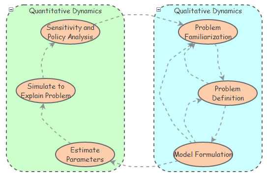
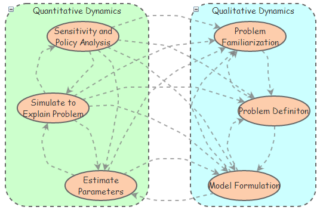
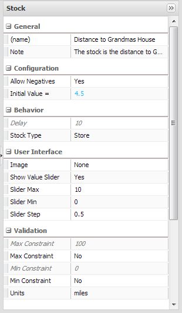
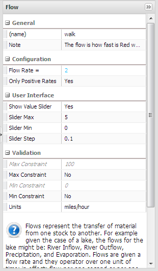
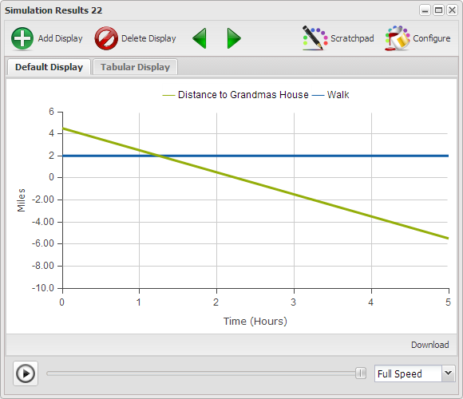
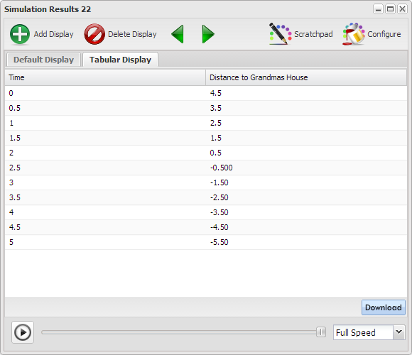
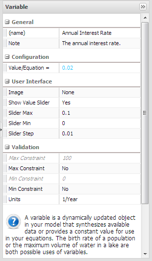
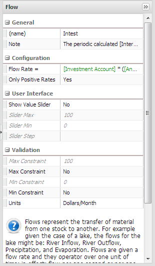
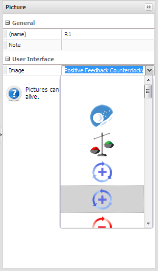
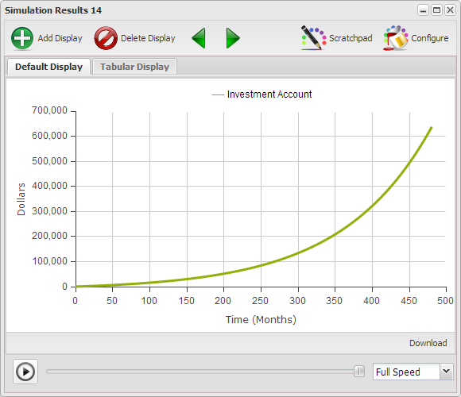

# Chapter 4 Building a Model v2 13.06.02 #

    “Would you tell me, please, which way I ought to go from here?”
    “That depends a good deal on where you want to get to,” said the Cat.
    “I don’t much care where–” said Alice.
    “Then it doesn’t matter which way you go,” said the Cat.
    “–so long as I get SOMEWHERE,” Alice added as an explanation.
    “Oh, you’re sure to do that,” said the Cat, “if you only walk long enough.”
    
    Lewis Carroll - Alice in Wonderland

Now that the most relevant aspects of Insight Maker have been introduced it is appropriate to provide you with a meaningful process and guidelines to use when they set out to build a model to promote an understanding of an area of interest. An aspect of this essential for the development of sound models is the topic of units. While units don't ensure a model is sound, if the units don't match up one can be certain the model is not sound.

## Model Construction Process ##

We develop models to help us understand the implications of interactions, and sometimes guidance. As such, as with Alice above, it is essential that before you begin to build a model you know what it is that you want to understand otherwise how will you know if the model does what you needs to do.

There are a number of guidelines or rules of thumb that you will find helpful when developing a model. These will be presented as Modeling Tips throughout this chapter. The idea is to ensure that the model serves the purpose you started building it for.

Figure 0 presents a generalize concept for of model development.

[** Figure 0. Model Construction Process](http://www.insightmaker.com/insight/184)

The difference between Real Events and Conclusions and Behaviors result in the creation of an Abstract Version of Real Events. The abstraction is then used to develop a Model which promotes a revision to Conclusions and Behaviors. This cycle continues until the Model produces a set of Conclusions and Behaviors which are congruent with Real Events. At this point there's no longer a need to create an Abstract Version of Real Events, meaning you have achieved the understanding you were seeking.

The construction process of Figure 0 is very conceptual and as you continue to develop models you will arrive at a sequence that you are comfortable with an enables you to achieve the understanding your seeking. Figure 0a and 0b present the two model formulation processes presented by Andrew Ford in Modeling the Environment.

[** Figure 0a. Emphasis on Model Formulation](http://www.insightmaker.com/insight/220)

In this approach one focuses on the understanding the qualitative dynamics, i.e., problem familiarization, problem definition and model formulation. Not until such time as there is a level of comfort in the understanding of these dimensions, which may employ Rich Pictures or Causal Loop Diagrams, does one progress to the quantitative aspect of model building, i.e., estimating parameters, simulating to explain the problem and sensitivity and policy analysis, which is where the Stock & Flow simulation model is employed. The quantitative dynamics may produce sufficient understanding or the process may continue back into the qualitative dynamics area. Model development is an iterative process.

Figure 0b, which may look like complete chaos, emphasizes simulation to provide feedback to provide a better understanding of all other aspects of the modeling process.

[** Figure 0b. Emphasis on Simulate Early & Simulate Often](http://www.insightmaker.com/insight/219)

Here the believe is that actually simulating all stages of the model are the best way to ground one's understanding of all other aspects of the model development process.

As you develop models you will develop an approach which is probably somewhere between Figure 0a and 0b that you are comfortable with. That is probably the most critical aspect, i.e., that you be comfortable with your process and it make sense to you.

## Modeling Guidelines ##

Figure 0c presents a number of guidelines or rules of thumb it would be good for you to keep in mind as you develop your models. Some of the following are only relevant to Stock & Flow simulations, and which they are should be quite obvious.

[** Figure 0c. Modeling Guidelines](http://www.insightmaker.com/insight/1784)

Remember that model development and the understanding that comes with it is an iterative process. It's almost impossible to create all the pieces as they should be the first time around. Look at it as do a little, learning a little and repeat.

- **Purpose**. Have a sense of what you want the model to accomplish and expect the thought to evolve as you devleop the model.
- **Boundary**. A boundary allows you to explicitly define what's part of the model and what's not part of the model. If you're unclear on the purpose of the model and unable to establish a boundary how will you ever know when to stop adding things to the model?
- **Time Units**. Will the interactions in this model be depicted over Years, Months, Days, etc. In this case the initial thought is that it will be hours. And you should realize that you initial thought may have to be revised once you begin developing the model.
- **Simulation Length**. How long might the interactions have to be modeled for. Here again the answer may be obvious, or you may have to start with an estimate and revise it after working with the model. Here we'll estimate 4 hrs.
- **Time Step**. Here again you have to estimate a value based on the smallest time of transition you expect in the interactions and then test it to see if you you're close enough. In this case we'll start with 0.5
- **Notes Notes Notes**. As you build your model add notes to the elements so you can refer back to them later to get a sense of what you were thinking when you created them. Yes, you tell yourself you know what you're doing at the moment, though you'll be surprised at what you won't remember a week, a month or even a year from now. Notes also make it much easier for others to understand what you intended when you created elements.
- **Variable Names**. A stock represents a quantity and should be labeled with a directionless noun our noun phrase, you know, a person, place or thing. Avoid directional modifiers such as increasing, decreasing, growing, slowing, etc. as they tend to make a model very difficult to understand. A flow represents something moving over time so it's label should be something one would easily think of as moving over time as walk, speed, flow, etc.
- **Loop Labels**. If you're developing a Causal Loop Diagram or Stock & Flow Diagram be sure to label and sequence your loops so others have a sense in what order to read your story.
- **Goals**. Balancing loops always have goals. Make sure they're explicitly identified.
- **Influences**. Make sure you include all relevant influences and only the relevant influences. Sometimes you include items because you can't figure out if they're relevant or not. That's OK as long as you remember to later take out the ones that aren't relevant. If you leave influenced which aren't relevant they are likely to result in confusion later.

The following items are most likely relevant only for Stock & Flow simulations.

- **Stocks**. Identify which items are the the stocks, or accumulations, in the model that will change over time. Stocks are often easy to identify if you think about stopping time. When time stops a stock still has a quantity. In this case it's the distance from Grandma's house as Red walks toward it.
- **Flows**. Identify the flows which are responsible for changing the stocks over time. If time stops a flow has no value. In this case it's walking.
- **Delay**. Delays can have very unexpected impacts on the behavior of a model. Where there are delays make sure they're explicitly identified.
- **Units**. Units can be very instrumental in assuring model validity. While consistency of units doesn't guarantee model validity if the units are inconsistent you can be sure the model is not valid.
- **Limits**. If there are limits on Stocks, Variables or Flows be sure they are explicitly stated so Insight Maker can inform you if the model generates out of limit value. This will signal you that there is a problem with assumptions or initial values.
- **Reality Check**. Ensure the model is producing results which are consistent with reality. If it is not then it's an opportunity for learning.

The guidelines are far too much to memorize though if you refer to them as a check list over time they will actually become second nature and you'll find yourself checking them as you're adding elements to a model.

----------

## Can Red Get to Grandma's House ##

Here's a simple example of a question that might be answered with a model. And yes, it is quite obvious you could just do the math though would you get any better at building models if you did?

Little Red Riding Hood want's to know how long it will take her to get to Grandma's house if she walks at 2 miles per hour and Grandma's house is 4.5 miles away thought the woods.

In this statement what is to be figured out is very easy to identify. Sometimes it's not so easy and you have to dig a little.

Figure 1 represents a simple model of Little Red Riding Hood walking to Grandma's house.

<IFRAME SRC="http://InsightMaker.com/insight/6767?embed=0&editor=1&topBar=1&sideBar=1&zoom=0" TITLE="Figure 1. Walking to Grandma's House" width=950 height=650></IFRAME>

[** Figure 1. Walking to Grandma's House](http://insightmaker.com/insight/6767)

While this may look like a rather trivial model there are several aspects of this model that warrant a few notes, and some of them we've not considered before.

----------

### Modeling Tips ###

----------

If you click on the stock and look at the configuration panel you'll notice that the last item in the list, Units, is set to miles. Units were not addressed in the first two chapters as they are so important we wanted to ensure we could focus on them in this chapter. You use units to help ensure that your models are sound. Not that units will not guarantee that your model is sound though it the units don't work out right you can be sure it's not, and Insight Maker checks them for you. Figure 2 shows the Configuration Panel for the stock.

[** Figure 2. Units for Distance to Grandma's House is in miles](http://www.insightmaker.com/insight/6767)

If you click on the flow and look at the configuration panel you'll notice that the units for walk is miles/hour as depicted in Figure 3.

[** Figure 3. Units for Walk is in miles/hour](http://www.insightmaker.com/insight/6767)

The flow has a units of hours as that's what was set up in Time Settings as the Time Units for the model. All the time settings are showing in Figure 4.

[** Figure 4. Time Settings for the Walk to Grandma's House](http://www.insightmaker.com/insight/6767)

You might now be asking, how the Walk in miles/hour gets turned in to Distance to Grandma's in miles? Because we've selected a Time Step of 0.5 each simulation step multiplies 0.5 hours x 2 miles/hour to get 1 mile traveled each time step. And the units are consistent. Later you can try changing the Time Units and running the model to see how that affects the answers. It's not actually this simple though with a constant flow rate this description is close enough.

----------

### Modeling Tip ###

There are a large number of units predefined in Insight Maker. If you click in the Units field and then click on the drop down on the right the Units Selection window will open as depicted in Figure 5. Here you can select from predefined units, though it's usually easier to just enter the appropriate units into the Units field. There is  also a way to define Custom Units thought we'll cover this option in a later chapter.

[** Figure 5. Units Selection Window](http://www.insightmaker.com/insight/6767)

----------

Now click the Run Button to simulate the model. The Run Button was added as a convenience because the Run button on the menu bar is off the right side at the top. The Run Button in the model will probably go away in the final version of this writing.

From the graphic results in Figure 6 and the tabular results in Figure 7 is should be evident that there are some enhancements that need to be made to our Walk to Grandma's House model.

[** Figure 6. Walk to Grandma's/Graphic Results](http://www.insightmaker.com/insight/6767)

[** Figure 7. Walk to Grandma's/Tabular Results](http://www.insightmaker.com/insight/6767)

In both the graphic display and tabular display it's evident that Red didn't stop when she got to Grandma's house, and one might wonder where she ended up after 5 hours of walking. And from the tabular display at 2 hours Red was 0.5 miles from Grandma's House and at 2.5 hours she was 0.5 miles past Grandma's House.That there is no time with the Distance to Grandma's House equal to zero indicates that the time step is to large. This simply tells us that our Time Step is too large for the relationships in the model. 

----------

### Exercise 3 - 1 ###

Run this model of Figure 1 with a Time Step of 0.25 and 0.125 and from the Tabular Display which Time Step do you think is most appropriate and why?

----------

Figure 8 represents a modification of the Little Red Riding Hood walking to Grandma's house which was presented in Figure 1.

<IFRAME SRC="http://InsightMaker.com/insight/6778?embed=0&editor=1&topBar=1&sideBar=1&zoom=0" TITLE="Figure 8. Stopping at Grandma's House" width=950 height=650></IFRAME>

[** Figure 8. Stopping at Grandma's House](http://insightmaker.com/insight/6778)

Hopefully you found in Exercise 3-1 that both 0.25 and 0.125 produced a step with a distance to Grandma's House of 0 at 2.25 hours. In finding no difference between the results for 0.25 and 0.125 you should have concluded that 0.25 was a small enough for this model.

The time step in Figure 8 has been set to 0.25 and the Stop at Grandmas variable has been added to tell the simulation to stop when Red has reached Grandma's House. If you run the model you'll see that it does just what we want it to do though if you look at the formula in Stop at Grandmas some explanation is probably in order.

    IfThenElse([Distance to Grandmas House] < {0 miles}, STOP, 0)

If you look at the Configuration Panel for Stop at Grandmas you'll notice that the Units are Unitless. The variable itself doesn't need a definition of units because it's not participating in any calculations. It's just a test.

As for the formula what you should remember is that when you start using units in a model, which you should do, all formulas have to be consistent from a units perspective otherwise Insight Maker will raise an error message. Just as a test change {0 miles} to 0 and run the model. Because [Distance to Grandmas House] has units what it is compared to has to have units.

----------

### Exercise 3-2 ###

In the [Stop at Grandmas] variable change {0 miles} to {0 kilometers}. Does the model still work? Why?

----------

The simulation engine in Insight Maker is smart enough to convert between the myriad of similar dimensions, e.g., miles, kilometers, feet, etc. Though it's recommended that you make conversions explicit otherwise models become very difficult to understand.

----------

### Exercise 3-3 ###

Seldom is there ever just one right way to build a model. You build the model to help you understand something and you might do that in different ways. Even for a model as simple as Going to Grandma's can be structured in several different ways other than starting with a stock of 2.5 and reducing it by walking. Try to build one or two alternatives to this model.

----------

Hopefully the Going to Grandma's model has given you a sense of an approach for developing models along with some useful tips and an introduction to using units and why they can be so useful to you. Oh, and not forget about putting notes in the model. Wiring diagrams without knowing what the pieces mean are generally not very useful.

## Why Aren't We All Rich ##

The following is intended to be another example of he development of a model, though somewhat more involved than the previous one. Here's the initial question describing what I'd like to understand.

> If one can put money in an investment account and it grows over time, and it grows even faster with regular deposits, why aren't more people rich and ready for retirement? I've started numerous retirement programs through the years though for one reason or another they've all evaporated in time. What is the basis of this sad state of affairs?

<IFRAME SRC="http://InsightMaker.com/insight/6780?embed=0&editor=1&topBar=1&sideBar=1&zoom=0" TITLE="Figure 9. Why Aren't We All Rich v0" width=950 height=650></IFRAME>

[** Figure 9. Why Aren't We All Rich v0](http://insightmaker.com/insight/6780)

Figure 9 presents the initial set up for this model.

- **Investment Account**. represents the amount of money, in Dollars, in the account. If you look at the Configuration Panel you'll notice that Units are set to Dollars.
- **Initial Deposit**. is a variable used to specify the amount of money that is initially put into the [Investment Account] when it is opened. Remember we said only a flow can increase or decrease a stock, though you can use a external variable to set the initial value for a stock. This is done done to make the [Initial Deposit] explicit with a slider for testing. The Units for [Initial Deposit] is also set to Dollars.
- **Time Setting**. We've assumed that this is an investment account that will compute and add interest on a monthly basis so the time settings are set up to run for 36 months with an initial Time Step = 1 knowing that we will have to test this later on.

If you run the model you'll find out it's about as interesting as watching pain dry, thought it does run.

----------

### Modeling Tips ###

Before you run a model you should develop a sense of the result you expect from the model at this point of its development. Then once you run the model you should be certain that is it performing as expected. When the result is not what you expect then either the structure is wrong, your assumptions are wrong, or you simply have an opportunity to develop your understanding.

You should never be more than a single concept change away from a running model that produces a result that you understand. You may think this a bit strict though after you add several elements to a model and it doesn't work and you spend hours trying to figure out why you may have a better appreciation for this statement.

----------

Since this is an investment account that is supposed to grow based on monthly interest Figure 10 provides a few additions.

<IFRAME SRC="http://InsightMaker.com/insight/6783?embed=0&editor=1&topBar=1&sideBar=1&zoom=0" TITLE="Figure 10. Why Aren't We All Rich v1" width=950 height=650></IFRAME>

[** Figure 10. Why Aren't We All Rich v1](http://insightmaker.com/insight/6783)

**Annual Interest Rate**, as depicted in Figure 11, is the rate that will be used to compute the interest on the account on a yearly basis. Not the a slider has been included with a .01 step size to make it easy to test different values. Units is 1/year as this is the per year interest rate.

[** Figure 11. Annual Interest Rate Configuration Pane](http://www.insightmaker.com/insight/6783)

**Months Per Year**, as depicted in Figure 12, is just the number of months per year, a fixed constant of 12, to be used to convert the Annual Interest Rate to a monthly interest rate. The Units for this variable are Months/Year.

[** Figure 12. Months per Year Configuration Pane](http://www.insightmaker.com/insight/6783)

----------

### Modeling Tips ###

Making all the elements of a model visible makes it much easier for others to understand it. This is why Months per Year and Initial Deposit were created as explicit variables rather than embedding the valued inside other elements.

And what's definitely worth repeating is that providing comments for all the elements of a model will also make it much easier for others to understand. All one need do is mouse over an element and click on the "i" that appears to read the comment.

----------

**Interest**, ad depicted in Figure 13, contains the calculation for the Interest at each step of the simulation. The Units for interest are Dollars/Month which is derived from the formula.

> [Investment Account] * ([Annual Interest Rate]/[Months per Year])

> In Units: Dollars * (1/Year) / (Months/Year) = Dollars/Month

And as the simulation sums Dollars/Month over months the result added to the Investment Account is in Dollars which is consistent with the units specified for the Investment Account stock.

[** Figure 13. Interest Configuration Pane](http://www.insightmaker.com/insight/6783)

----------

### Modeling Tip ###

**R1** makes use of the Picture primitive used to indicate that the relationship between Investment Account and Interest created a Reinforcing structure, with the 1 simply meaning it's the first one in the model.

[** Figure 14. Picture Configuration Pane](http://www.insightmaker.com/insight/6783)

You have the option of adding notes to the Picture element and there are a number of predefined images  that you can select from the pull down that can be assigned to the element. There are images for balancing and reinforcing loops, both clockwise and counter clockwise. These pictures can be assigned to Variables and Stocks also.

The other option is that you can put a URL in this field for an image somewhere on the web and that image will be displayed and may be resized.

----------

Figure 15 depicts a run of this model over the three years with a 2% annual interest rate.

[** Figure 15. Why Aren't We All Rich v1](http://www.insightmaker.com/insight/6783)

Admittedly $6 dollars in interest wouldn't seem like much of an incentive to invest in a investment account for three years. Though there are several aspects of the Investment Account that we might take into consideration.

Figure 16 depicts a couple several update to the model which are described below.

<IFRAME SRC="http://InsightMaker.com/insight/6788?embed=0&editor=1&topBar=1&sideBar=1&zoom=0" TITLE="Figure 16. Why Aren't We All Rich v2" width=950 height=650></IFRAME>

[** Figure 16. Why Aren't We All Rich v2](http://insightmaker.com/insight/6788)

**Time Settings** have been changed so the model runs for 30 years, or 360 months.

**Monthly Deposits** have been added as a flow allowing one to indicate that there are additional monthly deposits into the investment account. A slider has been included to allow for testing this model with different monthly deposits. The Units for this flow are Dollars/Month, the same as for Interest.

**Annual Interest Rate** has been changed to 10% because one is likely to find an investment account that will average 10% over a period of 30 years, or so it would seem based on Whitfield & Co[1].

Figure 17 shows the new result from the model with these parameters. Though is this enough to retire on? Not likely.

[** Figure 17. Why Aren't We All Rich v2 for 30 years, 10% interest, $70/month deposits](http://www.insightmaker.com/insight/6783)

Figure 18 is the same model with the years changed to 40 years and with $100 Dollars/Month recurring deposits. And there's a significant difference between $160 thousand dollars and $640 thousand dollars. The difference being what you are willing to invest and for how long.

[** Figure 18. Why Aren't We All Rich v2 for 40 years, 10% interest, $100/month deposits](http://www.insightmaker.com/insight/6783)

That said it's best if we don't lose sight of the initial question, that being why more people employ this model and become rich. Part of the difference between Figure 17 and Figure 18 is the extra $30 dollars/month in periodic deposits. One of the difficulties is finding the money to deposit on a monthly basis.

Figure 19 expands on where the money comes from for the monthly deposits.

<IFRAME SRC="http://InsightMaker.com/insight/6794?embed=0&editor=1&topBar=1&sideBar=1&zoom=0" TITLE="Figure 18. Why Aren't We All Rich v3" width=950 height=650></IFRAME>

[** Figure 18. Why Aren't We All Rich v3](http://insightmaker.com/insight/6794)

Based on this model if one wants to increase the monthly deposits then it is necessary to increase Income or decrease Expenses as the Monthly Deposits are what's left over. Part of the difficulty is that when one has money the tendency seems for most to spend it rather than save it.

There are a couple additional aspects related to deposits that should be mentioned though won't actually be added to the model. Many companies allow employees to have payroll deductions directly deposited into a retirement account. This helps take care of the problem of having the money and spending it rather than depositing it in the investment account. Also, at least in the US their are tax laws that allow for the investment of some amount of pretax fund, money that you don't have to pay taxes on, to be placed in an investment account. The idea being that you would withdraw the money sometime in the future when you're in a lower tax bracket. Some companies will even match a portion of your investment account deposits up to a certain amount each year. These options, which you could add to the model, would increase the resultant funds available at the end of the simulation.

The question we started with was that is this approach can be used to amass a sizable amount of money then why aren't more people using it to become well off. Part of the answer had to do with the idea that with money in their pocket people are more likely to spend it than save it even though there are incentives to save it.

Figure 19 provides an enhancement to the model adding Withdrawal and Penalty flows with some associated variables which are described below.

<IFRAME SRC="http://InsightMaker.com/insight/6827?embed=0&editor=1&topBar=1&sideBar=1&zoom=0" TITLE="Figure 19. Why Aren't We All Rich v4" width=950 height=650></IFRAME>

[** Figure 19. Why Aren't We All Rich v4](http://insightmaker.com/insight/6827)

**Penalty** is levied by the Government if the funds are withdrawn before you reach 59 1/2 and is meant to be an encouragement to save. The % Penalty is a variable with a slider defined to you can test the value during runs. The Units for Penalty are Dollars/Month.

**Withdrawal** represents money taken out of the account to purchase things with. As the amount of money in the Investment Account grows it becomes more and more attractive for use to purchase other things and there develops a tug of war between the Attractiveness of the money in the Investment Account and one's Determination to Save. Attractiveness and Determination to Save both represented by percentages between 0 and 100%. Attractiveness is represented with a Converter, a modeling element not previously described.

----------

### Modeling Tip ###

It is often the case that a variable to be used in a model can not be represented as a constant or some well defined formula. The variable is actually a function of Time or some other variable. In the case of the model in Figure 19 Attractiveness is a function of Investment Account and is defined as a set of data points.

Figure 20 shows the Configuration Panel for Attractiveness Principle. Note that many of the configuration options are the same as other modeling elements. The ones that are different are in Configuration and Input/Output Table.

[** Figure 20. Attractiveness Configuration Panel](http://www.insightmaker.com/insight/6827)

Because the variable is defines as a set of XY coordinates the Data has to be defined point by point as depicted in Figure 21, or the table may be imported.

[** Figure 21. Attractiveness Data Specification](http://www.insightmaker.com/insight/6827)

Also notice on the Converter Configuration Panel there is an option for Interpolation. This option defines how Insight Maker figures out the Y values in between the defined X points. The graph displayed in Figure 21 depicts the Linear Interpolation meaning that Insight Maker treats the line between two points as a straight line and if computes the Y value from the XY values at the two points on either side of the X value.

Figure 22 shows the curve for the Interpolation option of None meaning that it treats all the Y values between point X1Y1 and X2Y2 as Y1.

[** Figure 22. Attractiveness Data Specification with Interpolation = None](http://www.insightmaker.com/insight/6827)

----------

Figure 23, 24, 25 show the various display tabs for a run of this model with a Determination to save of 50%.

[** Figure 23. Investment Account Limited by Attractiveness](http://www.insightmaker.com/insight/6827)

When the Investment Account reaches $87,000 dollars after 255 months it is sufficiently attractive to overcome the Determination to Save so money is withdrawn from the account every month and the account no longer grows. Is this a bad thing? That depends on the intent.

[** Figure 24. Investment Account Attractiveness and Determination](http://www.insightmaker.com/insight/6827)

Figure 24 just shows that the Attractiveness has reached the Determination to Save level so withdrawals begin happening every month.

[** Figure 25. Investment Account Withdrawal and Penalty](http://www.insightmaker.com/insight/6827)

Figure 25 shows that there is almost $800 dollars a month being withdrawn from the account monthly and the account doesn't decrease. Maybe it's accomplishing what it needs to if $800 a month is sufficient to augment other income.

Note the large overshoot on the Withdrawal curve and a small one on the Penalty curve. This is most likely because the Time Step is too large. Figure 26 is the same display tab for the model run with a Time Step of 0.5. Notice how the curve cleans up.

[** Figure 25. Investment Account Withdrawal and Penalty with Time Step = 0.5](http://www.insightmaker.com/insight/6827)

----------

### Exercise 3-4 ###

There is a logic flaw in this model which you might try to repair. The Penalty is not actually taken from the Investment Account but from the Withdrawal itself so it reduces the amount you actually get from the Withdrawal. Be warned that is might be a tricky fix.

----------

We now have a model which provides some incentives to start and continue to deposit in an Investment Account, and some disincentives toward the withdrawal of funds, though have we really addressed the initial situation posed? Not really. As far as starting the Investment Account and regularly depositing money, there are incentives, and for many these incentives were enough to get them to invest. For many the incentive, for one reason or another, has not been sufficient. And, any more strict incentives would likely be looked on unfavorably. People do not like to be manipulated, even when it is for their own benefit. The penalty for withdrawal is a deterrent in some respects though as the Investment Account continues to grow its attractiveness in terms of what it can purchase continues to entice. The best answer for this situation is to legally tie up the withdrawal process so it's only an option in the case of dire emergencies. Though as much as people find being manipulated by others distasteful, being controlled by themselves is just as distasteful.

Is the model done? As usual, the answer is; "It Depends!" If it has provided sufficient understanding to address the situation posed then it is sufficient. If not then it should be taken further, though once it is sufficient you should STOP!

## Building a Model Summary ##

- **Intent**. Be sure you have a good idea of what you want the model to help you understand. This may evolve as you develop the model.
- **Time Frame**. Ensure you have a sense of the time frame over which you intend to simulation the model. As you build the mode you may find you need to adjust your initial thought on this.
- **Stocks & Flows**. Identify the Stocks & Flows first as they are key elements of the model.
- **Use Units**. Units help to ensure your model is sound and Insight Maker will test for consistency of units. If the units are consistent it doesn't guarantee the model is sound though it does add a level of confidence.
- **Variables & Links**. Add Variables & Links to influence the flows.
- **Test Often**. Each time you make a logical addition to the model think about how you expect the model to behave then run the model and see if there is agreement with your expectation. If it isn't then it's an opportunity to learn and improve the model. And if it does agree you should still consider the output. It may be that your expectation and the model are both wrong.
- **Time Step**. Test the Time Step to ensure it's small enough to capture all relevant transitions in the model.
- **Stop at the End**. When the model serves the purpose for which you are developing it, STOP! There is always more you can add to a model. You should only include what is relevant to satisfy the initial intent.

## References ##

- Catalina Foothills School District. 2003. Tips for Using System Dynamics Tools. http://www.clexchange.org/ftp/documents/Implementation/IM2003-12TipsUsingSDTools.pdf
- Ford, Andrew. 2009. Modeling the Environment. http://www.amazon.com/Modeling-Environment-Second-Andrew-Ford/dp/1597264733/
- Keeting, Elizabeth K. Internet 2013. Everything You Ever Wanted to Know about How to Develop A System Dynamics Model, But Were Afraid to Ask. http://www.systemdynamics.org/conferences/1998/PROCEED/00024.PDF
- Newell, Barry & Proust, Katrina. 2012. Introduction to
Collaborative Conceptual Modelling. https://digitalcollections.anu.edu.au/bitstream/1885/9386/3/Newell_IntroductionCollaborative_2012.pdf
- Whiftield, Caraig. 2012. What Returns Should We Expect from the Stock Market. http://www.whitfieldco.com/blog/?p=39

