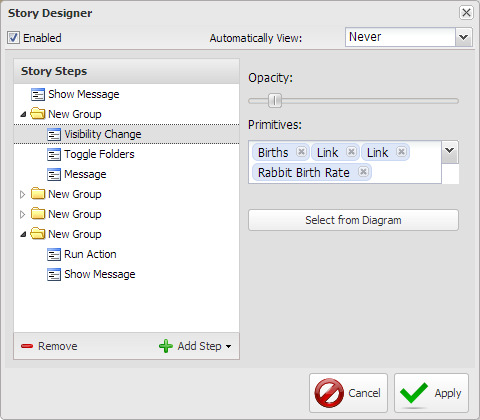
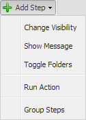

# Chapter 3 - A Model Is A Model Is A Model v2 13.06.19 #

In the previous chapters you worked with what is referred to a Stock & Flow Simulation Models. These are referred to as quantitative models because of the numerical values associated with them. While there are other types of quantitative models we won't get into them here. There is also another class of models referred to as qualitative models because they have no numeric values associated with them. There is a level of understanding well served by the use of qualitative models and as such this chapter will serve to acquaint you with several qualitative models that you can create with Insight Maker and find use for in your study of systems.

Models are simplifications of some aspect of the world around us intended to help us understand something. The Stock & Flow Simulation Models are very explicit as they the relations are represented by numerical formulas and the model may be iterated over time. The models presented in the sections of this chapter will present models which may also assist in understanding situations though only from a relationship perspective as there are generally no numerical values associated with the model and they are not iterated over time.

## Rich Pictures ##

A Rich Pictures is a pictorial representation of a set of relationships intended to convey an level of understanding about those relationships and the implication of those relationships. The strength of Rich Pictures is that there are no rules associated with creating a Rich Picture which means you create the picture that helps you understand the relationships.

Rich Pictures/Part 1 is intended to represent the relationships for a Savings Account. It is created using the Picture Primitive connected together with Links.

<IFRAME SRC="http://InsightMaker.com/insight/7085?embed=0&editor=1&topBar=1&sideBar=1&zoom=0" TITLE="" width=950 height=650></IFRAME>

[Rich Pictures/Part 1](http://insightmaker.com/insight/7085)

Picture Primitives are added to the canvas like any of the other Primitives. Just click on the Primitive to select it the click on the canvas where you want the Picture Primitive to be. You don't have to be too specific about the placement as items are very easy to move around on the canvas.

Once the Picture Primitive is placed on the canvas there are several options available on the Configuration.

[Picture Configuration Panel](http://www.insightmaker.com/insight/7085)

The General section of the Picture Primitive is just like the Primitives you've used to this point with a **(name)** and **Note** parameters. The Image option in the User Interface section is new. Here you may select one of the built in pictures from the drop down menu, no picture, the first option on the menu, or paste a URL into the field which points to some graphic on the Internet. Note that the Internet option only works if you're connected to the Internet.

Once you've created the Pictures simply use the Link element to connect them together as you did in the Stock & Flow models. After you select the Link tool when you mouse over a Picture Primitive the small right arrow will appear in the center as the connection point. Simply click on the selection point and drag to the element you want to connect to. You can't use Flows to connect Picture Primitives.

Note that you can use Stocks, Variables, Text and Buttons in Rich Pictures if you wish and you can add images to them also. Even though this is the case most of the time using Picture Primitives will serve just fine and we'll talk about Buttons somewhere further along the way.

----------

### Exercise 3-1 ###

Use the Picture Primitive to add additional elements to the model in Figure 1 and then connect them together using the Link tool. Note that in the Configuration segment of the Configuration Panel for the Link there is an option to indicate whether a Link is bi-directional. Use some of these in your exercise.

----------

### Modeling Note ###

The Text primitive is just similar to any other primitive in that you select it then click on the canvas where you want the Text to appear. Once you create the text item you can edit the text, assign notes to it, connect to or from it with links, and style it with commands form the Style segment of the Toolbar. 

----------

Rich Pictures/Part 2 adds a folder and a Link label to Rich Picture/Part 1.

<IFRAME SRC="http://InsightMaker.com/insight/7094?embed=0&editor=1&topBar=1&sideBar=1&zoom=0" TITLE="" width=950 height=650></IFRAME>

[Rich Pictures/Part 2](http://insightmaker.com/insight/7094)

If you select the Link that has the **adds to** label on it you'll notice that the (name) field contains the displayed the **adds to*** label and there's text in the **Note** field. These two attributes are like other Primitives. If the **(name)** field is blank for names **Link** it won't display. Any other text in the field will display on the Link, or near it if the link is segmented and curved. If you segment the Link the program doesn't really know where you want the label to be. As such if you select the link you'll see a small yellow node on the text. You can click on this node and move the label to wherever you would like it to be. Be warned that at times the position is a bit artful though you'll get the knack of it.

Folders are provided so you can enclose a number of items you want to explicitly draw attention to as a concept and have the ability to hide the detail if you  choose. To hide the detail click on the little minus (-) sign in the upper left corner of the folder. when you do this the folder closes, displays it's name and the minus (-) sign changes to a plus (+) sign. And you probably also surmised when you closed the folder that you can select an image for a folder or provide an image URL.

Remember the intent of a model is to be some simplification of the world around you to help you understand. There are really no rules for creating a Rich Picture though if you want others to understand it you might want to ensure it is readily understandable rather than confusing. How is the best way to ensure this? Present it to others and have them let you know where they thing it is clear and where they think it is confusing. Then go work on it some more.

In the next section you will be introduced to the Unfolding feature of Insight Maker which you can use to build a script so the model will explain itself to someone else when you're not there.

The following three models are provide examples of Rich Pictures for your review. Reviewers please note that these will be replaced with Rich Pictures more appropriate for the target audience.

<IFRAME SRC="http://InsightMaker.com/insight/666?embed=0&editor=1&topBar=0&sideBar=0&zoom=0" TITLE="" width=950 height=650></IFRAME>

[Patient Flows ED and Beyond](http://insightmaker.com/insight/666)

<IFRAME SRC="http://InsightMaker.com/insight/1557?embed=0&editor=1&topBar=0&sideBar=0&zoom=0" TITLE="" width=950 height=650></IFRAME>

[Biology Levels and Genetics](http://insightmaker.com/insight/1557)

<IFRAME SRC="http://InsightMaker.com/insight/1460?embed=0&editor=1&topBar=0&sideBar=0&zoom=0" TITLE="" width=950 height=650></IFRAME>

[SOA Reference Architecture](http://insightmaker.com/insight/1460)

## Causal Loop Diagrams ##

A Causal Loop Diagram is more structured than a Rich Picture and less structured than a Stock & Flow Diagram. The Causal Loop Diagram was initially invented as a way to express the findings of a Stock & Flow simulation model without having to show the entire Stock & Flow model as it was expected it might overwhelm the audience.

While a Causal Loop Diagram is a qualitative model there is still much one can come to understand from one because of the information presented about the relations.

<IFRAME SRC="http://InsightMaker.com/insight/7100?embed=0&editor=1&topBar=0&sideBar=0&zoom=0" TITLE="" width=950 height=650></IFRAME>

[Causal Loop Diagram/Part 1](http://insightmaker.com/insight/7100)

The good news is there are no new aspects of Insight Maker you need to learn to create a Causal Loop Diagram. The diagram is created with a Variables, Pictures and Links with Text used to indicate the relationship between the influencing variable and the influenced variable. After you create the variables, which you may represent with the Variable, Picture or Text Primitives you use Links to connect them and identify the relationship represented by the Link.

There are two widely used notations associated with Causal Loop Diagrams, both of which are presented below.

The first notation popularized by Senge in The Fifth Discipline uses an **S** and an **O** notation as depicted in the figure.

- **S** implies that the influenced variable changes in the same direction as the influencing variable. If the influencing variable increases the influenced variable increases. If the influencing variable decreases the influenced variable decreases.
- **O** implies that the influenced variable changes in the opposite direction as the influencing variable. If the influencing variable increases then the influenced variable decreases. If the influencing variable decreases then the influenced variable increases.

The influence indicators are created as Text elements and positioned as you deem appropriate to represent the influence representative of the Link.

The **+** and **-** notation is an older notation and the each has two possible meanings which are deduced from the context of the diagram.

- **+** implies that the influenced variable changes in the same direction as the influencing variable or the influencing variable adds to the influenced variable.
- **-** implies that the influenced variable changes in the opposite direction as the influencing variable or the influencing variable subtracts from the influenced variable.

The **+** and **-** notation are considered less likely to generate inconsistencies in a model when there are elements such as production and inventory are depicted. In this relationship the **+** interpreted as **adds to** for production adds to inventory. The situation is such that as production increases inventory increases and as production decreases inventory still increases, just not as rapidly. This should allow you to easily see that the **S** notation might result in a misinterpretation of the diagram as production decreases inventory decreases. To aid in avoiding the confusion some people use Stocks in their Causal Loop Diagrams to indicate those elements which are actually accumulations.

Because creating the Link indicators can get tedious in a hurry after you create the first one it's much easier to hold down the Control Key then click on the indicator and drag to a new location. This quickly creates you a copy of the indicator. You can actually use this sequence to duplicate any element of a model.

As this section is about Causal Loop Diagrams there probably should be some loops defined here somewhere shouldn't there? Causal Loop Diagrams/Part 2 presents a Causal Loop of the Balancing and Reinforcing loops presented in Chapter 1 and Chapter 2.

<IFRAME SRC="http://InsightMaker.com/insight/7101?embed=0&editor=1&topBar=0&sideBar=0&zoom=0" TITLE="" width=950 height=650></IFRAME>

[Causal Loop Diagram/Part 1](http://insightmaker.com/insight/7101)

The Balancing and Reinforcing models presented vary slightly from typical causal loop diagrams in the following ways.

- **Variables**. Variables in a Causal Loop Diagram are typically just Text though here we've used Stocks for those variable which represent accumulations and Pictures, with no images, to represent the variables. The advantage in using Picture elements for variables is that there are no restrictions on labels because Picture elements are never used in equations.
- **Link Colors**. Because the Link identifiers have to be created separately and are not attached to the Link it's much easier to make **+** indicators Blue and **-** indicators Red. This seems to be and evolving convention and then you could just leave the Link indicators out altogether.

While models are a simplification of the world around you intended to promote understanding they also represent an unfolding story. It is appropriate to sequence and label the loops. This gives others an guide to what order to read the story and the intent of the loop itself. The images are created with Picture elements and the images for reinforcing **+** and balancing **-** loops, both clockwise and counterclockwise are defined images available from the pull images pull down on the Configuration Panel.

The easiest way to identify whether a loop is a reinforcing or balancing loop is to count the number of minus (-) influences around the loop. If the number is zero or even then the loop is a reinforcing loop. If the number is odd then it's a balancing loop.

The two basic structures model presents Causal Loop/Rich Picture hybrid models.

<IFRAME SRC="http://InsightMaker.com/insight/7102?embed=0&editor=1&topBar=0&sideBar=0&zoom=0" TITLE="" width=950 height=650></IFRAME>

[Causal Loop/Rich Picture Hybrids](http://insightmaker.com/insight/7102)

If the images make it easier for the model to develop and convey understanding then it helps them achieve their purpose. The next model presents a Causal Loop Diagram for The Boy Who Cried Wolf Aesop's Fable.

<IFRAME SRC="http://InsightMaker.com/insight/7103?embed=0&editor=1&topBar=0&sideBar=0&zoom=0" TITLE="" width=950 height=650></IFRAME>

[The Boy Who Cried Wolf](http://insightmaker.com/insight/7103)

If you mouse over the various elements of this model you'll note there are notes on each one to help others to understand the model. Yet even with all these aids to understanding it's difficult for others to see it as a story as they're looking at the whole model at once. The Storytelling function in the next section will show you how to overcome this and actually tell a story with the model.

## Storytelling ##

Even though you may conscientiously develop your model and add comments often it turns out that people initially look at the whole model and they're overwhelmed. It might be somewhat like to eat a whole Elephant in a single bite. Storytelling provides a way to overcome this difficulty.

Storytelling a model is intended to reveal a model little by little and explain it along the way. Click on the View Story button in the lower left corner of the screen, read the text, and then click the Step Forward arrow on the right repeatedly to have the model presented as a story.

<IFRAME SRC="http://InsightMaker.com/insight/7104?embed=0&editor=1&topBar=0&sideBar=0&zoom=0" TITLE="" width=950 height=650></IFRAME>

[Storytelling Example](http://insightmaker.com/insight/7104)

This sequencing you just experienced was all done with the **Add Story** function on the right side of the Tools section of the Toolbar. If you click **Add Story** you should see the **Story Designer** window.

[Story Designer](http://www.insightmaker.com/insight/7085)

The main elements of this window are...

- **Enabled**. This check box allows you to actually enable Storytelling. If this box is checked the green plus sign and the View Story will show up in the lower left corner of the window.
- **Automatically View**. There are four options on this drop down allowing you to indicate the conditions under which View Story should execute automatically when the model is opened. The options are Never, For Editors, For Non-Editors, Always.
- **Story Steps**. Lists the steps that you have defined as part of the story. You may reorder steps by clicking and dragging them to the new location. If you click on one of the steps it's definition will be displayed on the right side of the Story Designer window. Currently the definition of the first Visibility Change is displayed.
- **- Remove**. To remove an Story Step first click on it to select it then click the **- Remove** button.
- **+ Add Step**. A drop down which allows you to select which type of step you want to add. New steps are added at the bottom of the list. You can select and drag the new step to the location in the sequence where you want it. The various steps will be described shortly.
- **Cancel**. Allows you to exit the Story Designer and not save any changes.
- **Apply**. Applies all the changes you have made in the Story Designer and exits.

There are five different types of steps you can include in a story.

[Steps of a Story](http://www.insightmaker.com/insight/7104)

When you select any one of these steps it will be added to the bottom of the list. You can move the step to the location where you want it. As the following step types are described you might want open the Story Designer and click on different Unfolding Steps to visualize how they're defined.

- **Change Visibility**. Allows you to specify the Opacity, with the slider, for one or more elements of the model when that step is executed. The steps may be selected from the drop down or you may select one or more items from the model and then click the **Select from Diagram** button to put those items in the list. Note that clicking the **Select from Diagram** button will replace the already selected elements with whatever you've selected in the model. If you want to add or remove one more more Primitives it's probably better to use the drop down to add or click the existing item to remove it.
- **Show Message**. Allows you to enter a text message you want to be displayed. There are some formatting options available in the Message edit window.
- **Toggle Folders**. Use this option to Expand or Collapse one or more folders. This is really useful if you want to expand a folder, walk through the items in the folder and then close the folder.
- **Run Action**. Provides you with a window in which you can enter Javascript commands to control various aspects of the model. And there are a large number of functions in the [Insight Maker API](http://insightmaker.com/sites/default/files/API/files/API-js.html) that you can employ in this step.
- **Group Steps**. This step creates a folder in the sequence in which you can place multiple steps. This allows you to indicate there are several steps you want to execute with a single Next Step click. You can see how this was used in the Figure 11 definition of the unfolding for the model in Figure 10. You can open and close a New Group folder by toggling the little triangle to the left of it. Also if you click on a folder you can rename it in the **Name** field on the right.

All new steps are added to the bottom of the list of steps. If you're creating a long series of steps and then you need to add one near the top this may be difficult. In an attempt to provide a work around the Model Unfolding Designer window is resizable.

The Boy Who Cried Wolf is repeated here from above so you can unfold this model and then take a look at the Story Designer to see how it was setup. Just click the View Story in the lower left of the window.

<IFRAME SRC="http://InsightMaker.com/insight/7103?embed=0&editor=1&topBar=0&sideBar=0&zoom=0" TITLE="" width=950 height=650></IFRAME>

[The Boy Who Cried Wolf](http://insightmaker.com/insight/7103)

By creating an story of your model you significantly increase the likelihood that others will understand the insights your model is endeavoring to surface. You might even find that in the process of creating the story you uncover ways to improve or clarify the model for yourself.

Systems Thinking: The Essence of And? is another story you can walk through and study as to how it was put together. This story attempts to explain why applying pesticides can increase the requirement for spraying more pesticides. It also attempt to distill the concept of Systems Thinking to a single word... And?

<IFRAME SRC="http://InsightMaker.com/insight/3365?embed=0&editor=1&topBar=0&sideBar=0&zoom=0" TITLE="" width=950 height=650></IFRAME>

[Systems Thinking: The Essence of And?](http://insightmaker.com/insight/3365)

## Summary ##

Always remember that a model is a simplification of the world around you intended to help you understand something. You should use a modeling form that adequately serves your quest for understanding. Stock & Flow, Rich Picture, and Causal Loop models are only three of a very large array of possible modeling forms that exist. Use them to the extent that they serve you and when they don't find a form that does. The Modeling and Simulation references provide access to several additional types of diagrams that have been created with Insight Maker, though there are probably more that haven't yet been identified. The Model Thinking Course by Scott E. Page presents a very extensive exposure to many types of models useful for understanding different aspects of the world around us.

### Rich Pictures ###

- Often easier for others to relate to and understand because of the images in the model.
- No rules for creating them though remember that you need to tell a story.
- Because you need to tell a story make the model as understandable as possible.

### Causal Loop Diagrams ###

- Specific Guidelines for how to depict the relationships between the elements.
- Two conventions for expressing relations.
- S and O notation can produce misinterpretations when it comes to stocks.
- The older + and - notation is considered more appropriate.
- Color coding relations is an alternative to both notations, though be consistent.
- Employing explicit stock representations often reduces misinterpretations.
- Hybrid Rich Pictures/Causal Loop Diagrams are often the very meaningful.

### Storytelling ###

- Makes it far easier for others to understand the insights you're trying to surface with your model.

## References ##

- [Senge, P. 1990. The Fifth Discipline: The Art & Practice of the Learning Organization](http://www.amazon.com/Fifth-Discipline-Practice-Organization-ebook/dp/B000SEIFKK/)
- [Modeling & Simulation with Insight Maker](http://www.systemswiki.org/index.php?title=Modeling_%26_Simulation_with_Insight_Maker)
- [Model Thinking Course](https://www.coursera.org/course/modelthinking) by Scott E. Page, University of Michigan
- [Rich Pictures](http://systems.open.ac.uk/materials/T552/pages/rich/richAppendix.html) from Open University Course T552
