# Chapter 5 Implications of Reality v0.6 13.06.17 #

The sections of this chapter will provide an awareness of the relationships between a number of structures that occur repeatedly across all disciplines as well as provide a sense of how these structures are actually related to each other.

## Three Basic Structures ##

In the Chapter 2 we covered the three basic structures in some detail. And it was claimed that all the models you will ever create will simply be a combination of some number of these basic structures. We don't expect that you take this on faith and while we can't prove it in this chapter we will provide you an opportunity to experience some of the more common structures which occur repeatedly across all disciplines of science.

<IFRAME SRC="http://InsightMaker.com/insight/5138?embed=0&editor=1&topBar=0&sideBar=1&zoom=0" TITLE="" width=950 height=650></IFRAME>

[Similar Structures/Different Behaviors](http://insightmaker.com/insight/5138)

## Typical Evolving Relationships ##

Figure 2 depicts the manner in which the Balancing/Goal Seeking and Reinforcing/Exponential structures tend to evolve into more complex interactions when not appropriately tended to.

<IFRAME SRC="http://InsightMaker.com/insight/538?embed=0&editor=1&topBar=0&sideBar=0&zoom=0" TITLE="" width=950 height=650></IFRAME>

[Typical Evolving Relationships](http://insightmaker.com/insight/538)

The sections of this chapter will present each structure of the model as a Causal Loop Diagram and a Stock & Flow Simulation which you can interact with. You are encouraged to spend time working with each simulation to develop a better understanding of the relationships and why the structure produces the characteristic behavior that it does.

Each structure will be presented in a generic form so you can focus on the implications of the relationships rather than what the actual elements are. Each section will also provide appropriate strategies for dealing with the structure as well as a number of explicit example of this structure in different areas.

## Fix a Problem ##

Have you ever thought about why when you fill a glass with water you seldom overflow it, or why when you get near the end of a project the final portion seems to take so much longer than it should? What you're experiencing is the effect of a balancing loop in operation.

### Causal Loop Diagram ###

[Balancing Loop Causal Loop Diagram](http://insightmaker.com/insight/139)

The balancing loop structure attempts to attain a balance between some current state and a desired state. Is it the difference between these two states that provides the motivation for action intended to move the current stated in the direction of the desired state. Once action has moved the current state to the desired state there's no longer a difference between the two so there's no more motivation for action and action stops because balance has been reached.

Balancing structures always have a goal, though sometimes it's zero and is implied. When you develop a balancing loop make sure you're aware of what the goal is.

### Stock & Flow Simulation ###

<IFRAME SRC="http://InsightMaker.com/insight/132?embed=0&editor=1&topBar=1&sideBar=1&zoom=0" TITLE="" width=950 height=650></IFRAME>

[Balancing Loop Stock & Flow Simulation](http://insightmaker.com/insight/132)

With settings of

- current state = 0
- desired state = 1
- action factor = 1
- Time Step = 1

[Balancing Loop with Time Step = 1](http://insightmaker.com/insight/132)

Changing to Time Step = 0.25 produces a much smoother transition.

[Balancing Loop with Time Step = 0.25](http://insightmaker.com/insight/132)

Though it is unlikely that the transition will be this rapid so we investigate the result if we change action factor = 0.5

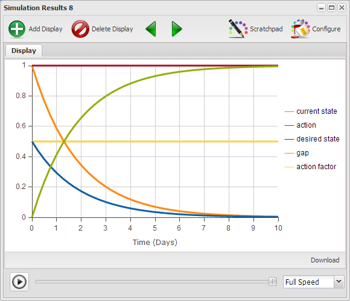

[Balancing Loop with action factor = 0.5](http://insightmaker.com/insight/132)

----------

### Exercise 5-1 ###

Run the model with different values of Time Step and action factor to get a better sense of the effect these two settings have on the results.

----------

### Examples ###

[Balancing Loop Examples](http://www.systemswiki.org/index.php?title=Category:Balancing_Loop)

### Effective Strategies ###

If you want the Balancing Loop to migrate the Current State to the desired state there are some specific things you might want to take into account.

- Ensure there is an explicit well understood and agreed upon definition of the desired state. If you don't know where you're trying to get to then any action will take you somewhere.
- Ensure there is an as objective as possible definition of the Current State. It is the relation between the desired state and the Current State that forms the basis for planning and subsequent action. If the planning is flawed there is a good chance the resultant action will be inappropriate to move the Current State to the desired state.
- Because action is driven by the size of the gap between desired state and Current State there is a natural tendency for the extent of action to decline as the Current State approaches the desired sate. This tendency accounts for the fact that as projects approach completion it seems to be more and more difficult to make progress toward completion. To overcome this tendency the motivation for action must come from somewhere other than the gap. In terms of project completion the focus might be to begin to think about completing this project so the organization can get on to the next one. The answer to the predicament lies outside the structure as presented.

### Areas of Concern ###

The Balancing Loop is one of the simplest structures and seldom ever occurs in isolation from additional influences. Look at the structure of the Balancing Loop and think of some things that might happen to change the behavior of the Balancing Loop.

- In time linear progress toward the goal may decline, which implies a Limits to Results Systems Archetype.
- Since you can never do just one thing, and the fact that the Current State is what it is for some reason, the action taken to change the Current State, or the change in the Current State itself, may produce side effects which in fact cause the Current State, in time, to return to its initial state, which implies a Fixes that Fail Systems Archetype.
- If the period of time over which it takes action to move the Current State to the desired state is relatively long there may be a willingness to settle for less than the initial desired state. In this instance the desired state is never reached because the desired state is lowered over time, which implies a Drifting Goals Systems Archetype.
- Pursuing the desired state may cause problems elsewhere. These problems may actually result in increasing the desired state making it more difficult to reach, which implies an Escalation Systems Archetype.
- The situation may be such that the action taken to achieve the desired state actually causes the Current State to overshoot the desired state. This would then require additional action to bring the Current State back toward the desired state, which implies a Balancing Loop with Delay Systems Archetype.
- It is also possible that there is a delay such that the structure promotes an endless oscillation, which implies an Indecision Systems Archetype.

## Linear Progress Slows Over Time ##

A Limits to Results structure represents a situation where a Balancing Loop moving toward its goal is slowed in its progress due to a limiting factor. This is generally due to some resource restriction or constraint.

### Causal Loop Diagram ###

[Limits to Results Causal Loop Diagram](http://insightmaker.com/insight/542)

The casual loop diagram for this structure is identical to the balancing loop structure except for the addition of a limit. The difference between the current state and the desired state produces a gap and that gap is the motivation for action. The limit is such that it won't allow all the action that the gap would like there to be. Imagine that you have 100 miles to travel and your car only goes 60 miles per hour, meaning there's no way you can get there in an hour. Or maybe you have a project to do that will take 30 hours which means that you along simply can't get it done in one day. The limit indicates the maximum amount of action that can happen in a time period to move the current state toward the desired state. Once the difference between the current state and the desired state is smaller than the limit the structure will behave just like a simple balancing loop.

### Stock & Flow Simulation ###

<IFRAME SRC="http://InsightMaker.com/insight/543?embed=0&editor=1&topBar=1&sideBar=1&zoom=0" TITLE="" width=950 height=650></IFRAME>

[Limits to Results Stock & Flow Simulation](http://insightmaker.com/insight/543)

The causal loop diagram can be implemented as a stock & flow simulation using the following equations allowing us to get a sense of the transitions over time.

> action = IfThenElse([gap] >= [limit], [limit], [gap])
> gap = [desired state] - [Current State]

With settings of

- current state = 0
- desired state = 1
- limit = 0.4
- Time Step = 0.25

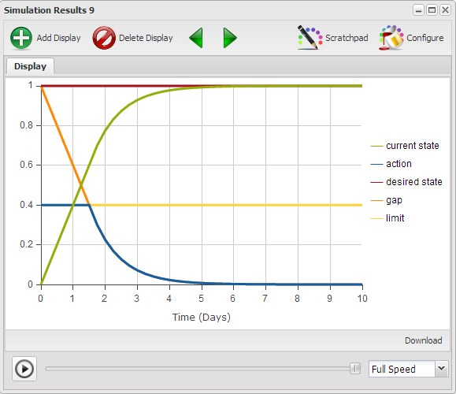

[Limits to Results with limit = 0.4](http://insightmaker.com/insight/543)

Notice that the current state progresses toward the desired state in a linear manner until the gap becomes less than the limit. After that progress is linear for a couple more time steps because of the small time step of 0.25. Once the current state reaches about 0.8 it begins to slow down significantly and stops when it reaches the goal.

----------

### Exercise 5-2 ###

Run the model with different values for limit. And see what happens if you change the Time Step to 0.5 or 1.0.

----------

### Examples ###

[Limits to Results Examples](http://www.systemswiki.org/index.php?title=Category:Limits_to_Results)

### Effective Strategies ###

- The effective way to avoid a Limits to Results scenario is simply to plan ahead to ensure there are sufficient resources available so progress toward results is not limited to a greater extent than are acceptable.

### Areas of Concern ###

- There are currently no known Systems Archetypes which are evolutions of this archetype.

## The Fix Overshoots the Goal ##

Have you ever pursued a goal and later found that you actually overshot the goal and had to back up to get back to the goal? The Balancing Loop with Delay structure is a variation of the standard Balancing Loop. The variation being that there are one or more delays in the structure which are responsible for producing, as will be demonstrated, a very different behavior pattern than the standard Balancing Loop.

### Causal Loop Diagram ###

[Balancing Loop with Delay Causal Loop Diagram](http://insightmaker.com/insight/544)

If you look at the Balancing Loop with Delay structure it looks identical to the standard balancing loop with the exception of the delay near the reduces link. The implication is that it takes some amount of time after the current state changes before it is actually realized and figures into the calculation of the gap which influences the subsequent action. Essentially what's happening is that action is being based on old data and therefore is probably not the appropriate action. The implications of this will become evident when we look at the simulation for this structure.

### Stock & Flow Simulation ###

<IFRAME SRC="http://InsightMaker.com/insight/133?embed=0&editor=1&topBar=1&sideBar=1&zoom=0" TITLE="" width=950 height=650></IFRAME>

[Balancing Loop with Delay Stock & Flow Simulation](http://insightmaker.com/insight/133)

Notice in the stock & flow structure the delay has been placed between the current state and the gap. The delay could have just as well been between the gap and action or there could have been a delay between the action and the actual change of the current state though this one is a bit more difficult to structure.

Equations for this structure are

> delay state = Delay(<Current State>, [time delay], 0)
> gap = [desired state] - [delay state]
> action = [gap] * [action factor]

With settings of

- current state = 0
- action factor = 0.5
- desired state = 1
- time delay = 0
- Time Step = 0.25

[Balancing Loop with Delay = 0](http://insightmaker.com/insight/133)

As expected these settings display the typical balancing loop goal seeking behavior.

With settings of

- current state = 0
- action factor = 0.5
- desired state = 1
- time delay = 1
- Time Step = 0.25

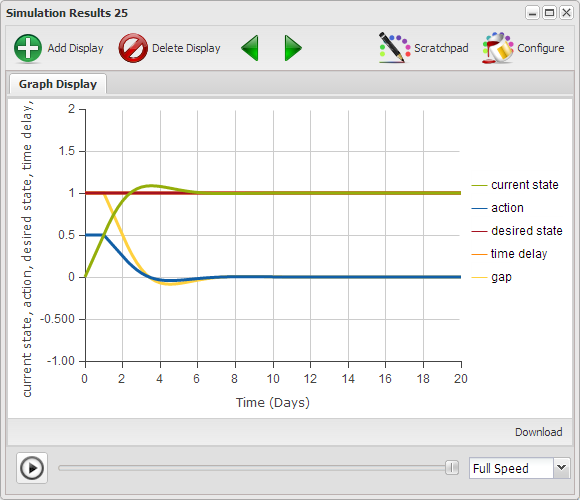

[Balancing Loop with Delay = 1](http://insightmaker.com/insight/133)

Notice that now with a delay the change in the gap and action are delayed for one time period and then the current state actually overshoots the goal and a negative action is required to bring the current state back to the goal.

With settings of

- current state = 0
- action factor = 0.5
- desired state = 1
- time delay = 2
- Time Step = 0.25

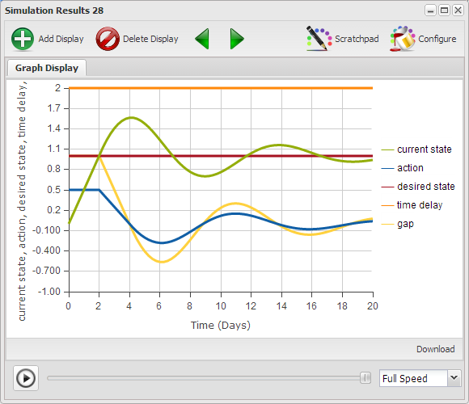

[Balancing Loop with Delay = 2](http://insightmaker.com/insight/133)

With a longer time delay the overshoot is even more severe though after a few time periods the current state actually will reach the goal.

----------

### Modeling Note ###

Notice the action flow in the diagram actually has an arrow at both ends. Click on the flow and notice the Configuration section of the configuration panel indicates Only Positive Rates is set to No. This means that the flow can flow in either direction based on whether the results of the equation are positive or negative.

----------

With settings of

- current state = 0
- action factor = 0.5
- desired state = 1
- time delay = 3
- Time Step = 0.25

[Balancing Loop with Delay = 3](http://insightmaker.com/insight/133)

We've now reached a delay where the action is so out of sync with an awareness of the results that the goal is never reached and the current state continually oscillates around the goal.

With settings of

- current state = 0
- action factor = 0.5
- desired state = 1
- time delay = 3.5
- Time Step = 0.25

[Balancing Loop with Delay = 3.5](http://insightmaker.com/insight/133)

Now the situation is described as being out of control because rather oscillations continue to get worse because of the length of the time delay.

You might ask how could it be that it might take 3.5 days for someone to get a sense of what the results of the previous actions were, which would be a good question. It's probably difficult to find a situation where this is realistic in days though what's important to realize is this structure could operate in this manner if the time units were hours, minutes, seconds or micro seconds.

----------

### Exercise 5-3 

Run this model varying the values of action factor, time delay and time step to develop a sense of how each of these variables influences the behavior of the model.

----------

### Examples ###

[Balancind Loop with Delay Examples](http://www.systemswiki.org/index.php?title=Category:Balancing_Loop_with_Delay)

### Effective Strategies ###

- Advice for dealing with this structure is quite simple. Patience is a virtue. If you know you're dealing with a balancing structure and things are not going as expected then study the structure to see if there could be one or more delays that your impatience is simply having difficulty dealing with. This structure proves that there are times when taking additional action is worse than not taking additional action. More is not always better. If things are waffling back and forth endlessly or out of control a little less effort might be appropriate.
- An alternative is to monitor the Current State on a more frequent basis and ensure the result of the monitoring impacts the action appropriately in a more timely manner. In short, take the delay out of the structure.

### Areas of Concern ###

There are currently no known Systems Archetypes which are direct derivatives of the Balancing Loop with Delay Systems Archetype.

## Things Seem to Oscillate Endlessly ##

Have you ever noticed how some things just seem to oscillate back and forth endlessly? Trying to decide between two options, the way people have their ups and downs, the way supply and demand never seems to settle out are examples of just this.

This situation is characteristic of two Balancing Loops with Delays which provide the desired state for each other. Because of the delays in the structure by the time one value reaches the point it's headed for, its destination has moved, so it begins changing again. This is very much like shooting at a target bobbing up and down on the end of a spring while you're jumping up and down on a trampoline.

### Causal Loop Diagram ###

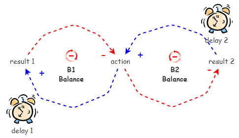

[Indecision Causal Loop Diagram](http://insightmaker.com/insight/545)

### Stock & Flow Simulation ###

<IFRAME SRC="http://InsightMaker.com/insight/546?embed=0&editor=1&topBar=1&sideBar=1&zoom=0" TITLE="" width=950 height=650></IFRAME>

[Indecision Stock & Flow Simulation](http://insightmaker.com/insight/546)

With settings of

- result 1 = 1
- result 2 = 0.5
- delay 2 = 1
- delay 1 = 2
- factor = 0.5
- Time Step = 0.25

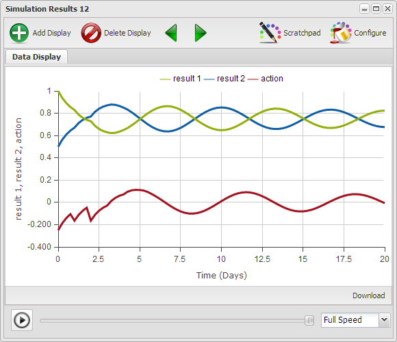

[Indecision Example 1](http://insightmaker.com/insight/546)

For these settings there is a delay for result 1 and result 2 and you can see the oscillations as action attempts to bring the two into a balance with each other. It is apparent that a balance will be achieved after some time as the oscillations are getting smaller over time.

----------

### Exercise 5-4 

Vary the values of delay 1, delay 2, factor, and time step to get a better sense of the implications of each variable on the behavior of this structure. 

----------

### Examples

- [Supply and Demand](http://www.systemswiki.org/index.php?title=Supply_and_Demand)
- [Price Balancing Loops](http://www.systemswiki.org/index.php?title=Price_Balancing_Loops)
- [Romeo & Juliet IM-759](http://insightmaker.com/insight/759)
- [Indecision Examples](http://www.systemswiki.org/index.php?title=Category:Indecision)

### Effective Strategies ###

- Because of the inherent delays in this structure it is completely inappropriate to base action on what the current driving value is. To deal with this structure one has to watch the cycles and attempt to predict what the driving value is going to be at a future point. One then creates a result 1 that will be appropriate for the predicted future result 2. In this structure a well operating crystal ball would be most helpful.
- Reducing the action in the short term until on gets a sense of the influences is most advisable.

### Areas of Concern ###

- Presently there are no Systems Archetypes which are derivatives of the Indecision Systems Archetype.

## The Fix Creates A Problem Elsewhere ##

Have you ever wondered how the apparently sensible actions by two individuals, groups, or countries for that matter, can result in both parties finding themselves where neither of them wants to be? Consider the way an argument heats up between two people, or the way that urgency begets urgency, or even the US/Soviet arms race of the past. The foundation of these activities is an Escalation structure.

### Causal Loop Diagram ###

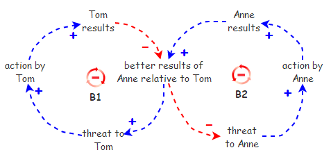

[Escalation Causal Loop Diagram](http://insightmaker.com/insight/970)

The two balancing loops interact in such a way as to create what is essentially a single reinforcing structure. Is this this reinforcing action which typically drives the result to somewhere neither of the participants wishes to be.

[Escalation as a Reinforcing Loop](http://insightmaker.com/insight/970)

### Stock & Flow Simulation ###

<IFRAME SRC="http://InsightMaker.com/insight/972?embed=0&editor=1&topBar=1&sideBar=1&zoom=0" TITLE="" width=950 height=650></IFRAME>

[Escalation Stock & Flow Simulation](http://insightmaker.com/insight/972)

With settings of

- Ted Results = 1
- Anne Results = 1.1
- multiplier = 2
- Time Step = 1

[Escalation Example](http://insightmaker.com/insight/972)

----------

### Exercise 5-5 

Vary the values of Ted Results, Anne Results and time step to get a better sense of the implications of each variable on the behavior of this structure. 

----------

### Examples ###

- A kid telling a small lie to cover a small thing, only to find himself into further problems that would require bigger lies, making it all the more difficult to tell the truth later when two people walking against each other on the street try to pass by making a step sideways only to discover they block each other again and another attempt to go off the way leads to the same situation
- [Escalation Examples](http://www.systemswiki.org/index.php?title=Category:Escalation)

### Effective Strategies ###

- One approach is to disconnect the two loops so Anne and Tom are no longer competing with each other but competing with themselves. This produces two reinforcing loops.
- The second approach is to begin evaluating the composite results of Anne and Tom rather than their individual results. In this way they begin to see the value in cooperation rather than competition and the structure turns into two synergistic reinforcing loops.

### Areas of Concern ###

- There are currently no known Systems Archetypes which are derivatives of the Escalation Systems Archetype.

## Over Time There Is A Tendency To Settle For Less

Have you ever noticed how difficult it is to bring the best of intentions to fruition? How so many people's New Years resolutions only last a few days? Our inability to achieve the things we set out to achieve is very much a result of the operation of a Drifting Goals structure we generally have little awareness of.

### Causal Loop Diagram ###

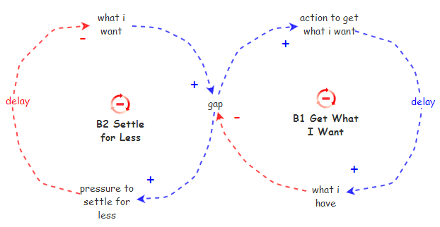

[Drifting Goals Causal Loop Diagram](http://insightmaker.com/insight/983)

Again we have two balancing loops which each provide a goal for the other and because of the delays in the time it takes for the action to produce results one goal overrides the other. What I Want server as the goal for B1 and Pressure to Settle for Less serves as the goal for B2.

### Stock & Flow Simulation ###

<IFRAME SRC="http://InsightMaker.com/insight/984?embed=0&editor=1&topBar=1&sideBar=1&zoom=0" TITLE="" width=950 height=650></IFRAME>

[Drifting Goals Stock & Flow Simulation](http://insightmaker.com/insight/984)

With settings of

- desired state = 1
- curretn state = 0
- pct chg fact = 0.2
- goal chg fact = 0.2
- Time Step = 0.5

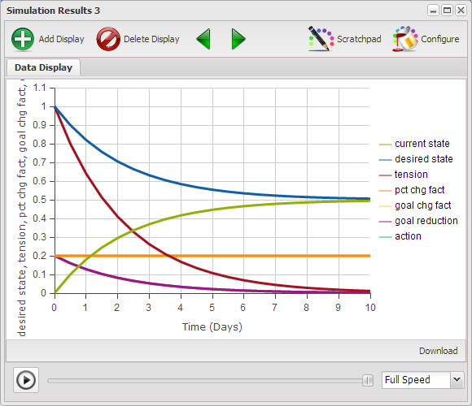

[Drifting Goals Example with pct chg = goal chg factors](http://insightmaker.com/insight/972)

In this example with the extent to which the goal drifted is about 50% which is very significant. The extent to which the goal drifts is very dependent on the goal chg fact variable.

----------

### Exercise 5-6 

Vary the pct chg fact, goal chg fact and Time Step values to get a sense of the impact on the extent to which the goal for the structure is degraded over time.

----------

### Examples ###

- [Drifting Goals Examples](http://www.systemswiki.org/index.php?title=Category:Drifting_Goals)

### Effective Strategies ###

- There is only one real effective way to deal with this structure, which is to disconnect the feedback from tension to goal reduction to Desired State so it can no longer subtract from Desired State.
- An alternative strategy is to further increase the action toward the Current State so it reduces the time delay such that there is no time for the tension to reduce the Desired State. This is fine if there are sufficient resources to increase the action.

### Areas of Concern ###

- The action toward the Desired State requires resources, which may have to be developed. Consideration needs to be given as to whether or not there really are sufficient resources to achieve the Desired State. For further insights into this see Growth and Underinvestment with a Drifting Standard.

## In Time The Problem Returns ##

Have you noticed how often your best intentions go awry? You set out to fix a problem and shortly thereafter you find yourself fixing the same problem again, and again. This generally results from some unexpected consequences, things that come into play because of your action, or the results of your action, that you never expected, which is why they're called unexpected consequences.

A Fixes that Fail Systems Archetype consists of a Balancing Loop which is intended to achieve a particular result, yet the result is foiled by an insidious Reinforcing Loop. These two loops interact in such a way that the desired result initially produced by the Balancing Loop is, after some delay, negated by the actions of the Reinforcing Loop. This structure may also be referred to as a Remedies that Fail structure.

### Causal Loop Diagram ###

[Fixes that Fail Causal Loop Diagram](http://insightmaker.com/insight/547)

The action of the Goal Seeking loop (B1) also influences, after some delay, unexpected consequences which diminishes the migration of the current sate in the direction of the desired state and creates the reinfocing loop (R2).

### Stock & Flow Simulation ###

<IFRAME SRC="http://InsightMaker.com/insight/549?embed=0&editor=1&topBar=1&sideBar=1&zoom=0" TITLE="" width=950 height=650></IFRAME>

[Fixes that Fail Stock & Flow Simulation](http://insightmaker.com/insight/549)

With settings of

- desired state = 1
- current state = 0
- action factor = 0.5
- uc factor = 0
- ucd factor = 0.2
- Time Step = 0.5

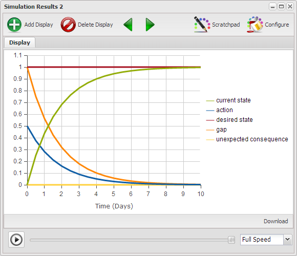

[Fixes that Fail Structure as Simple Goal Seeking Loop](http://insightmaker.com/insight/549)

With uc factor = 0 there is no unexpected consequences and therefor the value of ucd factor is irrelevant and the structure is essentially a standard goal seeking balancing loop (B1).

With settings of

- desired state = 1
- current state = 0
- action factor = 0.5
- uc factor = 0.3
- ucd factor = 0.2
- Time Step = 0.5

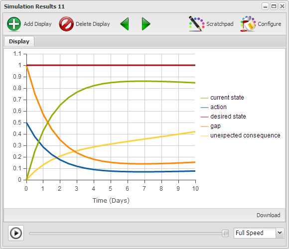

[Fixes that Fail Structure as Simple Goal Seeking Loop](http://insightmaker.com/insight/549)

As the value of uc factor increases unexpected consequences will increase more rapidly and have a more marked impact on the current state as long as the value of ucd factor remains constant.

----------

### Exercise 5-7 

Run the Fixes that Fail structure with various values of action factor, uc factor, ucd factor, and Time Step to get a sense of how these four factors influence the behavior of the structure.

----------

### Examples ###

- Your soccer ball is soft so you put air in it though in a few hours you have to put more air in it. And after a few weeks it seems like you spend all your time pumping up your soccer ball.
- Often times what appears to be the most appropriate way to deal with the situation doesn't really solve the problem and in time actually makes the situation worse.
- [Fixes that Fail Examples](http://www.systemswiki.org/index.php?title=Category:Fixes_that_Fail)

### Effective Strategies ###

- The most effective strategy for dealing with this structure is advance planning. Since you can never do just one thing, as everything affects everything else, before taking action to change the current state, think about what else that action, or change in the current state, is likely to affect. And, what effect the effect will have. Sometimes the unexpected consequence may be several effects away, so don't stop at just one. Essentially what one seeks to do is close the loop and identify the unexpected, which means it's no longer unexpected then, is it?
- A less effective strategy would be to figure out how to disconnect the unexpected consequence from influencing the action or the current state. Of course then it wouldn't be a consequence, would it?

### Areas of Concern ###

- There are times when attempts to deal with a situation in a particular way makes it even more difficult to deal with the situation in an appropriate manner later on which is often an indication of a Shifting the Burden Systems Archetype.

## The Underlying Cause Is Not Being Addressed ##

How many times have you noticed that there are some problems that seem to be addressed over and over. When the problem arises it is addressed, then some time later, maybe a day, a week, or a month, the same problem arises again. This situation is quite often the result of a Shifting the Burden structure.

### Causal Loop Diagram ###

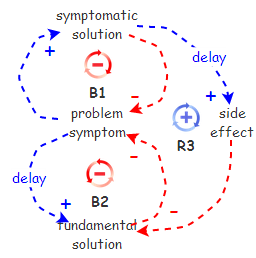

[Shifting the Burden Causal Loop Diagram](http://insightmaker.com/insight/986)

The causal loop depicts a problem symptom which can be addressed by a symptomatic solution (B1) and a fundamental solution (B2). The symptomatic solution is easier and quicker than the fundamental solution though it only treats the symptoms rather than actually solving the problem. And the nasty aspect of this structure is that the symptomatic solution typically has a side effect that makes it more difficult to implement the fundamental solution. This means that the more one employs the symptomatic solution the less likely one is to implement the fundamental solution. And because the problem isn't solved in time it returns again and again.

### Stock & Flow Simulation ###

<IFRAME SRC="http://InsightMaker.com/insight/1005?embed=0&editor=1&topBar=1&sideBar=1&zoom=0" TITLE="" width=950 height=650></IFRAME>

[Shifting the Burden Stock & Flow Simulation](http://insightmaker.com/insight/1005)

The Shifting the Burden Stock & Flow model is the equivalent of the Causal Loop Diagram with one addition. Problem Cause has been added to as it is essentially for the Problem Symptom to be able to return. This wasn't depicted in the Causal Loop Diagram and points out one of the shortcomings of Causal Loop Diagrams. Because they're qualitative you can argue any interactions you'd like and they're difficult to dispute because there's no data to support any of the arguments. With Stock & Flow models one can't argue things with hand waving and there's no smoke and mirrors to hide behind. Everything has to be explicit which is their strength.

With settings of

- sym fact = 0.5
- prob fact = 0.5
- fund fact = 0
- side effect fact = 0
- Time Step = 0.25

[Applying the Symptomatic Solution](http://insightmaker.com/insight/1005)

The problem cause results in an increase in the Problem Symptom until it reaches a level where it needs to be dealt with and the symptomatic solution is applied. This removes the Problem Symptom though has no affect on the problem cause so the Problem Symptom again begins to increase until it reaches a point where the symptomatic solution is again applied. Unless something else changes this will repeat endlessly.

With settings of

- sym fact = 0.5
- prob fact = 0.5
- fund fact = 0.2
- side effect fact = 0
- Time Step = 0.25

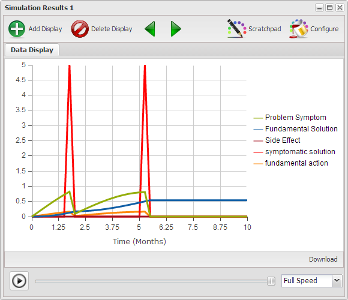

[Applying the Symptomatic Solution & Fundamental Action](http://insightmaker.com/insight/1005)

In this example it is apparent that the Symptomatic Solution is still has a part to play while the fundamental solution is actually solving the problem. Once this happens the symptoms don't return and there no need to apply the symptomatic solution or fundamental action in the future.

With settings of

- sym fact = 0.5
- prob fact = 0.5
- fund fact = 0.2
- side effect fact = 0.2
- Time Step = 0.25

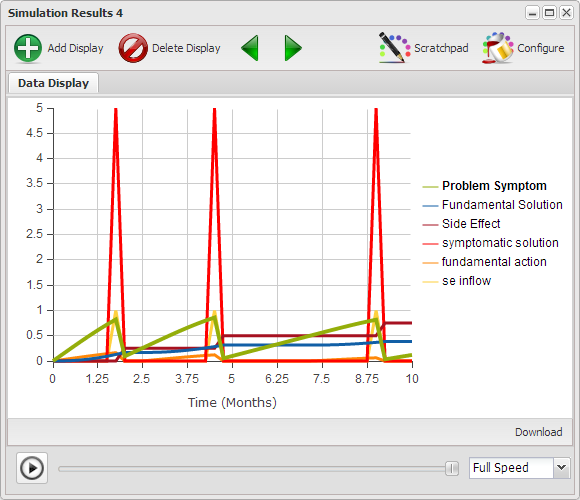

[Applying the Symptomatic Solution & Fundamental Action with Side Effect](http://insightmaker.com/insight/1005)

With the Side Effect coming into play you can see that the fundamental solution attempts to come into play though the side effect essentially negates it requiring that the symptomatic solution continue to be applied periodically.

----------

### Exercise 5-8 

While there are myriad of possible variations for the variables in this model you might find the result interesting if you apply the fundamental solution without the symptomatic solution. What questions does this result raise?

----------

### Examples ###

- [Summer Driving is an Emergency?](http://www.systemswiki.org/index.php?title=Summer_Driving_is_an_Emergency%3F)
- [Shifting the Burden Examples](http://www.systemswiki.org/index.php?title=Category:Shifting_the_Burden)

### Effective Strategies ###

Initially I perceived there to be a single appropriate strategy for dealing with this structure though I have found examples, which I will attach as soon as I get them sorted out, which seem support the range of strategies below.

- Learn to live with the symptomatic solution because that's as good as it's going to get. There are situations where there may be more effective solutions though you'll just never get them implemented in your lifetime. Sad but true.
-Implement the fundamental solution because if the symptomatic solution is implemented the strength of the side effect will ensure the fundamental solution will never get any traction.
- When dealing with a problem ask yourself if you are treating the symptoms or addressing the real cause of the problem. Often, out of expediency, the symptomatic solution is essential. The most effective strategy for dealing with a Shifting the Burden structure is to employ the symptomatic solution AND develop the fundamental solution. Thus one resolves the immediate problem and the other works to ensure that it doesn't return.

### Areas of Concern ###

- It is often the case that the side effect promotes some sort of dependency which further inhibits development of the fundamental solution. For insights into this situation see Addiction Systems Archetype.

## Dependence on the Fix Develops ##

An Addiction Systems Archetype is a variation of a Shifting the Burden Systems Archetype in which the side effect results is an addiction to the symptomatic solution. This structure is composed of two Balancing Loops and a Reinforcing Loop. It is a very annoying structure because the two Balancing Loops act as a single Reinforcing Loop migrating the situation in the same direction as the Reinforcing Loop. Both structures cooperate in moving the system in a direction other than the one desired.

### Causal Loop Diagram ###

[Addiction Causal Loop Diagram](http://insightmaker.com/insight/1085)

It should be immediately evident that this is the same structure as the shifting the burden structure with the Side Effect relabeled as Addiction. The difference in function will be demonstrated below in the stock & flow model.

### Stock & Flow Simulation ###

<IFRAME SRC="http://InsightMaker.com/insight/1086?embed=0&editor=1&topBar=1&sideBar=1&zoom=0" TITLE="" width=950 height=650></IFRAME>

[Addiction Stock & Flow Simulation](http://insightmaker.com/insight/1086)

I need to do is figure out how the addiction is different from shifting the burden structure. I think the side effect in shifting the burden may not be a stock whereas addiction is a stock. This was once the problem is solved in shifting the burden there isn't a residual influence from the side effect whereas in the addiction structure there is a significant residual.

----------

### Exercise 5-9 

I don't know about this at the moment.

----------

### Examples ###

- in organizations, people firefighting instead of solving the root problems, thereby reducing time available to invest in solving root problems
- I'm sure we could easily set up a similar example for short term economical measures that redirect resources from what could fix the economy in the longer term, though any model would probably be controversial.
- Wanting to win all the time can be really hard, and to increase your chances of winning, there are two options. One option is to cheat. The other option is to practise all the time and demonstrate a serious commitment to your sport. Whilst cheating is probably easier, it becomes highly addictive (because it doesn't require much effort) and because of this, the desire to win fairly though practise and commitment to your sport doesn't happen. Think of what happened to Lance Armstrong. https://dl.dropboxusercontent.com/u/102156844/Loop%20Structures/Lance%20Armstrong%20Shifting%20the%20Burden.jpeg 
- [Addiction Examples](http://www.systemswiki.org/index.php?title=Category:Addiction)

### Effective Strategies ###

- When dealing with a problem ask yourself if you are treating the symptoms or addressing the real cause of the problem. Often, out of expediency, the symptomatic solution is essential. The most effective strategy for dealing with an Addiction structure is dealing with the Addiction AND employment of the symptomatic solution AND development of the Fundamental Solution. This approach resolves the immediate problem and works to ensure that it doesn't return. Once one becomes addicted an external support system is often necessary to break the Addiction.

### Areas of Concern ###

- There are currently no known direct derivatives of the Addiction Systems Archetype.

## Trying to Promote Growth ##

A Reinforcing Loop is one in which an action produces a result which influences more of the same action, thus resulting in a growth or decline behavior. The Reinforcing Loop is one of the two foundation Systems Archetypes, the other being the Balancing Loop.

### Causal Loop Diagram ###

[Reinforcing Loop Causal Loop Diagram](http://insightmaker.com/insight/540)

You can readily tell a reinforcing structure as there are zero or an even number of balancing influences in the loop. The implication is that the loop results in exponential growth or decline as will be evident in the Stock & Flow model below. 

### Stock & Flow Simulation ###

<IFRAME SRC="http://InsightMaker.com/insight/131?embed=0&editor=1&topBar=1&sideBar=1&zoom=0" TITLE="" width=950 height=650></IFRAME>

[Reinforcing Loop Stock & Flow Simulation](http://insightmaker.com/insight/131)

With settings of

- factor = 1
- results = 1
- Simulation Length = 10
- Time Step = 1

[Reinforcing Loop Causal Loop Diagram](http://insightmaker.com/insight/131)

The result of this run should be obvious as the value of result at the end of 10 periods is 1,024 or 2^10. Though you might also note that the graph is a bit choppy meaning that the Time Step is probably longer than it should be.

----------

### Exercise 5-10 

You can do various runs with smaller and smaller Time Step size and the answer gets larger and larger. That being the case how would you determine the appropriate Time Step for the model?

----------

### Examples ###

- [Reinforcing Loop Examples](http://www.systemswiki.org/index.php?title=Category:Reinforcing_Loop)

### Effective Strategies ###

- If a reinforcing structure is producing a desirable result it is generally referred to as a virtuous cycle. When this happens there is a tendency to ignore it and let it go. This is a mistake as nothing grows forever. When everything is going just the way you want it to that's the best time to be concerned about how to ensure it continues going the way you want in the future.
- When a reinforcing structure is producing an undesirable result it is generally referred to as a viscous cycle. The best way to deal with a viscous cycle is to find a way to break one of the feedback loops so the structure can no longer reinforce itself. Either that or figure out why the viscous cycle is a good thing.

### Areas of Concern ###

The reinforcing structure is one of the simplest structures and seldom ever occurs in isolation from additional influences. As was indicated above, nothing grows forever so there are extensions of this structure to be concerned about. The most prevalent extensions of the reinforcing structure are identified in the following areas of concern.

- It has been repeatedly indicated that nothing grows forever. What often happens with a reinforcing structure is that there are limits to growth which have not yet kicked in. The best thing to do is look for these before you run into them. For insights into this situation see Limits to Growth Systems Archetype.
- Since you can't create something from nothing, the growth comes with a cost somewhere. Consider whether the growth is limiting growth or creating a decline somewhere else you haven't quite noticed as of yet. For insights into this situation see Success to the Successful Systems Archetype.
- Often the reinforcing nature of this structure is the result of a synergistic relation between two or more individuals, groups, or organizations. When this is the case there is a tendency for the involved parties to take unenlightened action which actually destroys the synergy. For insights into this situation see Accidental Adversaries Systems Archetype.

## Growth Leads to Decline Elsewhere ##

As long as A and B are equally successful everything will remain stable. Though if A or B receive more resources than the other or A or B is more successful than the other the imbalance will result in greater success of a or b accordingly and promote even more success of the one that demonstrates greater success.

### Causal Loop Diagram ###

[Success to the Successful Causal Loop Diagram](http://insightmaker.com/insight/552)

### Stock & Flow Simulation ###

<IFRAME SRC="http://InsightMaker.com/insight/554?embed=0&editor=1&topBar=1&sideBar=1&zoom=0" TITLE="" width=950 height=650></IFRAME>

[Success to the Successful Stock & Flow Simulation](http://insightmaker.com/insight/554)

----------

### Exercise 5-11 

----------

### Examples ###

- balancing two boats http://bit.ly/17CI6sH

### Effective Strategies ###

There are actually two strategies for dealing with a Success to the Successful situation.
- Identify the resource being unequally distributed and balance the distribution.
- Disconnect the two reinforcing structures so they are not dependent on the allocation of resources based on their results. While the allocation based on results may initially appear to make sense it might actually be the reason for the results.

### Areas of Concern ###

- There are currently no known Systems Archetypes which are derivatives of the Success to the Successful Systems Archetype.

## Growth Slows Over Time ##

A Limits to Growth Systems Archetype consists of a Reinforcing Loop, the growth of which, after some success, is offset by the action of a Balancing Loop.

### Causal Loop Diagram ###

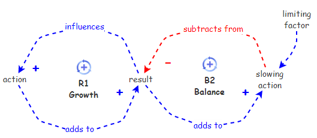

[Limits to Growth Causal Loop Diagram](http://insightmaker.com/insight/550)

### Stock & Flow Simulation ###

<IFRAME SRC="http://InsightMaker.com/insight/551?embed=0&editor=1&topBar=1&sideBar=1&zoom=0" TITLE="" width=950 height=650></IFRAME>

[Limits to Growth Stock & Flow Simulation](http://insightmaker.com/insight/551)

----------

### Exercise 5-12 

----------

### Examples ###

- Rabbits tend to multiply very rapidly so why is it we're not completely overrun by rabbits, well maybe everywhere except Australia?
- keep playing instead of cleaning up the mess in the room, which makes further play difficult, AND the increased mess repels one from cleaning up.
- 
### Effective Strategies ###

- The best defense is a good offense. As defined in the effective strategies for the Reinforcing Loop, if there is a Reinforcing Loop operating start looking for what is going to become a limiting factor, and remove it before it even has a chance to create a substantial impact on the result.
- If the structure is already at a stage where the limiting factor is interacting with results to limit results the options are:
- Alter the limiting factor in such a way that it no longer interacts with the results to create a slowing action.
- Find a way to disconnect the results from the slowing action so it can no longer add to it.
- Disconnect the slowing action from the results so it can no longer have a negative impact.

### Areas of Concern ###

- There are often multiple limits to deal with which leads to an Attractiveness Principle.
- It is possible that limited shared resources are the source of the limiting factor leading to a Tragedy of the Commons.
- The limit may be insufficient capacity which leads to Growth and Underinvestment.

## Partners for Growth Become Adversaries ##

The Accidental Adversaries Systems Archetype represents a structure where two entities which would be in a synergistic growth relationship end up limiting each others results because of their own activities.

### Causal Loop Diagram ###

[Accidental Adversaries Causal Loop Diagram](http://insightmaker.com/insight/163)

### Stock & Flow Simulation ###

<IFRAME SRC="http://InsightMaker.com/insight/164?embed=0&editor=1&topBar=1&sideBar=1&zoom=0" TITLE="" width=950 height=650></IFRAME>

[Accidental Adversaries Stock & Flow Simulation](http://insightmaker.com/insight/164)

----------

### Exercise 5-13 

----------

### Examples ###

- Parents can be interesting. Both Mums and Dads want to act as good role models and create a positive family environment, but sometimes, each one of them gets caught up in being seen as ''the good parent" and gives in to our whims and desires. We all know how this works: If one parent says 'no' to something, we just ask the other parent. The problem is that when one or both of our parents wants to be seen as the ''good parent,'' the other one ends up being seen as the 'bad' or 'tough' parent, and the whole 'good role model' or 'good family environment' disintegrates pretty quickly. 
https://dl.dropboxusercontent.com/u/102156844/Loop%20Structures/Family%20dysfunctionality%20Accid%20Adversaries.jpeg

### Effective Strategies ###

This structure points out how myopic local activity, with the best of intentions, can lead to an overall limiting development of the global system, and actually inhibit local development as well.
- A and B need to determine whether it is really better to be partners in creating the future or competitors, and do one or the other, not both. At present A and B are neither as they undermine each others success to promote their own success. Sounds like enemies to me.
- Alternatively, some higher authority could alter the structure in such a way that A to A and B to B didn't promote the individual result of A and B.
- Another alternative would be to alter the structure in such a way that the result is not measured in terms of A and B individually but in terms of the total result of the two of them together. In this way it should be quite quickly evident that each is undermining their own success through their self-serving actions.

### Areas of Concern ###

- There are currently no known Systems Archetypes that are derivatives of the Accidental Adversaries Systems Archetype.

## Limited Resources are Shared by Others ##

A Tragedy of the Commons situation exists whenever two or more activities, each, which in order to produce results, rely on a shared limited resource. Results for these activities continue to develop as long as their use of the limited resource doesn't exceed the resource limit. Once this limit is reached the results produced by each activity are limited to the level at which the resource is replenished. As an example, consider multiple departments with an organization using IT resources, until they've exhausted IT capacity.

### Causal Loop Diagram ###

[Tragedy of the Commons Causal Loop Diagram](http://insightmaker.com/insight/559)

### Stock & Flow Simulation ###

<IFRAME SRC="http://InsightMaker.com/insight/560?embed=0&editor=1&topBar=1&sideBar=1&zoom=0" TITLE="" width=950 height=650></IFRAME>

[Tragedy of the Commons Stock & Flow Simulation](http://insightmaker.com/insight/560)

----------

### Exercise 5-14 

----------

### Examples ###

### Effective Strategies ###

This structure repeatedly appears in organizational contexts where a service organization supports the success of multiple departments who fail to support the service organization in return. There are two strategies for dealing with this structure, one more effective than the other.
- The most effective strategy for dealing with this structure is to wire in feedback paths from A's result and B's result to the resource replenishment so as A and B use resources their results promotes the availability of additional resources.
- The alternate, and less effective, strategy for dealing with this structure is to add an additional resource to control the use of resources by A and B. This strategy limits the overall potential results of the structure to the predefined resource limit. It also adds additional resources to the equation, and probably results in endless disputes as to the fairness associated with the allocation of resources. While not really the most appropriate strategy this is the one most often used --- out of ignorance I would suspect.
- More ecological approach would be for A and B to realize what they're doing and collaboratively manage their activity and the resource such that it isn't depleted. Yes, it could happen.

### Areas of Concern ###

There are currently no known Systems Archetypes which are derivatives of Tragedy of the Commons.

## More Than One Limit To Be Addressed ##

It's relatively well understood that you can't be all things to all people. Somewhere one has to make choices. An Attractiveness Principle Systems Archetype is essentially a Limits to Growth Systems Archetype with multiple limits, all of which can not be addressed equally.

### Causal Loop Diagram ###

[Attractiveness Principle Causal Loop Diagram](http://insightmaker.com/insight/1115)

### Stock & Flow Simulation ###

<IFRAME SRC="http://InsightMaker.com/insight/1117?embed=0&editor=1&topBar=1&sideBar=1&zoom=0" TITLE="" width=950 height=650></IFRAME>

[Attractiveness Principle Stock & Flow Simulation](http://insightmaker.com/insight/1117)

----------

### Exercise 5-15 

----------

### Examples ###

### Effective Strategies ###

- A strong offense is the most effective defense. Being aware that there is a growth situation in effect should induce the insightful to look for limiting factors because they will come into play sooner or later. Once limiting factors are identified steps should be taken to inhibit the limiting factors before they inhibit results.
- It is generally the case that limiting factors do not come into play at the same levels of results. As such, one needs to be concerned with the timing of the limiting factors. It makes little sense to inhibit factors before they are about to act as limiting factors.
- It is often the case that all the limiting factors cannot be addressed. When this is the case one must decide which ones to inhibit and which ones to live with. If possible the factor promoting the greatest limitations should be eliminated first as it will provide the greatest gain.

### Areas of Concern ###

There are currently no known direct derivatives of the Attractiveness Principle Systems Archetype.

## The Limit Is Insufficient Capacity ##

A Growth and Underinvestment Systems Archetype is simply an elaborated Limits to Growth Systems Archetype where the growth inhibitor is part of another Balancing Loop with an external standard and some delay. The real nasty thing about this structure is that the two Balancing Loops form a single Reinforcing Loop which inhibits growth.

### Causal Loop Diagram ###

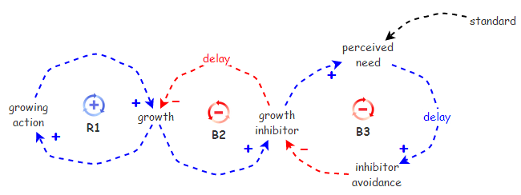

[Growth and Underinvestment Causal Loop Diagram](http://insightmaker.com/insight/1122)

### Stock & Flow Simulation ###

<IFRAME SRC="http://InsightMaker.com/insight/1124?embed=0&editor=1&topBar=1&sideBar=1&zoom=0" TITLE="" width=950 height=650></IFRAME>

[Growth and Underinvestment Stock & Flow Simulation](http://insightmaker.com/insight/1124)

----------

### Exercise 5-16 

----------

### Examples ###

### Effective Strategies ###

- The only effective strategy for dealing with this structure is foresight. One has to study the implications of the Result before the Result actually places demands on the system and develop the slowing action avoidance before it is actually needed. Have you ever noticed that runners seem to be the people that least need to run? It's because they run.

### Areas of Concern ###

- It is possible that under pressure the standard may drift and this structure will develop into a Growth and Underinvestment with a Drifting Standard Systems Archetype.

## There Is A Tendency To Let The Standard Slip ##

A Growth and Underinvestment with a Drifting Standard structure is simply an elaborated Growth and Underinvestment structure where the growth inhibitor induces a decline of the standard over time. The real nasty thing about this structure is that the growth inhibitor influence sets up a Reinforcing Loop which even further promotes a drifting of the standard over time.

### Causal Loop Diagram ###

[Growth and Underinvestment with a Drifting Goal Causal Loop Diagram](http://insightmaker.com/insight/1123)

### Stock & Flow Simulation ###

<IFRAME SRC="http://InsightMaker.com/insight/1126?embed=0&editor=1&topBar=1&sideBar=1&zoom=0" TITLE="" width=950 height=650></IFRAME>

[Growth and Underinvestment with a Drifting Goal Stock & Flow Simulation](http://insightmaker.com/insight/1126)

----------

### Exercise 5-17 

----------

### Examples ###

### Effective Strategies ###

- The only effective strategy for dealing with this structure is foresight. One has to study the implications of Result before Result actually places demands on the system and develop the Inhibitor Avoidance before it is actually needed. Have you ever noticed that runners seem to be the people that least need to run? It's because they run.
- And, in this structure it is essential to ensure that the standard is not diminished by the tension created by the growth inhibitor.

### Areas of Concern ###

- There are currently no known Systems Archetypes which are based on the Growth and Underinvestment with a Drifting Standard Systems Archetype.

## Summary ##

The chapter should explicitly depict the relationships between the structures presented in the previous sections and explain the natural evolution paths for the structures.

<IFRAME SRC="http://InsightMaker.com/insight/538?embed=0&editor=1&topBar=0&sideBar=0&zoom=0" TITLE="" width=950 height=650></IFRAME>

[Systems Archetypes Relationships](http://insightmaker.com/insight/538)

## References ##

- Braun, Bill. 2002. The Systems Archetypes. [http://wwwu.uni-klu.ac.at/gossimit/pap/sd/wb_sysarch.pdf](http://wwwu.uni-klu.ac.at/gossimit/pap/sd/wb_sysarch.pdf)
